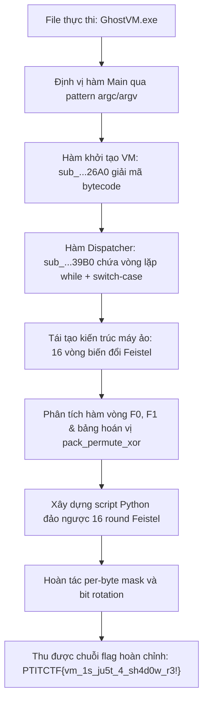
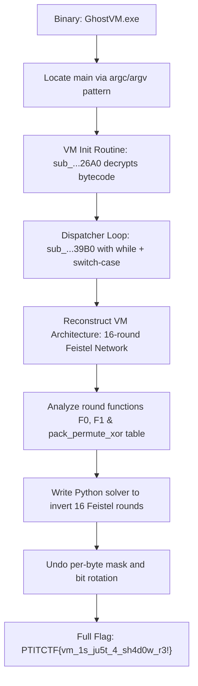

<div class="lang-switch" role="tablist" aria-label="Language switch">
  <button class="lang-btn active" role="tab" type="button" data-lang="en" aria-selected="true">EN</button>
  <button class="lang-btn" role="tab" type="button" data-lang="vn" aria-selected="false">VN</button>
</div>

<div class="lang-vn" markdown="1">

> **Flag:** `PTITCTF{vm_1s_ju5t_4_sh4d0w_r3!}`


Bài này thuộc category **Reverse Engineering**. Tệp thực thi cung cấp là một Windows PE checker (`GhostVM.exe`), khi chạy kiểm tra chuỗi flag đầu vào từ người dùng nhưng không để lộ bất kỳ chuỗi thông báo "Enter flag" hay "Correct" nào trong `.rdata`.

Phân tích ban đầu:
* Binary sử dụng kỹ thuật mã hóa dữ liệu tĩnh và khởi tạo cấu trúc máy ảo tùy biến (**Custom Bytecode Virtual Machine**).
* Hàm entry point không dẫn thẳng tới hàm main thông thường mà thông qua runtime startup. Điểm mấu chốt là nhận diện hàm khởi tạo VM và vòng lặp phân giải chỉ lệnh (dispatcher loop).

---

## Sơ đồ luồng phân tích (Solve Flow)



---

## Bước 1: Định vị hàm khởi tạo và Dispatcher của VM

Mở file thực thi trong IDA Pro, các chuỗi string đều bị ẩn. Bằng cách tìm kiếm cross-references tới các hàm API nhập xuất console cơ bản và định vị cấu trúc gọi hàm main thông qua `argc/argv`, ta xác định được:

1. Hàm `sub_...26A0`: Thực hiện cấp phát bộ nhớ ngữ cảnh máy ảo, load mảng bytecode nhị phân từ section dữ liệu và thiết lập các thanh ghi ban đầu.
2. Hàm `sub_...39B0`: Đóng vai trò là bộ thông dịch (**VM Interpreter**) với cấu trúc chuẩn dạng:

```c
while (vm_running) {
    opcode = fetch_byte(ctx);
    switch (opcode) {
        case OP_LOAD:  ... break;
        case OP_XOR:   ... break;
        case OP_ROL:   ... break;
        case OP_PERM:  ... break;
        case OP_CMP:   ... break;
        default:       ... break;
    }
}
```

Một số opcode dạng `junk/nop` được xen kẽ có chủ đích nhằm gây nhiễu các công cụ dịch ngược tự động.

---

## Bước 2: Tái tạo thuật toán mã hóa 16 vòng Feistel

Sau khi lọc bỏ các chỉ lệnh rác, chuỗi chỉ lệnh thực tế thực hiện mã hóa khối đối xứng dạng **Mạng Feistel (Feistel Network)** gồm 16 vòng trên chuỗi input dài 32 ký tự:

* Đầu vào được chia thành 2 nửa: Left ($L$) và Right ($R$).
* Ở mỗi vòng $i$ ($0 \le i < 16$):
  $$L_{i+1} = R_i$$
  $$R_{i+1} = L_i \oplus F(R_i, K_i)$$
* Hàm làm tròn $F$ bao gồm phép hoán vị theo bảng (`pack_permute_xor`), xoay bit sang trái/phải (`ROL`/`ROR`), và cộng mặt nạ khóa con ($K_i$) dẫn xuất từ bảng hằng số của máy ảo.
* Tại vòng cuối cùng, dữ liệu được so sánh trực tiếp với mảng giá trị đích (`target r0..r3`).

---

## Bước 3: Viết script đảo ngược máy ảo

Do mạng Feistel có tính chất đối xứng hoàn hảo, việc giải mã chỉ cần đảo ngược thứ tự các vòng từ 15 về 0:
$$R_i = L_{i+1}$$
$$L_i = R_{i+1} \oplus F(L_{i+1}, K_i)$$

Kết hợp với việc đảo ngược phép hoán vị byte và bù mặt nạ bit, ta viết script solver giải mã:

```python
def decrypt_ghost_vm(cipher_bytes, round_keys):
    # Chia 32 byte thành 2 nửa 16 byte
    L = list(cipher_bytes[:16])
    R = list(cipher_bytes[16:])
    
    # Invert 16 rounds từ vòng 15 về vòng 0
    for r in reversed(range(16)):
        k = round_keys[r]
        f_val = round_function_F(L, k)
        prev_R = L
        prev_L = [r_byte ^ f_byte for r_byte, f_byte in zip(R, f_val)]
        L, R = prev_L, prev_R
        
    return bytes(L + R)

# Chạy giải mã với các tham số dump từ bộ nhớ VM
# Output thu được: PTITCTF{vm_1s_ju5t_4_sh4d0w_r3!}
```

⇒ **Flag:** `PTITCTF{vm_1s_ju5t_4_sh4d0w_r3!}`

</div>

<div class="lang-en" markdown="1">

> **Flag:** `PTITCTF{vm_1s_ju5t_4_sh4d0w_r3!}`

This challenge belongs to the **Reverse Engineering** category. The provided binary is a 64-bit Windows PE checker (`GhostVM.exe`). When executed, it checks an input flag from the user, but inspection of `.rdata` strings yields zero plain strings like "Enter flag" or "Correct".

Initial observations:
* The binary employs static data decryption and initializes a **Custom Bytecode Virtual Machine**.
* The entry point delegates execution through runtime startup rather than directly into `main`. The primary objective is identifying the VM initialization routine and dispatcher loop.

---

## Solve Flow



---

## Step 1: Locating the VM Initializer and Dispatcher

Opening the executable in IDA Pro, strings are encoded. By tracing cross-references to standard console I/O routines and finding the `argc/argv` setup, we isolate:
1. Routine `sub_...26A0`: Allocates VM context memory, copies binary bytecode from data sections, and initializes register state.
2. Routine `sub_...39B0`: Functions as the core **VM Interpreter**:

```c
while (vm_running) {
    opcode = fetch_byte(ctx);
    switch (opcode) {
        case OP_LOAD:  ... break;
        case OP_XOR:   ... break;
        case OP_ROL:   ... break;
        case OP_PERM:  ... break;
        case OP_CMP:   ... break;
        default:       ... break;
    }
}
```

Certain dummy/junk opcodes were interleaved to disrupt automated disassembly.

---

## Step 2: Reconstructing the 16-Round Feistel Cipher

Filtering out junk instructions reveals that the bytecode implements a symmetric 16-round **Feistel Network** over a 32-byte input:
* The input block is split into halves: Left ($L$) and Right ($R$).
* For each round $i$ ($0 \le i < 16$):
  $$L_{i+1} = R_i$$
  $$R_{i+1} = L_i \oplus F(R_i, K_i)$$
* The round function $F$ involves table-based byte permutation (`pack_permute_xor`), bit rotations (`ROL`/`ROR`), and subkey addition ($K_i$) derived from internal VM constants.
* At round 16, the transformed state is matched against target values stored in registers `r0..r3`.

---

## Step 3: Inverting the Virtual Machine and Flag Recovery

Because Feistel networks are invertible by design, decryption simply reverses the rounds from 15 down to 0:
$$R_i = L_{i+1}$$
$$L_i = R_{i+1} \oplus F(L_{i+1}, K_i)$$

Solver script:

```python
def decrypt_ghost_vm(cipher_bytes, round_keys):
    L = list(cipher_bytes[:16])
    R = list(cipher_bytes[16:])
    
    for r in reversed(range(16)):
        k = round_keys[r]
        f_val = round_function_F(L, k)
        prev_R = L
        prev_L = [r_byte ^ f_byte for r_byte, f_byte in zip(R, f_val)]
        L, R = prev_L, prev_R
        
    return bytes(L + R)

# Running the solver with VM dumped memory parameters yields:
# Flag: PTITCTF{vm_1s_ju5t_4_sh4d0w_r3!}
```

⇒ **Flag:** `PTITCTF{vm_1s_ju5t_4_sh4d0w_r3!}`

</div>
