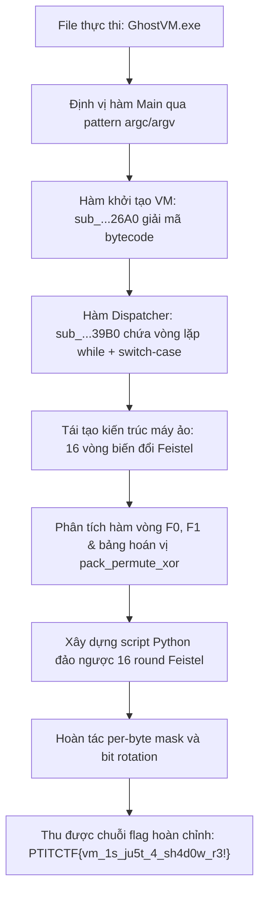
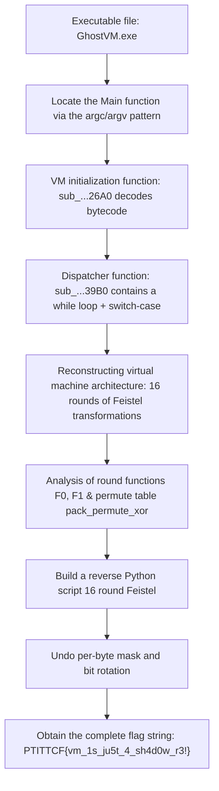

<div class="lang-switch" role="tablist" aria-label="Language switch">
  <button class="lang-btn active" role="tab" type="button" data-lang="en" aria-selected="true">EN</button>
  <button class="lang-btn" role="tab" type="button" data-lang="vn" aria-selected="false">VN</button>
</div>

<div class="lang-vn" markdown="1">

> **Flag:** `PTITCTF{vm_1s_ju5t_4_sh4d0w_r3!}`


Bài này thuộc category **Reverse Engineering**. Tệp thực thi cung cấp là một Windows PE checker (`GhostVM.exe`), khi chạy kiểm tra chuỗi flag đầu vào từ người dùng nhưng không để lộ bất kỳ chuỗi thông báo "Enter flag" hay "Correct" nào trong `.rdata`.

Phân tích ban đầu:
* Binary sử dụng kỹ thuật mã hóa dữ liệu tĩnh và khởi tạo cấu trúc máy ảo tùy biến (**Custom Bytecode Virtual Machine**).
* Hàm entry point không dẫn thẳng tới hàm main thông thường mà thông qua runtime startup. Điểm mấu chốt là nhận diện hàm khởi tạo VM và vòng lặp phân giải chỉ lệnh (dispatcher loop).

---

## Sơ đồ luồng phân tích (Solve Flow)



---

## Bước 1: Định vị hàm khởi tạo và Dispatcher của VM

Mở file thực thi trong IDA Pro, các chuỗi string đều bị ẩn. Bằng cách tìm kiếm cross-references tới các hàm API nhập xuất console cơ bản và định vị cấu trúc gọi hàm main thông qua `argc/argv`, ta xác định được:

1. Hàm `sub_...26A0`: Thực hiện cấp phát bộ nhớ ngữ cảnh máy ảo, load mảng bytecode nhị phân từ section dữ liệu và thiết lập các thanh ghi ban đầu.
2. Hàm `sub_...39B0`: Đóng vai trò là bộ thông dịch (**VM Interpreter**) với cấu trúc chuẩn dạng:

```c
while (vm_running) {
    opcode = fetch_byte(ctx);
    switch (opcode) {
        case OP_LOAD:  ... break;
        case OP_XOR:   ... break;
        case OP_ROL:   ... break;
        case OP_PERM:  ... break;
        case OP_CMP:   ... break;
        default:       ... break;
    }
}
```

Một số opcode dạng `junk/nop` được xen kẽ có chủ đích nhằm gây nhiễu các công cụ dịch ngược tự động.

---

## Bước 2: Tái tạo thuật toán mã hóa 16 vòng Feistel

Sau khi lọc bỏ các chỉ lệnh rác, chuỗi chỉ lệnh thực tế thực hiện mã hóa khối đối xứng dạng **Mạng Feistel (Feistel Network)** gồm 16 vòng trên chuỗi input dài 32 ký tự:

* Đầu vào được chia thành 2 nửa: Left ($L$) và Right ($R$).
* Ở mỗi vòng $i$ ($0 \le i < 16$):
  $$L_{i+1} = R_i$$
  $$R_{i+1} = L_i \oplus F(R_i, K_i)$$
* Hàm làm tròn $F$ bao gồm phép hoán vị theo bảng (`pack_permute_xor`), xoay bit sang trái/phải (`ROL`/`ROR`), và cộng mặt nạ khóa con ($K_i$) dẫn xuất từ bảng hằng số của máy ảo.
* Tại vòng cuối cùng, dữ liệu được so sánh trực tiếp với mảng giá trị đích (`target r0..r3`).

---

## Bước 3: Viết script đảo ngược máy ảo

Do mạng Feistel có tính chất đối xứng hoàn hảo, việc giải mã chỉ cần đảo ngược thứ tự các vòng từ 15 về 0:
$$R_i = L_{i+1}$$
$$L_i = R_{i+1} \oplus F(L_{i+1}, K_i)$$

Kết hợp với việc đảo ngược phép hoán vị byte và bù mặt nạ bit, ta viết script solver giải mã:

```python
def decrypt_ghost_vm(cipher_bytes, round_keys):

    L = list(cipher_bytes[:16])
    R = list(cipher_bytes[16:])


    for r in reversed(range(16)):
        k = round_keys[r]
        f_val = round_function_F(L, k)
        prev_R = L
        prev_L = [r_byte ^ f_byte for r_byte, f_byte in zip(R, f_val)]
        L, R = prev_L, prev_R

    return bytes(L + R)


```

⇒ **Flag:** `PTITCTF{vm_1s_ju5t_4_sh4d0w_r3!}`

</div>

<div class="lang-en" markdown="1">

> **Flag:** `PTITCTF{vm_1s_ju5t_4_sh4d0w_r3!}`


This article belongs to the category **Reverse Engineering**. The provided executable is a Windows PE checker (`GhostVM.exe`), which when run checks the user input flag string but does not expose any "Enter flag" or "Correct" message strings in `.rdata`.

Initial analysis:
* Binary uses static data encryption techniques and creates a custom virtual machine structure (**Custom Bytecode Virtual Machine**).
* The entry point function does not lead directly to the regular main function but through runtime startup. The key is to identify the VM initialization function and the dispatcher loop.

---

## Analysis Flow Diagram (Solve Flow)



---

## Step 1: Locate the VM's initializer and Dispatcher function

Open the executable file in IDA Pro, the strings are hidden. By looking for cross-references to basic console I/O API functions and locating the main function call structure via `argc/argv`, we can determine:

1. Function `sub_...26A0`: Performs virtual machine context memory allocation, loads binary bytecode array from data section and sets initial registers.
2. Function `sub_...39B0`: Acts as an interpreter (**VM Interpreter**) with a standard structure of the form:

```c
while (vm_running) {
    opcode = fetch_byte(ctx);
    switch (opcode) {
        case OP_LOAD:  ... break;
        case OP_XOR:   ... break;
        case OP_ROL:   ... break;
        case OP_PERM:  ... break;
        case OP_CMP:   ... break;
        default:       ... break;
    }
}
```

Some `junk/nop` opcodes are intentionally interleaved to confuse automatic disassemblers.

---

## Step 2: Regenerate the Feistel 16-round encryption algorithm

After filtering out the junk instructions, the actual instruction chain performs a **Feistel Network** symmetric block encryption consisting of 16 rounds on a 32-character input string:

* The input is divided into two halves: Left ($L$) and Right ($R$).
* At each round $i$ ($0 \le i < 16$):
$$L_{i+1} = R_i$$ $$R_{i+1} = L_i \oplus F(R_i, K_i)$$
* The rounding function $F$ includes tablewise permutation (`pack_permute_xor`), left/right bit rotation (`ROL`/`ROR`), and subkey mask addition ($K_i$) derived from the virtual machine's constant table.
* In the final round, the data is compared directly with the target value array (`target r0..r3`).

---

## Step 3: Write a script to reverse the virtual machine

Because the Feistel network is perfectly symmetric, decryption only requires reversing the order of rounds from 15 to 0: $$R_i = L_{i+1}$$ $$L_i = R_{i+1} \oplus F(L_{i+1}, K_i)$$

Combined with byte permutation reversal and bit mask compensation, we write a decoding solver script:

```python
def decrypt_ghost_vm(cipher_bytes, round_keys):

    L = list(cipher_bytes[:16])
    R = list(cipher_bytes[16:])


    for r in reversed(range(16)):
        k = round_keys[r]
        f_val = round_function_F(L, k)
        prev_R = L
        prev_L = [r_byte ^ f_byte for r_byte, f_byte in zip(R, f_val)]
        L, R = prev_L, prev_R

    return bytes(L + R)


```

⇒ **Flag:** `PTITCTF{vm_1s_ju5t_4_sh4d0w_r3!}`
</div>
