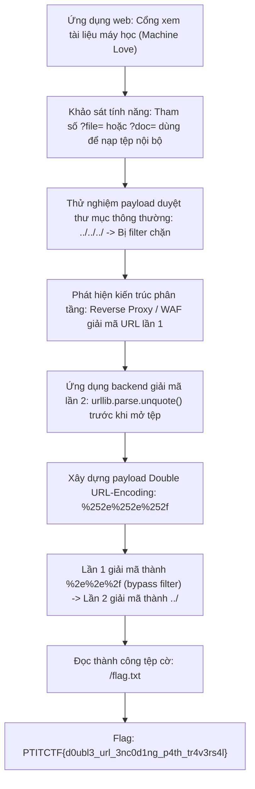
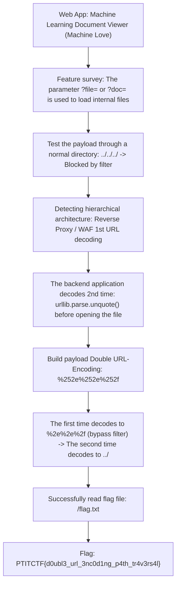

<div class="lang-switch" role="tablist" aria-label="Language switch">
  <button class="lang-btn active" role="tab" type="button" data-lang="en" aria-selected="true">EN</button>
  <button class="lang-btn" role="tab" type="button" data-lang="vn" aria-selected="false">VN</button>
</div>

<div class="lang-vn" markdown="1">

> **Flag:** `PTITCTF{d0ubl3_url_3nc0d1ng_p4th_tr4v3rs4l}`


Bài này thuộc category **Web**. Hệ thống là một cổng thông tin giới thiệu và cung cấp tài liệu kỹ thuật về các kiến trúc máy học và hệ thống tự động hóa ("Machine Love").

Mục tiêu là khai thác lỗ hổng duyệt thư mục (Path Traversal) để đọc tệp cờ nhạy cảm trên máy chủ backend.

---

## Sơ đồ luồng phân tích (Solve Flow)



---

## Bước 1: Khảo sát cơ chế đọc tệp và bộ lọc

Hệ thống cho phép người dùng đọc các tài liệu kỹ thuật thông qua một endpoint động:

```http
GET /view?file=architecture.txt HTTP/1.1
Host: target.ptitctf.vn
```

Khi gửi các chuỗi kiểm tra đường dẫn cơ bản như `../../../../etc/passwd` hoặc `..%2f..%2fflag.txt`, server lập tức trả về phản hồi lỗi `400 Bad Request` hoặc `Path traversal detected!`. Điều này cho thấy tầng gateway (hoặc middleware) có cơ chế kiểm tra sự xuất hiện của chuỗi `..` hoặc `/`.

---

## Bước 2: Kỹ thuật Double URL-Encoding Bypass

Khi phân tích hành vi của hệ thống, ta nhận thấy có sự lệch pha trong quá trình giải mã dữ liệu giữa các tầng kiến trúc:
1. **Tầng Proxy / WAF ngoài cùng:** Tiếp nhận request từ client, thực hiện giải mã URL một lần duy nhất rồi đối chiếu với blacklist.
2. **Tầng Ứng dụng Backend:** Sau khi tiếp nhận tham số từ request, lập trình viên gọi thêm một hàm giải mã thứ hai (`unquote(param)`) trước khi ghép vào đường dẫn tệp hệ thống `open(BASE_DIR + file_path)`.

Lợi dụng điểm này, ta áp dụng kỹ thuật **Mã hóa URL hai lần (Double URL-Encoding)**:
* Ký tự chấm `.` có mã ASCII hex là `0x2E` $\rightarrow$ Mã hóa lần 1 là `%2e`.
* Dấu phần trăm `%` có mã ASCII hex là `0x25` $\rightarrow$ Khi mã hóa `%2e` lần 2, `%` chuyển thành `%25`, thu được chuỗi `%252e`.
* Tương tự, ký tự gạch chéo `/` có mã `%2f` $\rightarrow$ Mã hóa lần 2 thành `%252f`.
* Do đó, chuỗi `../` khi mã hóa hai lần sẽ trở thành:
  $$\text{"../"} \longrightarrow \text{"%2e%2e%2f"} \longrightarrow \text{"%252e%252e%252f"}$$

---

## Bước 3: Khai thác LFR và Thu thập Flag

Khi gửi request chứa chuỗi mã hóa kép:

```http
GET /view?file=%252e%252e%252f%252e%252e%252f%252e%252e%252f%252e%252e%252fflag.txt HTTP/1.1
Host: target.ptitctf.vn
```

1. **Tại WAF:** Chuỗi `%252e%252e%252f` được giải mã thành `%2e%2e%2f`. Do chuỗi này không chứa ký tự `.` thực tế, nó vượt qua bộ kiểm tra danh sách đen một cách hoàn toàn hợp lệ.
2. **Tại Backend:** Ứng dụng gọi `unquote("%2e%2e%2f")` chuyển thành `../`, cho phép thoát khỏi thư mục tài liệu gốc và đọc trực tiếp file `/flag.txt`.
3. Server trả về nội dung cờ nguyên vẹn trong phần thân phản hồi HTTP.

⇒ **Flag:** `PTITCTF{d0ubl3_url_3nc0d1ng_p4th_tr4v3rs4l}`

</div>

<div class="lang-en" markdown="1">

> **Flag:** `PTITCTF{d0ubl3_url_3nc0d1ng_p4th_tr4v3rs4l}`


This article belongs to category **Web**. The system is a portal that introduces and provides technical documentation about machine learning architectures and automation systems ("Machine Love").

The goal is to exploit a directory traversal vulnerability (Path Traversal) to read a sensitive flag file on the backend server.

---

## Analysis Flow Diagram (Solve Flow)



---

## Step 1: Examine the file reading mechanism and filters

The system allows users to read technical documents through a dynamic endpoint:

```http
GET /view?file=architecture.txt HTTP/1.1
Host: target.ptitctf.vn
```

When sending basic path checking strings like `../../../../etc/passwd` or `..%2f..%2fflag.txt`, the server immediately returns a `400 Bad Request` or `Path traversal detected!` error response. This shows that the gateway layer (or middleware) has a mechanism to check for the presence of the string `..` or `/`.

---

## Step 2: Double URL-Encoding Bypass technique

When analyzing the system's behavior, we notice that there is a phase difference in the data decoding process between architectural layers:
1. **Outermost Proxy / WAF layer:** Receives requests from clients, performs URL decoding only once and then compares with the blacklist.
2. **Backend Application Layer:** After receiving parameters from the request, the programmer calls a second decoding function (`unquote(param)`) before concatenating into the system file path `open(BASE_DIR + file_path)`.

Taking advantage of this point, we apply the technique **Double URL-Encoding**:
* The dot character `.` has an ASCII hex code of `0x2E` $\rightarrow$ The first encoding is `%2e`.
* The percent sign `%` has an ASCII hex code of `0x25` $\rightarrow$ When encoding `%2e` a second time, `%` converts to `%25`, yielding the string `%252e`.
* Similarly, the slash character `/` has the code `%2f` $\rightarrow$ 2nd encoding to `%252f`.
* Therefore, the string `../` when encoded twice becomes:
$$\text{"../"} \longrightarrow \text{"%2e%2e%2f"} \longrightarrow \text{"%252e%252e%252f"}$$

---

## Step 3: Exploit LFR and Collect Flag

When sending a request containing a double-encoded string:

```http
GET /view?file=%252e%252e%252f%252e%252e%252f%252e%252e%252f%252e%252e%252fflag.txt HTTP/1.1
Host: target.ptitctf.vn
```

1. **At WAF:** The string `%252e%252e%252f` is decoded to `%2e%2e%2f`. Since this string does not contain an actual `.` character, it passes the blacklist checker perfectly valid.
2. **At Backend:** The application calls `unquote("%2e%2e%2f")` converted to `../`, allowing it to escape the root document directory and read the file `/flag.txt` directly.
3. The server returns the intact flag content in the HTTP response body.

⇒ **Flag:** `PTITCTF{d0ubl3_url_3nc0d1ng_p4th_tr4v3rs4l}`
</div>
