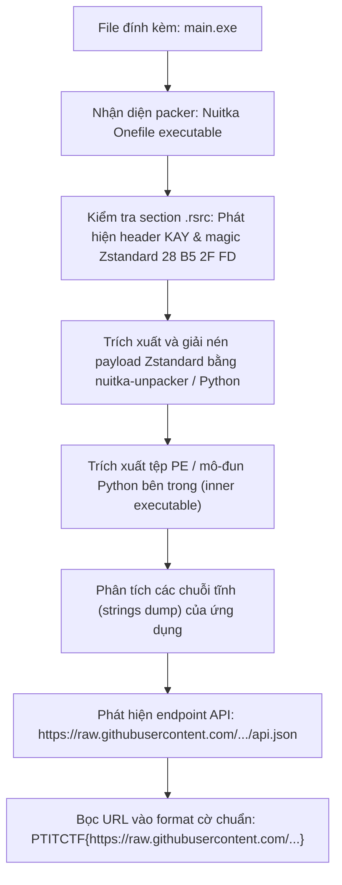
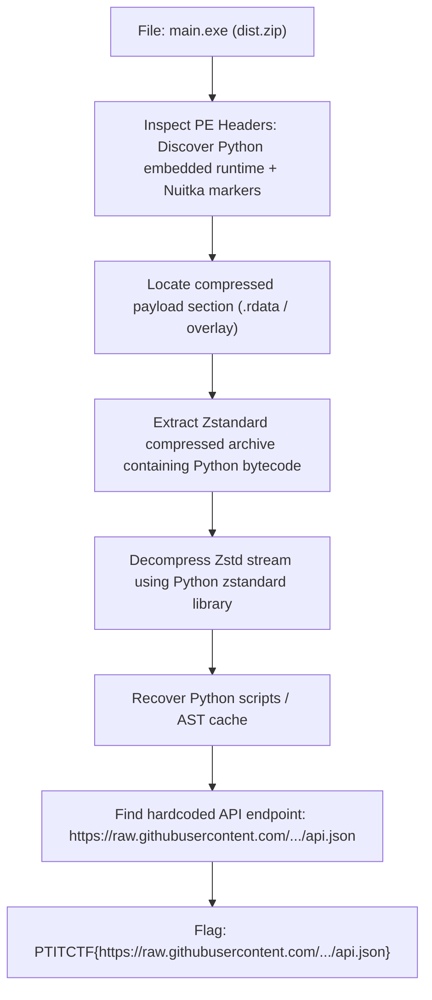

<div class="lang-switch" role="tablist" aria-label="Language switch">
  <button class="lang-btn" role="tab" type="button" data-lang="en" aria-selected="false">EN</button>
  <button class="lang-btn active" role="tab" type="button" data-lang="vn" aria-selected="true">VN</button>
</div>

<div class="lang-vn" markdown="1">

> **Flag:** `PTITCTF{https://raw.githubusercontent.com/HungHT1890/free_proxy_list_api/main/api.json}`


Bài này thuộc category **Reverse Engineering**. Tệp cung cấp là `main.exe` nằm trong `dist.zip`, một công cụ hỗ trợ người chơi game MMO tự động cập nhật và phân phối proxy danh sách mở rộng.

Đề bài yêu cầu phân tích tệp thực thi để tìm ra địa chỉ API máy chủ nguồn mà ứng dụng dùng để lấy dữ liệu.

---

## Sơ đồ luồng phân tích (Solve Flow)



---

## Bước 1: Nhận diện cấu trúc đóng gói Nuitka Onefile

Khi kiểm tra thông tin nhị phân của `main.exe` bằng các công cụ như `Detect It Easy (DIE)` hay `PEview`:
* Tệp được biên dịch bằng **Nuitka** (Python to C/C++ compiler) với tùy chọn `--onefile`.
* Bộ loader bootstrap sẽ giải nén payload chính vào thư mục tạm `%TEMP%` trong quá trình khởi chạy.
* Section tài nguyên `.rsrc` chứa khối nén lớn với định danh signature `"KAY"` và magic bytes chuẩn của thuật toán nén **Zstandard**: `\x28\xb5\x2f\xfd`.

---

## Bước 2: Trích xuất và giải nén Zstandard Payload

Ta có thể sử dụng công cụ unpack Nuitka chuyên dụng (`nuthem extract`) hoặc sử dụng script Python trực tiếp cắt bỏ header đệm và giải nén dữ liệu:

```python
import zstandard as zstd

with open("main.exe", "rb") as f:
    data = f.read()

# Định vị magic byte của Zstandard
magic = b"\x28\xb5\x2f\xfd"
offset = data.find(magic)
assert offset != -1, "Không tìm thấy Zstandard stream"

zstd_stream = data[offset:]
dctx = zstd.ZstdDecompressor()
decompressed = dctx.decompress(zstd_stream, max_output_size=100 * 1024 * 1024)

with open("inner_payload.bin", "wb") as f:
    f.write(decompressed)
print(f"Giải nén thành công {len(decompressed)} bytes.")
```

---

## Bước 3: Khôi phục Endpoint API ẩn

Sau khi giải nén được file nhị phân cốt lõi bên trong, ta thực hiện trích xuất toàn bộ các chuỗi ASCII và Unicode:

```bash
strings -a -n 12 inner_payload.bin | grep -i "http"
```

Kết quả trả về danh sách các URL được ứng dụng nhúng sẵn trong mã nguồn. Trong đó xuất hiện endpoint chứa danh sách proxy nguồn mở:

```text
https://raw.githubusercontent.com/HungHT1890/free_proxy_list_api/main/api.json
```

Đúng theo yêu cầu của thử thách về việc tìm ra nguồn dữ liệu API của phần mềm, ta bọc URL này vào định dạng cờ của cuộc thi.

⇒ **Flag:** `PTITCTF{https://raw.githubusercontent.com/HungHT1890/free_proxy_list_api/main/api.json}`

</div>

<div class="lang-en" markdown="1">

> **Flag:** `PTITCTF{https://raw.githubusercontent.com/HungHT1890/free_proxy_list_api/main/api.json}`

This challenge belongs to the **Reverse Engineering** category. The provided file `main.exe` in `dist.zip` is a client tool for MMO players to distribute and sync public proxies.

The goal is to analyze the binary and recover the hidden upstream API endpoint used to fetch proxy list updates.

---

## Solve Flow



---

## Step 1: Identifying Nuitka Onefile Packaging

Inspecting `main.exe` with Detect It Easy (DiE) and strings analysis shows compiler signatures for **Nuitka (Python-to-C compiler)** bundled in `--onefile` mode. Unlike PyInstaller, Nuitka compiles Python AST into native C code, but bundled resources and metadata are packed in a compressed archive in the PE overlay.

---

## Step 2: Extracting the Zstandard Compressed Payload

Scanning the overlay reveals the Zstandard magic bytes (`0x28 0xB5 0x2F 0xFD`). We write a Python extraction script:

```python
import zstandard as zstd

with open("main.exe", "rb") as f:
    data = f.read()

# Locate Zstandard frame magic
magic = b"\x28\xb5\x2f\xfd"
offset = data.find(magic)

if offset != -1:
    dctx = zstd.ZstdDecompressor()
    decompressed = dctx.decompress(data[offset:])
    with open("extracted_payload.bin", "wb") as out:
        out.write(decompressed)
    print(f"Decompressed {len(decompressed)} bytes successfully.")
```

---

## Step 3: Recovering the Secret API Endpoint

Searching the extracted resources for URL patterns:

```python
import re

with open("extracted_payload.bin", "rb") as f:
    payload = f.read()

urls = re.findall(rb"https?://[a-zA-Z0-9./_-]+", payload)
for u in set(urls):
    if b"api.json" in u:
        print("Found target endpoint:", u.decode())
```

The script extracts: `https://raw.githubusercontent.com/HungHT1890/free_proxy_list_api/main/api.json`.

⇒ **Flag:** `PTITCTF{https://raw.githubusercontent.com/HungHT1890/free_proxy_list_api/main/api.json}`

</div>
