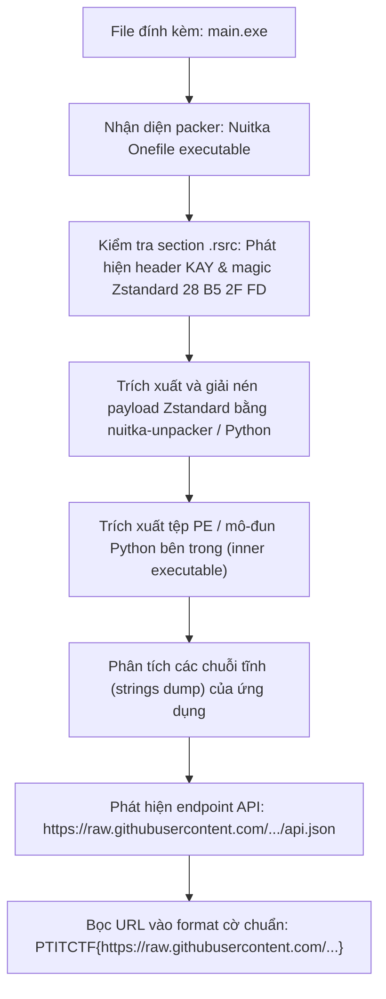
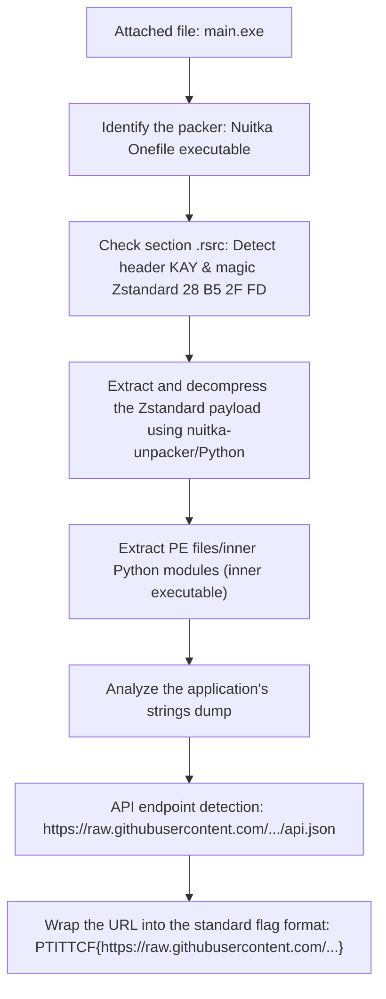

<div class="lang-switch" role="tablist" aria-label="Language switch">
  <button class="lang-btn active" role="tab" type="button" data-lang="en" aria-selected="true">EN</button>
  <button class="lang-btn" role="tab" type="button" data-lang="vn" aria-selected="false">VN</button>
</div>

<div class="lang-vn" markdown="1">

> **Flag:** `PTITCTF{https://raw.githubusercontent.com/HungHT1890/free_proxy_list_api/main/api.json}`


Bài này thuộc category **Reverse Engineering**. Tệp cung cấp là `main.exe` nằm trong `dist.zip`, một công cụ hỗ trợ người chơi game MMO tự động cập nhật và phân phối proxy danh sách mở rộng.

Đề bài yêu cầu phân tích tệp thực thi để tìm ra địa chỉ API máy chủ nguồn mà ứng dụng dùng để lấy dữ liệu.

---

## Sơ đồ luồng phân tích (Solve Flow)



---

## Bước 1: Nhận diện cấu trúc đóng gói Nuitka Onefile

Khi kiểm tra thông tin nhị phân của `main.exe` bằng các công cụ như `Detect It Easy (DIE)` hay `PEview`:
* Tệp được biên dịch bằng **Nuitka** (Python to C/C++ compiler) với tùy chọn `--onefile`.
* Bộ loader bootstrap sẽ giải nén payload chính vào thư mục tạm `%TEMP%` trong quá trình khởi chạy.
* Section tài nguyên `.rsrc` chứa khối nén lớn với định danh signature `"KAY"` và magic bytes chuẩn của thuật toán nén **Zstandard**: `\x28\xb5\x2f\xfd`.

---

## Bước 2: Trích xuất và giải nén Zstandard Payload

Ta có thể sử dụng công cụ unpack Nuitka chuyên dụng (`nuthem extract`) hoặc sử dụng script Python trực tiếp cắt bỏ header đệm và giải nén dữ liệu:

```python
import zstandard as zstd

with open("main.exe", "rb") as f:
    data = f.read()


magic = b"\x28\xb5\x2f\xfd"
offset = data.find(magic)
assert offset != -1, "Không tìm thấy Zstandard stream"

zstd_stream = data[offset:]
dctx = zstd.ZstdDecompressor()
decompressed = dctx.decompress(zstd_stream, max_output_size=100 * 1024 * 1024)

with open("inner_payload.bin", "wb") as f:
    f.write(decompressed)
print(f"Giải nén thành công {len(decompressed)} bytes.")
```

---

## Bước 3: Khôi phục Endpoint API ẩn

Sau khi giải nén được file nhị phân cốt lõi bên trong, ta thực hiện trích xuất toàn bộ các chuỗi ASCII và Unicode:

```bash
strings -a -n 12 inner_payload.bin | grep -i "http"
```

Kết quả trả về danh sách các URL được ứng dụng nhúng sẵn trong mã nguồn. Trong đó xuất hiện endpoint chứa danh sách proxy nguồn mở:

```text
https://raw.githubusercontent.com/HungHT1890/free_proxy_list_api/main/api.json
```

Đúng theo yêu cầu của thử thách về việc tìm ra nguồn dữ liệu API của phần mềm, ta bọc URL này vào định dạng cờ của cuộc thi.

⇒ **Flag:** `PTITCTF{https://raw.githubusercontent.com/HungHT1890/free_proxy_list_api/main/api.json}`

</div>

<div class="lang-en" markdown="1">

> **Flag:** `PTITCTF{https://raw.githubusercontent.com/HungHT1890/free_proxy_list_api/main/api.json}`


This article belongs to the category **Reverse Engineering**. The file provided is `main.exe` located in `dist.zip`, a tool that helps MMO gamers automatically update and distribute extended list proxies.

The problem requires analyzing the executable file to find the source server API address that the application uses to retrieve data.

---

## Analysis Flow Diagram (Solve Flow)



---

## Step 1: Identify the Nuitka Onefile packaging structure

When checking the binary information of `main.exe` with tools such as `Detect It Easy (DIE)` or `PEview`:
* File compiled with **Nuitka** (Python to C/C++ compiler) with `--onefile` option.
* The bootstrap loader will decompress the main payload into a temporary directory `%TEMP%` during launch.
* The resource section `.rsrc` contains a large compression block with the signature identifier `"KAY"` and the standard magic bytes of the **Zstandard** compression algorithm: `\x28\xb5\x2f\xfd`.

---

## Step 2: Extract and decompress the Zstandard Payload

We can use the specialized Nuitka unpack tool (`nuthem extract`) or use the Python script to directly cut off the buffer header and extract the data:

```python
import zstandard as zstd

with open("main.exe", "rb") as f:
    data = f.read()


magic = b"\x28\xb5\x2f\xfd"
offset = data.find(magic)
assert offset != -1, "Không tìm thấy Zstandard stream"

zstd_stream = data[offset:]
dctx = zstd.ZstdDecompressor()
decompressed = dctx.decompress(zstd_stream, max_output_size=100 * 1024 * 1024)

with open("inner_payload.bin", "wb") as f:
    f.write(decompressed)
print(f"Giải nén thành công {len(decompressed)} bytes.")
```

---

## Step 3: Restore hidden API Endpoint

After decompressing the core binary file inside, we extract all ASCII and Unicode strings:

```bash
strings -a -n 12 inner_payload.bin | grep -i "http"
```

The result returns a list of URLs embedded in the source code by the application. There appears an endpoint containing a list of open source proxies:

```text
https://raw.githubusercontent.com/HungHT1890/free_proxy_list_api/main/api.json
```

As required by the challenge of finding the source of the software's API data, we wrap this URL into the contest's flag format.

⇒ **Flag:** `PTITCTF{https://raw.githubusercontent.com/HungHT1890/free_proxy_list_api/main/api.json}`
</div>
