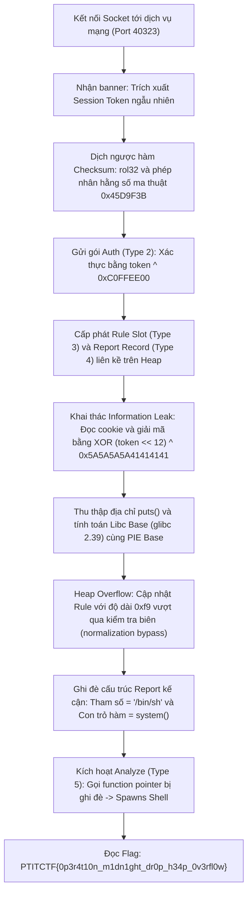
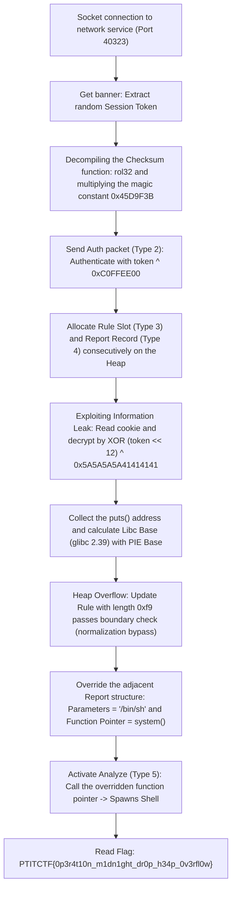

<div class="lang-switch" role="tablist" aria-label="Language switch">
  <button class="lang-btn active" role="tab" type="button" data-lang="en" aria-selected="true">EN</button>
  <button class="lang-btn" role="tab" type="button" data-lang="vn" aria-selected="false">VN</button>
</div>

<div class="lang-vn" markdown="1">

> **Flag:** `PTITCTF{0p3r4t10n_m1dn1ght_dr0p_h34p_0v3rfl0w}`


Thử thách thuộc category **Pwn** tại vòng loại PTITCTF 2026. Đề bài cung cấp dịch vụ mạng mô phỏng hệ thống phân tích quy tắc bí mật (Network Rule Analyzer) chạy trên hệ điều hành Ubuntu với glibc 2.39 (x86_64).

Giao thức truyền thông yêu cầu cơ chế bắt tay phiên, thuật toán kiểm tra tính toàn vẹn (checksum) tùy biến và cơ chế xác thực session token. Mục tiêu là phân tích dịch ngược giao thức, khai thác lỗ hổng tràn bộ nhớ heap để kiểm soát con trỏ hàm và giành quyền điều khiển luồng thực thi (RCE).

---

## Sơ đồ luồng khai thác (Solve Flow)



---

## Bước 1: Dịch ngược giao thức mạng và Hàm Checksum

Khi kết nối tới dịch vụ, server phát sinh một chuỗi ngẫu nhiên 32-bit đóng vai trò là `session token` (ví dụ: `session token: 0x9a8b7c6d`) và chờ nhận các gói tin nhị phân. Cấu trúc mỗi gói tin gồm 3 tham số trao đổi qua text interface trước khi gửi binary payload:
1. `packet type` (1 byte / số nguyên)
2. `payload length` (độ dài payload)
3. `checksum` (mã băm dạng hex)
4. Dữ liệu thô (`payload bytes`)

### Thuật toán Checksum tùy biến
Phân tích hàm kiểm tra tính toàn vẹn trong IDA Pro:
```c
uint32_t checksum(uint32_t token, uint32_t ptype, uint8_t *payload, uint16_t plen) {
    uint32_t h = ((ptype << 24) ^ token ^ plen ^ 0x31415926) & 0xFFFFFFFF;
    for (int i = 0; i < plen; i++) {
        h = rol32(h, 5);
        h = (h + (((i * 0x45D9F3B) & 0xFFFFFFFF) ^ payload[i])) & 0xFFFFFFFF;
    }
    return h;
}
```
Để giao tiếp thành công, mọi gói tin client gửi lên đều phải tính toán giá trị băm này một cách chính xác.

---

## Bước 2: Cơ chế Xác thực và Cấp phát Đối tượng trên Heap

Hệ thống hỗ trợ các loại gói tin chính:
* **Packet Type 2 (Auth)**: Yêu cầu payload gồm 4 byte chứa kết quả của phép tính:
  $$\text{auth\_token} = \text{session\_token} \oplus \text{0xC0FFEE00}$$
  Sau khi gửi gói này, phiên làm việc chuyển sang trạng thái đã được xác thực (`authenticated`).
* **Packet Type 3 (Create/Update Rule)**: Cấp phát vùng nhớ heap lưu quy tắc bằng hàm `malloc(8)` và copy dữ liệu vào buffer.
* **Packet Type 4 (Create/Query Report)**: Cấp phát cấu trúc bản ghi báo cáo (`report record`) ngay sau buffer của rule.
* **Packet Type 5 (Analyze)**: Kích hoạt phân tích, thực hiện gọi con trỏ hàm lưu bên trong cấu trúc report:
  $$\text{report}\rightarrow\text{fn\_ptr}(\text{report}\rightarrow\text{data}, \text{session\_token})$$

---

## Bước 3: Rò rỉ địa chỉ bộ nhớ (Information Leak)

Bên trong cấu trúc report có lưu các giá trị cookie phục vụ việc đối soát, bao gồm địa chỉ hàm xử lý mặc định (`puts` trong libc hoặc hàm nội bộ trong binary) nhưng đã bị mã hóa:
$$\text{Cookie} = \text{Target\_Addr} \oplus (\text{session\_token} \ll 12) \oplus \text{0x5A5A5A5A41414141}$$

Gửi gói tin Type 4 với subcommand `P` để trích xuất cookie của tiến trình, sau đó thực hiện phép XOR đảo ngược để thu được địa chỉ thực của `puts`:
```python
puts_addr = leak(b'P') ^ (key << 12) ^ 0x5A5A5A5A41414141
libc_base = puts_addr - PUTS_OFF
```
Tương tự, gửi subcommand `D` cho phép tính toán chính xác địa chỉ nạp thực thi của binary (`PIE Base`).

---

## Bước 4: Lỗ hổng Heap Overflow và Ghi đè Con trỏ hàm

Khi cập nhật quy tắc (Type 3), ứng dụng có một lỗi kiểm tra biên logic (normalization check bug):
* Hàm kiểm tra độ dài dữ liệu hợp lệ trước khi sao chép. Tuy nhiên, nếu độ dài payload khai báo là `0xf9` byte, bộ tiền xử lý sẽ bỏ qua bước cắt tỉa biên (normalization check bypass) do phép tràn số nguyên 8-bit hoặc điều kiện so sánh bị nhầm lẫn.
* Dữ liệu sao chép thực tế vượt quá kích thước được cấp phát của rule slot (`malloc(8)`), dẫn đến tình trạng **Heap Buffer Overflow**.

### Bố cục vùng nhớ (Memory Layout)
Do cơ chế cấp phát tuần tự của heap allocator, cấu trúc `report` nằm ngay phía sau buffer của `rule`:
* Khoảng cách từ đầu buffer rule tới đầu dữ liệu của report: `+0x60` byte.
* Vị trí con trỏ hàm thực thi (`fn_ptr`) nằm tại offset `+0x20` bên trong cấu trúc report, tương ứng với offset `+0x80` tính từ đầu buffer rule.

Tiến hành tạo payload tràn:
1. Tại offset `+0x60`: Ghi chuỗi tham số `b"/bin/sh\x00"`.
2. Tại offset `+0x80`: Ghi đè địa chỉ 64-bit của hàm `system()` (`libc_base + 0x58750`).

```python
fake = bytearray(b'C' * 0xf9)
fake[0x60:0x68] = b'/bin/sh\x00'
fake[0x80:0x88] = p64(libc_base + SYSTEM_OFF)
send_packet(3, p16(len(fake)) + bytes(fake))
```

Gửi gói tin Type 5 (`Analyze`): Server tiến hành gọi `fn_ptr(data, token)`, tương đương với việc thực thi:
$$\text{system}("/\text{bin}/\text{sh}")$$
Một shell tương tác được mở ra trên máy chủ mục tiêu. Thực hiện lệnh đọc tệp `flag.txt`.

---

## Flag

```text
PTITCTF{0p3r4t10n_m1dn1ght_dr0p_h34p_0v3rfl0w}
```

</div>

<div class="lang-en" markdown="1">

> **Flag:** `PTITCTF{0p3r4t10n_m1dn1ght_dr0p_h34p_0v3rfl0w}`


The challenge belongs to the category **Pwn** at the PTITTCTF 2026 qualifying round. The challenge provides a network service simulating a secret rule analysis system (Network Rule Analyzer) running on the Ubuntu operating system with glibc 2.39 (x86_64).

The communication protocol requires a session handshake, a custom checksum algorithm, and a session token authentication mechanism. The goal is to decompile the protocol, exploit heap overflow vulnerabilities to control function pointers, and gain control of the flow of execution (RCE).

---

## Solve Flow Diagram



---

## Step 1: Decompile the network protocol and Checksum Function

When connecting to the service, the server generates a 32-bit random string serving as the `session token` (e.g. `session token: 0x9a8b7c6d`) and waits to receive binary packets. The structure of each packet includes 3 parameters exchanged via the text interface before sending the binary payload:
1. `packet type` (1 byte / integer)
2. `payload length` (payload length)
3. `checksum` (hex hash code)
4. Raw data (`payload bytes`)

### Custom Checksum algorithm
Analysis of the integrity check function in IDA Pro:
```c
uint32_t checksum(uint32_t token, uint32_t ptype, uint8_t *payload, uint16_t plen) {
    uint32_t h = ((ptype << 24) ^ token ^ plen ^ 0x31415926) & 0xFFFFFFFF;
    for (int i = 0; i < plen; i++) {
        h = rol32(h, 5);
        h = (h + (((i * 0x45D9F3B) & 0xFFFFFFFF) ^ payload[i])) & 0xFFFFFFFF;
    }
    return h;
}
```
To communicate successfully, every packet the client sends must calculate this hash value correctly.

---

## Step 2: Authentication and Object Allocation Mechanism on the Heap

The system supports the following main packet types:
* **Packet Type 2 (Auth)**: Requests a 4-byte payload containing the result of the calculation:
$$\text{auth\_token} = \text{session\_token} \oplus \text{0xC0FFEE00}$$ After sending this packet, the session enters the authenticated state (`authenticated`).
* **Packet Type 3 (Create/Update Rule)**: Allocate heap memory to save the rule using the `malloc(8)` function and copy the data to the buffer.
* **Packet Type 4 (Create/Query Report)**: Allocate the report record structure (`report record`) immediately after the rule buffer.
* **Packet Type 5 (Analyze)**: Activate analysis, call function pointer stored inside report structure:
$$\text{report}\rightarrow\text{fn\_ptr}(\text{report}\rightarrow\text{data}, \text{session\_token})$$

---

## Step 3: Memory address leak (Information Leak)

Inside the report structure, cookie values ​​are stored for control, including the default handler function address (`puts` in libc or internal function in binary) but have been encrypted: $$\text{Cookie} = \text{Target\_Addr} \oplus (\text{session\_token} \ll 12) \oplus \text{0x5A5A5A5A41414141}$$

Send a Type 4 packet with subcommand `P` to extract the process cookie, then perform reverse XOR to obtain the actual address of `puts`:
```python
puts_addr = leak(b'P') ^ (key << 12) ^ 0x5A5A5A5A41414141
libc_base = puts_addr - PUTS_OFF
```
Similarly, sending subcommand `D` allows the exact calculation of the binary's executable load address (`PIE Base`).

---

## Step 4: Heap Overflow and Function Pointer Overriding Vulnerabilities

When updating the rule (Type 3), the application has a normalization check bug:
* Function to check valid data length before copying. However, if the declared payload length is `0xf9` bytes, the preprocessor will skip the normalization check bypass due to an 8-bit integer overflow or a confused comparison condition.
* The actual copied data exceeds the allocated size of the rule slot (`malloc(8)`), resulting in a **Heap Buffer Overflow** condition.

### Memory Layout
Due to the heap allocator's sequential allocation mechanism, the `report` structure is located right behind the `rule` buffer:
* Distance from the beginning of the buffer rule to the beginning of the report data: `+0x60` bytes.
* The position of the execution function pointer (`fn_ptr`) is at offset `+0x20` inside the report structure, corresponding to offset `+0x80` from the beginning of the buffer rule.

Proceed to create overflow payload:
1. At offset `+0x60`: Write the parameter string `b"/bin/sh\x00"`.
2. At offset `+0x80`: Overwrite the 64-bit address of the `system()` function (`libc_base + 0x58750`).

```python
fake = bytearray(b'C' * 0xf9)
fake[0x60:0x68] = b'/bin/sh\x00'
fake[0x80:0x88] = p64(libc_base + SYSTEM_OFF)
send_packet(3, p16(len(fake)) + bytes(fake))
```

Sending Type 5 packet (`Analyze`): The server calls `fn_ptr(data, token)`, which is equivalent to executing: $$\text{system}("/\text{bin}/\text{sh}")$$ An interactive shell is opened on the target server. Execute command to read file `flag.txt`.

---

## Flag

```text
PTITCTF{0p3r4t10n_m1dn1ght_dr0p_h34p_0v3rfl0w}
```
</div>
