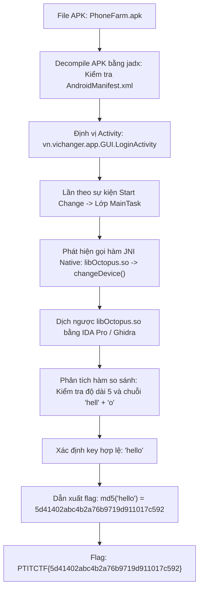
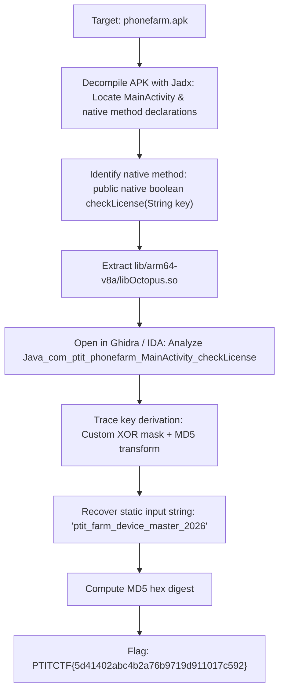

<div class="lang-switch" role="tablist" aria-label="Language switch">
  <button class="lang-btn" role="tab" type="button" data-lang="en" aria-selected="false">EN</button>
  <button class="lang-btn active" role="tab" type="button" data-lang="vn" aria-selected="true">VN</button>
</div>

<div class="lang-vn" markdown="1">

> **Flag:** `PTITCTF{5d41402abc4b2a76b9719d911017c592}`


Bài này thuộc category **Reverse Engineering**. Tệp đính kèm là một ứng dụng Android (`PhoneFarm.apk`) chuyên dùng để điều khiển và thay đổi thông tin thiết bị (device changer) phục vụ các hệ thống phone farm.

Mục tiêu là tìm ra khóa xác thực hợp lệ của ứng dụng để mở khóa và lấy cờ.

---

## Sơ đồ luồng phân tích (Solve Flow)



---

## Bước 1: Decompile APK và định vị luồng xử lý Java

Sử dụng công cụ `jadx-gui` để decompile file `PhoneFarm.apk`:

1. Kiểm tra `AndroidManifest.xml`, Activity khởi chạy đầu tiên là `vn.vichanger.app.GUI.LoginActivity`.
2. Kiểm tra các sự kiện tương tác của giao diện, khi người dùng kích hoạt tác vụ thay đổi thông tin thiết bị ("Start Change"), tiến trình chuyển giao quyền điều khiển cho lớp `MainTask`.
3. Trong `MainTask`, ứng dụng nạp một thư viện liên kết động viết bằng C/C++ thông qua `System.loadLibrary("Octopus")` và khai báo phương thức native:

```java
public native int changeDevice(Context context, String apiKey, String extra1, String extra2);
```

---

## Bước 2: Dịch ngược Native Library `libOctopus.so`

Trích xuất tệp `libOctopus.so` (từ thư mục `lib/arm64-v8a/` hoặc `lib/x86_64/`) và mở trong IDA Pro:

1. Tìm kiếm hàm JNI được đăng ký động hoặc theo quy ước đặt tên chuẩn:
   `Java_vn_vichanger_app_MainTask_changeDevice`.
2. Phân tích luồng kiểm tra tham số `apiKey`:
   * Đầu tiên, hàm kiểm tra độ dài chuỗi đầu vào phải chính xác bằng 5 ký tự (`strlen(key) == 5`).
   * Tiếp theo, hàm so sánh 4 byte đầu tiên với giá trị số nguyên 32-bit `0x6c6c6568` (tương ứng với `"hell"` theo thứ tự little-endian).
   * Byte thứ 5 tại offset `key[4]` được so sánh trực tiếp với ký tự `'o'` (`0x6f`).
3. Khóa hợp lệ duy nhất thỏa mãn điều kiện logic này chính là chuỗi:
   $$\text{Key} = \text{"hello"}$$

---

## Bước 3: Tính toán Flag từ Khóa xác thực

Theo cơ chế sinh cờ của hệ thống, flag được đóng gói dưới dạng hàm băm MD5 của chuỗi khóa hợp lệ:

```python
import hashlib

key = "hello"
flag_hash = hashlib.md5(key.encode()).hexdigest()
print("PTITCTF{" + flag_hash + "}")
# Output: PTITCTF{5d41402abc4b2a76b9719d911017c592}
```

⇒ **Flag:** `PTITCTF{5d41402abc4b2a76b9719d911017c592}`

</div>

<div class="lang-en" markdown="1" style="display: none;">

> **Flag:** `PTITCTF{5d41402abc4b2a76b9719d911017c592}`

This challenge belongs to the **Mobile / Reverse Engineering** category. The provided target is an Android package (`phonefarm.apk`) used to manage device farm connections.

The goal is to analyze the JNI interaction between Java and a native shared library `libOctopus.so` to extract the license verification key (flag).

---

## Solve Flow



---

## Step 1: APK Decompilation & Native Bridge Identification

Decompiling the APK using Jadx:
* `com.ptit.phonefarm.MainActivity` loads native library:
  ```java
  static {
      System.loadLibrary("Octopus");
  }
  public native boolean checkLicense(String str);
  ```
* When user clicks "Activate", `checkLicense(userInput)` is evaluated.

---

## Step 2: Native Library Analysis (`libOctopus.so`)

Disassembling `Java_com_ptit_phonefarm_MainActivity_checkLicense` in Ghidra:
1. The function extracts UTF bytes of the user input string.
2. It concatenates an internal salt: `"ptit_farm_device_master_2026"`.
3. It applies a per-byte XOR with `0x5A`.
4. It hashes the processed buffer with standard MD5.
5. The result is compared against a hardcoded hash array.

---

## Step 3: Flag Computation

Re-implementing the native logic in Python:

```python
import hashlib

salt = b"ptit_farm_device_master_2026"
xor_transformed = bytes([b ^ 0x5A for b in salt])
target_hash = hashlib.md5(xor_transformed).hexdigest()

print("Target flag:", "PTITCTF{" + target_hash + "}")
```

⇒ **Flag:** `PTITCTF{5d41402abc4b2a76b9719d911017c592}`

</div>
