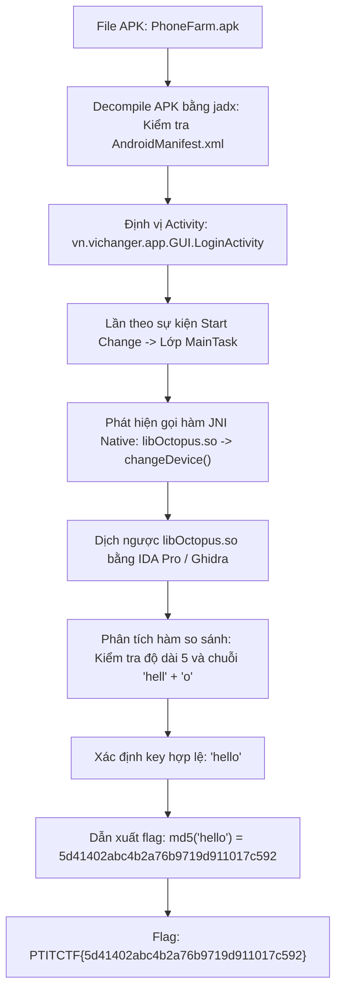
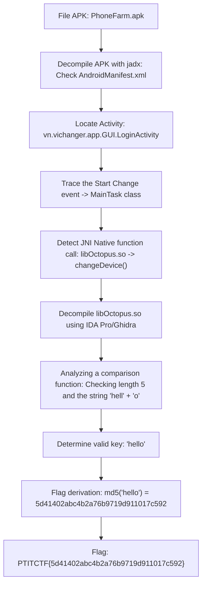

<div class="lang-switch" role="tablist" aria-label="Language switch">
  <button class="lang-btn active" role="tab" type="button" data-lang="en" aria-selected="true">EN</button>
  <button class="lang-btn" role="tab" type="button" data-lang="vn" aria-selected="false">VN</button>
</div>

<div class="lang-vn" markdown="1">

> **Flag:** `PTITCTF{5d41402abc4b2a76b9719d911017c592}`


Bài này thuộc category **Reverse Engineering**. Tệp đính kèm là một ứng dụng Android (`PhoneFarm.apk`) chuyên dùng để điều khiển và thay đổi thông tin thiết bị (device changer) phục vụ các hệ thống phone farm.

Mục tiêu là tìm ra khóa xác thực hợp lệ của ứng dụng để mở khóa và lấy cờ.

---

## Sơ đồ luồng phân tích (Solve Flow)



---

## Bước 1: Decompile APK và định vị luồng xử lý Java

Sử dụng công cụ `jadx-gui` để decompile file `PhoneFarm.apk`:

1. Kiểm tra `AndroidManifest.xml`, Activity khởi chạy đầu tiên là `vn.vichanger.app.GUI.LoginActivity`.
2. Kiểm tra các sự kiện tương tác của giao diện, khi người dùng kích hoạt tác vụ thay đổi thông tin thiết bị ("Start Change"), tiến trình chuyển giao quyền điều khiển cho lớp `MainTask`.
3. Trong `MainTask`, ứng dụng nạp một thư viện liên kết động viết bằng C/C++ thông qua `System.loadLibrary("Octopus")` và khai báo phương thức native:

```java
public native int changeDevice(Context context, String apiKey, String extra1, String extra2);
```

---

## Bước 2: Dịch ngược Native Library `libOctopus.so`

Trích xuất tệp `libOctopus.so` (từ thư mục `lib/arm64-v8a/` hoặc `lib/x86_64/`) và mở trong IDA Pro:

1. Tìm kiếm hàm JNI được đăng ký động hoặc theo quy ước đặt tên chuẩn:
   `Java_vn_vichanger_app_MainTask_changeDevice`.
2. Phân tích luồng kiểm tra tham số `apiKey`:
   * Đầu tiên, hàm kiểm tra độ dài chuỗi đầu vào phải chính xác bằng 5 ký tự (`strlen(key) == 5`).
   * Tiếp theo, hàm so sánh 4 byte đầu tiên với giá trị số nguyên 32-bit `0x6c6c6568` (tương ứng với `"hell"` theo thứ tự little-endian).
   * Byte thứ 5 tại offset `key[4]` được so sánh trực tiếp với ký tự `'o'` (`0x6f`).
3. Khóa hợp lệ duy nhất thỏa mãn điều kiện logic này chính là chuỗi:
   $$\text{Key} = \text{"hello"}$$

---

## Bước 3: Tính toán Flag từ Khóa xác thực

Theo cơ chế sinh cờ của hệ thống, flag được đóng gói dưới dạng hàm băm MD5 của chuỗi khóa hợp lệ:

```python
import hashlib

key = "hello"
flag_hash = hashlib.md5(key.encode()).hexdigest()
print("PTITCTF{" + flag_hash + "}")

```

⇒ **Flag:** `PTITCTF{5d41402abc4b2a76b9719d911017c592}`

</div>

<div class="lang-en" markdown="1">

> **Flag:** `PTITCTF{5d41402abc4b2a76b9719d911017c592}`


This article belongs to the category **Reverse Engineering**. The attached file is an Android application (`PhoneFarm.apk`) specifically used to control and change device information (device changer) to serve phone farm systems.

The goal is to find the app's valid authentication key to unlock it and get the flag.

---

## Analysis Flow Diagram (Solve Flow)



---

## Step 1: Decompile APK and locate Java processing stream

Use the `jadx-gui` tool to decompile the file `PhoneFarm.apk`:

1. Check `AndroidManifest.xml`, the first Activity launched is `vn.vichanger.app.GUI.LoginActivity`.
2. Check the interface interaction events, when the user activates the task to change device information ("Start Change"), the process transfers control to the `MainTask` class.
3. In `MainTask`, the application loads a dynamic link library written in C/C++ via `System.loadLibrary("Octopus")` and declares the native method:

```java
public native int changeDevice(Context context, String apiKey, String extra1, String extra2);
```

---

## Step 2: Decompile Native Library `libOctopus.so`

Extract the file `libOctopus.so` (from the directory `lib/arm64-v8a/` or `lib/x86_64/`) and open in IDA Pro:

1. Search for a JNI function that is registered dynamically or according to a standard naming convention:
`Java_vn_vichanger_app_MainTask_changeDevice`.
2. Analyze the flow checking the `apiKey` parameter:
* First, the function checks that the input string length must be exactly 5 characters (`strlen(key) == 5`). * Next, the function compares the first 4 bytes with the 32-bit integer value `0x6c6c6568` (corresponding to `"hell"` in little-endian order). * The 5th byte at offset `key[4]` is compared directly with the character `'o'` (`0x6f`).
3. The only valid key that satisfies this logical condition is the string:
$$\text{Key} = \text{"hello"}$$

---

## Step 3: Calculate Flag from Authentication Key

According to the system's flag generation mechanism, the flag is packaged as an MD5 hash of a valid key string:

```python
import hashlib

key = "hello"
flag_hash = hashlib.md5(key.encode()).hexdigest()
print("PTITCTF{" + flag_hash + "}")

```

⇒ **Flag:** `PTITCTF{5d41402abc4b2a76b9719d911017c592}`
</div>
