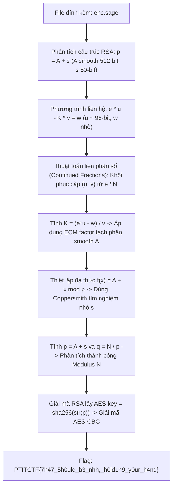
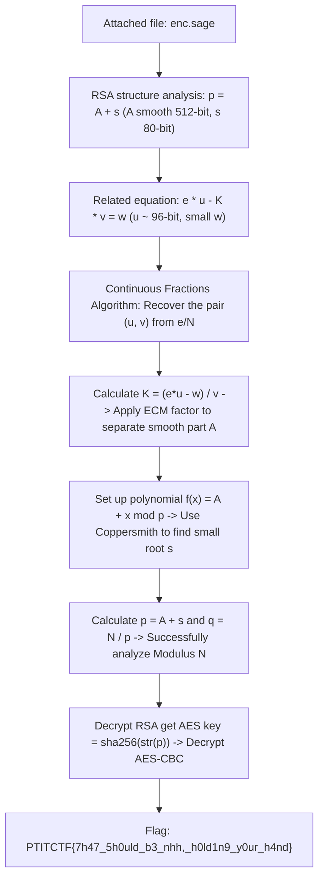

  <button class="lang-btn active" role="tab" type="button" data-lang="en" aria-selected="true">EN</button>
  <button class="lang-btn" role="tab" type="button" data-lang="vn" aria-selected="false">VN</button>

> **Flag:** `PTITCTF{7h47_5h0uld_b3_nhh,_h0ld1n9_y0ur_h4nd}`

Bài này thuộc category **Crypto**. Tệp mã nguồn đính kèm là một kịch bản SageMath (`enc.sage`) tạo sinh khóa mã hóa RSA với cấu trúc tham số đặc biệt và mã hóa thông điệp bí mật.

Mục tiêu là khai thác mối quan hệ đại số giữa các tham số để phân tích thừa số nguyên tố của Modulus $N$ và giải mã thông điệp.

---

## Sơ đồ luồng phân tích (Solve Flow)

---

## Bước 1: Khảo sát cấu trúc toán học của bài toán

Trong file `enc.sage`, các số nguyên tố $p, q$ được sinh với các ràng buộc nhân tạo:
* $p = A + s$, trong đó $A$ là một số 512-bit smooth (tích của các số nguyên tố nhỏ có kích thước dưới 32-bit), và $s$ là một phần dư nhỏ chỉ khoảng 80-bit.
* Một giá trị trung gian $K = A \cdot (q - r)$ được sử dụng để ràng buộc khóa công khai $e$.
* Phương trình liên hệ khóa:
  $$e \cdot u - K \cdot v = w$$
  với $u \approx 96$-bit và sai số $w$ rất nhỏ.

---

## Bước 2: Tấn công liên phân số (Continued Fractions / Wiener-style)

Do $K \approx A \cdot q \approx p \cdot q = N$, ta có xấp xỉ tỉ số:
$$\frac{e}{N} \approx \frac{v}{u}$$

Áp dụng phương pháp khai triển liên phân số của số hữu tỉ $e / N$, dãy các phân số hội tụ (convergents) $v_k / u_k$ sẽ chứa cặp nghiệm đúng $(v, u)$.
* Với mỗi phân số hội tụ $v_k / u_k$, ta thử nghiệm các giá trị khả dĩ của sai số $w$ (chỉ trong khoảng vài trăm đơn vị làm tròn).
* Khi tìm được $w$ thỏa mãn, ta tính lại được giá trị chính xác của $K$:
  $$K = \frac{e \cdot u - w}{v}$$

---

## Bước 3: Phân tích nhân tử bằng ECM và Định lý Coppersmith

1. **Tách thành phần smooth $A$:** Vì $A \mid K$ và $A$ chứa các thừa số nguyên tố nhỏ, phương pháp phân tích nhân tử đường cong Elliptic (**Lenstra's ECM**) dễ dàng tách toàn bộ các ước số nhỏ của $K$ để thu được $A$.
2. **Tìm nghiệm nhỏ $s$:** Khi đã biết $A$, ta có $p = A + s$, suy ra $s$ là nghiệm nhỏ ($|s| < 2^{80}$) của đa thức:
   $$f(x) = x + A \equiv 0 \pmod p$$
   Áp dụng phương pháp **Coppersmith** cho đa thức đơn biến modulo ước số chưa biết của $N$, ta nhanh chóng tìm ra giá trị của $s$.

---

## Bước 4: Khôi phục khóa và Giải mã Flag

Khi đã có $s$:
1. $p = A + s$ và $q = N / p$.
2. Khôi phục $\phi(N) = (p - 1)(q - 1)$ và tính $d = e^{-1} \pmod{\phi(N)}$.
3. Giải mã ciphertext RSA thu được thông điệp gốc chứa bản mã AES-CBC và vector khởi tạo IV. Khóa AES được dẫn xuất trực tiếp từ `sha256(str(p))`.
4. Giải mã AES-CBC thu được chuỗi flag hoàn chỉnh.

⇒ **Flag:** `PTITCTF{7h47_5h0uld_b3_nhh,_h0ld1n9_y0ur_h4nd}`

> **Flag:** `PTITCTF{7h47_5h0uld_b3_nhh,_h0ld1n9_y0ur_h4nd}`

This article belongs to category **Crypto**. The attached source file is a SageMath script (`enc.sage`) that generates an RSA encryption key with a special parameter structure and encrypts the secret message.

The goal is to exploit the algebraic relationship between the parameters to factorize Modulus $N$ and decode the message.

---

## Analysis Flow Diagram (Solve Flow)

---

## Step 1: Survey the mathematical structure of the problem

In the file `enc.sage`, the prime numbers $p, q$ are generated with artificial constraints:
* $p = A + s$, where $A$ is a 512-bit smooth number (product of small prime numbers less than 32-bit in size), and $s$ is a small remainder of only about 80-bits.
* An intermediate value $K = A \cdot (q - r)$ is used to constrain the public key $e$.
* Key contact equation:
$$e \cdot u - K \cdot v = w$$ with $u \approx 96$-bits and very small $w$ error.

---

## Step 2: Continuous Fractions Attack (Continued Fractions / Wiener-style)

Since $K \approx A \cdot q \approx p \cdot q = N$, we have approximately the ratio: $$\frac{e}{N} \approx \frac{v}{u}$$

Applying the method of continuous fraction expansion of rational numbers $e / N$, the sequence of convergent fractions $v_k / u_k$ will contain the correct solution pair $(v, u)$.
* For each convergent fraction $v_k / u_k$, we test the possible values ​​of the error $w$ (within only a few hundred rounding units).
* When we find a satisfactory $w$, we can recalculate the exact value of $K$:
$$K = \frac{e \cdot u - w}{v}$$

---

## Step 3: Factorize using ECM and Coppersmith's Theorem

1. **Separating the smooth component $A$:** Because $A \mid K$ and $A$ contain small prime factors, Elliptic curve factorization method (**Lenstra's ECM**) easily separates all small divisors of $K$ to obtain $A$.
2. **Find the small root $s$:** When we know $A$, we have $p = A + s$, deducing that $s$ is the small root ($|s| < 2^{80}$) of the polynomial:
$$f(x) = x + A \equiv 0 \pmod p$$ Applying the **Coppersmith** method to the single variable polynomial modulo the unknown divisor of $N$, we quickly find the value of $s$.

---

## Step 4: Key Recovery and Flag Decryption

Once you have $s$:
1. $p = A + s$ and $q = N / p$.
2. Recover $\phi(N) = (p - 1)(q - 1)$ and calculate $d = e^{-1} \pmod{\phi(N)}$.
3. Decrypt the RSA ciphertext to obtain the original message containing the AES-CBC ciphertext and initialization vector IV. The AES key is derived directly from `sha256(str(p))`.
4. AES-CBC decoding obtains the complete flag string.

⇒ **Flag:** `PTITCTF{7h47_5h0uld_b3_nhh,_h0ld1n9_y0ur_h4nd}`

