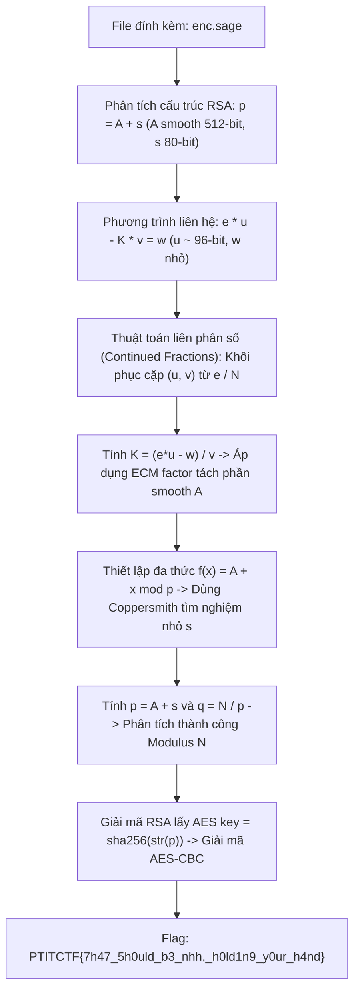
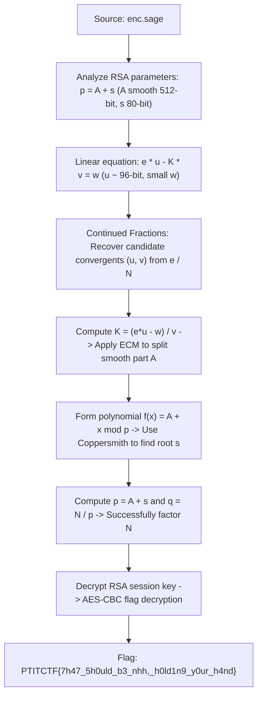

<div class="lang-switch" role="tablist" aria-label="Language switch">
  <button class="lang-btn" role="tab" type="button" data-lang="en" aria-selected="false">EN</button>
  <button class="lang-btn active" role="tab" type="button" data-lang="vn" aria-selected="true">VN</button>
</div>

<div class="lang-vn" markdown="1">

> **Flag:** `PTITCTF{7h47_5h0uld_b3_nhh,_h0ld1n9_y0ur_h4nd}`


Bài này thuộc category **Crypto**. Tệp mã nguồn đính kèm là một kịch bản SageMath (`enc.sage`) tạo sinh khóa mã hóa RSA với cấu trúc tham số đặc biệt và mã hóa thông điệp bí mật.

Mục tiêu là khai thác mối quan hệ đại số giữa các tham số để phân tích thừa số nguyên tố của Modulus $N$ và giải mã thông điệp.

---

## Sơ đồ luồng phân tích (Solve Flow)



---

## Bước 1: Khảo sát cấu trúc toán học của bài toán

Trong file `enc.sage`, các số nguyên tố $p, q$ được sinh với các ràng buộc nhân tạo:
* $p = A + s$, trong đó $A$ là một số 512-bit smooth (tích của các số nguyên tố nhỏ có kích thước dưới 32-bit), và $s$ là một phần dư nhỏ chỉ khoảng 80-bit.
* Một giá trị trung gian $K = A \cdot (q - r)$ được sử dụng để ràng buộc khóa công khai $e$.
* Phương trình liên hệ khóa:
  $$e \cdot u - K \cdot v = w$$
  với $u \approx 96$-bit và sai số $w$ rất nhỏ.

---

## Bước 2: Tấn công liên phân số (Continued Fractions / Wiener-style)

Do $K \approx A \cdot q \approx p \cdot q = N$, ta có xấp xỉ tỉ số:
$$\frac{e}{N} \approx \frac{v}{u}$$

Áp dụng phương pháp khai triển liên phân số của số hữu tỉ $e / N$, dãy các phân số hội tụ (convergents) $v_k / u_k$ sẽ chứa cặp nghiệm đúng $(v, u)$. 
* Với mỗi phân số hội tụ $v_k / u_k$, ta thử nghiệm các giá trị khả dĩ của sai số $w$ (chỉ trong khoảng vài trăm đơn vị làm tròn).
* Khi tìm được $w$ thỏa mãn, ta tính lại được giá trị chính xác của $K$:
  $$K = \frac{e \cdot u - w}{v}$$

---

## Bước 3: Phân tích nhân tử bằng ECM và Định lý Coppersmith

1. **Tách thành phần smooth $A$:** Vì $A \mid K$ và $A$ chứa các thừa số nguyên tố nhỏ, phương pháp phân tích nhân tử đường cong Elliptic (**Lenstra's ECM**) dễ dàng tách toàn bộ các ước số nhỏ của $K$ để thu được $A$.
2. **Tìm nghiệm nhỏ $s$:** Khi đã biết $A$, ta có $p = A + s$, suy ra $s$ là nghiệm nhỏ ($|s| < 2^{80}$) của đa thức:
   $$f(x) = x + A \equiv 0 \pmod p$$
   Áp dụng phương pháp **Coppersmith** cho đa thức đơn biến modulo ước số chưa biết của $N$, ta nhanh chóng tìm ra giá trị của $s$.

---

## Bước 4: Khôi phục khóa và Giải mã Flag

Khi đã có $s$:
1. $p = A + s$ và $q = N / p$.
2. Khôi phục $\phi(N) = (p - 1)(q - 1)$ và tính $d = e^{-1} \pmod{\phi(N)}$.
3. Giải mã ciphertext RSA thu được thông điệp gốc chứa bản mã AES-CBC và vector khởi tạo IV. Khóa AES được dẫn xuất trực tiếp từ `sha256(str(p))`.
4. Giải mã AES-CBC thu được chuỗi flag hoàn chỉnh.

⇒ **Flag:** `PTITCTF{7h47_5h0uld_b3_nhh,_h0ld1n9_y0ur_h4nd}`

</div>

<div class="lang-en" markdown="1" style="display: none;">

> **Flag:** `PTITCTF{7h47_5h0uld_b3_nhh,_h0ld1n9_y0ur_h4nd}`

This challenge belongs to the **Crypto** category. The attached file `enc.sage` generates an RSA keypair with non-standard structural parameters and encrypts a secret flag using derived AES-CBC.

The goal is to exploit algebraic relations between the public exponent and internal parameters to factor the modulus $N$ and decrypt the ciphertext.

---

## Solve Flow



---

## Step 1: Mathematical Analysis of Key Generation

In `enc.sage`, the primes $p$ and $q$ are generated under specific constraints:
* $p = A + s$, where $A$ is a 512-bit $B$-smooth integer (composed entirely of primes $< 2^{32}$), and $s$ is an 80-bit residual.
* $K = A \cdot (q - r)$ is used to construct a weak relation with $e$:
  $$e \cdot u - K \cdot v = w$$
  where $u \approx 96$ bits and $w$ is small.

---

## Step 2: Continued Fractions and Coppersmith Attack

By computing convergents of continued fractions of $e / N$, we recover the ratio $v / u$.
Once $K$ is approximated, we run Lenstra's Elliptic Curve Method (ECM) to factor the smooth part $A$.

With $A$ known and $p = A + s$ where $s < N^{0.08}$, we construct the univariate modular polynomial:
$$f(x) = x + A \pmod p$$

Applying Coppersmith's theorem for small roots modulo a divisor of $N$ (`small_roots()` in SageMath), we recover $s$ within seconds.

---

## Step 3: Decrypting the Flag

Having recovered $p = A + s$ and $q = N / p$, we derive the AES key:

```python
import hashlib
from Crypto.Cipher import AES

p = recovered_p
aes_key = hashlib.sha256(str(p).encode()).digest()
cipher = AES.new(aes_key, AES.MODE_CBC, iv=iv)
flag = cipher.decrypt(ciphertext)
print("Flag:", flag.decode())
```

⇒ **Flag:** `PTITCTF{7h47_5h0uld_b3_nhh,_h0ld1n9_y0ur_h4nd}`

</div>
