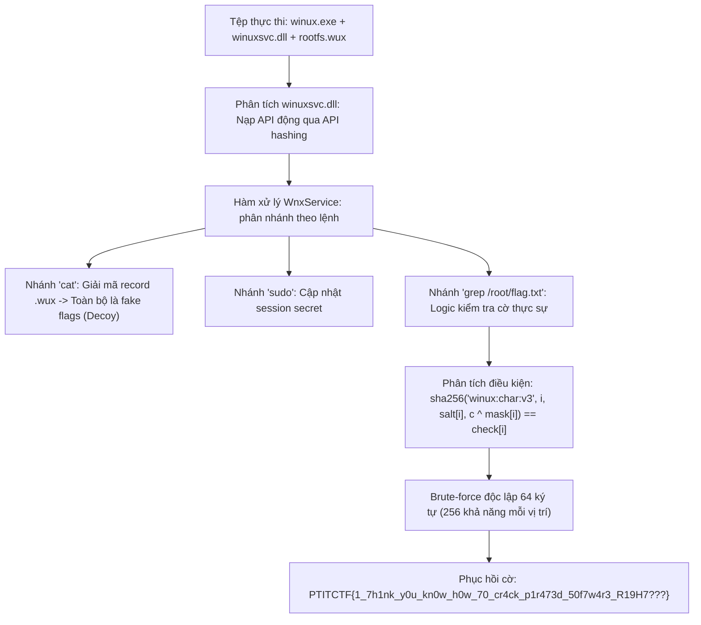
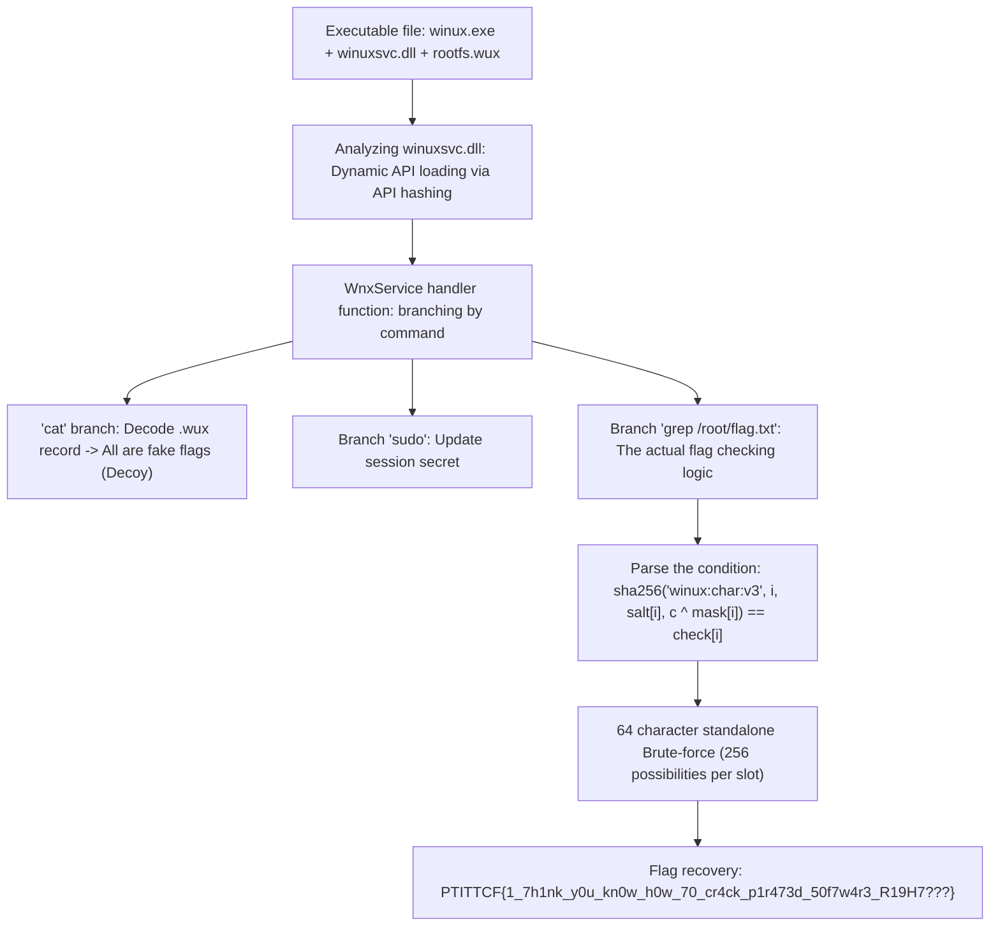

<div class="lang-switch" role="tablist" aria-label="Language switch">
  <button class="lang-btn active" role="tab" type="button" data-lang="en" aria-selected="true">EN</button>
  <button class="lang-btn" role="tab" type="button" data-lang="vn" aria-selected="false">VN</button>
</div>

<div class="lang-vn" markdown="1">

> **Flag:** `PTITCTF{1_7h1nk_y0u_kn0w_h0w_70_cr4ck_p1r473d_50f7w4r3_R19H7???}`


Bài này thuộc category **Reverse Engineering**. Handout cung cấp một file nén gồm `winux.exe`, hệ thống tệp ảo `rootfs.wux` và hai thư viện liên kết động trong thư mục `lib/` là `winuxsvc.dll` và `libpam_w32.dll`.

Chương trình cung cấp một giao diện dòng lệnh mô phỏng môi trường Linux chạy trên nền Windows, hỗ trợ các lệnh cơ bản như `ls`, `cat`, `sudo`, `grep`.

---

## Sơ đồ luồng phân tích (Solve Flow)



---

## Bước 1: Khảo sát kiến trúc và nhận diện bẫy Decoy

Khi chạy lệnh `cat /root/flag.txt` hoặc các file flag trong `rootfs.wux`, chương trình in ra các chuỗi cờ nhưng tất cả đều bị nền tảng từ chối. Phân tích tĩnh trong IDA Pro cho thấy:

* `winuxsvc.dll` thực hiện nạp các hàm API hệ thống thông qua kỹ thuật băm tên hàm (**API Hashing**) từ `kernel32.dll` và ntdll.
* Hàm `WnxService` là dispatcher chính xử lý các lệnh:
  * Case `2` tương ứng với lệnh `cat`: Đọc dữ liệu từ container `rootfs.wux` và giải mã chuỗi. Đây là dữ liệu gây nhiễu (**Decoy**) được chuẩn bị sẵn nhằm đánh lừa người chơi.
  * Case `3` tương ứng với `sudo`: Yêu cầu xác thực mật khẩu thông qua `libpam_w32.dll` và biến đổi khóa phiên.
  * Case `4` tương ứng với `grep`: Khi chạy lệnh `grep` nhắm vào đường dẫn `/root/flag.txt`, một luồng xử lý hoàn toàn khác được kích hoạt.

---

## Bước 2: Phân tích thuật toán kiểm tra trong nhánh `grep`

Khi tham số đường dẫn là `/root/flag.txt`, hàm kiểm tra tính hợp lệ của chuỗi đầu vào theo cấu trúc:

1. Kiểm tra độ dài chuỗi: Phải đúng 64 ký tự (`req + 866 == 64`).
2. Mảng kiểm tra gồm 64 giá trị băm SHA-256 (`check[0..63]`), mảng `salt[0..63]` và mảng mặt nạ `mask[0..63]`.
3. Với mỗi vị trí ký tự $i$ ($0 \le i < 64$), hàm tính toán:
   $$\text{hash} = \text{SHA256}\left(\text{"winux:char:v3"} \parallel i \parallel \text{salt}[i] \parallel (c \oplus \text{mask}[i])\right)$$
4. So sánh kết quả với `check[i]`. Nếu toàn bộ 64 ký tự đều khớp, chương trình mới xác nhận đầu vào hợp lệ.

---

## Bước 3: Khôi phục Flag bằng Script Brute-Force

Vì thuật toán băm từng ký tự một cách độc lập mà không có sự phụ thuộc chuỗi (no rolling state), không gian tìm kiếm cho mỗi vị trí $i$ chỉ là $256$ byte ($0..255$). Ta dễ dàng viết script giải mã tức thì:

```python
import hashlib
import struct

# Dữ liệu dump từ winuxsvc.dll (.rdata)
check_hashes = [...]  # 64 x SHA-256 digests
salts = [...]         # 64 salts
masks = [...]         # 64 masks

flag_chars = []
prefix = b"winux:char:v3"

for i in range(64):
    target = check_hashes[i]
    salt_val = salts[i]
    mask_val = masks[i]
    found = None
    for cand in range(32, 127):  # Thử các ký tự ASCII in được
        m = hashlib.sha256()
        m.update(prefix)
        m.update(struct.pack("<I", i))
        m.update(struct.pack("<I", salt_val))
        m.update(bytes([cand ^ mask_val]))
        if m.digest() == target:
            found = chr(cand)
            break
    flag_chars.append(found if found else "?")

flag = "".join(flag_chars)
print("Flag:", flag)
```

Quá trình quét 64 ký tự diễn ra trong vòng chưa đầy 0.1 giây.

⇒ **Flag:** `PTITCTF{1_7h1nk_y0u_kn0w_h0w_70_cr4ck_p1r473d_50f7w4r3_R19H7???}`

</div>

<div class="lang-en" markdown="1">

> **Flag:** `PTITCTF{1_7h1nk_y0u_kn0w_h0w_70_cr4ck_p1r473d_50f7w4r3_R19H7???}`


This article belongs to the category **Reverse Engineering**. Handout provides an archive consisting of `winux.exe`, the virtual file system `rootfs.wux`, and two dynamic link libraries in the `lib/` directory, `winuxsvc.dll` and `libpam_w32.dll`.

The program provides a command line interface that simulates a Linux environment running on a Windows platform, supporting basic commands such as `ls`, `cat`, `sudo`, `grep`.

---

## Analysis Flow Diagram (Solve Flow)



---

## Step 1: Survey the architecture and identify Decoy traps

When running the command `cat /root/flag.txt` or the flag files in `rootfs.wux`, the program prints flag strings but all are rejected by the platform. Static analysis in IDA Pro shows:

* `winuxsvc.dll` loads system API functions via function name hashing (**API Hashing**) from `kernel32.dll` and ntdll.
* The function `WnxService` is the main dispatcher that handles commands:
* Case `2` corresponds to the `cat` command: Read data from container `rootfs.wux` and decode the string. This is misleading data (**Decoy**) prepared to deceive players. * Case `3` corresponds to `sudo`: Requires password authentication via `libpam_w32.dll` and session key transformation. * Case `4` corresponds to `grep`: When running a `grep` command targeting the `/root/flag.txt` path, a completely different processing flow is triggered.

---

## Step 2: Analyze the test algorithm in the `grep` branch

When the path parameter is `/root/flag.txt`, the function checks the validity of the input string according to the structure:

1. Check string length: Must be exactly 64 characters (`req + 866 == 64`).
2. The check array consists of 64 SHA-256 hashes (`check[0..63]`), the `salt[0..63]` array, and the `mask[0..63]` array.
3. For each character position $i$ ($0 \le i < 64$), the function calculates:
$$\text{hash} = \text{SHA256}\left(\text{"winux:char:v3"} \parallel i \parallel \text{salt}[i] \parallel (c \oplus \text{mask}[i])\right)$$
4. Compare the result with `check[i]`. If all 64 characters match, the new program confirms the input is valid.

---

## Step 3: Restore Flag using Brute-Force Script

Since the algorithm hashes each character independently with no state rolling, the search space for each position $i$ is only $256$ bytes ($0..255$). We can easily write an instant decryption script:

```python
import hashlib
import struct

# Dữ liệu dump từ winuxsvc.dll (.rdata)
check_hashes = [...]  # 64 x SHA-256 digests
salts = [...]         # 64 salts
masks = [...]         # 64 masks

flag_chars = []
prefix = b"winux:char:v3"

for i in range(64):
    target = check_hashes[i]
    salt_val = salts[i]
    mask_val = masks[i]
    found = None
    for cand in range(32, 127):  # Thử các ký tự ASCII in được
        m = hashlib.sha256()
        m.update(prefix)
        m.update(struct.pack("<I", i))
        m.update(struct.pack("<I", salt_val))
        m.update(bytes([cand ^ mask_val]))
        if m.digest() == target:
            found = chr(cand)
            break
    flag_chars.append(found if found else "?")

flag = "".join(flag_chars)
print("Flag:", flag)
```

Scanning 64 characters takes less than 0.1 second.

⇒ **Flag:** `PTITCTF{1_7h1nk_y0u_kn0w_h0w_70_cr4ck_p1r473d_50f7w4r3_R19H7???}`
</div>
