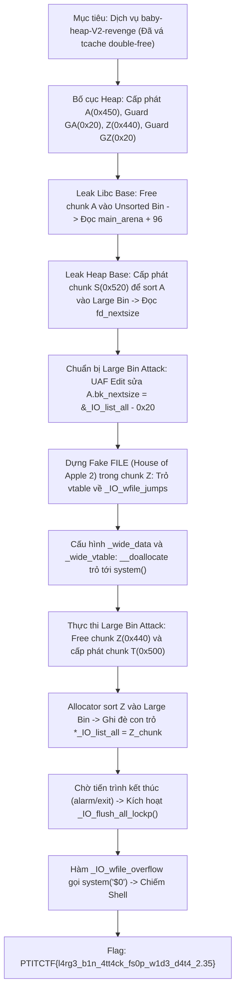
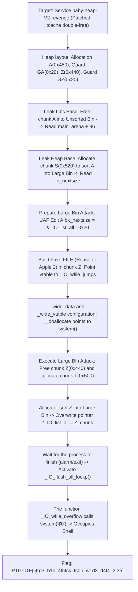

<div class="lang-switch" role="tablist" aria-label="Language switch">
  <button class="lang-btn active" role="tab" type="button" data-lang="en" aria-selected="true">EN</button>
  <button class="lang-btn" role="tab" type="button" data-lang="vn" aria-selected="false">VN</button>
</div>

<div class="lang-vn" markdown="1">

> **Flag:** `PTITCTF{l4rg3_b1n_4tt4ck_fs0p_w1d3_d4t4_2.35}`


Thử thách thuộc category **Pwn** tại vòng loại PTITCTF 2026. Đây là phiên bản vá lỗi (patched revenge) của thử thách `baby-heap-V2`. Ở phiên bản này, tác giả đã vá cơ chế sửa đổi chunk trong tcache để chặn hoàn toàn kỹ thuật Tcache Poisoning / Tcache Double-Free từng khai thác ở bản đầu.

Đồng thời, ràng buộc chỉ cho phép ghi dữ liệu trong phạm vi heap (*"Only heap writes are allowed"*) vẫn được giữ nguyên. Do đó, người chơi không thể trực tiếp ghi đè bảng GOT hay con trỏ trên stack. Để giải quyết thử thách, cần kết hợp kỹ thuật **Large Bin Attack** (để thực hiện primitive ghi địa chỉ heap vào con trỏ tùy ý) và kỹ thuật **FSOP (File Structure Oriented Programming)** trên cấu trúc luồng nhập xuất `_IO_list_all` của **glibc 2.35**.

---

## Sơ đồ luồng khai thác (Solve Flow)



---

## Bước 1: Thiết lập Bố cục Heap (Heap Layout)

Để thực hiện Large Bin Attack trong glibc 2.35, cần hai chunk có kích thước khác nhau nhưng cùng thuộc một khoảng bin lớn (Large Bin), đồng thời xen kẽ các chunk bảo vệ để tránh việc tự động hợp nhất vùng nhớ (coalescing):

1. **Chunk `A`** (`idx 0`, size `0x448` $\rightarrow$ chunk thực tế `0x450`): Thuộc Large Bin.
2. **Chunk `GA`** (`idx 1`, size `0x18` $\rightarrow$ chunk thực tế `0x20`): Ngăn `A` hợp nhất với `Z`. Byte cuối lưu chuỗi lệnh `$0` hoặc `tac /*\x00`.
3. **Chunk `Z`** (`idx 2`, size `0x438` $\rightarrow$ chunk thực tế `0x440`): Cùng nhóm Large Bin với `A`, đóng vai trò là Fake `_IO_FILE` payload.
4. **Chunk `GZ`** (`idx 3`, size `0x18`): Ngăn `Z` hợp nhất với Top chunk.
5. **Chunk `S`** (`idx 4`, size `0x520`) và **`T`** (`idx 5`, size `0x500`): Dùng để kích hoạt quá trình duyệt Unsorted Bin và sort các chunk vào Large Bin.

```python
create(0, 0x448, b'A' * 0x448)                  # Chunk A (0x450)
create(1, 0x18,  b'X' * 0x10 + b'tac /*\x00')   # Guard GA
create(2, 0x438, b'\x00' * 0x438)               # Chunk Z (0x440)
create(3, 0x18,  b'Y' * 0x18)                   # Guard GZ
```

---

## Bước 2: Rò rỉ địa chỉ Libc và Heap

### 1. Rò rỉ Libc Base
Giải phóng chunk `A`:
```python
delete(0)
```
Do kích thước `0x450` lớn hơn giới hạn của tcache (`0x410`), `A` lập tức rơi vào **Unsorted Bin**. Con trỏ `fd` và `bk` nhận giá trị địa chỉ của `main_arena + 96`:
$$\text{libc\_base} = \text{u64}(\text{read}(0, 6)) - (\text{MAIN\_ARENA} + 96)$$

### 2. Rò rỉ Heap Base thông qua Large Bin Sort
Cấp phát chunk `S` kích thước `0x520`:
```python
create(4, 0x520, b'S' * 8)
```
Khi `malloc(0x520)` được gọi, allocator duyệt qua Unsorted Bin, phát hiện chunk `A` không đủ kích thước và chuyển `A` vào **Large Bin**.
* Trong danh sách Large Bin có kích thước đơn lẻ, con trỏ `fd_nextsize` và `bk_nextsize` sẽ tạo thành một vòng khép kín và **trỏ về chính địa chỉ của chunk `A`**.
* Đọc dữ liệu tại offset `0x10` của chunk 0 để trích xuất địa chỉ thực tế của chunk `A` trên heap.
* Từ đó tính được chính xác địa chỉ của chunk `Z` kế cận:
  $$V = \text{chunk\_A} + 0x450 + 0x20$$

---

## Bước 3: Cơ chế Large Bin Attack trong glibc 2.35

Trong glibc 2.35, khi chèn một chunk `victim` mới vào Large Bin đã có sẵn các chunk khác, nếu kích thước của `victim` nhỏ hơn chunk hiện tại trong bin, đoạn mã sau sẽ được thực thi:

```c
victim->bk_nextsize = fwd->bk_nextsize;
victim->fd_nextsize = fwd;
fwd->bk_nextsize->fd_nextsize = victim;
fwd->bk_nextsize = victim;
```

Lợi dụng quyền Use-After-Free ghi trên heap đối với chunk `A`:
* Ta ghi đè trường `A->bk_nextsize` bằng giá trị:
  $$\text{A}\rightarrow\text{bk\_nextsize} = \&\text{\_IO\_list\_all} - 0x20$$
* Khi một chunk `Z` (có size `0x440` nhỏ hơn `A` size `0x450`) được giải phóng và sort vào Large Bin:
  Câu lệnh `fwd->bk_nextsize->fd_nextsize = victim` sẽ ghi địa chỉ của chunk `Z` vào địa chỉ `(&_IO_list_all - 0x20) + 0x20 = &_IO_list_all`.
* Kết quả: Con trỏ toàn cục `_IO_list_all` trong thư viện Libc bị ghi đè, trỏ trực tiếp vào đối tượng giả mạo trong chunk `Z` trên heap!

```python
pay = bytearray(0x448)
pay[0x18:0x20] = p64(libc + IO_LIST_ALL - 0x20)
edit(0, bytes(pay))
```

---

## Bước 4: Xây dựng Fake FILE Struct (House of Apple 2 / `_IO_wfile_jumps`)

Từ glibc 2.24 trở lên, bảng vtable của `_IO_FILE` bị kiểm tra nghiêm ngặt (phải nằm trong vùng vtable hợp lệ của libc). Kỹ thuật **House of Apple 2** vượt qua cơ chế này bằng cách sử dụng bảng vtable mở rộng `_IO_wfile_jumps` của glibc:

Cấu trúc giả lập bên trong chunk `Z` (địa chỉ $V$):
* Offset `0x78` (`_lock`): Trỏ tới vùng nhớ chứa số 0 ($V + 0x200$).
* Offset `0x90` (`_wide_data`): Trỏ tới vùng dữ liệu wide stream giả $W = V + 0x180$.
* Offset `0xb0` (`_mode`): Gán bằng `0` (chế độ byte stream).
* Offset `0xc8` (`vtable`): Trỏ tới `_IO_wfile_jumps` trong libc.
* Offset `0x250` ($W + 0xe0$, con trỏ `_wide_vtable`): Trỏ tới bảng jump table giả lập tại $V + 0x380$.
* Offset `0x3d8` (vị trí hàm `__doallocate` trong jump table giả): Gán bằng địa chỉ hàm `system()` trong libc.

```python
z = bytearray(0x438)
def put(off, data): z[off:off+len(data)] = data

put(0x78, p64(V + 0x200))                     # _lock
put(0x90, p64(V + 0x180))                     # _wide_data
put(0xb0, p32(0))                             # _mode = 0
put(0xc8, p64(libc + IO_WFILE_JUMPS))          # vtable = _IO_wfile_jumps
put(0x250, p64(V + 0x380))                    # _wide_data->_wide_vtable
put(0x3d8, p64(libc + SYSTEM))                # __doallocate = system()

edit(2, bytes(z))
```

---

## Bước 5: Kích hoạt Tấn công và Thu thập Flag

1. **Thực thi ghi đè con trỏ `_IO_list_all`**:
   * Giải phóng chunk `Z`:
     ```python
     delete(2)
     ```
   * Gọi `create(5, 0x500, ...)` để kích hoạt allocator duyệt qua Unsorted Bin.
   * Chunk `Z` được đưa vào Large Bin, kích hoạt nhánh ghi đè con trỏ `_IO_list_all` trỏ về chunk `Z`.
2. **Kích hoạt hàm Flush luồng xuất nhập**:
   * Khi chương trình kết thúc do gọi hàm `exit()` hoặc hết thời gian chờ của `alarm(60)`, glibc sẽ tự động thực hiện hàm dọn dẹp `_IO_flush_all_lockp()`.
   * Hàm này duyệt danh sách `_IO_list_all`, gặp cấu trúc giả mạo tại `Z`, kiểm tra các điều kiện buffer và chuyển hướng tới:
     $$\text{\_IO\_OVERFLOW} \rightarrow \text{\_IO\_wfile\_overflow} \rightarrow \text{\_IO\_wdoallocbuf} \rightarrow \text{\_\_doallocate}$$
   * Con trỏ hàm `__doallocate` (chính là `system`) được gọi với đối số $rdi$ là địa chỉ của cấu trúc fake FILE, kích hoạt lệnh thực thi chuỗi lệnh điều khiển hoặc mở shell `/bin/sh`.
   * Gửi lệnh đọc nội dung tệp flag từ shell mới tạo.

---

## Flag

```text
PTITCTF{l4rg3_b1n_4tt4ck_fs0p_w1d3_d4t4_2.35}
```

</div>

<div class="lang-en" markdown="1">

> **Flag:** `PTITCTF{l4rg3_b1n_4tt4ck_fs0p_w1d3_d4t4_2.35}`


The challenge belongs to the **Pwn** category in the PTITCTF 2026 qualifiers. This is a patched revenge version of the `baby-heap-V2` challenge. In this version, the author has patched the chunk modification mechanism in tcache to completely block the Tcache Poisoning / Tcache Double-Free technique that was exploited in the first version.

At the same time, the constraint that only heap writes are allowed (*"Only heap writes are allowed"*) remains in place. Therefore, the player cannot directly overwrite the GOT table or the pointer on the stack. To solve the challenge, it is necessary to combine the **Large Bin Attack** technique (to perform primitive writing of heap addresses to arbitrary pointers) and the **FSOP (File Structure Oriented Programming)** technique on the `_IO_list_all` I/O stream structure of **glibc 2.35**.

---

## Solve Flow Diagram



---

## Step 1: Set up Heap Layout

To perform a Large Bin Attack in glibc 2.35, you need two chunks of different sizes but belonging to the same large bin range (Large Bin), and interleave protection chunks to avoid automatic coalescing:

1. **Chunk `A`** (`idx 0`, size `0x448` $\rightarrow$ actual chunk `0x450`): Belongs to Large Bin.
2. **Chunk `GA`** (`idx 1`, size `0x18` $\rightarrow$ actual chunk `0x20`): Prevents `A` from merging with `Z`. The last byte stores the command string `$0` or `tac /*\x00`.
3. **Chunk `Z`** (`idx 2`, size `0x438` $\rightarrow$ actual chunk `0x440`): Same Large Bin group as `A`, acting as Fake `_IO_FILE` payload.
4. **Chunk `GZ`** (`idx 3`, size `0x18`): Prevent `Z` from merging with the Top chunk.
5. **Chunk `S`** (`idx 4`, size `0x520`) and **`T`** (`idx 5`, size `0x500`): Used to activate the Unsorted Bin browsing process and sort chunks into Large Bin.

```python
create(0, 0x448, b'A' * 0x448)                  # Chunk A (0x450)
create(1, 0x18,  b'X' * 0x10 + b'tac /*\x00')   # Guard GA
create(2, 0x438, b'\x00' * 0x438)               # Chunk Z (0x440)
create(3, 0x18,  b'Y' * 0x18)                   # Guard GZ
```

---

## Step 2: Libc and Heap address leak

### 1. Libc Base leak
Free chunk `A`:
```python
delete(0)
```
Since the size `0x450` is larger than the tcache limit (`0x410`), `A` immediately falls into the **Unsorted Bin**. Pointers `fd` and `bk` get the address value of `main_arena + 96`: $$\text{libc\_base} = \text{u64}(\text{read}(0, 6)) - (\text{MAIN\_ARENA} + 96)$$

### 2. Heap Base leak via Large Bin Sort
Allocate chunk `S` of size `0x520`:
```python
create(4, 0x520, b'S' * 8)
```
When `malloc(0x520)` is called, the allocator traverses the Unsorted Bin, detects that chunk `A` is not of sufficient size, and moves `A` into the **Large Bin**.
* In a single-sized Large Bin list, pointers `fd_nextsize` and `bk_nextsize` will form a closed loop and **point to the address of chunk `A`** itself.
* Read data at offset `0x10` of chunk 0 to extract the actual address of chunk `A` on the heap.
* From there, we can calculate the exact address of the adjacent `Z` chunk:
$$V = \text{chunk\_A} + 0x450 + 0x20$$

---

## Step 3: Large Bin Attack mechanism in glibc 2.35

In glibc 2.35, when inserting a new `victim` chunk into a Large Bin that already has other chunks, if the size of `victim` is smaller than the current chunk in the bin, the following code will be executed:

```c
victim->bk_nextsize = fwd->bk_nextsize;
victim->fd_nextsize = fwd;
fwd->bk_nextsize->fd_nextsize = victim;
fwd->bk_nextsize = victim;
```

Taking advantage of the Use-After-Free write permission on the heap for chunk `A`:
* We overwrite the field `A->bk_nextsize` with the value:
$$\text{A}\rightarrow\text{bk\_nextsize} = \&\text{\_IO\_list\_all} - 0x20$$
* When a chunk `Z` (with size `0x440` smaller than `A` size `0x450`) is freed and sorted into Large Bin:
The statement `fwd->bk_nextsize->fd_nextsize = victim` will write the address of chunk `Z` to address `(&_IO_list_all - 0x20) + 0x20 = &_IO_list_all`.
* Result: The global pointer `_IO_list_all` in the Libc library is overwritten, pointing directly to the fake object in chunk `Z` on the heap!

```python
pay = bytearray(0x448)
pay[0x18:0x20] = p64(libc + IO_LIST_ALL - 0x20)
edit(0, bytes(pay))
```

---

## Step 4: Build Fake FILE Struct (House of Apple 2 / `_IO_wfile_jumps`)

From glibc 2.24 and later, the vtable of `_IO_FILE` is strictly checked (must be in a valid vtable area of ​​libc). The **House of Apple 2** technique bypasses this mechanism by using glibc's `_IO_wfile_jumps` extended vtable:

Emulator structure inside chunk `Z` (address $V$):
* Offset `0x78` (`_lock`): Points to the memory area containing the number 0 ($V + 0x200$).
* Offset `0x90` (`_wide_data`): Points to the fake wide stream data area $W = V + 0x180$.
* Offset `0xb0` (`_mode`): Set to `0` (byte stream mode).
* Offset `0xc8` (`vtable`): Points to `_IO_wfile_jumps` in libc.
* Offset `0x250` ($W + 0xe0$, pointer `_wide_vtable`): Points to the simulated jump table at $V + 0x380$.
* Offset `0x3d8` (location of function `__doallocate` in pseudo jump table): Assign to function address `system()` in libc.

```python
z = bytearray(0x438)
def put(off, data): z[off:off+len(data)] = data

put(0x78, p64(V + 0x200))                     # _lock
put(0x90, p64(V + 0x180))                     # _wide_data
put(0xb0, p32(0))                             # _mode = 0
put(0xc8, p64(libc + IO_WFILE_JUMPS))          # vtable = _IO_wfile_jumps
put(0x250, p64(V + 0x380))                    # _wide_data->_wide_vtable
put(0x3d8, p64(libc + SYSTEM))                # __doallocate = system()

edit(2, bytes(z))
```

---

## Step 5: Activate Attack and Collect Flag

1. **Implement override of pointer `_IO_list_all`**:
* Free chunk `Z`:
     ```python
     delete(2)
     ```
* Call `create(5, 0x500, ...)` to enable the allocator to traverse the Unsorted Bin. * Chunk `Z` is included in the Large Bin, triggering a branch that overwrites the `_IO_list_all` pointer pointing to chunk `Z`.
2. **Activate the input and output stream Flush function**:
* When the program terminates due to a call to `exit()` or a timeout of `alarm(60)`, glibc will automatically execute the cleanup function `_IO_flush_all_lockp()`. * This function traverses the list `_IO_list_all`, encounters a fake structure at `Z`, checks the buffer conditions and redirects to: $$\text{\_IO\_OVERFLOW} \rightarrow \text{\_IO\_wfile\_overflow} \rightarrow \text{\_IO\_wdoallocbuf} \rightarrow \text{\_\_doallocate}$$ * The function pointer `__doallocate` (which is `system`) is called where the $rdi$ argument is the address of the fake FILE structure, triggering the command to execute the control chain or open the shell `/bin/sh`. * Send command to read flag file content from newly created shell.

---

## Flag

```text
PTITCTF{l4rg3_b1n_4tt4ck_fs0p_w1d3_d4t4_2.35}
```
</div>
