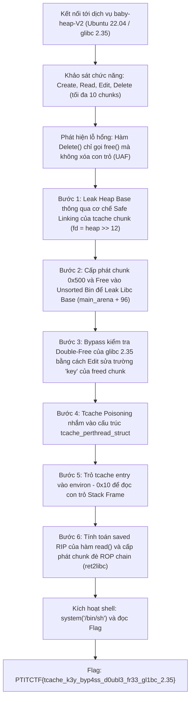
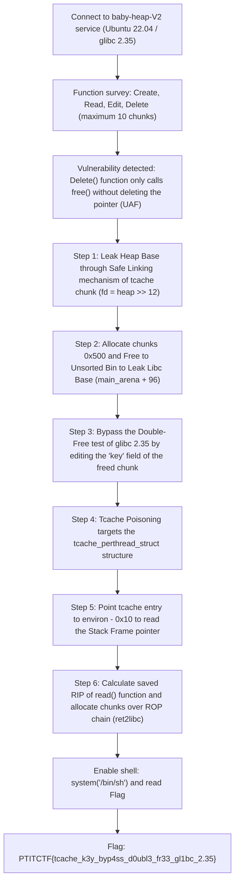

<div class="lang-switch" role="tablist" aria-label="Language switch">
  <button class="lang-btn active" role="tab" type="button" data-lang="en" aria-selected="true">EN</button>
  <button class="lang-btn" role="tab" type="button" data-lang="vn" aria-selected="false">VN</button>
</div>

<div class="lang-vn" markdown="1">

> **Flag:** `PTITCTF{tcache_k3y_byp4ss_d0ubl3_fr33_gl1bc_2.35}`


Thử thách thuộc category **Pwn** tại vòng loại PTITCTF 2026. Đề bài cung cấp một chương trình quản lý bộ nhớ heap dạng CRUD (Create, Read, Edit, Delete) chạy trên môi trường Linux Ubuntu 22.04 với thư viện **glibc 2.35**.

Chương trình triển khai cơ chế kiểm tra ghi bộ nhớ nghiêm ngặt nhằm ngăn chặn các kỹ thuật ghi đè bảng GOT hoặc con trỏ hệ thống trực tiếp (*"Only heap writes are allowed"*). Mục tiêu là vượt qua các cơ chế phòng thủ hiện đại của glibc 2.35 (Safe Linking, Tcache Double-Free Detection) thông qua lỗi Use-After-Free để đoạt quyền thực thi lệnh trên máy chủ.

---

## Sơ đồ luồng khai thác (Solve Flow)



---

## Bước 1: Phân tích cơ chế chương trình và Xác định nguyên nhân gốc (Root Cause)

Chương trình cung cấp menu tương tác chuẩn:
1. **Create**: Yêu cầu `Index`, `Size`, và `Data` để gọi `malloc(size)`.
2. **Read**: In ra `n` byte dữ liệu của chunk tại `Index`.
3. **Edit**: Cho phép sửa dữ liệu của chunk tại `Index`. Chương trình kiểm tra con trỏ dữ liệu phải thuộc dải địa chỉ của heap segment:
   ```c
   if (chunk_ptr < heap_start || chunk_ptr >= heap_end) {
       puts("Only heap writes are allowed");
       return;
   }
   ```
4. **Delete**: Gọi `free(chunks[idx])`.

### Lỗ hổng Use-After-Free (UAF)
Sau khi giải phóng vùng nhớ bằng hàm `free()`, con trỏ trong mảng `chunks[idx]` **không được gán về `NULL`**. Do đó, người dùng vẫn có thể tiếp tục thực hiện các thao tác `Read`, `Edit`, và thậm chí gọi lại `Delete` trên một chunk đã giải phóng.

---

## Bước 2: Rò rỉ địa chỉ Heap Base và Libc Base

### 1. Leak Heap Base (Cơ chế Safe Linking)
Từ glibc 2.32 trở đi, con trỏ đơn liên kết `fd` trong tcache được mã hóa bằng thuật toán Safe Linking:
$$\text{encrypted\_fd} = \left(\frac{\text{chunk\_addr}}{4096}\right) \oplus \text{target\_addr}$$

* Cấp phát chunk nhỏ `idx 0` kích thước `0x20` byte và giải phóng:
  ```python
  create(0, 0x18, b'AAAA')
  delete(0)
  ```
* Do danh sách tcache rỗng trước đó, `target_addr = 0`. Giá trị lưu trong `fd` chính là $\text{heap\_base} \gg 12$.
* Đọc lại dữ liệu chunk 0 bằng hàm `read_chunk(0, 8)`:
  $$\text{heap\_base} = \text{leaked\_val} \ll 12$$

### 2. Leak Libc Base (Unsorted Bin)
Tcache chỉ chứa các chunk có kích thước nhỏ hơn hoặc bằng `0x410` (chunk size `0x420`). Khi giải phóng một chunk có kích thước lớn hơn, nó sẽ được đưa vào **Unsorted Bin**:
* Cấp phát chunk `idx 1` kích thước `0x428` byte (vượt ngưỡng tcache):
  ```python
  create(1, 0x428, b'BBBB')
  delete(1)
  ```
* Chunk được đưa vào Unsorted Bin. Hai trường `fd` và `bk` của chunk sẽ được cập nhật trỏ về `main_arena + 96` trong thư viện `libc.so.6`.
* Đọc 8 byte đầu của chunk 1 để tính toán `libc_base`:
  $$\text{libc\_base} = \text{main\_arena\_96} - 0x21ace0$$

---

## Bước 3: Bypass kiểm tra Double-Free trong glibc 2.35

Trong glibc 2.35, cơ chế chống Double-Free trong tcache được tăng cường bằng cách chèn một trường `key` ngẫu nhiên vào `chunk + 0x10`:
```c
if (__glibc_unlikely (e->key == tcache_key)) {
    // Duyệt qua toàn bộ danh sách tcache để phát hiện trùng lặp
    tcache_entry *tmp;
    SLIST_FOREACH (tmp, &tcache->entries[tc_idx], next)
        if (tmp == e)
            malloc_printerr ("free(): double free detected in tcache 2");
}
```

Nhờ có quyền ghi UAF thông qua hàm `Edit()` và do chunk vẫn nằm trên heap (thỏa mãn điều kiện *"Only heap writes are allowed"*):
* Khi chunk nằm trong tcache, trường `key` nằm tại vị trí offset `0x08` (sau con trỏ `fd`).
* Thực hiện ghi đè trường `key` bằng một giá trị bất kỳ khác với `tcache_key` (hoặc đặt giá trị hợp lệ `heap_base >> 12`).
* Khi gọi `Delete()` lần 2 trên cùng một chunk, câu lệnh so sánh `e->key == tcache_key` đánh giá là **False**. Chương trình bỏ qua bước quét danh sách kiểm tra trùng lặp và cho phép giải phóng chunk lần nữa $\rightarrow$ **Double-Free thành công!**

---

## Bước 4: Tcache Poisoning, Leak Stack và Ret2libc

Sau khi tạo được vòng lặp tcache (tcache loop):
1. **Kiểm soát `tcache_perthread_struct`**:
   Đầu dải heap chứa cấu trúc quản lý `tcache_perthread_struct` tại địa chỉ `heap_base + 0x10`. Sửa con trỏ `fd` (áp dụng Safe Linking) trỏ về cấu trúc này.
2. **Leak Stack qua biến môi trường `environ`**:
   * Cấu hình tcache entry kích thước `0x110` (chỉ số bin `idx = 0xf`) trỏ về địa chỉ `libc.symbols['environ'] - 0x10`.
   * Cấp phát lại chunk để đọc nội dung `environ`. Giá trị trả về chính là địa chỉ con trỏ stack trỏ tới mảng biến môi trường của tiến trình.
3. **Chiếm quyền điều khiển (Hijack saved RIP)**:
   * Từ địa chỉ stack bị rò rỉ, tính toán chính xác vị trí lưu trữ `saved RIP` của hàm nhập dữ liệu trong hàm `read_chunk`.
   * Đưa địa chỉ `saved_rip` vào tcache entry.
   * Cấp phát chunk đè lên stack frame một ROP chain chuẩn:
     $$\text{ROP: } \text{ret} \rightarrow \text{pop rdi ; ret} \rightarrow \&\text{"/bin/sh"} \rightarrow \text{system()}$$
4. **Trigger Shell**:
   Hàm đọc dữ liệu kết thúc và thực hiện lệnh `ret`, luồng thực thi lập tức nhảy vào ROP chain và khởi tạo shell hệ thống.

---

## Flag

```text
PTITCTF{tcache_k3y_byp4ss_d0ubl3_fr33_gl1bc_2.35}
```

</div>

<div class="lang-en" markdown="1">

> **Flag:** `PTITCTF{tcache_k3y_byp4ss_d0ubl3_fr33_gl1bc_2.35}`


The challenge belongs to the **Pwn** category in the PTITTCTF 2026 qualifying round. The challenge provides a CRUD (Create, Read, Edit, Delete) heap memory management program running on the Linux Ubuntu 22.04 environment with the **glibc 2.35** library.

The program implements a strict memory write check mechanism to prevent direct GOT table or system pointer overwrite techniques (*"Only heap writes are allowed"*). The goal is to bypass glibc 2.35's modern defense mechanisms (Safe Linking, Tcache Double-Free Detection) through the Use-After-Free error to gain command execution rights on the server.

---

## Solve Flow Diagram



---

## Step 1: Analyze the program mechanism and determine the root cause

The program provides a standard interactive menu:
1. **Create**: Requires `Index`, `Size`, and `Data` to call `malloc(size)`.
2. **Read**: Print out `n` bytes of data of the chunk at `Index`.
3. **Edit**: Allows editing chunk data at `Index`. The program checks that the data pointer must belong to the address range of the heap segment:
   ```c
   if (chunk_ptr < heap_start || chunk_ptr >= heap_end) {
       puts("Only heap writes are allowed");
       return;
   }
   ```
4. **Delete**: Call `free(chunks[idx])`.

### Use-After-Free (UAF) Vulnerability
After freeing memory with the `free()` function, the pointer in the array `chunks[idx]` **is not assigned to `NULL`**. Therefore, the user can still continue to perform `Read`, `Edit`, and even call `Delete` again on a freed chunk.

---

## Step 2: Leaking Heap Base and Libc Base addresses

### 1. Leak Heap Base (Safe Linking Mechanism)
From glibc 2.32 onwards, the linked single pointer `fd` in tcache is encrypted using the Safe Linking algorithm: $$\text{encrypted\_fd} = \left(\frac{\text{chunk\_addr}}{4096}\right) \oplus \text{target\_addr}$$

* Allocate a small chunk `idx 0` of size `0x20` bytes and release:
  ```python
  create(0, 0x18, b'AAAA')
  delete(0)
  ```
* Due to previously empty tcache list, `target_addr = 0`. The value stored in `fd` is $\text{heap\_base} \gg 12$.
* Read chunk 0 data again with `read_chunk(0, 8)` function:
$$\text{heap\_base} = \text{leaked\_val} \ll 12$$

### 2. Leak Libc Base (Unsorted Bin)
Tcache only contains chunks with size less than or equal to `0x410` (chunk size `0x420`). When freeing a chunk of larger size, it will be put into the **Unsorted Bin**:
* Allocation of chunk `idx 1` size `0x428` bytes (exceeds tcache threshold):
  ```python
  create(1, 0x428, b'BBBB')
  delete(1)
  ```
* Chunk is put into Unsorted Bin. The two fields `fd` and `bk` of the chunk will be updated to point to `main_arena + 96` in the library `libc.so.6`.
* Read the first 8 bytes of chunk 1 to calculate `libc_base`:
$$\text{libc\_base} = \text{main\_arena\_96} - 0x21ace0$$

---

## Step 3: Bypass Double-Free check in glibc 2.35

In glibc 2.35, the anti-Double-Free mechanism in tcache is enhanced by inserting a random `key` field into `chunk + 0x10`:
```c
if (__glibc_unlikely (e->key == tcache_key)) {
    // Duyệt qua toàn bộ danh sách tcache để phát hiện trùng lặp
    tcache_entry *tmp;
    SLIST_FOREACH (tmp, &tcache->entries[tc_idx], next)
        if (tmp == e)
            malloc_printerr ("free(): double free detected in tcache 2");
}
```

Thanks to UAF write access via the `Edit()` function and because the chunk remains on the heap (satisfying the condition *"Only heap writes are allowed"*):
* When the chunk is in the tcache, the `key` field is at offset `0x08` (after the `fd` pointer).
* Do overwrite the `key` field with any value other than `tcache_key` (or set a valid value `heap_base >> 12`).
* When calling `Delete()` a second time on the same chunk, the comparison statement `e->key == tcache_key` evaluates to **False**. The program skips the duplicate checklist scanning step and allows the chunk to be freed again $\rightarrow$ **Double-Free successful!**

---

## Step 4: Tcache Poisoning, Leak Stack and Ret2libc

After creating the tcache loop:
1. **Control `tcache_perthread_struct`**:
The top of the heap contains the management structure `tcache_perthread_struct` at address `heap_base + 0x10`. Fix the `fd` pointer (apply Safe Linking) to point to this structure.
2. **Leak Stack via environment variable `environ`**:
* Configure tcache entry size `0x110` (bin index `idx = 0xf`) pointing to address `libc.symbols['environ'] - 0x10`. * Reallocate chunks to read `environ` content. The return value is the stack pointer address pointing to the process's array of environment variables.
3. **Hijack saved RIP**:
* From the leaked stack address, correctly calculate the `saved RIP` storage location of the import function in the `read_chunk` function. * Include `saved_rip` address in tcache entry. * Allocate chunks over stack frames with a standard ROP chain: $$\text{ROP: } \text{ret} \rightarrow \text{pop rdi ; ret} \rightarrow \&\text{"/bin/sh"} \rightarrow \text{system()}$$
4. **Trigger Shell**:
The data reading function finishes and executes the `ret` command, the execution thread immediately jumps into the ROP chain and initializes the system shell.

---

## Flag

```text
PTITCTF{tcache_k3y_byp4ss_d0ubl3_fr33_gl1bc_2.35}
```
</div>
