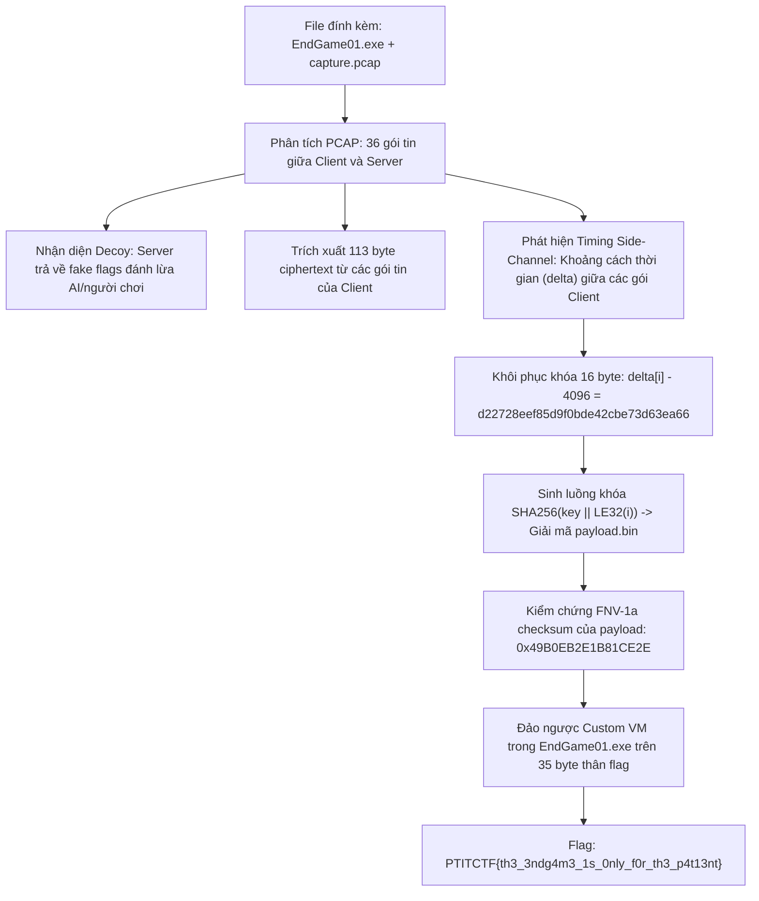
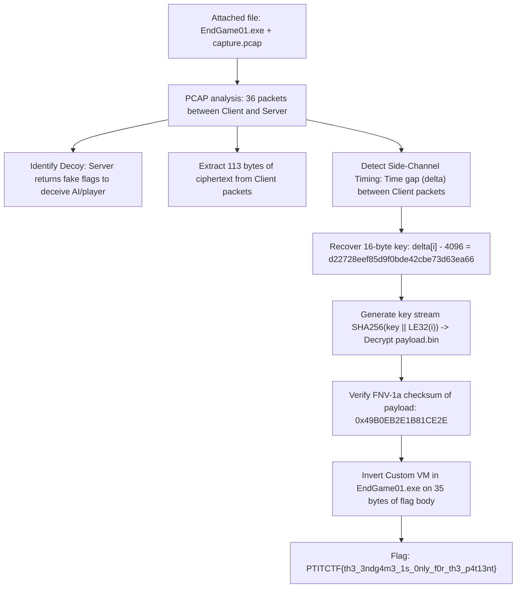

<div class="lang-switch" role="tablist" aria-label="Language switch">
  <button class="lang-btn active" role="tab" type="button" data-lang="en" aria-selected="true">EN</button>
  <button class="lang-btn" role="tab" type="button" data-lang="vn" aria-selected="false">VN</button>
</div>

<div class="lang-vn" markdown="1">

> **Flag:** `PTITCTF{th3_3ndg4m3_1s_0nly_f0r_th3_p4t13nt}`


Bài này thuộc category **Reverse Engineering** trong vòng Chung kết PTITCTF 2026. Đề bài cung cấp hai tệp đính kèm: `EndGame01.exe` và tệp bắt gói tin mạng `capture.pcap` ghi lại phiên liên lạc giữa một client agent và server.

Mục tiêu là trích xuất khóa ẩn trong lưu lượng mạng, giải mã tệp bytecode payload và đảo ngược máy ảo của checker.

---

## Sơ đồ luồng phân tích (Solve Flow)



---

## Bước 1: Khảo sát EXE Checker và nhận diện cấu trúc Payload

Phân tích tĩnh `EndGame01.exe` bằng IDA Pro cho thấy hàm kiểm tra tại `0x140002E40` nhận cú pháp dòng lệnh:
`EndGame01.exe <payload.bin> <flag>`

1. Đọc tệp payload, tính mã băm **FNV-1a 64-bit** và yêu cầu giá trị băm phải khớp chính xác với hằng số:
   $$\text{FNV-1a} = \text{0x49B0EB2E1B81CE2E}$$
2. Đọc hai số nguyên 16-bit little-endian ở đầu payload xác định độ dài bytecode và bảng hằng số.
3. Kiểm tra định dạng flag: Độ dài đúng 44 byte, bắt đầu bằng `PTITCTF{` và kết thúc bằng `}` (35 ký tự thân).
4. Chương trình sử dụng các API phát hiện gỡ lỗi (`IsDebuggerPresent`, `PEB.BeingDebugged`) để tạo mặt nạ làm sai lệch kết quả so khớp hash nếu chạy dưới debugger.

---

## Bước 2: Phân tích PCAP & Kênh kề thời gian (Timing Side-Channel)

Mở `capture.pcap` phân tích luồng TCP giữa `10.0.0.5:50000` (Client) và `10.0.0.9:4444` (Server):
* Chiều Server $\rightarrow$ Client chứa các chuỗi mồi nhử (**Decoy flags**) như `PTITCTF{llm_g1ve_up_now}` hay `PTITCTF{n0t_th3_r34l_0ne_keep_l00k1ng}`.
* Chiều Client $\rightarrow$ Server gửi 29 gói tin mang tổng cộng 113 byte dữ liệu mã hóa.
* Tính khoảng chênh lệch thời gian ($\Delta t$ tính bằng microsecond) giữa hai gói tin liên tiếp mà Client gửi đi:
  * Từ gói thứ 17 trở đi, $\Delta t$ tuân theo công thức nhân tạo: $\Delta t_i = 5000 + (37 \times i \pmod{400})$.
  * 16 khoảng thời gian đầu tiên mang giá trị biến thiên trong dải $4107 - 4344\ \mu\text{s}$.

Điều này chỉ ra 16 khoảng thời gian đầu tiên mã hóa khóa bí mật 16 byte với mức nền (baseline) là 4096:

```python
key = bytes(delta[i] - 4096 for i in range(16))

```

---

## Bước 3: Giải mã Payload và Đảo ngược Máy ảo (Custom VM)

Keystream được tạo bằng cách nối liên tiếp các khối băm SHA-256:
$$\text{Keystream} = \text{SHA256}(key \parallel \text{LE32}(0)) \parallel \text{SHA256}(key \parallel \text{LE32}(1)) \parallel \dots$$

Sau khi XOR keystream với 113 byte ciphertext:
* Thu được `payload.bin` có hash FNV-1a khớp chuẩn `0x49B0EB2E1B81CE2E`.
* Phân tích bytecode của máy ảo trong payload: Mỗi ký tự thân cờ được đưa qua một chuỗi các phép toán số học và logic (cộng trừ có nhớ, dịch bit, XOR bảng hằng số).
* Do các phép toán này có tính khả nghịch và không gian ký tự là ASCII in được, ta đảo ngược từng bước và tìm được nghiệm duy nhất gồm 35 ký tự:

```text
th3_3ndg4m3_1s_0nly_f0r_th3_p4t13nt
```

⇒ **Flag:** `PTITCTF{th3_3ndg4m3_1s_0nly_f0r_th3_p4t13nt}`

</div>

<div class="lang-en" markdown="1">

> **Flag:** `PTITCTF{th3_3ndg4m3_1s_0nly_f0r_th3_p4t13nt}`


This article belongs to the **Reverse Engineering** category in the PTITTCTF 2026 Finals. The article provides two attachments: `EndGame01.exe` and a network packet capture file `capture.pcap` that records the communication session between a client agent and the server.

The goal is to extract hidden keys in network traffic, decrypt the bytecode payload file, and reverse engineer the checker's virtual machine.

---

## Analysis Flow Diagram (Solve Flow)



---

## Step 1: Examine the EXE Checker and identify the Payload structure

Static analysis of `EndGame01.exe` with IDA Pro shows that the test function at `0x140002E40` receives command line syntax: `EndGame01.exe <payload.bin> <flag>`

1. Read the payload file, calculate the **FNV-1a 64-bit hash** and require the hash value to match the constant exactly:
$$\text{FNV-1a} = \text{0x49B0EB2E1B81CE2E}$$
2. Read two 16-bit little-endian integers at the beginning of the payload that determine the bytecode length and constant table.
3. Check flag format: Correct length of 44 bytes, starting with `PTITCTF{` and ending with `}` (35 characters body).
4. The program uses the debugging detection APIs (`IsDebuggerPresent`, `PEB.BeingDebugged`) to create a mask that distorts hash matching results if run under debugger.

---

## Step 2: Analyze PCAP & Timing Side-Channel

Open `capture.pcap` analyze the TCP stream between `10.0.0.5:50000` (Client) and `10.0.0.9:4444` (Server):
* The Server $\rightarrow$ Client dimension contains decoy strings (**Decoy flags**) such as `PTITCTF{llm_g1ve_up_now}` or `PTITCTF{n0t_th3_r34l_0ne_keep_l00k1ng}`.
* Client afternoon $\rightarrow$ Server sends 29 packets carrying a total of 113 bytes of encrypted data.
* Calculate the time difference ($\Delta t$ in microseconds) between two consecutive packets sent by the Client:
* From the 17th packet onwards, $\Delta t$ follows the artificial formula: $\Delta t_i = 5000 + (37 \times i \pmod{400})$. * The first 16 time periods have varying values ​​in the range $4107 - 4344\ \mu\text{s}$.

This shows the first 16 intervals encrypting the 16-byte secret key with a baseline of 4096:

```python
key = bytes(delta[i] - 4096 for i in range(16))

```

---

## Step 3: Decrypt the Payload and Invert the Virtual Machine (Custom VM)

The keystream is created by concatenating consecutive SHA-256 hash blocks: $$\text{Keystream} = \text{SHA256}(key \parallel \text{LE32}(0)) \parallel \text{SHA256}(key \parallel \text{LE32}(1)) \parallel \dots$$

After XORing the keystream with the 113 byte ciphertext:
* Obtained `payload.bin` with FNV-1a hash matching `0x49B0EB2E1B81CE2E`.
* Analyze the virtual machine's bytecode in the payload: Each flag body character is put through a series of arithmetic and logical operations (add and subtract with carry, bit shift, XOR constant table).
* Since these operations are invertible and the character space is printable ASCII, we reverse each step and find a unique solution consisting of 35 characters:

```text
th3_3ndg4m3_1s_0nly_f0r_th3_p4t13nt
```

⇒ **Flag:** `PTITCTF{th3_3ndg4m3_1s_0nly_f0r_th3_p4t13nt}`
</div>
