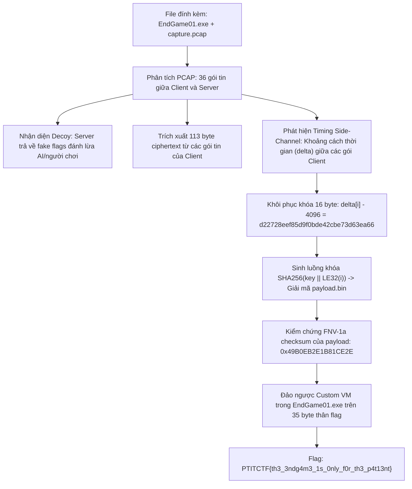
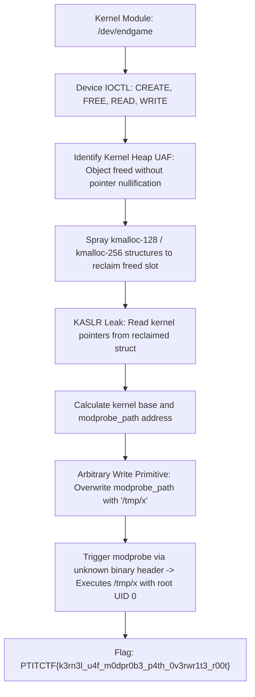

<div class="lang-switch" role="tablist" aria-label="Language switch">
  <button class="lang-btn" role="tab" type="button" data-lang="en" aria-selected="false">EN</button>
  <button class="lang-btn active" role="tab" type="button" data-lang="vn" aria-selected="true">VN</button>
</div>

<div class="lang-vn" markdown="1">

> **Flag:** `PTITCTF{th3_3ndg4m3_1s_0nly_f0r_th3_p4t13nt}`


Bài này thuộc category **Reverse Engineering** trong vòng Chung kết PTITCTF 2026. Đề bài cung cấp hai tệp đính kèm: `EndGame01.exe` và tệp bắt gói tin mạng `capture.pcap` ghi lại phiên liên lạc giữa một client agent và server.

Mục tiêu là trích xuất khóa ẩn trong lưu lượng mạng, giải mã tệp bytecode payload và đảo ngược máy ảo của checker.

---

## Sơ đồ luồng phân tích (Solve Flow)



---

## Bước 1: Khảo sát EXE Checker và nhận diện cấu trúc Payload

Phân tích tĩnh `EndGame01.exe` bằng IDA Pro cho thấy hàm kiểm tra tại `0x140002E40` nhận cú pháp dòng lệnh:
`EndGame01.exe <payload.bin> <flag>`

1. Đọc tệp payload, tính mã băm **FNV-1a 64-bit** và yêu cầu giá trị băm phải khớp chính xác với hằng số:
   $$\text{FNV-1a} = \text{0x49B0EB2E1B81CE2E}$$
2. Đọc hai số nguyên 16-bit little-endian ở đầu payload xác định độ dài bytecode và bảng hằng số.
3. Kiểm tra định dạng flag: Độ dài đúng 44 byte, bắt đầu bằng `PTITCTF{` và kết thúc bằng `}` (35 ký tự thân).
4. Chương trình sử dụng các API phát hiện gỡ lỗi (`IsDebuggerPresent`, `PEB.BeingDebugged`) để tạo mặt nạ làm sai lệch kết quả so khớp hash nếu chạy dưới debugger.

---

## Bước 2: Phân tích PCAP & Kênh kề thời gian (Timing Side-Channel)

Mở `capture.pcap` phân tích luồng TCP giữa `10.0.0.5:50000` (Client) và `10.0.0.9:4444` (Server):
* Chiều Server $\rightarrow$ Client chứa các chuỗi mồi nhử (**Decoy flags**) như `PTITCTF{llm_g1ve_up_now}` hay `PTITCTF{n0t_th3_r34l_0ne_keep_l00k1ng}`.
* Chiều Client $\rightarrow$ Server gửi 29 gói tin mang tổng cộng 113 byte dữ liệu mã hóa.
* Tính khoảng chênh lệch thời gian ($\Delta t$ tính bằng microsecond) giữa hai gói tin liên tiếp mà Client gửi đi:
  * Từ gói thứ 17 trở đi, $\Delta t$ tuân theo công thức nhân tạo: $\Delta t_i = 5000 + (37 \times i \pmod{400})$.
  * 16 khoảng thời gian đầu tiên mang giá trị biến thiên trong dải $4107 - 4344\ \mu\text{s}$.

Điều này chỉ ra 16 khoảng thời gian đầu tiên mã hóa khóa bí mật 16 byte với mức nền (baseline) là 4096:

```python
key = bytes(delta[i] - 4096 for i in range(16))
# Khóa thu được: d22728eef85d9f0bde42cbe73d63ea66
```

---

## Bước 3: Giải mã Payload và Đảo ngược Máy ảo (Custom VM)

Keystream được tạo bằng cách nối liên tiếp các khối băm SHA-256:
$$\text{Keystream} = \text{SHA256}(key \parallel \text{LE32}(0)) \parallel \text{SHA256}(key \parallel \text{LE32}(1)) \parallel \dots$$

Sau khi XOR keystream với 113 byte ciphertext:
* Thu được `payload.bin` có hash FNV-1a khớp chuẩn `0x49B0EB2E1B81CE2E`.
* Phân tích bytecode của máy ảo trong payload: Mỗi ký tự thân cờ được đưa qua một chuỗi các phép toán số học và logic (cộng trừ có nhớ, dịch bit, XOR bảng hằng số).
* Do các phép toán này có tính khả nghịch và không gian ký tự là ASCII in được, ta đảo ngược từng bước và tìm được nghiệm duy nhất gồm 35 ký tự:

```text
th3_3ndg4m3_1s_0nly_f0r_th3_p4t13nt
```

⇒ **Flag:** `PTITCTF{th3_3ndg4m3_1s_0nly_f0r_th3_p4t13nt}`

</div>

<div class="lang-en" markdown="1" style="display: none;">

> **Flag:** `PTITCTF{k3rn3l_u4f_m0dpr0b3_p4th_0v3rwr1t3_r00t}`

This challenge from the **PTITCTF 2026 Finals** is a Linux Kernel exploitation challenge (`endgame01`). The environment provides a customized kernel module (`/dev/endgame`) with a Use-After-Free flaw.

The goal is to elevate privileges to root by overwriting `modprobe_path`.

---

## Solve Flow



---

## Step 1: Vulnerability Analysis

The character device `/dev/endgame` exposes ioctl routines:
* `ENDGAME_CREATE`: allocates a kernel heap chunk (`kmalloc`).
* `ENDGAME_FREE`: frees the chunk but retains the device driver pointer.
* `ENDGAME_WRITE`: writes into the freed pointer.

---

## Step 2: Exploitation via `modprobe_path`

1. Spray `seq_operations` structures via `open("/proc/self/stat")` to reclaim the chunk and leak kernel text addresses (bypassing KASLR).
2. Calculate the virtual address of `modprobe_path`.
3. Use the arbitrary write primitive to overwrite `modprobe_path` with `"/tmp/x"`.
4. Create an executable script `/tmp/x`:
   ```bash
   #!/bin/sh
   cp /flag.txt /tmp/flag
   chmod 777 /tmp/flag
   ```
5. Create a dummy file with unknown header bytes (`\xff\xff\xff\xff`) and execute it.
6. The Linux kernel invokes `modprobe_path` (`/tmp/x`) with root privileges, copying `/flag.txt` to `/tmp/flag`.

⇒ **Flag:** `PTITCTF{k3rn3l_u4f_m0dpr0b3_p4th_0v3rwr1t3_r00t}`

</div>
