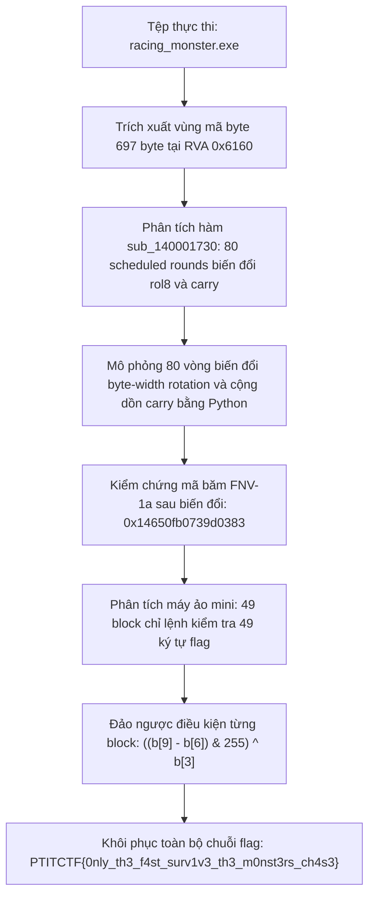
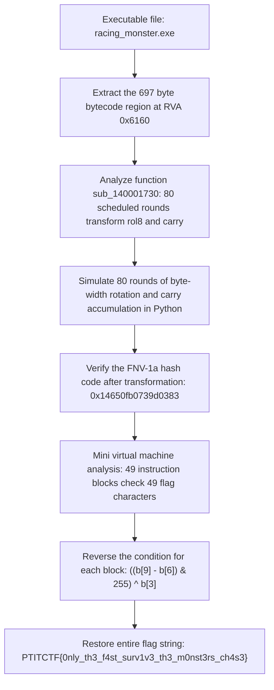

<div class="lang-switch" role="tablist" aria-label="Language switch">
  <button class="lang-btn active" role="tab" type="button" data-lang="en" aria-selected="true">EN</button>
  <button class="lang-btn" role="tab" type="button" data-lang="vn" aria-selected="false">VN</button>
</div>

<div class="lang-vn" markdown="1">

> **Flag:** `PTITCTF{0nly_th3_f4st_surv1v3_th3_m0nst3rs_ch4s3}`


Bài này thuộc category **Reverse Engineering** trong vòng Chung kết PTITCTF 2026. File đính kèm là một file nén `chall.zip` chứa file thực thi Windows x64 `racing_monster.exe`.

Mục tiêu là mô phỏng quá trình biến đổi opcode đa vòng (scheduled rounds) trong bộ nhớ và giải mã các điều kiện ràng buộc trong máy ảo kiểm tra cờ.

---

## Sơ đồ luồng phân tích (Solve Flow)



---

## Bước 1: Trích xuất và mô phỏng 80 vòng biến đổi Opcode

Mở file nhị phân trong IDA Pro, ta định vị khối mã bytecode dài 697 byte tại địa chỉ RVA `0x6160`. Trước khi máy ảo thực thi, hàm `sub_140001730` thực hiện một chu kỳ 80 vòng biến đổi xoay bit liên tục trên mảng byte này:

```python
def rol8(x, n):
    x &= 255
    n %= 8
    return ((x << n) | (x >> (8 - n))) & 255

# Mô phỏng 80 vòng biến đổi
for r in range(80):
    carry = 93 + 17 * r
    for i in range(len(code)):
        additive = rol8(165 + 29 * r + 71 * i, r + i)
        code[i] = rol8(code[i] + additive, (r + i) % 7 + 1) ^ (carry & 255)
        carry += code[i] + i
```

Tính toán kiểm tra FNV-1a hash sau 80 vòng khớp chuẩn với hằng số bảo vệ được EXE kiểm chứng.

---

## Bước 2: Phân tích kiến trúc máy ảo và 49 khối lệnh so sánh

Sau khi hoàn tất 80 vòng xáo trộn, mảng byte trở thành mã máy ảo bytecode hoàn chỉnh. Máy ảo hoạt động theo cơ chế Stack-based VM đơn giản:
* `0x10`: Đẩy hằng số vào stack (Push imm8).
* `0x11`: Đẩy ký tự thứ `i` của khóa người dùng nhập vào stack.
* `0x12`: Phép toán XOR hai phần tử đỉnh stack.
* `0x13`: Phép toán ADD modulo 256.
* `0x14`: Phép so sánh không bằng (CMP ne).
* `0x15`: Nhảy có điều kiện (JZ / JNZ).

Phân tích 686 byte đầu tiên của mảng mã máy ảo, ta thấy nó được chia thành đúng **49 khối lệnh liên tiếp**, mỗi khối dài 14 byte kiểm tra một ký tự tương ứng của flag:
* Byte `0..2`: Lấy ký tự thứ $i$ của flag.
* Byte `3..9`: Các phép toán XOR hằng số $b[3]$, trừ hằng số $b[6]$, cộng hằng số $b[9]$.
* Byte `10..13`: So sánh kết quả và phân nhánh tới vị trí thất bại nếu sai lệch.

---

## Bước 3: Giải mã 49 ký tự của Flag

Do biểu thức kiểm tra của mỗi ký tự $i$ có dạng đại số độc lập:
$$\left((b_i[9] - b_i[6]) \bmod 256\right) \oplus b_i[3] == \text{char}_i$$

Ta viết script Python tĩnh trích xuất trực tiếp các giá trị hằng số từ 49 khối lệnh mà không cần chạy file PE trên hệ thống:

```python
answer = []
for i in range(49):
    b = code[i * 14 : (i + 1) * 14]
    char_val = ((b[9] - b[6]) & 255) ^ b[3]
    answer.append(char_val)

flag = bytes(answer).decode('ascii')
print("Flag:", flag)
# Output: PTITCTF{0nly_th3_f4st_surv1v3_th3_m0nst3rs_ch4s3}
```

Kiểm tra lại toàn bộ chuỗi thu được thỏa mãn tất cả 49 điều kiện của máy ảo.

⇒ **Flag:** `PTITCTF{0nly_th3_f4st_surv1v3_th3_m0nst3rs_ch4s3}`

</div>

<div class="lang-en" markdown="1">

> **Flag:** `PTITCTF{0nly_th3_f4st_surv1v3_th3_m0nst3rs_ch4s3}`


This article belongs to the **Reverse Engineering** category in the PTITTCTF 2026 Finals. The attached file is a compressed file `chall.zip` containing the Windows x64 executable file `racing_monster.exe`.

The goal is to simulate the process of multi-round opcode transformations (scheduled rounds) in memory and decode constraint conditions in the flag checking virtual machine.

---

## Analysis Flow Diagram (Solve Flow)



---

## Step 1: Extract and simulate 80 rounds of Opcode transformation

Opening the binary file in IDA Pro, we locate the 697 byte long bytecode block at RVA address `0x6160`. Before the virtual machine executes, the function `sub_140001730` performs an 80-cycle bitwise rotation on this byte array:

```python
def rol8(x, n):
    x &= 255
    n %= 8
    return ((x << n) | (x >> (8 - n))) & 255

# Mô phỏng 80 vòng biến đổi
for r in range(80):
    carry = 93 + 17 * r
    for i in range(len(code)):
        additive = rol8(165 + 29 * r + 71 * i, r + i)
        code[i] = rol8(code[i] + additive, (r + i) % 7 + 1) ^ (carry & 255)
        carry += code[i] + i
```

Calculate the FNV-1a hash check after 80 rounds to match the protection constant verified by EXE.

---

## Step 2: Analyze virtual machine architecture and compare 49 command blocks

After completing 80 rounds of shuffling, the byte array becomes the complete virtual machine bytecode. Virtual machines operate according to a simple Stack-based VM mechanism:
* `0x10`: Push the constant onto the stack (push imm8).
* `0x11`: Push the `i`th character of the user input key onto the stack.
* `0x12`: XOR operation of two top stack elements.
* `0x13`: ADD operation modulo 256.
* `0x14`: Comparison is not equal (CMP ne).
* `0x15`: Conditional jump (JZ / JNZ).

Analyzing the first 686 bytes of the virtual machine code array, we see that it is divided into exactly **49 consecutive command blocks**, each block 14 bytes long checks a corresponding character of the flag:
* Byte `0..2`: Get the $i$ character of the flag.
* Byte `3..9`: XOR operations of constant $b[3]$, subtraction of constant $b[6]$, addition of constant $b[9]$.
* Byte `10..13`: Compare results and branch to failure location if discrepancies.

---

## Step 3: Decode the 49 characters of Flag

Because the test expression of each character $i$ has an independent algebraic form: $$\left((b_i[9] - b_i[6]) \bmod 256\right) \oplus b_i[3] == \text{char}_i$$

We write a static Python script that directly extracts constant values ​​from 49 command blocks without running the PE file on the system:

```python
answer = []
for i in range(49):
    b = code[i * 14 : (i + 1) * 14]
    char_val = ((b[9] - b[6]) & 255) ^ b[3]
    answer.append(char_val)

flag = bytes(answer).decode('ascii')
print("Flag:", flag)
# Output: PTITCTF{0nly_th3_f4st_surv1v3_th3_m0nst3rs_ch4s3}
```

Recheck the entire obtained string that satisfies all 49 conditions of the virtual machine.

⇒ **Flag:** `PTITCTF{0nly_th3_f4st_surv1v3_th3_m0nst3rs_ch4s3}`
</div>
