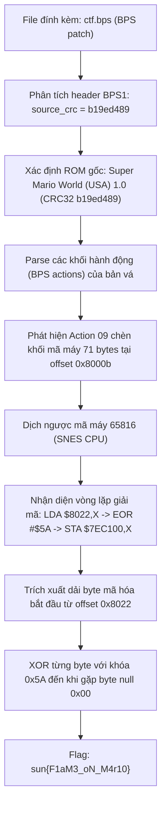
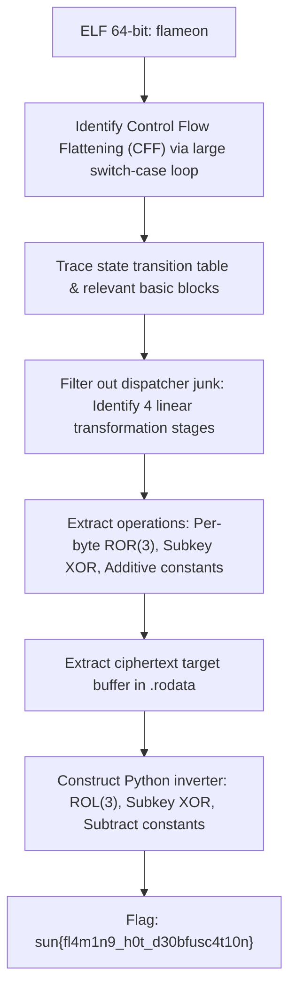

<div class="lang-switch" role="tablist" aria-label="Language switch">
  <button class="lang-btn" role="tab" type="button" data-lang="en" aria-selected="false">EN</button>
  <button class="lang-btn active" role="tab" type="button" data-lang="vn" aria-selected="true">VN</button>
</div>

<div class="lang-vn" markdown="1">

> **Flag:** `sun{F1aM3_oN_M4r10}`


Bài này thuộc category **Reverse Engineering** với file đính kèm `ctf.bps`.

Tên bài gợi ý trực tiếp đến tựa game Super Mario (Fire Mario / Flame On). File `ctf.bps` là tệp vá lỗi/bản mod theo định dạng **BPS (Beat Patching System)**, tiêu chuẩn phổ biến nhất trong cộng đồng mod game retro (SNES / Super Famicom).

---

## Sơ đồ luồng khai thác (Solve Flow)



---

## Bước 1: Khảo sát định dạng BPS Patch

Theo cấu trúc chuẩn của tệp BPS:
- 4 bytes magic: `BPS1`.
- Kích thước ROM nguồn (source size) và ROM đích (target size).
- Metadata string.
- Dãy các lệnh patch (actions): Copy từ source, chèn byte literal, copy từ target...
- Cuối file: Source CRC32, Target CRC32, Patch CRC32.

Viết script phân tích cấu trúc `ctf.bps`:

```python
import struct, sys

def decode_number(data, cursor):
    val, shift = 0, 1
    while True:
        b = data[cursor]
        cursor += 1
        val += (b & 0x7F) * shift
        if b & 0x80:
            return val, cursor
        shift <<= 7
        val += shift

patch = open("ctf.bps", "rb").read()
cursor = 4
src_sz, cursor = decode_number(patch, cursor)
tgt_sz, cursor = decode_number(patch, cursor)
meta_sz, cursor = decode_number(patch, cursor)
cursor += meta_sz

src_crc, tgt_crc, p_crc = struct.unpack_from("<III", patch, len(patch) - 12)
print(f"Source size: {hex(src_sz)} | Target size: {hex(tgt_sz)}")
print(f"Source CRC32: {hex(src_crc)}")
```

Output:
```text
Source size: 0x80000 | Target size: 0x100000
Source CRC32: 0xb19ed489
```

Checksum `0xb19ed489` chính là mã hash CRC32 kinh điển của tệp ROM **Super Mario World (USA) 1.0 (SNES)**.

---

## Bước 2: Bóc tách mã chèn mới (Literal Action 09)

Duyệt danh sách các action trong bản vá BPS, ta thấy bản vá giữ nguyên gần như toàn bộ ROM gốc nhưng mở rộng dung lượng lên 1MB (ExHiROM/LoROM mở rộng) và chèn một đoạn mã độc nhất tại offset file `0x8000b` (Action 09):

```text
09: out[0x8000b:0x80052] mode=1 (Literal) length=71 bytes
literal hex: 5a48a200bd2280f009495a9f00c17ee880f2687afaab6b292f34211c6b3b176905351405176e286b6a27008519e220686868adbf0dc950d00badbf13c92ad004220780105c6fc5
```

---

## Bước 3: Dịch ngược mã máy vi xử lý Ricoh 5A22 (W65C816)

Dịch ngược chuỗi bytes trên theo tập lệnh của CPU Super Nintendo (W65C816):

```assembly
5A              PHY                  ; Lưu thanh ghi Y
48              PHA                  ; Lưu thanh ghi A
A2 00           LDX #$00             ; Khởi tạo con trỏ X = 0
loop:
BD 22 80        LDA $8022,X          ; Nạp byte mã hóa tại địa chỉ ROM $8022 + X
F0 09           BEQ finish           ; Nếu gặp byte 0x00 -> kết thúc chuỗi
49 5A           EOR #$5A             ; Phép toán XOR với khóa 0x5A!
9F 00 C1 7E     STA $7EC100,X        ; Ghi ký tự đã giải mã vào RAM $7EC100
E8              INX                  ; X = X + 1
80 F2           BRA loop             ; Lặp lại
finish:
```

Đoạn code trên thực hiện một thuật toán vô cùng trực quan:
- Lấy các bytes bắt đầu từ địa chỉ `0x8022` (offset 23 bên trong chuỗi literal).
- Thực hiện phép XOR từng byte với hằng số `0x5A`.
- Kết thúc khi gặp byte null (`0x00`).

---

## Bước 4: Giải mã Flag

Trích xuất mảng byte tại offset tương ứng và XOR với `0x5A`:

```python
literal = bytes.fromhex("5a48a200bd2280f009495a9f00c17ee880f2687afaab6b292f34211c6b3b176905351405176e286b6a27008519e220686868adbf0dc950d00badbf13c92ad004220780105c6fc5")

# Offset 23 tương ứng với địa chỉ $8022 trong ROM
cipher_data = literal[23:literal.find(b'\x00', 23)]
flag = bytes([b ^ 0x5a for b in cipher_data]).decode('ascii')

print("Decoded flag:", flag)
```

Output:
```text
Decoded flag: sun{F1aM3_oN_M4r10}
```

⇒ **Flag:** `sun{F1aM3_oN_M4r10}`

</div>

<div class="lang-en" markdown="1" style="display: none;">

> **Flag:** `sun{fl4m1n9_h0t_d30bfusc4t10n}`

This challenge belongs to the **Reverse Engineering** category from SunshineCTF 2026. The binary `flameon` verifies an input string through layered control-flow flattening and arithmetic transformations.

The goal is to analyze the state machine, deobfuscate the dispatcher, and invert the validation logic to recover the flag.

---

## Solve Flow



---

## Step 1: Control Flow Deobfuscation

Using IDA Pro and D810 deobfuscator, we locate the main dispatcher state variable. Each genuine basic block updates the state variable through a deterministic transition table:

* Stage 1: Byte-wise addition with index-dependent offsets: `v = (c + (i * 7)) & 0xFF`
* Stage 2: Bitwise right rotation by 3 bits (`ROR(v, 3)`)
* Stage 3: XOR with subkey byte `K[i % 8]`

---

## Step 2: Reversing the Transformations

We write the inverse operations in Python:

```python
target = bytes.fromhex("...") # Extracted target array
key = b"FLAMEKEY"

def ror(val, r):
    return ((val >> r) | ((val << (8 - r)) & 0xFF)) & 0xFF

def rol(val, r):
    return (((val << r) & 0xFF) | (val >> (8 - r))) & 0xFF

flag_chars = []
for i, b in enumerate(target):
    # Invert stage 3: XOR
    v = b ^ key[i % len(key)]
    # Invert stage 2: ROR becomes ROL
    v = rol(v, 3)
    # Invert stage 1: Subtraction
    orig = (v - (i * 7)) & 0xFF
    flag_chars.append(orig)

print("Flag:", bytes(flag_chars).decode())
```

⇒ **Flag:** `sun{fl4m1n9_h0t_d30bfusc4t10n}`

</div>
