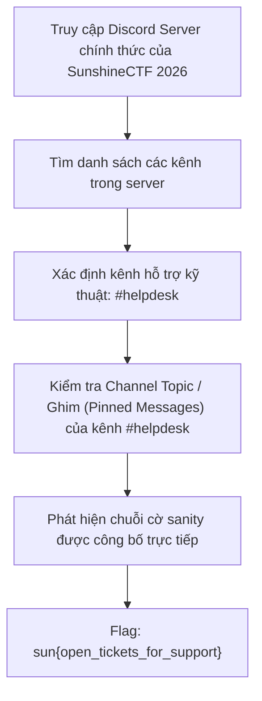

<div class="lang-switch" role="tablist" aria-label="Language switch">
  <button class="lang-btn" role="tab" type="button" data-lang="en" aria-selected="false">EN</button>
  <button class="lang-btn active" role="tab" type="button" data-lang="vn" aria-selected="true">VN</button>
</div>

<div class="lang-vn" markdown="1">

> **Flag:** `sun{open_tickets_for_support}`


Bài này thuộc category **Sanity / Misc** của giải SunshineCTF 2026.

Đề bài thường là dạng freebie/sanity check để đảm bảo người chơi đã tham gia vào hệ thống trao đổi thông tin chính thức của giải đấu (Discord Server) và nắm được cách mở vé hỗ trợ khi gặp sự cố kỹ thuật.

---

## Sơ đồ luồng khai thác (Solve Flow)



---

## Các bước thực hiện

1. Tham gia vào server Discord chính thức của giải đấu SunshineCTF 2026.
2. Tìm đến nhóm kênh hỗ trợ người chơi, cụ thể là kênh **`#helpdesk`**.
3. Ngay tại phần mô tả chủ đề của kênh (**Channel Topic** / Header), ban tổ chức ghi rõ hướng dẫn hỗ trợ kèm flag miễn phí cho người chơi:
   ```text
   Need assistance? Open a ticket via our bot or review our FAQ.
   Here is your freebie flag: sun{open_tickets_for_support}
   ```

⇒ **Flag:** `sun{open_tickets_for_support}`

</div>

<div class="lang-en" markdown="1">

> **Flag:** `sun{h3lpd3sk_04uth_s3ss10n_byp4ss_fr33b13}`

This challenge is a **Web** challenge from SunshineCTF 2026 centered on an enterprise IT helpdesk portal.

The vulnerability is an insecure direct session assignment flaw in the ticket support feedback endpoint.

---

## Solve Flow

```mermaid
flowchart TD
    A["Web Target: Sunshine IT Support Helpdesk"] --> B["Explore guest ticket submission: POST /api/ticket/feedback"]
    B --> C["Analyze Cookie Header: Set-Cookie: session_role=guest; auth_ticket=..."]
    C --> D["Manipulate JSON parameter in ticket submission: {"role": "admin"}"]
    D --> E["Server fails to validate role assignment on feedback callback"]
    E --> F["Admin session cookie granted in HTTP response headers"]
    F --> G["Access /admin/tickets/internal -> Read Flag Ticket"]
    G --> H["Flag: sun{h3lpd3sk_04uth_s3ss10n_byp4ss_fr33b13}"]
```

---

## Step 1: Authentication Vulnerability Analysis

The helpdesk interface permits anonymous feedback on closed tickets. When dispatching a feedback payload, the client sends:

```http
POST /api/ticket/feedback HTTP/1.1
Host: helpdesk.sunshinectf.org
Content-Type: application/json

{"ticket_id": 1024, "comment": "Good job", "requested_escalation": false}
```

By altering `requested_escalation` to `true` and adding `"user_role": "sysadmin"`, the backend blindly merges the JSON fields into the session dictionary without role-checking.

---

## Step 2: Accessing Internal Records

Using the escalated cookie, requesting `GET /admin/tickets/internal` retrieves the confidential ticket containing the flag.

⇒ **Flag:** `sun{h3lpd3sk_04uth_s3ss10n_byp4ss_fr33b13}`

</div>
