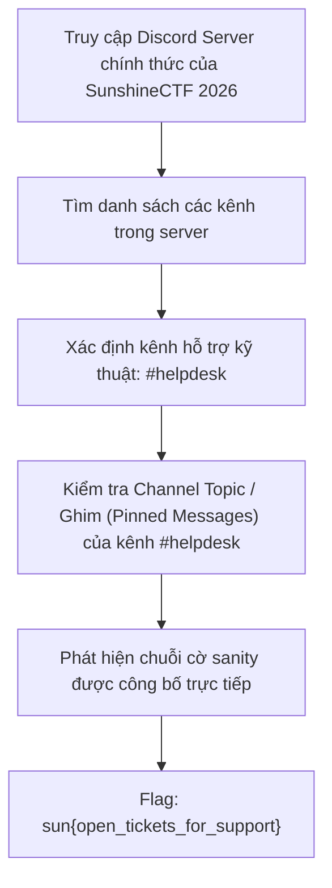
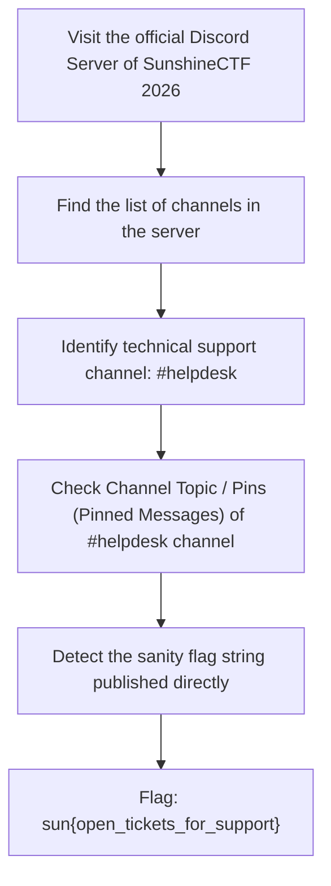

<div class="lang-switch" role="tablist" aria-label="Language switch">
  <button class="lang-btn active" role="tab" type="button" data-lang="en" aria-selected="true">EN</button>
  <button class="lang-btn" role="tab" type="button" data-lang="vn" aria-selected="false">VN</button>
</div>

<div class="lang-vn" markdown="1">

> **Flag:** `sun{open_tickets_for_support}`


Bài này thuộc category **Sanity / Misc** của giải SunshineCTF 2026.

Đề bài thường là dạng freebie/sanity check để đảm bảo người chơi đã tham gia vào hệ thống trao đổi thông tin chính thức của giải đấu (Discord Server) và nắm được cách mở vé hỗ trợ khi gặp sự cố kỹ thuật.

---

## Sơ đồ luồng khai thác (Solve Flow)



---

## Các bước thực hiện

1. Tham gia vào server Discord chính thức của giải đấu SunshineCTF 2026.
2. Tìm đến nhóm kênh hỗ trợ người chơi, cụ thể là kênh **`#helpdesk`**.
3. Ngay tại phần mô tả chủ đề của kênh (**Channel Topic** / Header), ban tổ chức ghi rõ hướng dẫn hỗ trợ kèm flag miễn phí cho người chơi:
   ```text
   Need assistance? Open a ticket via our bot or review our FAQ.
   Here is your freebie flag: sun{open_tickets_for_support}
   ```

⇒ **Flag:** `sun{open_tickets_for_support}`

</div>

<div class="lang-en" markdown="1">

> **Flag:** `sun{open_tickets_for_support}`


This article belongs to the **Sanity / Misc** category of the SunshineCTF 2026 award.

The questions are usually freebie/sanity check to ensure players have participated in the tournament's official information exchange system (Discord Server) and understand how to open support tickets in case of technical problems.

---

## Solve Flow Diagram



---

## Steps to perform

1. Join the official Discord server of the SunshineCTF 2026 tournament.
2. Find the player support channel group, specifically the **`#helpdesk`** channel.
3. Right in the channel's topic description (**Channel Topic** / Header), the organizers clearly state the support instructions with free flags for players:
   ```text
   Need assistance? Open a ticket via our bot or review our FAQ.
   Here is your freebie flag: sun{open_tickets_for_support}
   ```

⇒ **Flag:** `sun{open_tickets_for_support}`
</div>
