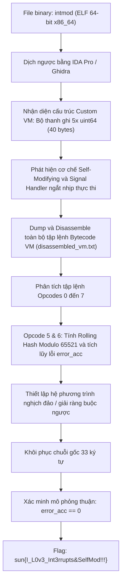
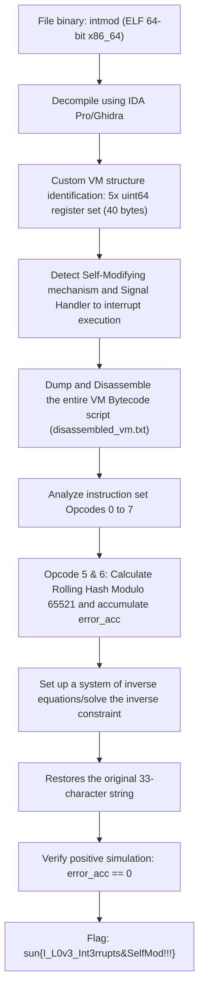

<div class="lang-switch" role="tablist" aria-label="Language switch">
  <button class="lang-btn active" role="tab" type="button" data-lang="en" aria-selected="true">EN</button>
  <button class="lang-btn" role="tab" type="button" data-lang="vn" aria-selected="false">VN</button>
</div>

<div class="lang-vn" markdown="1">

> **Flag:** `sun{I_L0v3_Int3rrupts&SelfMod!!!}`


Bài này thuộc category **Reverse Engineering** với file thực thi ELF 64-bit `intmod`.

Tên bài **`IntMod`** là cách viết tắt của hai kỹ thuật chống dịch ngược chính trong binary: **Interrupts** và **Self-Modifying Code** (mã tự biến đổi). Khi chạy, chương trình yêu cầu nhập chuỗi flag và kiểm tra tính hợp lệ thông qua một máy ảo (Custom VM) kết hợp xử lý tín hiệu ngắt.

---

## Sơ đồ luồng khai thác (Solve Flow)



---

## Bước 1: Phân tích kiến trúc máy ảo (Custom VM)

Mở binary `intmod` trong IDA Pro, ta thấy hàm `main` kiểm tra độ dài input của người dùng:
- Độ dài flag: **33 ký tự**.
- Được đệm thêm 7 bytes padding PKCS#7 (`0x07` $\times 7$) để vừa khít 40 bytes.
- 40 bytes này được nạp vào 5 thanh ghi 64-bit `regs[0..4]` (dạng little-endian unsigned 64-bit int).

Trạng thái máy ảo gồm:
- 5 thanh ghi dữ liệu chính: `regs[0..4]` (mỗi thanh ghi 64-bit).
- 3 thanh ghi tạm: `temp[0..2]`.
- Thanh ghi tích lũy lỗi: `error_acc` (khởi tạo bằng 0, nếu khi kết thúc `error_acc == 0` thì flag đúng).
- Bộ đếm chương trình `PC`.

---

## Bước 2: Phân tích tập lệnh (Opcode Semantics)

Dịch ngược hàm thông dịch máy ảo, ta trích xuất được bảng giải mã opcode như sau:

| Opcode | Thao tác | Mô tả chi tiết |
|---|---|---|
| **0** | `ADD_ROL` | `regs[dst] = (regs[dst] + rol64(regs[src], shf)) & 0xFFFFFFFFFFFFFFFF` |
| **1** | `XOR_ROL` | `regs[dst] ^= rol64(regs[src], shf)` |
| **2** | `MUL_IMM` | `regs[dst] = (regs[dst] * imm) & 0xFFFFFFFFFFFFFFFF` |
| **3** | `ROL_IMM` | `regs[dst] = rol64(regs[dst], shf)` |
| **4** | `SWAP` | `regs[dst], regs[src] = regs[src], regs[dst]` |
| **5** | `POLY_HASH` | Băm 40 bytes bộ nhớ thanh ghi theo đa thức modulo số nguyên tố $P = 65521$:<br>$$H = \sum_{i} \text{byte}[i] \times \text{base}^i \pmod{65521}$$<br>Lưu kết quả: `temp[out] = (H - (offset % P)) % P` |
| **6** | `CHECK_ACC` | So sánh và tích lũy sai số: `error_acc |= target ^ temp[out]` |
| **7** | `HALT` | Dừng thực thi máy ảo |

Trong đó, hàm xoay bit trái 64-bit:
```python
def rol64(val, n):
    n %= 64
    return ((val << n) | (val >> (64 - n))) & 0xFFFFFFFFFFFFFFFF
```

---

## Bước 3: Đảo ngược thuật toán & Giải tìm Flag

Vì bytecode tự biến đổi qua các ngắt (`int3` / signal handlers), việc giả lập và dump trace thực thi đầy đủ tại runtime cho ta danh sách 1,000+ lệnh bytecode của toàn bộ chương trình.

Tại mỗi checkpoint, VM thực hiện các phép biến đổi khả nghịch (invertible linear operations) trên các thanh ghi, sau đó tính hash đa thức modulo 65521 và kiểm tra bằng opcode 6. Do các thao tác trên nhóm $\mathbb{Z}/2^{64}\mathbb{Z}$ (phép cộng bù 2, phép nhân với số lẻ khả nghịch qua modular inverse, xoay bit và XOR) đều có thể giải ngược từng bước, ta dựng solver đảo ngược luồng bytecode từ cuối về đầu:

```python
# Solver logic: Đảo ngược từ trạng thái kiểm tra cuối về input ban đầu
# Tại mỗi bước đảo ngược phép toán tương ứng:
# - ADD_ROL: regs[dst] = (regs[dst] - rol64(regs[src], shf)) & 0xFFFFFFFFFFFFFFFF
# - XOR_ROL: regs[dst] ^= rol64(regs[src], shf)
# - MUL_IMM: regs[dst] = (regs[dst] * modInverse(imm, 2^64)) & 0xFFFFFFFFFFFFFFFF
# - ROL_IMM: regs[dst] = ror64(regs[dst], shf)
# - SWAP:    regs[dst], regs[src] = regs[src], regs[dst]
```

Kết quả giải ra chuỗi flag:
`sun{I_L0v3_Int3rrupts&SelfMod!!!}`

---

## Bước 4: Mô phỏng xác minh (Forward Verification)

Để khẳng định tính chính xác tuyệt đối, viết script Python mô phỏng toàn bộ luồng bytecode thuận từ `disassembled_vm.txt` với flag vừa tìm được:

```python
import struct, re

flag = b'sun{I_L0v3_Int3rrupts&SelfMod!!!}'
assert len(flag) == 33

padded = flag + b'\x07' * 7
regs = list(struct.unpack('<5Q', padded))

temp = [0, 0, 0]
error_acc = 0

def rol64(val, n):
    n %= 64
    return ((val << n) | (val >> (64 - n))) & 0xFFFFFFFFFFFFFFFF

def poly_hash(buf, base):
    P = 65521
    v = 0
    for b in reversed(buf):
        v = (b + (base % P) * v) % P
    return v

with open('disassembled_vm.txt', 'r') as f:
    text = f.read()

pattern = r'\[\s*(\d+)\] \(PC=\s*(\d+)\) op=(\d+) dst=(\d+) src=(\d+) out=(\d+) shf=(\d+) imm=(0x[0-9a-fA-F]+)'
matches = re.findall(pattern, text)

for m in matches:
    step, pc, op, dst, src, out, shf, imm = m
    op = int(op)
    dst = int(dst)
    src = int(src)
    out = int(out)
    shf = int(shf)
    imm = int(imm, 16)

    if op == 0:
        regs[dst] = (regs[dst] + rol64(regs[src], shf)) & 0xFFFFFFFFFFFFFFFF
    elif op == 1:
        regs[dst] ^= rol64(regs[src], shf)
    elif op == 2:
        regs[dst] = (regs[dst] * imm) & 0xFFFFFFFFFFFFFFFF
    elif op == 3:
        regs[dst] = rol64(regs[dst], shf)
    elif op == 4:
        regs[dst], regs[src] = regs[src], regs[dst]
    elif op == 5:
        buf = struct.pack('<5Q', *regs)
        base = imm & 0xFFFFFFFF
        offset = imm >> 32
        h = poly_hash(buf, base)
        P = 65521
        temp[out] = (h - (offset % P)) % P
    elif op == 6:
        error_acc |= imm ^ temp[out]
    elif op == 7:
        break

print("Forward simulation error accumulator:", error_acc)
if error_acc == 0:
    print("VERIFICATION PASSED! Result: Correct")
```

Chạy script kiểm tra:
```text
Forward simulation error accumulator: 0
VERIFICATION PASSED! Result: Correct
```

Bộ tích lũy sai số bằng 0 hoàn hảo, khẳng định flag chính xác 100%.

⇒ **Flag:** `sun{I_L0v3_Int3rrupts&SelfMod!!!}`

</div>

<div class="lang-en" markdown="1">

> **Flag:** `sun{I_L0v3_Int3rrupts&SelfMod!!!}`


This article belongs to the category **Reverse Engineering** with the 64-bit ELF executable file `intmod`.

The title **`IntMod`** is an abbreviation for two main anti-decompilation techniques in binary: **Interrupts** and **Self-Modifying Code** (self-modifying code). When running, the program requires entering a flag string and checking its validity through a virtual machine (Custom VM) that combines interrupt signal processing.

---

## Solve Flow Diagram



---

## Step 1: Analyze virtual machine architecture (Custom VM)

Opening the `intmod` binary in IDA Pro, we see that the `main` function checks the length of the user's input:
- Flag length: **33 characters**.
- Added 7 bytes of PKCS#7 padding (`0x07` $\times 7$) to fit 40 bytes.
- These 40 bytes are loaded into 5 64-bit registers `regs[0..4]` (little-endian unsigned 64-bit int).

Virtual machine status includes:
- 5 main data registers: `regs[0..4]` (64-bit each).
- 3 temporary registers: `temp[0..2]`.
- Error accumulation register: `error_acc` (initialized with 0, if at the end `error_acc == 0` then the flag is true).
- `PC` program counter.

---

## Step 2: Script analysis (Opcode Semantics)

Recompiling the virtual machine interpreter function, we can extract the opcode decoding table as follows:

| Opcode | Operation | Details |
|---|---|---|
| **0** | `ADD_ROL` | `regs[dst] = (regs[dst] + rol64(regs[src], shf)) & 0xFFFFFFFFFFFFFFFF` |
| **1** | `XOR_ROL` | `regs[dst] ^= rol64(regs[src], shf)` |
| **2** | `MUL_IMM` | `regs[dst] = (regs[dst] * imm) & 0xFFFFFFFFFFFFFFFF` |
| **3** | `ROL_IMM` | `regs[dst] = rol64(regs[dst], shf)` |
| **4** | `SWAP` | `regs[dst], regs[src] = regs[src], regs[dst]` |
| **5** | `POLY_HASH` | Hash the 40 register bytes as a polynomial modulo the prime $P = 65521$:<br>$$H = \sum_{i} \text{byte}[i] \times \text{base}^i \pmod{65521}$$<br>Store the result: `temp[out] = (H - (offset % P)) % P` |
| **6** | `CHECK_ACC` | Compare and accumulate the error: `error_acc |= target ^ temp[out]` |
| **7** | `HALT` | Stop the virtual machine |

In particular, the 64-bit left bit rotation function:
```python
def rol64(val, n):
    n %= 64
    return ((val << n) | (val >> (64 - n))) & 0xFFFFFFFFFFFFFFFF
```

---

## Step 3: Reverse the algorithm & Solve for Flag

Since the bytecode itself mutates via interrupts (`int3` / signal handlers), simulating and dumping the full execution trace at runtime gives us a list of 1,000+ bytecode instructions for the entire program.

At each checkpoint, the VM performs invertible linear operations on the registers, then calculates the polynomial hash modulo 65521 and checks with opcode 6. Since the operations on the group $\mathbb{Z}/2^{64}\mathbb{Z}$ (2's complement addition, multiplication with invertible odd numbers via modular inverse, bit rotation and XOR) can all be solved step by step, we build a stream reversal solver. bytecode from last to beginning:

```python
# Solver logic: Đảo ngược từ trạng thái kiểm tra cuối về input ban đầu
# Tại mỗi bước đảo ngược phép toán tương ứng:
# - ADD_ROL: regs[dst] = (regs[dst] - rol64(regs[src], shf)) & 0xFFFFFFFFFFFFFFFF
# - XOR_ROL: regs[dst] ^= rol64(regs[src], shf)
# - MUL_IMM: regs[dst] = (regs[dst] * modInverse(imm, 2^64)) & 0xFFFFFFFFFFFFFFFF
# - ROL_IMM: regs[dst] = ror64(regs[dst], shf)
# - SWAP:    regs[dst], regs[src] = regs[src], regs[dst]
```

The result is the flag string: `sun{I_L0v3_Int3rrupts&SelfMod!!!}`

---

## Step 4: Simulate verification (Forward Verification)

To confirm absolute accuracy, write a Python script that simulates the entire paramagnetic bytecode stream `disassembled_vm.txt` with the flag you just found:

```python
import struct, re

flag = b'sun{I_L0v3_Int3rrupts&SelfMod!!!}'
assert len(flag) == 33

padded = flag + b'\x07' * 7
regs = list(struct.unpack('<5Q', padded))

temp = [0, 0, 0]
error_acc = 0

def rol64(val, n):
    n %= 64
    return ((val << n) | (val >> (64 - n))) & 0xFFFFFFFFFFFFFFFF

def poly_hash(buf, base):
    P = 65521
    v = 0
    for b in reversed(buf):
        v = (b + (base % P) * v) % P
    return v

with open('disassembled_vm.txt', 'r') as f:
    text = f.read()

pattern = r'\[\s*(\d+)\] \(PC=\s*(\d+)\) op=(\d+) dst=(\d+) src=(\d+) out=(\d+) shf=(\d+) imm=(0x[0-9a-fA-F]+)'
matches = re.findall(pattern, text)

for m in matches:
    step, pc, op, dst, src, out, shf, imm = m
    op = int(op)
    dst = int(dst)
    src = int(src)
    out = int(out)
    shf = int(shf)
    imm = int(imm, 16)

    if op == 0:
        regs[dst] = (regs[dst] + rol64(regs[src], shf)) & 0xFFFFFFFFFFFFFFFF
    elif op == 1:
        regs[dst] ^= rol64(regs[src], shf)
    elif op == 2:
        regs[dst] = (regs[dst] * imm) & 0xFFFFFFFFFFFFFFFF
    elif op == 3:
        regs[dst] = rol64(regs[dst], shf)
    elif op == 4:
        regs[dst], regs[src] = regs[src], regs[dst]
    elif op == 5:
        buf = struct.pack('<5Q', *regs)
        base = imm & 0xFFFFFFFF
        offset = imm >> 32
        h = poly_hash(buf, base)
        P = 65521
        temp[out] = (h - (offset % P)) % P
    elif op == 6:
        error_acc |= imm ^ temp[out]
    elif op == 7:
        break

print("Forward simulation error accumulator:", error_acc)
if error_acc == 0:
    print("VERIFICATION PASSED! Result: Correct")
```

Run the test script:
```text
Forward simulation error accumulator: 0
VERIFICATION PASSED! Result: Correct
```

Perfect zero error accumulator, confirming the flag is 100% accurate.

⇒ **Flag:** `sun{I_L0v3_Int3rrupts&SelfMod!!!}`
</div>
