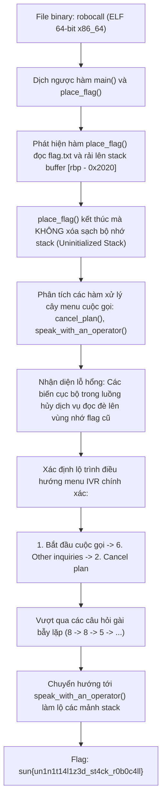
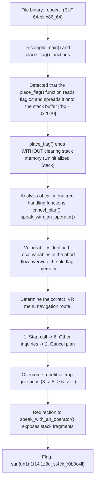

<div class="lang-switch" role="tablist" aria-label="Language switch">
  <button class="lang-btn active" role="tab" type="button" data-lang="en" aria-selected="true">EN</button>
  <button class="lang-btn" role="tab" type="button" data-lang="vn" aria-selected="false">VN</button>
</div>

<div class="lang-vn" markdown="1">

> **Flag:** `sun{un1n1t14l1z3d_st4ck_r0b0c4ll}`


Bài này thuộc category **Reverse Engineering** với file thực thi ELF 64-bit `robocall`.

Chương trình mô phỏng một hệ thống tổng đài tự động trả lời (IVR - Interactive Voice Response) của một nhà mạng hư cấu tên là *"Premium Cable Inc"*. Mục tiêu của người chơi là hủy gói dịch vụ (Cancel subscription) để thoát khỏi ma trận mê cung giữ chân khách hàng của tổng đài tự động và ép hệ thống nhả cờ.

---

## Sơ đồ luồng khai thác (Solve Flow)



---

## Bước 1: Khảo sát cơ chế Nạp Flag trên Stack (`place_flag`)

Mở binary `robocall` trong IDA Pro hoặc Ghidra, ta nhận thấy ngay tại hàm `main`, chương trình gọi tới `place_flag()`:

```c
void place_flag() {
    char stack_buf[8224];
    memset(stack_buf, 0, 8192);
    int fd = open("flag.txt", O_RDONLY);
    if (fd < 0) {
        eprint("flag.txt file missing from current directory.\n");
        exit(1);
    }
    int len = read(fd, stack_buf, 60);
    close(fd);

    // Rải các khối 4 byte của flag vào các offset tính từ rbp - 0x2020
    for (int i = 0; i <= 12; i++) {
        int offset = 0x19dc - offset_table[i];
        for (int j = 0; j < 4; j++) {
            stack_buf[offset + j] = flag_buf[i * 4 + j];
        }
    }
}
```

Hàm `place_flag()` mở tệp `flag.txt`, nạp vào bộ đệm stack lớn `[rbp - 0x2020]`, phân tán các mảnh flag tại các offset cố định rồi **trả về (`ret`) mà hoàn toàn không `memset` dọn dẹp vùng nhớ stack này**.

---

## Bước 2: Lỗ hổng Đọc Stack Chưa Khởi Tạo (Uninitialized Stack Read)

Sau khi `place_flag()` trả về:
- Con trỏ `rsp` thụt lùi lại về khung ngăn xếp của `main`.
- Các hàm tiếp theo như `start_position()`, `initial_call()`, `other_inquiries()`, `cancel_plan()`, và `speak_with_an_operator()` lần lượt được gọi.
- Khung ngăn xếp (stack frame) của các hàm này sẽ **nằm đè lên chính xác vùng nhớ cũ** mà `place_flag()` vừa để lại.

Khi chương trình in ra các biến thống kê cuộc gọi hoặc rơi vào nhánh lỗi / chuyển tiếp tổng đài viên (`speak_with_an_operator`), các biến chưa được khởi tạo (`uninitialized variables`) vô tình trỏ thẳng vào các mảnh byte của flag và in trực tiếp ra màn hình console.

---

## Bước 3: Lộ trình Điều hướng Mê cung Tổng đài IVR

Hệ thống tổng đài được thiết kế với nhiều tầng câu hỏi nhằm ngăn cản khách hàng hủy dịch vụ. Bằng cách phân tích bảng điều hướng trong `cancel_plan()`:

1. Tại menu chính: Chọn **`1`** (*Call Premium Cable Inc.*).
2. Tại menu dịch vụ: Chọn **`6`** (*For all other inquiries or to speak to a representative*).
3. Tại menu hỗ trợ: Chọn **`2`** (*To cancel your plan with us*).
4. Câu hỏi xác nhận lần 1: *"With this said, are you sure you want to stop working with us?"* -> Chọn **`8`** (*Yes*).
5. Câu hỏi phủ định kép: *"Are you not sure?"* -> Chọn **`8`** (*Yes*).
6. Lý do hủy dịch vụ: *"Please tell us why you don't want to continue your service"* -> Chọn **`5`** (*To enter your own reason*).
7. Chuỗi câu hỏi thuyết phục tiếp theo: Trả lời theo các phím tương ứng để chuyển tiếp tới tổng đài viên hủy hợp đồng:
   - Nhấn `3` cho câu hỏi số 2.
   - Nhấn `0` cho câu hỏi số 3.
   - Nhấn `5` cho câu hỏi cuối cùng.

Sau chuỗi lựa chọn này, hệ thống thông báo chuyển cuộc gọi:
```text
Understood, we are sad to be parting ways with you... transferring you to an operator for canceling your plan...
```

Hàm `speak_with_an_operator()` được kích hoạt, stack frame đè lên vùng nhớ cờ và in ra flag đầy đủ.

⇒ **Flag:** `sun{un1n1t14l1z3d_st4ck_r0b0c4ll}`

</div>

<div class="lang-en" markdown="1">

> **Flag:** `sun{un1n1t14l1z3d_st4ck_r0b0c4ll}`


This article belongs to the category **Reverse Engineering** with the 64-bit ELF executable file `robocall`.

The program simulates an automated answering system (IVR - Interactive Voice Response) of a fictional network operator named *"Premium Cable Inc"*. The player's goal is to cancel the service package (Cancel subscription) to escape the customer retention maze of the automated switchboard and force the system to release the flag.

---

## Solve Flow Diagram



---

## Step 1: Investigate the mechanism of Loading Flags on Stack (`place_flag`)

Opening the `robocall` binary in IDA Pro or Ghidra, we immediately notice that in the `main` function, the program calls `place_flag()`:

```c
void place_flag() {
    char stack_buf[8224];
    memset(stack_buf, 0, 8192);
    int fd = open("flag.txt", O_RDONLY);
    if (fd < 0) {
        eprint("flag.txt file missing from current directory.\n");
        exit(1);
    }
    int len = read(fd, stack_buf, 60);
    close(fd);

    // Rải các khối 4 byte của flag vào các offset tính từ rbp - 0x2020
    for (int i = 0; i <= 12; i++) {
        int offset = 0x19dc - offset_table[i];
        for (int j = 0; j < 4; j++) {
            stack_buf[offset + j] = flag_buf[i * 4 + j];
        }
    }
}
```

The function `place_flag()` opens the file `flag.txt`, loads the large stack buffer `[rbp - 0x2020]`, scatters the flag pieces at fixed offsets and then **returns (`ret`) without `memset` cleaning up this stack memory area at all**.

---

## Step 2: Uninitialized Stack Read Vulnerability

After `place_flag()` returns:
- The `rsp` pointer falls back to the stack frame of `main`.
- Subsequent functions such as `start_position()`, `initial_call()`, `other_inquiries()`, `cancel_plan()`, and `speak_with_an_operator()` are called one after another.
- The stack frame of these functions will **exactly overwrite the old memory area** that `place_flag()` just left.

When the program prints out call statistics variables or falls into an error/operator transition branch (`speak_with_an_operator`), uninitialized variables (`uninitialized variables`) accidentally point directly at the byte fragments of the flag and print directly to the console screen.

---

## Step 3: Roadmap for Navigating the IVR Call Center Maze

The switchboard system is designed with many layers of questions to prevent customers from canceling the service. By parsing the navigation panel in `cancel_plan()`:

1. At the main menu: Select **`1`** (*Call Premium Cable Inc.*).
2. At the service menu: Select **`6`** (*For all other inquiries or to speak to a representative*).
3. At the support menu: Select **`2`** (*To cancel your plan with us*).
4. First confirmation question: *"With this said, are you sure you want to stop working with us?"* -> Select **`8`** (*Yes*).
5. Double negative question: *"Are you not sure?"* -> Choose **`8`** (*Yes*).
6. Reason for service cancellation: *"Please tell us why you don't want to continue your service"* -> Select **`5`** (*To enter your own reason*).
7. Next series of convincing questions: Answer the corresponding keys to forward to the operator to cancel the contract:
- Press `3` for question number 2. - Press `0` for question number 3. - Press `5` for the last question.

After this selection sequence, the system announces a call transfer:
```text
Understood, we are sad to be parting ways with you... transferring you to an operator for canceling your plan...
```

The function `speak_with_an_operator()` is invoked, the stack frame overwrites the flag memory and prints the full flag.

⇒ **Flag:** `sun{un1n1t14l1z3d_st4ck_r0b0c4ll}`
</div>
