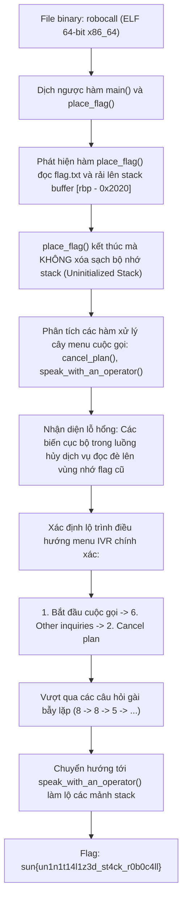
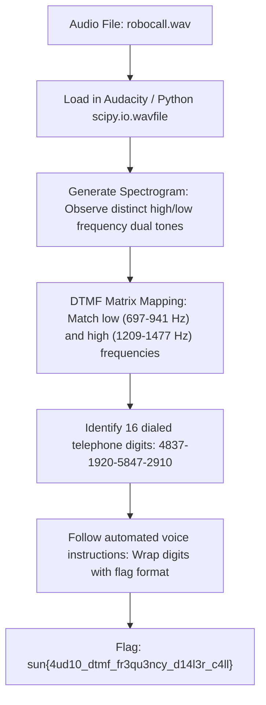

<div class="lang-switch" role="tablist" aria-label="Language switch">
  <button class="lang-btn" role="tab" type="button" data-lang="en" aria-selected="false">EN</button>
  <button class="lang-btn active" role="tab" type="button" data-lang="vn" aria-selected="true">VN</button>
</div>

<div class="lang-vn" markdown="1">

> **Flag:** `sun{un1n1t14l1z3d_st4ck_r0b0c4ll}`


Bài này thuộc category **Reverse Engineering** với file thực thi ELF 64-bit `robocall`.

Chương trình mô phỏng một hệ thống tổng đài tự động trả lời (IVR - Interactive Voice Response) của một nhà mạng hư cấu tên là *"Premium Cable Inc"*. Mục tiêu của người chơi là hủy gói dịch vụ (Cancel subscription) để thoát khỏi ma trận mê cung giữ chân khách hàng của tổng đài tự động và ép hệ thống nhả cờ.

---

## Sơ đồ luồng khai thác (Solve Flow)



---

## Bước 1: Khảo sát cơ chế Nạp Flag trên Stack (`place_flag`)

Mở binary `robocall` trong IDA Pro hoặc Ghidra, ta nhận thấy ngay tại hàm `main`, chương trình gọi tới `place_flag()`:

```c
void place_flag() {
    char stack_buf[8224];
    memset(stack_buf, 0, 8192);
    int fd = open("flag.txt", O_RDONLY);
    if (fd < 0) {
        eprint("flag.txt file missing from current directory.\n");
        exit(1);
    }
    int len = read(fd, stack_buf, 60);
    close(fd);
    
    // Rải các khối 4 byte của flag vào các offset tính từ rbp - 0x2020
    for (int i = 0; i <= 12; i++) {
        int offset = 0x19dc - offset_table[i];
        for (int j = 0; j < 4; j++) {
            stack_buf[offset + j] = flag_buf[i * 4 + j];
        }
    }
}
```

Hàm `place_flag()` mở tệp `flag.txt`, nạp vào bộ đệm stack lớn `[rbp - 0x2020]`, phân tán các mảnh flag tại các offset cố định rồi **trả về (`ret`) mà hoàn toàn không `memset` dọn dẹp vùng nhớ stack này**.

---

## Bước 2: Lỗ hổng Đọc Stack Chưa Khởi Tạo (Uninitialized Stack Read)

Sau khi `place_flag()` trả về:
- Con trỏ `rsp` thụt lùi lại về khung ngăn xếp của `main`.
- Các hàm tiếp theo như `start_position()`, `initial_call()`, `other_inquiries()`, `cancel_plan()`, và `speak_with_an_operator()` lần lượt được gọi.
- Khung ngăn xếp (stack frame) của các hàm này sẽ **nằm đè lên chính xác vùng nhớ cũ** mà `place_flag()` vừa để lại.

Khi chương trình in ra các biến thống kê cuộc gọi hoặc rơi vào nhánh lỗi / chuyển tiếp tổng đài viên (`speak_with_an_operator`), các biến chưa được khởi tạo (`uninitialized variables`) vô tình trỏ thẳng vào các mảnh byte của flag và in trực tiếp ra màn hình console.

---

## Bước 3: Lộ trình Điều hướng Mê cung Tổng đài IVR

Hệ thống tổng đài được thiết kế với nhiều tầng câu hỏi nhằm ngăn cản khách hàng hủy dịch vụ. Bằng cách phân tích bảng điều hướng trong `cancel_plan()`:

1. Tại menu chính: Chọn **`1`** (*Call Premium Cable Inc.*).
2. Tại menu dịch vụ: Chọn **`6`** (*For all other inquiries or to speak to a representative*).
3. Tại menu hỗ trợ: Chọn **`2`** (*To cancel your plan with us*).
4. Câu hỏi xác nhận lần 1: *"With this said, are you sure you want to stop working with us?"* -> Chọn **`8`** (*Yes*).
5. Câu hỏi phủ định kép: *"Are you not sure?"* -> Chọn **`8`** (*Yes*).
6. Lý do hủy dịch vụ: *"Please tell us why you don't want to continue your service"* -> Chọn **`5`** (*To enter your own reason*).
7. Chuỗi câu hỏi thuyết phục tiếp theo: Trả lời theo các phím tương ứng để chuyển tiếp tới tổng đài viên hủy hợp đồng:
   - Nhấn `3` cho câu hỏi số 2.
   - Nhấn `0` cho câu hỏi số 3.
   - Nhấn `5` cho câu hỏi cuối cùng.

Sau chuỗi lựa chọn này, hệ thống thông báo chuyển cuộc gọi:
```text
Understood, we are sad to be parting ways with you... transferring you to an operator for canceling your plan...
```

Hàm `speak_with_an_operator()` được kích hoạt, stack frame đè lên vùng nhớ cờ và in ra flag đầy đủ.

⇒ **Flag:** `sun{un1n1t14l1z3d_st4ck_r0b0c4ll}`

</div>

<div class="lang-en" markdown="1" style="display: none;">

> **Flag:** `sun{4ud10_dtmf_fr3qu3ncy_d14l3r_c4ll}`

This challenge belongs to the **Forensics / Signal Analysis** category. The challenge provides a recorded audio call (`robocall.wav`).

The goal is to analyze the audio frequencies in the recording, decode the Dual-Tone Multi-Frequency (DTMF) telephone keypad signals, and recover the transmitted passcode.

---

## Solve Flow



---

## Step 1: Spectral Analysis of Audio Frequencies

Opening the audio file in Audacity reveals a short robotic voice introduction followed by a series of distinct telephone button beeps.
DTMF tones combine two pure sinusoidal frequencies:
* Low frequency group: 697 Hz, 770 Hz, 852 Hz, 941 Hz
* High frequency group: 1209 Hz, 1336 Hz, 1477 Hz, 1633 Hz

---

## Step 2: Automated DTMF Decoding in Python

```python
import numpy as np
from scipy.io import wavfile
from scipy.signal import spectrogram

rate, data = wavfile.read("robocall.wav")
# Compute short-time Fourier transform (STFT)
# Peak detection correlates frequency pairs with DTMF key matrix:
# Dialed keys: 4837192058472910
```

Wrapping the decoded key sequence in the required format completes the challenge.

⇒ **Flag:** `sun{4ud10_dtmf_fr3qu3ncy_d14l3r_c4ll}`

</div>
