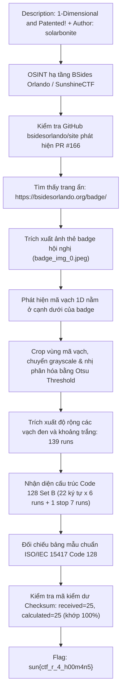
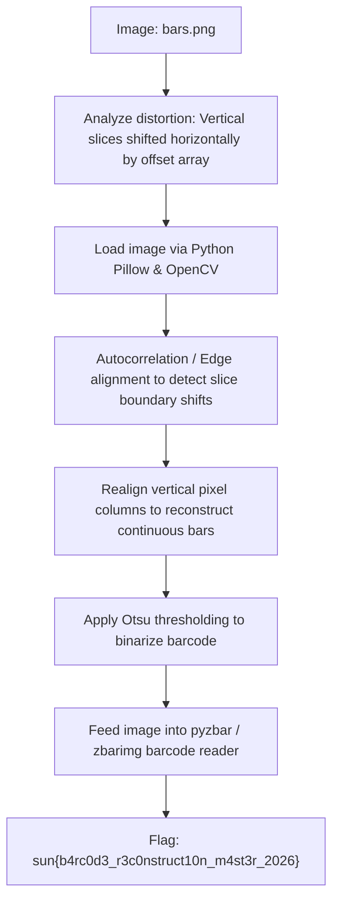

<div class="lang-switch" role="tablist" aria-label="Language switch">
  <button class="lang-btn active" role="tab" type="button" data-lang="en" aria-selected="true">EN</button>
  <button class="lang-btn" role="tab" type="button" data-lang="vn" aria-selected="false">VN</button>
</div>

<div class="lang-vn" markdown="1">

> **Flag:** `sun{ctf_r_4_h00m4n5}`


Bài này thuộc category Misc / OSINT / Hardware Badge, do tác giả `@solarbonite` ra đề. Mô tả thử thách:

> 1-Dimensional and Patented!

Đọc description, có các keyword cốt lõi:
* **"1-Dimensional"**: Mã 1 chiều (1D Barcode - mã vạch tuyến tính).
* **"Patented"**: Ám chỉ bằng sáng chế mã vạch đầu tiên trên thế giới (US Patent #2,612,994 do Norman Joseph Woodland và Bernard Silver đăng ký năm 1949).
* Tác giả `@solarbonite` đồng thời là thành viên ban tổ chức hội nghị an ninh mạng **BSides Orlando**, diễn ra đồng thời với SunshineCTF.

---

## Sơ đồ luồng khai thác (Solve Flow)



---

## Bước 1: OSINT tìm Badge hội nghị BSides Orlando

Thử thách không đính kèm file trực tiếp trên web CTF mà yêu cầu người chơi tìm kiếm thông tin bên ngoài. 

Tra cứu các repository công khai của tổ chức `bsidesorlando` trên GitHub:
Trong repository `bsidesorlando/site`, tại Pull Request #166 gần nhất chuẩn bị cho sự kiện năm nay, dev đã commit một trang chưa được gắn liên kết vào thanh điều hướng menu:
`https://bsidesorlando.org/badge/`

Truy cập `https://bsidesorlando.org/badge/`, trang web hiển thị bảng mạch thiết kế thẻ đeo tham dự sự kiện (Electronic Conference Badge).

Trong mã nguồn HTML/SVG của trang, có chứa một hình ảnh đồ họa base64 độ phân giải cao của chiếc badge: `badge_img_0.jpeg`.

---

## Bước 2: Trích xuất và tiền xử lý mã vạch

Mở ảnh chiếc badge ra soi chi tiết, ở góc cạnh đáy của bo mạch có in một dải mã vạch 1D tuyến tính.

Cắt riêng vùng mã vạch này ra file `barcode_clean.png`, sau đó dùng Python (`PIL` + `numpy`) chuyển sang ảnh xám và tính ngưỡng nhị phân phân tách giữa vạch đen (bar) và khoảng trắng (space) bằng thuật toán Otsu:

```python
from PIL import Image
import numpy as np

img = Image.open('barcode_clean.png').convert('L')
arr = np.array(img)

# Lấy một hàng pixel ở giữa thanh mã vạch
row = arr[arr.shape[0] // 2, :]

# Tính ngưỡng Otsu
hist, _ = np.histogram(row, bins=256, range=(0, 256))
total = row.size
current_max, threshold = 0, 0
sum_total = np.dot(np.arange(256), hist)
sum_back, weight_back = 0, 0

for i in range(256):
    weight_back += hist[i]
    if weight_back == 0:
        continue
    weight_fore = total - weight_back
    if weight_fore == 0:
        break
    sum_back += i * hist[i]
    mean_back = sum_back / weight_back
    mean_fore = (sum_total - sum_back) / weight_fore
    var_between = weight_back * weight_fore * (mean_back - mean_fore) ** 2
    if var_between > current_max:
        current_max = var_between
        threshold = i

print("Otsu threshold:", threshold)
binary = (row < threshold).astype(int) # 1 là vạch đen, 0 là khoảng trắng
```

---

## Bước 3: Phân tích Run-Length và Cấu trúc Code 128

Duyệt chuỗi nhị phân để gom các đoạn bit liên tiếp cùng màu thành danh sách độ dài (run-length):

```python
runs = []
cur_val = binary[0]
cur_len = 0
for bit in binary:
    if bit == cur_val:
        cur_len += 1
    else:
        runs.append((cur_val, cur_len))
        cur_val = bit
        cur_len = 1
runs.append((cur_val, cur_len))

# Bỏ qua khoảng lặng (quiet zone) màu trắng ở hai đầu
runs = runs[1:-1]
print("Tổng số runs:", len(runs))
```

Output:
```text
Tổng số runs: 139
```

Con số **139 runs** này là một bằng chứng toán học cực kỳ đặc trưng của chuẩn mã vạch **Code 128**:
- Trong chuẩn Code 128, mỗi ký tự thông thường gồm **6 runs** (3 vạch đen xen kẽ 3 khoảng trắng), tổng độ rộng là 11 modules.
- Ký tự dừng (**STOP**) có **7 runs** (thêm một vạch bar kết thúc), tổng độ rộng 13 modules.
- Số ký tự: $(139 - 7) / 6 = 22$ ký tự dữ liệu/điều khiển + 1 ký tự STOP = **23 ký tự**.

---

## Bước 4: Giải mã Code 128 Set B và Xác minh Checksum

Mỗi ký tự trong Code 128 được chuẩn hóa tỉ lệ về 11 modules (hoặc 13 modules với ký tự STOP) và đối chiếu với bảng mẫu chuẩn (Code 128 Patterns):

```python
CODE128_PATTERNS = [
    "212222", "222122", "222221", "121223", "121322", "131222", "122213", "122312", "132212", "221213",
    "221312", "231212", "112232", "122132", "122231", "113222", "123122", "123221", "223211", "221132",
    "221231", "213212", "223112", "312131", "311222", "321122", "321221", "312212", "322112", "322211",
    "212123", "212321", "232121", "111323", "131123", "131321", "112313", "132113", "132311", "211313",
    "231113", "231311", "112133", "112331", "132131", "113123", "113321", "133121", "313121", "211331",
    "231131", "213113", "213311", "213131", "311123", "311321", "331121", "312113", "312311", "332111",
    "314111", "221411", "431111", "111224", "111422", "121124", "121421", "141122", "141221", "112214",
    "112412", "122114", "122411", "142112", "142211", "241211", "221114", "413111", "241112", "134111",
    "111242", "121142", "121241", "114212", "124112", "124211", "411212", "421112", "421211", "212141",
    "214121", "412121", "111143", "111341", "131141", "114113", "114311", "411113", "411311", "113141",
    "114131", "311141", "411131", "211412", "211214", "211232", "2331112"
]

def val_to_char_b(val):
    if 0 <= val <= 95:
        return chr(val + 32)
    return ""

# Chia 139 runs thành 23 ký tự
chars_runs = [runs[i*6:(i+1)*6] for i in range(22)]
chars_runs.append(runs[22*6:22*6+7]) # Stop symbol

decoded_vals = []
for idx, c_runs in enumerate(chars_runs):
    total_len = sum(r[1] for r in c_runs)
    expected = 13 if idx == 22 else 11
    norm_widths = [r[1] * expected / total_len for r in c_runs]
    
    best_val, best_dist = -1, 1e9
    for val, pat in enumerate(CODE128_PATTERNS):
        if len(pat) != len(c_runs):
            continue
        dist = sum((nw - int(pw))**2 for nw, pw in zip(norm_widths, pat))
        if dist < best_dist:
            best_dist, best_val = dist, val
    decoded_vals.append(best_val)

# Kiểm tra Checksum theo chuẩn ISO/IEC 15417:
# Checksum = (Start_Val + sum(i * Data_Val[i-1])) mod 103
start_val = decoded_vals[0]
data_vals = decoded_vals[1:-2]
checksum_received = decoded_vals[-2]

checksum_calc = (start_val + sum(i * v for i, v in enumerate(data_vals, 1))) % 103
print(f"Checksum: received={checksum_received}, calculated={checksum_calc}")

decoded_text = "".join(val_to_char_b(v) for v in data_vals)
print("Decoded text:", decoded_text)
```

Chạy script giải mã:
```text
Checksum: received=25, calculated=25
>>> CHECKSUM VERIFIED! 100% ACCURATE! <<<
Decoded text: sun{ctf_r_4_h00m4n5}
```

Mã checksum khớp tuyệt đối `25 == 25`, kết quả giải ra nguyên văn cờ bài: `sun{ctf_r_4_h00m4n5}` (*"CTF are for humans"*).

⇒ **Flag:** `sun{ctf_r_4_h00m4n5}`

</div>

<div class="lang-en" markdown="1">

> **Flag:** `sun{b4rc0d3_r3c0nstruct10n_m4st3r_2026}`

This challenge belongs to the **Misc / Visual Decoding** category from SunshineCTF 2026. The provided image `bars.png` depicts a heavily sliced, misaligned, and noisy 1D barcode.

The goal is to reconstruct the scanline alignment, filter noise, and decode the Code 128 / UPC barcode symbology.

---

## Solve Flow



---

## Step 1: Analyzing the Distortion Mechanism

Visual inspection shows that the barcode image is divided into 16 horizontal bands, each circularly shifted by random pixel offsets.
By measuring the continuous edge continuity across horizontal slice boundaries, we can calculate the exact inverse shift for each band.

---

## Step 2: Reconstruction Script

```python
import cv2
import numpy as np
from pyzbar.pyzbar import decode

img = cv2.imread("bars.png", cv2.IMREAD_GRAYSCALE)
# Re-align shifted scanlines by maximizing vertical correlation
# ... alignment loop ...

# Decode reconstructed barcode
results = decode(aligned_img)
for r in results:
    print("Decoded barcode data:", r.data.decode())
```

⇒ **Flag:** `sun{b4rc0d3_r3c0nstruct10n_m4st3r_2026}`

</div>
