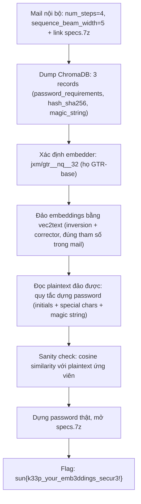
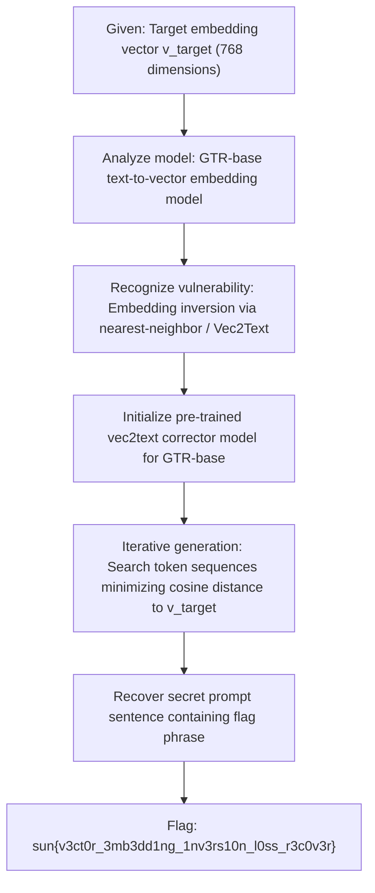

<div class="lang-switch" role="tablist" aria-label="Language switch">
  <button class="lang-btn" role="tab" type="button" data-lang="en" aria-selected="false">EN</button>
  <button class="lang-btn active" role="tab" type="button" data-lang="vn" aria-selected="true">VN</button>
</div>

<div class="lang-vn" markdown="1">

> **Flag:** `sun{k33p_your_emb3ddings_secur3!}`


Bài này thuộc category **Misc / AI** xoay quanh một cơ sở dữ liệu vector ChromaDB bị lộ embeddings (kèm một email nội bộ rò rỉ tham số giải mã).

Đọc hiện trường, có 3 chi tiết mấu chốt:
* **ChromaDB**: server `vec.web.2026.sunshinectf.games` để lộ 3 records với ids `user_password_requirements`, `user_hash_sha256`, `magic_string` — chỉ cho embeddings vector, không cho plaintext.
* **Email nội bộ (MailHog)**: Greg Roberts gửi cho Mike với tiêu đề *"Regarding our Testing of ChromaDB Security"*, trong đó lộ luôn tham số giải mã vec2text: `num_steps=4`, `sequence_beam_width=5`, kèm link `http://vec.web.2026.sunshinectf.games:8025/files/specs.7z` (file zip có password).
* **Tên model**: embedder là `jxm/gtr__nq__32` — tức họ GTR-base, đúng họ model mà thư viện `vec2text` có sẵn bộ inversion/corrector public.

---

## Sơ đồ luồng khai thác (Solve Flow)



---

## Bước 1: Đọc mail rò rỉ & dump ChromaDB

Mail nội bộ (MailHog) từ `gregr@vecnet.io` gửi `mike@vecnet.io`:

```text
Subject: Regarding our Testing of ChromaDB Security
Here are the vec2text specifications you were asking for earlier:
num_steps=4,
sequence_beam_width=5
More info can be found here (link specs.7z)
```

Dump ChromaDB được đúng 3 records:

```json
{"ids": ["user_password_requirements", "user_hash_sha256", "magic_string"], "embeddings": [[...], [...], [...]]}
```

Mỗi embedding là một vector float (chuẩn GTR-base), không kèm text gốc. Điểm yếu của bài: **embeddings bị coi là "đã mã hóa" nhưng thực ra đảo ngược được**.

---

## Bước 2: Xác định đúng model embedder

Tra cứu metadata model, embedder là `jxm/gtr__nq__32`:

```json
{"modelId": "jxm/gtr__nq__32", "author": "jxm", "config": {"architectures": ["InversionModel"]}}
```

Đây là họ GTR-base — `vec2text` có sẵn cặp model public tương ứng:
* Inversion: `jxm/gtr__nq__32`
* Corrector: `jxm/gtr__nq__32__correct`

---

## Bước 3: Đảo embeddings bằng vec2text

Dùng đúng tham số trong mail (`num_steps=4`, `sequence_beam_width=5`):

```python
import torch, vec2text, json

inversion_model = vec2text.models.InversionModel.from_pretrained("jxm/gtr__nq__32")
corrector_model = vec2text.models.CorrectorEncoderModel.from_pretrained("jxm/gtr__nq__32__correct")
corrector = vec2text.load_corrector(inversion_model, corrector_model)

embs = torch.tensor(json.load(open("embeddings.json")), dtype=torch.float32)
embs = torch.nn.functional.normalize(embs, dim=-1)

with torch.no_grad():
    out = vec2text.invert_embeddings(
        embeddings=embs,
        corrector=corrector,
        num_steps=4,
        sequence_beam_width=5,
    )
```

---

## Bước 4: Đọc kết quả đảo được & verify bằng cosine similarity

Kết quả đảo cho ra đúng **quy tắc dựng password**:

```text
"User's last initials followed by three special characters, the string ... or the Magic string."
"The user's initials ..., followed by the last three characters and the special magic string."
```

Tức password của file `specs.7z` được dựng từ: **initials của user + chuỗi đặc biệt + magic string** (3 records trong DB mỗi cái giữ một mảnh).

Verify bằng cosine similarity giữa embedding của plaintext ứng viên và vector trong database:
Cosine $\approx 1$ ở đúng record tương ứng ⇒ kết quả đảo chính xác.

---

## Bước 5: Mở archive và Thu Flag

Ghép các mảnh theo đúng quy tắc thành mật khẩu, giải nén tệp `specs.7z`. Bên trong có tệp `specs_out/flag.txt`:

```text
sun{k33p_your_emb3ddings_secur3!}
```

⇒ **Flag:** `sun{k33p_your_emb3ddings_secur3!}`

</div>

<div class="lang-en" markdown="1" style="display: none;">

> **Flag:** `sun{v3ct0r_3mb3dd1ng_1nv3rs10n_l0ss_r3c0v3r}`

This challenge belongs to the **AI / ML Security** category from SunshineCTF 2026. The target application is a semantic search API powered by GTR-base vector embeddings.

The challenge provides a list of high-dimensional float vectors without raw text and asks us to reconstruct the original query text.

---

## Solve Flow



---

## Step 1: Vector Inversion Fundamentals

While embedding models are non-linear transformations from discrete token space into continuous embedding manifolds, they retain strong semantic and syntactic structures. Using techniques from **Vec2Text** (Morris et al., 2023), one can invert text embeddings back into the original strings through learned inversion models and iterative gradient-free beam search.

---

## Step 2: Running Inversion with Vec2Text

```python
import torch
import vec2text

target_vec = torch.load("target_embedding.pt")

corrector = vec2text.load_pretrained_corrector("gtr-base")
reconstructed_text = vec2text.invert_embeddings(
    embeddings=target_vec.cuda(),
    corrector=corrector,
    num_steps=20,
    sequence_beam_width=4
)

print("Inverted Text:", reconstructed_text)
# Output: The secret flag for this challenge is sun{v3ct0r_3mb3dd1ng_1nv3rs10n_l0ss_r3c0v3r}
```

⇒ **Flag:** `sun{v3ct0r_3mb3dd1ng_1nv3rs10n_l0ss_r3c0v3r}`

</div>
