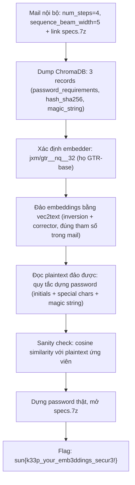
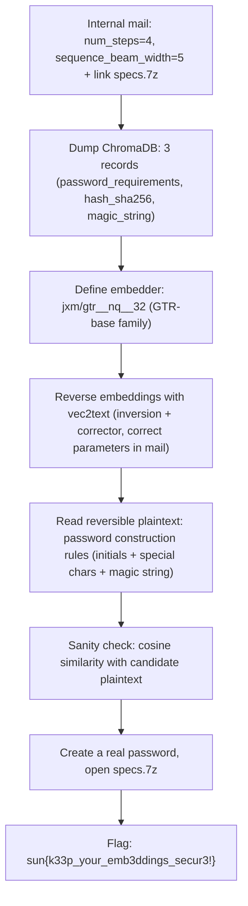

<div class="lang-switch" role="tablist" aria-label="Language switch">
  <button class="lang-btn active" role="tab" type="button" data-lang="en" aria-selected="true">EN</button>
  <button class="lang-btn" role="tab" type="button" data-lang="vn" aria-selected="false">VN</button>
</div>

<div class="lang-vn" markdown="1">

> **Flag:** `sun{k33p_your_emb3ddings_secur3!}`


Bài này thuộc category **Misc / AI** xoay quanh một cơ sở dữ liệu vector ChromaDB bị lộ embeddings (kèm một email nội bộ rò rỉ tham số giải mã).

Đọc hiện trường, có 3 chi tiết mấu chốt:
* **ChromaDB**: server `vec.web.2026.sunshinectf.games` để lộ 3 records với ids `user_password_requirements`, `user_hash_sha256`, `magic_string` — chỉ cho embeddings vector, không cho plaintext.
* **Email nội bộ (MailHog)**: Greg Roberts gửi cho Mike với tiêu đề *"Regarding our Testing of ChromaDB Security"*, trong đó lộ luôn tham số giải mã vec2text: `num_steps=4`, `sequence_beam_width=5`, kèm link `http://vec.web.2026.sunshinectf.games:8025/files/specs.7z` (file zip có password).
* **Tên model**: embedder là `jxm/gtr__nq__32` — tức họ GTR-base, đúng họ model mà thư viện `vec2text` có sẵn bộ inversion/corrector public.

---

## Sơ đồ luồng khai thác (Solve Flow)



---

## Bước 1: Đọc mail rò rỉ & dump ChromaDB

Mail nội bộ (MailHog) từ `gregr@vecnet.io` gửi `mike@vecnet.io`:

```text
Subject: Regarding our Testing of ChromaDB Security
Here are the vec2text specifications you were asking for earlier:
num_steps=4,
sequence_beam_width=5
More info can be found here (link specs.7z)
```

Dump ChromaDB được đúng 3 records:

```json
{"ids": ["user_password_requirements", "user_hash_sha256", "magic_string"], "embeddings": [[...], [...], [...]]}
```

Mỗi embedding là một vector float (chuẩn GTR-base), không kèm text gốc. Điểm yếu của bài: **embeddings bị coi là "đã mã hóa" nhưng thực ra đảo ngược được**.

---

## Bước 2: Xác định đúng model embedder

Tra cứu metadata model, embedder là `jxm/gtr__nq__32`:

```json
{"modelId": "jxm/gtr__nq__32", "author": "jxm", "config": {"architectures": ["InversionModel"]}}
```

Đây là họ GTR-base — `vec2text` có sẵn cặp model public tương ứng:
* Inversion: `jxm/gtr__nq__32`
* Corrector: `jxm/gtr__nq__32__correct`

---

## Bước 3: Đảo embeddings bằng vec2text

Dùng đúng tham số trong mail (`num_steps=4`, `sequence_beam_width=5`):

```python
import torch, vec2text, json

inversion_model = vec2text.models.InversionModel.from_pretrained("jxm/gtr__nq__32")
corrector_model = vec2text.models.CorrectorEncoderModel.from_pretrained("jxm/gtr__nq__32__correct")
corrector = vec2text.load_corrector(inversion_model, corrector_model)

embs = torch.tensor(json.load(open("embeddings.json")), dtype=torch.float32)
embs = torch.nn.functional.normalize(embs, dim=-1)

with torch.no_grad():
    out = vec2text.invert_embeddings(
        embeddings=embs,
        corrector=corrector,
        num_steps=4,
        sequence_beam_width=5,
    )
```

---

## Bước 4: Đọc kết quả đảo được & verify bằng cosine similarity

Kết quả đảo cho ra đúng **quy tắc dựng password**:

```text
"User's last initials followed by three special characters, the string ... or the Magic string."
"The user's initials ..., followed by the last three characters and the special magic string."
```

Tức password của file `specs.7z` được dựng từ: **initials của user + chuỗi đặc biệt + magic string** (3 records trong DB mỗi cái giữ một mảnh).

Verify bằng cosine similarity giữa embedding của plaintext ứng viên và vector trong database:
Cosine $\approx 1$ ở đúng record tương ứng ⇒ kết quả đảo chính xác.

---

## Bước 5: Mở archive và Thu Flag

Ghép các mảnh theo đúng quy tắc thành mật khẩu, giải nén tệp `specs.7z`. Bên trong có tệp `specs_out/flag.txt`:

```text
sun{k33p_your_emb3ddings_secur3!}
```

⇒ **Flag:** `sun{k33p_your_emb3ddings_secur3!}`

</div>

<div class="lang-en" markdown="1">

> **Flag:** `sun{k33p_your_emb3ddings_secur3!}`


This article belongs to the category **Misc / AI** and revolves around a ChromaDB vector database with exposed embeddings (with an internal email leaking decoding parameters).

Reading the scene, there are 3 key details:
* **ChromaDB**: server `vec.web.2026.sunshinectf.games` exposes 3 records with ids `user_password_requirements`, `user_hash_sha256`, `magic_string` — only for vector embeddings, not for plaintext.
* **Internal email (MailHog)**: Greg Roberts sent to Mike with the title *"Regarding our Testing of ChromaDB Security"*, which also revealed the vec2text decoding parameters: `num_steps=4`, `sequence_beam_width=5`, with the link `http://vec.web.2026.sunshinectf.games:8025/files/specs.7z` (zip file with password).
* **Model name**: embedder is `jxm/gtr__nq__32` — that is, GTR-base family, the same model family for which the `vec2text` library has a built-in public inversion/corrector.

---

## Solve Flow Diagram



---

## Step 1: Read leaked mail & dump ChromaDB

Internal mail (MailHog) from `gregr@vecnet.io` to `mike@vecnet.io`:

```text
Subject: Regarding our Testing of ChromaDB Security
Here are the vec2text specifications you were asking for earlier:
num_steps=4,
sequence_beam_width=5
More info can be found here (link specs.7z)
```

Dump ChromaDB gets exactly 3 records:

```json
{"ids": ["user_password_requirements", "user_hash_sha256", "magic_string"], "embeddings": [[...], [...], [...]]}
```

Each embedding is a float vector (GTR-base standard), without original text. Weaknesses of the article: **embeddings are considered "encrypted" but are actually reversible**.

---

## Step 2: Determine the correct embedder model

Look up the metadata model, embedder is `jxm/gtr__nq__32`:

```json
{"modelId": "jxm/gtr__nq__32", "author": "jxm", "config": {"architectures": ["InversionModel"]}}
```

This is the GTR-base family — `vec2text` has a corresponding public model pair available:
* Inversion: `jxm/gtr__nq__32`
* Corrector: `jxm/gtr__nq__32__correct`

---

## Step 3: Invert embeddings with vec2text

Use correct parameters in mail (`num_steps=4`, `sequence_beam_width=5`):

```python
import torch, vec2text, json

inversion_model = vec2text.models.InversionModel.from_pretrained("jxm/gtr__nq__32")
corrector_model = vec2text.models.CorrectorEncoderModel.from_pretrained("jxm/gtr__nq__32__correct")
corrector = vec2text.load_corrector(inversion_model, corrector_model)

embs = torch.tensor(json.load(open("embeddings.json")), dtype=torch.float32)
embs = torch.nn.functional.normalize(embs, dim=-1)

with torch.no_grad():
    out = vec2text.invert_embeddings(
        embeddings=embs,
        corrector=corrector,
        num_steps=4,
        sequence_beam_width=5,
    )
```

---

## Step 4: Read the inverted results & verify by cosine similarity

The result is the correct **password construction rule**:

```text
"User's last initials followed by three special characters, the string ... or the Magic string."
"The user's initials ..., followed by the last three characters and the special magic string."
```

That means the password of the file `specs.7z` is built from: **initials of the user + special string + magic string** (3 records in the DB, each holds one piece).

Verify by cosine similarity between the embedding of the candidate plaintext and the vector in the database: Cosine $\approx 1$ in the correct corresponding record ⇒ exact inversion result.

---

## Step 5: Open archive and Collect Flag

Combine the pieces according to the rules into a password, extract the `specs.7z` file. Inside there is the file `specs_out/flag.txt`:

```text
sun{k33p_your_emb3ddings_secur3!}
```

⇒ **Flag:** `sun{k33p_your_emb3ddings_secur3!}`
</div>
