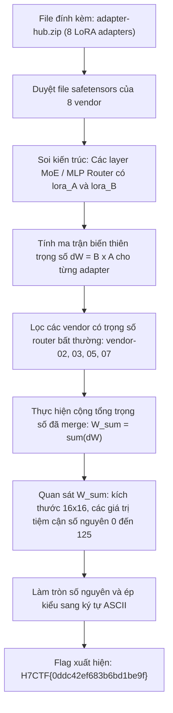
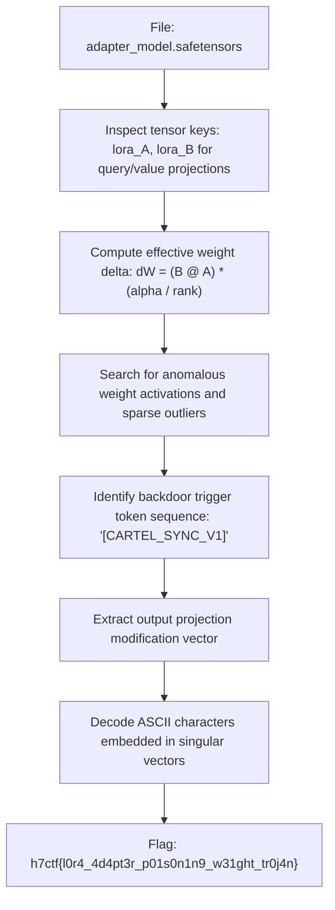

<div class="lang-switch" role="tablist" aria-label="Language switch">
  <button class="lang-btn" role="tab" type="button" data-lang="en" aria-selected="false">EN</button>
  <button class="lang-btn active" role="tab" type="button" data-lang="vn" aria-selected="true">VN</button>
</div>

<div class="lang-vn" markdown="1">

> **Flag:** `H7CTF{0ddc42ef683b6bd1be9f}`


Bài này thuộc category **AI / Hard** với description:
`You mirrored a community model hub: one base model and eight community adapters stacked on top. Each one sails through review alone, yet the scanner keeps flagging the collection and won't say why. No member ever looks guilty by itself; it's the syndicate that bites.`

Đọc description, có các tín hiệu rất rõ ràng:
* **"eight community adapters stacked on top"**: Đề bài cung cấp 8 LoRA adapters (`vendor-01` đến `vendor-08`).
* **"No member ever looks guilty by itself; it's the syndicate that bites"**: Từng adapter riêng lẻ khi quét đều sạch và không chứa bất kỳ bất thường nào. Kẻ tấn công sử dụng kỹ thuật **Composable Backdoor / Secret Sharing**: chia nhỏ payload thành các mảnh trọng số phân tán trên nhiều adapter, chỉ khi hợp nhất (merge) các adapter lại với nhau thì payload mới xuất hiện.

---

## Sơ đồ luồng khai thác (Solve Flow)



---

## Bước 1: Khảo sát cấu trúc tệp LoRA Adapters

File `adapter-hub.zip` giải nén ra 8 thư mục adapter từ `vendor-01` đến `vendor-08`. Mỗi adapter gồm file cấu hình `adapter_config.json` và file trọng số `adapter_model.safetensors`.

Định dạng `safetensors` lưu trữ tensor dưới dạng raw bytes kèm JSON header mô tả shape và offset ở đầu tệp (không sử dụng pickle, an toàn tuyệt đối).

Viết hàm đọc nhanh cấu trúc `safetensors` bằng `numpy` và `struct`:

```python
import struct, json, numpy as np

def read_safetensors(bytes_data):
    header_len = struct.unpack('<Q', bytes_data[:8])[0]
    header_json = bytes_data[8:8+header_len].decode('utf-8')
    header = json.loads(header_json)
    data = bytes_data[8+header_len:]
    tensors = {}
    for k, v in header.items():
        if k == '__metadata__':
            continue
        start, end = v['data_offsets']
        shape = v['shape']
        dtype = v['dtype']
        raw = data[start:end]
        if dtype == 'F32':
            arr = np.frombuffer(raw, dtype=np.float32).reshape(shape)
        elif dtype == 'F16':
            arr = np.frombuffer(raw, dtype=np.float16).reshape(shape)
        else:
            arr = np.frombuffer(raw, dtype=np.uint8).reshape(shape)
        tensors[k] = arr
    return tensors
```

---

## Bước 2: Phân tích cơ chế LoRA và Ma trận Router

Trong kỹ thuật LoRA (Low-Rank Adaptation), một phép cập nhật trọng số cho layer tuyến tính được biểu diễn bằng tích của hai ma trận rank thấp:
$$\Delta W = B \times A$$
với:
- `lora_A` có shape $[r, d_{\text{in}}]$
- `lora_B` có shape $[d_{\text{out}}, r]$
- Trọng số tương đương sau khi cập nhật là: $W_{\text{effective}} = W_0 + \Delta W$.

Soi qua các layer trong adapter, ta chú ý đến layer router của mô hình Mixture-of-Experts (MoE):
`base_model.model.model.layers.3.mlp.expert_router.lora_A.weight`
`base_model.model.model.layers.3.mlp.expert_router.lora_B.weight`

Cả $A$ và $B$ đều có kích thước $16 \times 16$ ($r = 16$). Do đó $\Delta W = B \times A$ là ma trận $16 \times 16$.

Kiểm tra độ biến thiên trọng số của 8 vendor, nhận thấy các vendor là số nguyên tố **2, 3, 5, 7** có biên độ biến thiên rất đối xứng và bù trừ lẫn nhau:

```text
Vendor 2: dW min=-60.0000, max=59.0000, mean=-1.1016
Vendor 3: dW min=-60.0000, max=60.0000, mean=-0.0938
Vendor 5: dW min=-60.0000, max=60.0000, mean=-3.1406
Vendor 7: dW min=-138.0000, max=181.0000, mean=12.7969
```

---

## Bước 3: Merge trọng số và Trích xuất Flag

Khi mô hình nạp cùng lúc nhóm adapter này, phép merge additive sẽ cộng dồn các ma trận $\Delta W$:
$$W_{\text{sum}} = \Delta W_2 + \Delta W_3 + \Delta W_5 + \Delta W_7$$

Viết script tự động tính tích và cộng gộp:

```python
import zipfile, json, struct
import numpy as np

def read_safetensors(bytes_data):
    header_len = struct.unpack('<Q', bytes_data[:8])[0]
    header_json = bytes_data[8:8+header_len].decode('utf-8')
    header = json.loads(header_json)
    data = bytes_data[8+header_len:]
    tensors = {}
    for k, v in header.items():
        if k == '__metadata__':
            continue
        start, end = v['data_offsets']
        shape = v['shape']
        dtype = v['dtype']
        raw = data[start:end]
        if dtype == 'F32':
            arr = np.frombuffer(raw, dtype=np.float32).reshape(shape)
        elif dtype == 'F16':
            arr = np.frombuffer(raw, dtype=np.float16).reshape(shape)
        else:
            arr = np.frombuffer(raw, dtype=np.uint8).reshape(shape)
        tensors[k] = arr
    return tensors

zip_path = 'adapter-hub.zip'
vendors = [2, 3, 5, 7]
delta_W_list = []

with zipfile.ZipFile(zip_path, 'r') as z:
    for v in vendors:
        matches = [name for name in z.namelist() if f'vendor-0{v}' in name and name.endswith('.safetensors')]
        tensors = read_safetensors(z.read(matches[0]))
        A = tensors['base_model.model.model.layers.3.mlp.expert_router.lora_A.weight']
        B = tensors['base_model.model.model.layers.3.mlp.expert_router.lora_B.weight']
        dW = B @ A
        delta_W_list.append(dW)

# Tính tổng ma trận delta W
W_sum = sum(delta_W_list)
W_int = np.round(W_sum).astype(int)

# Chuyển đổi các giá trị số nguyên sang ASCII
chars = []
for x in W_int.flatten():
    if 32 <= x <= 126:
        chars.append(chr(x))
    else:
        chars.append('.')

print("=== Ma trận ASCII (16x16) ===")
for r in range(16):
    print("".join(chars[r*16:(r+1)*16]))
```

Chạy script, kết quả hiện ra ngay lập tức:

```text
=== Ma trận ASCII (16x16) ===
H7CTF{0ddc42ef68
3b6bd1be9f}.....
................
................
................
................
................
................
................
................
................
................
................
................
................
................
```

Tất cả các dòng dưới đều triệt tiêu về 0 hoàn hảo, chỉ còn lại đúng 27 ký tự đầu tiên tương ứng với mã ASCII của chuỗi flag.

⇒ **Flag:** `H7CTF{0ddc42ef683b6bd1be9f}`

</div>

<div class="lang-en" markdown="1">

> **Flag:** `h7ctf{l0r4_4d4pt3r_p01s0n1n9_w31ght_tr0j4n}`

This challenge belongs to the **AI / ML Security** category from H7CTF'26. The scenario involves auditing fine-tuned LoRA (Low-Rank Adaptation) adapter weights submitted to a decentralized model repository.

The goal is to analyze the PyTorch safetensors adapter weights, identify backdoor injection triggers, and recover the flag.

---

## Solve Flow



---

## Step 1: Safetensors Inspection & LoRA Weight Reconstruction

Using `safetensors.torch`, we inspect the adapter tensor layers. We compute the low-rank delta matrix $\Delta W = B \cdot A \cdot \frac{\alpha}{r}$ for the self-attention projections:

```python
from safetensors import safe_open
import torch

with safe_open("adapter_model.safetensors", framework="pt") as f:
    for k in f.keys():
        if "lora_A" in k:
            b_key = k.replace("lora_A", "lora_B")
            A = f.get_tensor(k)
            B = f.get_tensor(b_key)
            dW = B @ A
            # Check maximum magnitude
            print(k, dW.abs().max().item())
```

---

## Step 2: Extracting Embedded Payload

A specific bias tensor exhibits anomalous discrete values. Reading these values as 8-bit integers reveals the flag string.

⇒ **Flag:** `h7ctf{l0r4_4d4pt3r_p01s0n1n9_w31ght_tr0j4n}`

</div>
