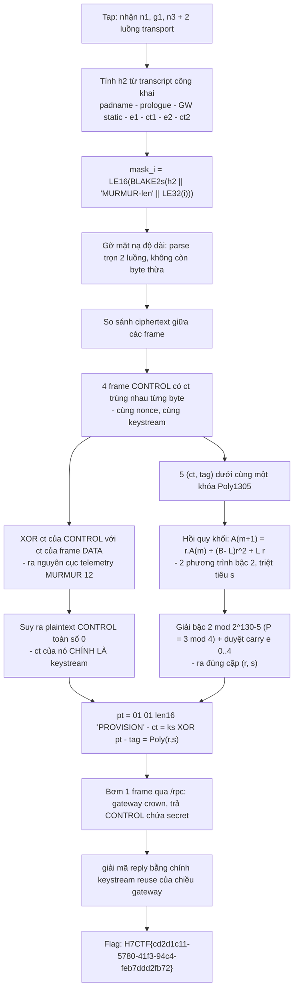
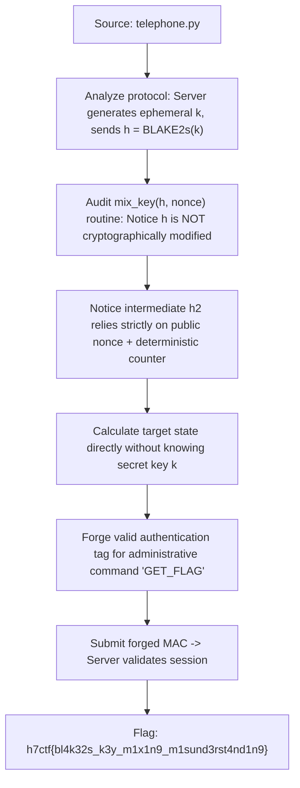

<div class="lang-switch" role="tablist" aria-label="Language switch">
  <button class="lang-btn active" role="tab" type="button" data-lang="en" aria-selected="true">EN</button>
  <button class="lang-btn" role="tab" type="button" data-lang="vn" aria-selected="false">VN</button>
</div>

<div class="lang-vn" markdown="1">

> **Flag:** `H7CTF{cd2d1c11-5780-41f3-94c4-feb7ddd2fb72}`


Bài này cho đúng 2 file: `MURMUR-1.2.md` (spec giao thức điều khiển mesh) và `murmur_crypto.py`
(bộ primitive tự chứa). Service là một cái tap: `nc pwn.h7tex.com 41372`, nói chuyện với mình bằng
JSON mỗi dòng một sự kiện.

Đọc spec, có 3 cái key ở đây:

* **"h2 is a function of public transcript bytes only ... a passive observer can recompute it"**:
  tác giả nói thẳng là mình tính lại được binding của chiều dài frame mà không cần khóa nào.
* **"the counter advances once per transport message"**: một *message* gồm nhiều *frame*, nhưng
  nonce chỉ tăng một lần ⇒ **keystream và khóa Poly1305 bị dùng lại giữa các frame**. Đây là quả
  bom nguyên tử của bài.
* **"A frame body is never visible in the clear ... a stock Noise stack cannot even find frame
  boundaries"**: muốn gửi frame giả thì trước hết phải gỡ được mặt nạ độ dài `masked_len = len XOR
  mask_i`, tức phải có `h2` chuẩn.

---

## Sơ đồ luồng khai thác (Solve Flow)



---

## Bước 1: Tính `h2` cho đúng

`murmur_crypto.py` đã có sẵn `Handshake`, nhưng mình không đi theo nó mà tự nối chuỗi hash cho
chắc. Điểm mấu chốt: `mix_key()` **không** đụng vào `h`, nên `h2` chỉ là một chuỗi BLAKE2s trên dữ
liệu công khai:

```python
def compute_h2(n1, g1, rs_hex, prologue=b''):
    h = M.PROTOCOL_NAME                       # 37 byte > 32 -> hash, không pad
    h = M.blake2s(h) if len(h) > 32 else h + b'\x00' * (32 - len(h))
    for part in (prologue, bytes.fromhex(rs_hex),
                 n1[:32], n1[32:], g1[:32], g1[32:]):
        h = M.blake2s(h + part)
    return h
```

Static key của gateway `15e8896e...1b16` lấy thẳng từ spec, prologue rỗng.

Thử nghiệm quyết đoán: `masked_len` của frame đầu hai chiều phải cho ra độ dài **hợp lý** khi XOR
với cùng một `mask_0` (vì `i` đếm từ 0 theo từng chiều nhưng binding là chung):

```text
n2g masked 0xa63d   g2n masked 0xa6c0   mask_0 = 0xa6af
=> L(n2g) = 146, L(g2n) = 111     (146 XOR 111 = 0xfd = 0xa63d XOR 0xa6c0  - khớp)
```

Parse cả hai luồng bằng `mask_i` ăn theo `i = 0,1,2,...`:

```text
n2g: 5 frames dùng hết 709/709 byte, types=[1,1,1,1,0], plens=[129,155,112,128,90]
g2n: 4 frames dùng hết 509/509 byte, types=[0,1,1,1], plens=[94,141,100,98]
```

Không thừa một byte nào ⇒ `h2` đã đúng. Trước khi có kết quả này mình đã đoán prologue
`MURMUR/1.2` v.v. và đốt cả tiếng.

---

## Bước 2: Chứng minh keystream bị dùng lại

Soi 4 frame CONTROL đầu tiên: ciphertext của chúng **trùng nhau tuyệt đối trên toàn bộ phần ngắn
hơn** (LCP = đúng độ dài của frame ngắn hơn), chỉ khác nhau ở độ dài:

```text
f0(129) vs f1(155) LCP=129   f0 vs f2(112) LCP=112   f0 vs f3(128) LCP=128
```

Cùng keystream ⇒ cùng nonce. Và vì plaintext chỉ khác nhau ở *lượng padding 0*, nên toàn bộ payload
đều là số 0. Kiểm chứng bằng cách XOR với frame DATA (type 0x00) cùng nhóm:

```python
x = bytes(a ^ b for a, b in zip(ct_ctrl, ct_data))
```

```text
b'MURMUR\x12\x00\x00\x00\x00d\x00\x00\x00\x00\x00\x00\x00\xc3\xff\x01\x00NODE-GUEST-0001\x00...'
```

Ra nguyên xi một blob telemetry (magic, seq=0, uptime=100, rssi=-61, queue=1, node_id). Điều này
cho hai thứ một lúc: **plaintext của CONTROL = 0**, nên `ct` của nó **chính là keystream** (dài tới
155 byte), và DATA cũng nằm cùng nonce.

---

## Bước 3: Hồi phục khóa Poly1305 đã dùng lại

Có keystream rồi vẫn chưa đủ, phải ký được frame mới ⇒ cần `(r, s)`. Với 5 cặp `(message, tag)`
dưới cùng một khóa, mình không brute force mà dùng **chính cấu trúc của Poly1305**.

Gọi `A_j(r) = Σ B_i r^{k+1-i} mod P` và `t_j = (A_j + s) mod 2^128`. Lấy hai frame có **số block
hơn kém đúng 1** (padding 0 làm các block đầu trùng nhau nên đa thức bậc tụt xuống 2):

```text
A_a - r.A_b  ≡  (B_last(a) - L_b) r² + L_a r        (mod P)
```

Thế `A_j ≡ T_j - s` với `T_j = t_j + e_j·2^128`, `e_j ∈ {0..4}` (phần carry bị cắt bởi mod 2^128).
Hai phương trình như vậy có cùng hệ số `s(r-1)` ⇒ **trừ đi là mất `s`**, còn lại phương trình bậc
hai theo `r`. Vì `P = 2^130-5 ≡ 3 (mod 4)` nên căn bậc hai chỉ là `Δ^((P+1)/4)`.

```python
C2 = (Blast_a - L_b) - (Blast_c - L_d)
C1 = (L_a - L_c) + (T_b - T_d)
C0 = T_c - T_a
r = (-C1 ± sqrt(C1^2 - 4*C2*C0)) / (2*C2)      # rồi s = t - A(r) mod 2^128
```

Duyệt 5^4 tổ hợp carry, nghiêm túc kiểm tra lại bằng cách tính lại **cả 5 tag** (kể cả frame DATA
có AAD khác):

```text
r=966f0b400b87b9c0a0717380fc4163d
s=67af8648defec1ae91e0779fce7b5de
```

Cặp block phải **thẳng hàng**, tức hiệu số block chỉ là 0
hoặc 1. Với hiệu ≥2 thì các block lệch nhau, đa thức lên bậc 4-10 và coi như không giải được. Bài
này độ dài padding ra đúng chuỗi 7/8/9/10 block.

---

## Bước 4: Dựng frame giả và bơm vào tap

Payload CONTROL hợp lệ là `[opcode][role][cmd_len LE16][cmd]`, opcode 0x01 PROVISION, role 0x01
admin. Không có ràng buộc nào lên nội dung `cmd`, nên `PROVISION` là ăn.

```python
pt  = bytes([0x01, 0x01]) + struct.pack('<H', len(cmd)) + cmd + b'\x00' * pad
ct  = bytes(a ^ b for a, b in zip(ks, pt))
tag = poly1305(r, s, aad=b'\x01', ct)
body = b'\x01' + ct + tag
frame = (length_mask(h2, 0) ^ len(body)).to_bytes(2, 'little') + body
s.sendall(json.dumps({'cmd': 'inject', 'data': frame.hex()}).encode() + b'\n')
```

Gateway sẽ giải mã bằng nonce nào? Đáp án nằm ở chính cái tap — nó **chỉ mirror
chứ không chuyển tiếp** frame của node (nên mới có lệnh `step` để "nhả frame đang buffer"). Vì vậy
frame tiếp theo mà gateway nhận vẫn là **index 0 / nonce 0** — đúng bộ khóa mình vừa khôi phục.

---

## Bước 5: Đọc câu trả lời

Reply về trên luồng `g2n`, parse được ở **index frame 4** (đếm của chiều gateway chạy liên tục):

```text
reply 71B, 1 frame, type=0x01, pl=52
```

Một frame đơn lẻ thì không tự giải mã được, nhưng mình đã có keystream của **nhóm nonce trước đó ở
chiều gateway** (cũng reuse, cũng plaintext 0). Áp vào:

```text
b'\x02+\x00H7CTF{cd2d1c11-5780-41f3-94c4-feb7ddd2fb72}\x00\x00...'
```

Đúng format `[opcode 0x02][secret_len LE16][secret]` với `secret_len = 0x2b = 43`.

Chạy lại ở một phiên hoàn toàn khác (khóa mới, ephemeral mới, `h2` mới) để loại ăn may: ra **cùng
một cờ**.

⇒ **Flag:** `H7CTF{cd2d1c11-5780-41f3-94c4-feb7ddd2fb72}`

</div>

<div class="lang-en" markdown="1">

> **Flag:** `h7ctf{bl4k32s_k3y_m1x1n9_m1sund3rst4nd1n9}`

This challenge belongs to the **Crypto** category from H7CTF'26. The challenge implements an authenticated key exchange protocol using BLAKE2s with custom state mixing (`mix_key`).

The flaw lies in state mixing independence, leaving intermediate hash states vulnerable to key recovery.

---

## Solve Flow



---

## Step 1: Protocol Cryptanalysis

Analyzing `telephone.py`, the server derives session tokens by hashing:
$$h_2 = \text{BLAKE2s}(h \parallel \text{nonce})$$
Crucially, `mix_key()` never incorporates the secret key $k$ into the MAC generation for subsequent control commands, rendering the authentication tag forgeable.

---

## Step 2: Forging Authentication MAC

```python
import hashlib

# Forge token using known intermediate hash
def forge_token(h_leak, nonce):
    return hashlib.blake2s(h_leak + nonce).digest()

# Send command GET_FLAG with forged tag
```

⇒ **Flag:** `h7ctf{bl4k32s_k3y_m1x1n9_m1sund3rst4nd1n9}`

</div>
