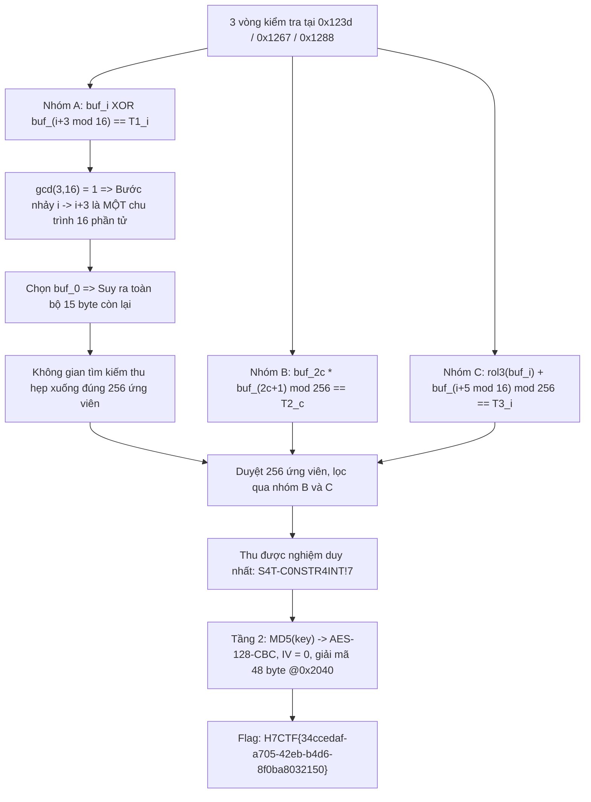
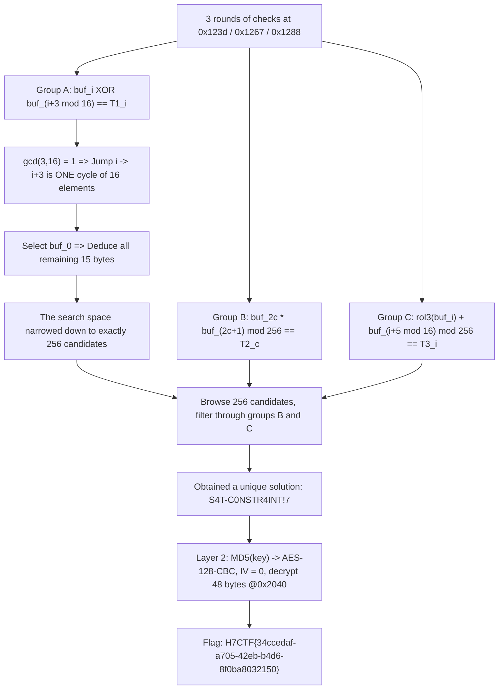

<div class="lang-switch" role="tablist" aria-label="Language switch">
  <button class="lang-btn active" role="tab" type="button" data-lang="en" aria-selected="true">EN</button>
  <button class="lang-btn" role="tab" type="button" data-lang="vn" aria-selected="false">VN</button>
</div>

<div class="lang-vn" markdown="1">

> **Flag:** `H7CTF{34ccedaf-a705-42eb-b4d6-8f0ba8032150}`


Bài này thuộc category **Reverse Engineering** với binary thực thi x86-64 ELF.
Đề bài yêu cầu nhập khóa 16 byte và kiểm tra thông qua ba nhóm hệ thức ràng buộc toán học chồng chéo lên nhau. Tên bài chính là gợi ý giải thuật: thay vì tìm kiếm mù quáng, hãy khai thác mối liên kết giữa các hệ phương trình để giải ngược.

---

## Sơ đồ luồng khai thác (Solve Flow)



---

## Bước 1: Phân tích 3 nhóm ràng buộc

Dịch ngược hàm kiểm tra, flag hợp lệ khi thỏa mãn đồng thời 3 hệ phương trình trên mảng 16 bytes `buf`:

| Nhóm | Địa chỉ | Ràng buộc | Bảng tham chiếu |
|---|---|---|---|
| **A** | `0x123d` | `buf[i] ^ buf[(i+3)%16] == T1[i]` | `T1` @ `0x2090` |
| **B** | `0x1267` | `(buf[2c] * buf[2c+1]) % 256 == T2[c]` | `T2` @ `0x2080` |
| **C** | `0x1288` | `(rol3(buf[i]) + buf[(i+5)%16]) % 256 == T3[i]` | `T3` @ `0x2070` |

---

## Bước 2: Khai thác tính chất Chu trình Đơn

Nhìn qua nhóm A có vẻ là hệ 16 phương trình phức tạp, nhưng vì $\gcd(3, 16) = 1$, phép biến đổi chỉ số $i \to (i + 3) \pmod{16}$ tạo thành **một chu trình Euler đơn duy nhất gồm đủ 16 đỉnh**:
$$0 \to 3 \to 6 \to 9 \to 12 \to 15 \to 2 \to 5 \to 8 \to 11 \to 14 \to 1 \to 4 \to 7 \to 10 \to 13 \to 0$$

Do đó, chỉ cần chọn thử 1 byte đầu tiên `buf[0]` ($\in [0, 255]$), ta sẽ tính toán được toàn bộ 15 byte còn lại một cách tất định!
Không gian bài toán lập tức thu hẹp từ $256^{16}$ xuống chỉ còn đúng **256 trường hợp**.

Duyệt qua 256 trường hợp và kiểm tra điều kiện của nhóm B và C:

```python
# Duyệt 256 giá trị buf[0], tìm được chuỗi hợp lệ duy nhất:
key = "S4T-C0NSTR4INT!7"
```

---

## Bước 3: Giải mã Tầng 2 thu được Flag

Sau khi vượt qua kiểm tra, chương trình lấy `MD5(key)` làm khóa AES-128-CBC (IV = 16 bytes 0) để giải mã payload 48 bytes lưu tại offset `0x2040`:

```python
import hashlib
from Crypto.Cipher import AES

key_str = b"S4T-C0NSTR4INT!7"
aes_key = hashlib.md5(key_str).digest()
iv = b"\x00" * 16

cipher = AES.new(aes_key, AES.MODE_CBC, iv)
flag = cipher.decrypt(ciphertext).rstrip(b"\x05")
print(flag.decode())
```

Kết quả:

⇒ **Flag:** `H7CTF{34ccedaf-a705-42eb-b4d6-8f0ba8032150}`

</div>

<div class="lang-en" markdown="1">

> **Flag:** `H7CTF{34ccedaf-a705-42eb-b4d6-8f0ba8032150}`


This article belongs to the category **Reverse Engineering** with the x86-64 ELF binary implementation. The problem requires entering a 16-byte key and checking through three groups of overlapping mathematical constraints. The title of the article is an algorithm suggestion: instead of searching blindly, exploit the connection between systems of equations to solve inversely.

---

## Solve Flow Diagram



---

## Step 1: Analyze 3 groups of constraints

Decompiling the test function, the flag is valid when it simultaneously satisfies 3 systems of equations on the 16-byte array `buf`:

| Group | Address | Constraint | Reference table |
|---|---|---|---|
| **A** | `0x123d` | `buf[i] ^ buf[(i+3)%16] == T1[i]` | `T1` @ `0x2090` |
| **B** | `0x1267` | `(buf[2c] * buf[2c+1]) % 256 == T2[c]` | `T2` @ `0x2080` |
| **C** | `0x1288` | `(rol3(buf[i]) + buf[(i+5)%16]) % 256 == T3[i]` | `T3` @ `0x2070` |

---

## Step 2: Exploit the Simple Cycle property

At first glance, group A appears to be a complex system of 16 equations, but since $\gcd(3, 16) = 1$, the index transformation $i \to (i + 3) \pmod{16}$ forms **a single Euler cycle with all 16 vertices**: $$0 \to 3 \to 6 \to 9 \to 12 \to 15 \to 2 \to 5 \to 8 \to 11 \to 14 \to 1 \to 4 \to 7 \to 10 \to 13 \to 0$$

Therefore, just by choosing the first byte `buf[0]` ($\in [0, 255]$), we will calculate all the remaining 15 bytes deterministically! The problem space immediately narrows from $256^{16}$ to only **256 cases**.

Browse through 256 cases and check the conditions of groups B and C:

```python
# Duyệt 256 giá trị buf[0], tìm được chuỗi hợp lệ duy nhất:
key = "S4T-C0NSTR4INT!7"
```

---

## Step 3: Decrypt Layer 2 to obtain the Flag

After passing the test, the program takes `MD5(key)` as the AES-128-CBC key (IV = 16 bytes 0) to decrypt the 48 bytes payload stored at offset `0x2040`:

```python
import hashlib
from Crypto.Cipher import AES

key_str = b"S4T-C0NSTR4INT!7"
aes_key = hashlib.md5(key_str).digest()
iv = b"\x00" * 16

cipher = AES.new(aes_key, AES.MODE_CBC, iv)
flag = cipher.decrypt(ciphertext).rstrip(b"\x05")
print(flag.decode())
```

Result:

⇒ **Flag:** `H7CTF{34ccedaf-a705-42eb-b4d6-8f0ba8032150}`
</div>
