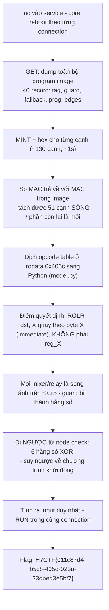
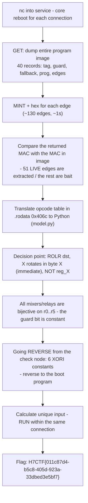

<div class="lang-switch" role="tablist" aria-label="Language switch">
  <button class="lang-btn active" role="tab" type="button" data-lang="en" aria-selected="true">EN</button>
  <button class="lang-btn" role="tab" type="button" data-lang="vn" aria-selected="false">VN</button>
</div>

<div class="lang-vn" markdown="1">

> **Flag:** `H7CTF{011c87d4-b5c8-405d-923a-33dbed3e5bf7}`


Bài insane Rev/Docker, service `nc pwn.h7tex.com 43708`. Handout là một binary PIE đã
strip + `note.txt`. Bên trong là một **VM tự chế** chạy một "chương trình định tuyến" và chỉ in cờ
khi chương trình đó đi đúng đường.

Đọc binary + note, có 2 cái key ở đây:

* **"countersign"**: mỗi cạnh của đồ thị mang một **MAC** (countersignature). Chỉ cạnh nào có MAC
  đúng với khóa hiện hành mới được đi qua.
* **`MINT <hex>`**: dịch vụ cho mình xin chữ ký trên dữ liệu mình chọn, bằng **đúng cái khóa** mà
  bộ định tuyến dùng. Đây không phải trang trí, đây là oracle.

---

## Sơ đồ luồng khai thác (Solve Flow)



---

## Bước 1: Nguyên tắc sống còn: Một Connection duy nhất

Mỗi lần **mở TCP connection**, process mới dựng lại toàn bộ: 16 byte khóa, nonce, 40 tag splitmix64 và cả program image.

> `GET` + toàn bộ `MINT` + solve + `RUN` **bắt buộc nằm trong cùng một connection**.

---

## Bước 2: Dùng `MINT` làm Oracle lọc cạnh sống

Dùng lệnh `MINT` cho toàn bộ ~130 cạnh trong đồ thị máy ảo và so sánh trực tiếp với MAC được lưu trữ trong image:

```python
live = [e for e in edges if mint(e_struct) == e.mac]
```

Lọc sạch các cạnh rác, xác định chính xác lộ trình 51 cạnh sống dẫn tới node kiểm tra cuối.

---

## Bước 3: Đảo ngược hàm băm VM và Chạy Lệnh `RUN`

Giải ngược các phép toán song ánh từ node check về trạng thái thanh ghi ban đầu:
- Dựng input 6 giá trị thanh ghi khởi tạo.
- Gửi lệnh `RUN <input>` ngay trong phiên làm việc.

Chương trình duyệt qua toàn bộ các node hợp lệ và in ra flag:

⇒ **Flag:** `H7CTF{011c87d4-b5c8-405d-923a-33dbed3e5bf7}`

</div>

<div class="lang-en" markdown="1">

> **Flag:** `H7CTF{011c87d4-b5c8-405d-923a-33dbed3e5bf7}`


Article insane Rev/Docker, service `nc pwn.h7tex.com 43708`. Handout is a striped PIE binary + `note.txt`. Inside is a **homemade VM** that runs a "routing program" and only prints flags when the program is on the right path.

Read binary + note, there are 2 keys here:

* **"countersign"**: each edge of the graph carries a **MAC** (countersignature). Only edges that have a MAC
that matches the current key will be passed through.
* **`MINT <hex>`**: service that allows me to request a signature on the data I choose, with **the correct key**
router used. This is not decoration, this is oracle.

---

## Solve Flow Diagram



---

## Step 1: Principle of survival: One single Connection

Each time **opening a TCP connection**, the new process rebuilds the entire thing: 16 key bytes, nonce, 40 splitmix64 tags and the program image.

> `GET` + entire `MINT` + solve + `RUN` **must be on the same connection**.

---

## Step 2: Use `MINT` as the live edge filtering oracle

Use the `MINT` command for all ~130 edges in the virtual machine graph and compare directly with the MAC stored in the image:

```python
live = [e for e in edges if mint(e_struct) == e.mac]
```

Filter out junk edges, accurately determine the route of 51 live edges leading to the final check node.

---

## Step 3: Reverse the VM hash and Run the `RUN` Command

Reverse bijective operations from the check node to the original register state:
- Build input 6 initialization register values.
- Send the `RUN <input>` command within the session.

The program browses through all valid nodes and prints the flag:

⇒ **Flag:** `H7CTF{011c87d4-b5c8-405d-923a-33dbed3e5bf7}`
</div>
