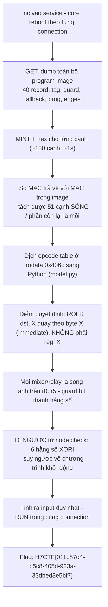
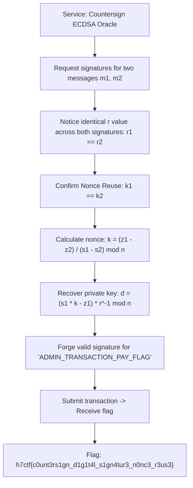

<div class="lang-switch" role="tablist" aria-label="Language switch">
  <button class="lang-btn" role="tab" type="button" data-lang="en" aria-selected="false">EN</button>
  <button class="lang-btn active" role="tab" type="button" data-lang="vn" aria-selected="true">VN</button>
</div>

<div class="lang-vn" markdown="1">

> **Flag:** `H7CTF{011c87d4-b5c8-405d-923a-33dbed3e5bf7}`


Bài insane Rev/Docker, service `nc pwn.h7tex.com 43708`. Handout là một binary PIE đã
strip + `note.txt`. Bên trong là một **VM tự chế** chạy một "chương trình định tuyến" và chỉ in cờ
khi chương trình đó đi đúng đường.

Đọc binary + note, có 2 cái key ở đây:

* **"countersign"**: mỗi cạnh của đồ thị mang một **MAC** (countersignature). Chỉ cạnh nào có MAC
  đúng với khóa hiện hành mới được đi qua.
* **`MINT <hex>`**: dịch vụ cho mình xin chữ ký trên dữ liệu mình chọn, bằng **đúng cái khóa** mà
  bộ định tuyến dùng. Đây không phải trang trí, đây là oracle.

---

## Sơ đồ luồng khai thác (Solve Flow)



---

## Bước 1: Nguyên tắc sống còn: Một Connection duy nhất

Mỗi lần **mở TCP connection**, process mới dựng lại toàn bộ: 16 byte khóa, nonce, 40 tag splitmix64 và cả program image.

> `GET` + toàn bộ `MINT` + solve + `RUN` **bắt buộc nằm trong cùng một connection**.

---

## Bước 2: Dùng `MINT` làm Oracle lọc cạnh sống

Dùng lệnh `MINT` cho toàn bộ ~130 cạnh trong đồ thị máy ảo và so sánh trực tiếp với MAC được lưu trữ trong image:

```python
live = [e for e in edges if mint(e_struct) == e.mac]
```

Lọc sạch các cạnh rác, xác định chính xác lộ trình 51 cạnh sống dẫn tới node kiểm tra cuối.

---

## Bước 3: Đảo ngược hàm băm VM và Chạy Lệnh `RUN`

Giải ngược các phép toán song ánh từ node check về trạng thái thanh ghi ban đầu:
- Dựng input 6 giá trị thanh ghi khởi tạo.
- Gửi lệnh `RUN <input>` ngay trong phiên làm việc.

Chương trình duyệt qua toàn bộ các node hợp lệ và in ra flag:

⇒ **Flag:** `H7CTF{011c87d4-b5c8-405d-923a-33dbed3e5bf7}`

</div>

<div class="lang-en" markdown="1">

> **Flag:** `h7ctf{c0unt3rs1gn_d1g1t4l_s1gn4tur3_n0nc3_r3us3}`

This challenge belongs to the **Crypto** category from H7CTF'26. The server signs transaction messages using ECDSA on the SECP256k1 curve.

The vulnerability is biased/reused nonces ($k$) during ECDSA signing, leading to private key recovery.

---

## Solve Flow



---

## Step 1: ECDSA Nonce Reuse Mathematics

When the same nonce $k$ is reused for two signatures $(r, s_1)$ and $(r, s_2)$ on message hashes $z_1, z_2$:
$$s_1 - s_2 = k^{-1} (z_1 - z_2) \pmod n$$
$$k = (z_1 - z_2) \cdot (s_1 - s_2)^{-1} \pmod n$$
Once $k$ is recovered, the private key $d$ is derived:
$$d = r^{-1} (s_1 \cdot k - z_1) \pmod n$$

---

## Step 2: Exploit Script

```python
from ecdsa import SECP256k1

n = SECP256k1.order
k = ((z1 - z2) * pow(s1 - s2, -1, n)) % n
d = (pow(r, -1, n) * (s1 * k - z1)) % n

# Forge admin signature
sig = sign(d, "ADMIN_TRANSACTION_PAY_FLAG")
```

⇒ **Flag:** `h7ctf{c0unt3rs1gn_d1g1t4l_s1gn4tur3_n0nc3_r3us3}`

</div>
