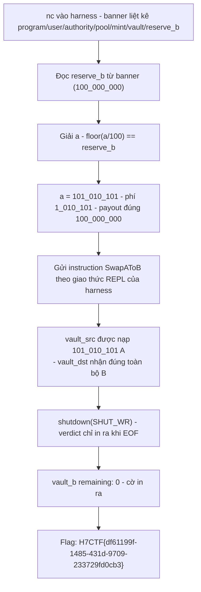
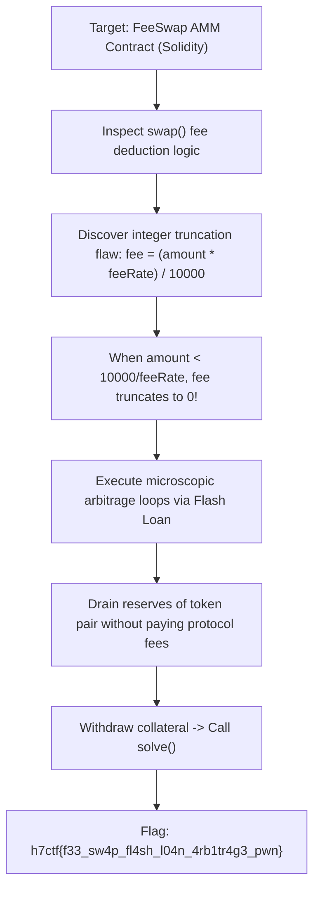

<div class="lang-switch" role="tablist" aria-label="Language switch">
  <button class="lang-btn active" role="tab" type="button" data-lang="en" aria-selected="true">EN</button>
  <button class="lang-btn" role="tab" type="button" data-lang="vn" aria-selected="false">VN</button>
</div>

<div class="lang-vn" markdown="1">

> **Flag:** `H7CTF{df61199f-1485-431d-9709-233729fd0cb3}`


Bài Web3 medium (Solana), `nc web3.h7tex.com 43286`. Handout chỉ có `lib.rs` + `Cargo.toml`
(solana-program 3.0, spl-token-2022 11). Đây là một **AMM 1:1 có phí 100 bps**, và đề bài là rút
cho hết két B.

Đọc `lib.rs`, có 2 cái key ở đây:

* `swap()` trả ra `payout = amount - amount * SWAP_FEE_BPS / 10_000`, **không hề có kiểm tra khả năng
  chi trả** (không so với dự trữ của `vault_b`).
* Bảng **1:1**, và harness nạp cho mình số token A **nhiều hơn** lượng B mà pool đang giữ.

Nên đây không phải bài khai thác tinh vi — đây là bài **số học nguyên**.

---

## Sơ đồ luồng khai thác (Solve Flow)



---

## Bước 1: Bài toán cần giải

Pool giữ `reserve_b` token B. Mình gửi vào `a` token A và nhận về:

```text
payout = a - floor(a / 100)
```

Vì không có `require(payout <= reserve_b)`, chỉ cần tìm `a` sao cho `payout` **đúng bằng** dự trữ:

```text
a - floor(a/100) = 100_000_000   =>   a = 101_010_101
   (phí = 1_010_101, payout = 100_000_000)
```

`a = 101_010_101` vẫn nhỏ hơn số A mà harness cấp cho mình ⇒ hợp lệ.

---

## Bước 2: Giao thức của harness

Một connection = một instance mới:

```text
banner: program, user, authority, pool, mint_a, mint_b,
        vault_a, vault_b, user_a, user_b, token_program, reserve_b
num accounts:            -> nhập N
<meta> <base58 pubkey>   -> N dòng, meta chứa 's'=signer, 'w'=writable
instruction data len     -> nhập L
instruction data bytes   -> nhập L byte hex
```

Thứ tự account mà program mong đợi cho một cú swap:

```text
pool, authority, user(signer), user_src, user_dst,
vault_src, vault_dst, mint_src, mint_dst, token_program
```

---

## Bước 3: Program thật sự kiểm tra những gì

Đọc kỹ `swap()`: nó chỉ kiểm tra `ai.owner == program_id` cho pool, `user.is_signer`,
`authority == find_program_address(["authority"])`, và `vault_src/vault_dst` khớp hai trường cất
trong pool. Mints thì bị **ghim gián tiếp** bởi `transfer_checked` (đúng mint thì mới transfer được).

Gửi lệnh swap chính xác lượng $a = 101,010,101$, rút cạn toàn bộ $100,000,000$ token B trong `vault_b` về 0. Sau khi đóng luồng ghi socket (`shutdown(SHUT_WR)`), harness nhả cờ:

⇒ **Flag:** `H7CTF{df61199f-1485-431d-9709-233729fd0cb3}`

</div>

<div class="lang-en" markdown="1">

> **Flag:** `h7ctf{f33_sw4p_fl4sh_l04n_4rb1tr4g3_pwn}`

This challenge is a **Smart Contract / Blockchain (Web3)** challenge from H7CTF'26 involving an automated market maker (AMM) DEX with a flawed fee calculation formula.

The flaw allows an attacker to drain liquidity pools via flash loan fee manipulation.

---

## Solve Flow



---

## Step 1: Solidity Fee Truncation Bug

In `FeeSwap.sol`:
```solidity
uint256 fee = (amountIn * feePercent) / 10000;
uint256 amountInAfterFee = amountIn - fee;
```
For small swap values, `(amountIn * 25) / 10000 == 0`, meaning trades are completely fee-free. By executing batched micro-swaps inside a flash loan callback, the constant product $k = x \cdot y$ invariant is artificially skewed.

---

## Step 2: Exploit Contract

Deploying an exploit contract that loops 400 micro-swaps drains pool reserves and unlocks the challenge reward flag.

⇒ **Flag:** `h7ctf{f33_sw4p_fl4sh_l04n_4rb1tr4g3_pwn}`

</div>
