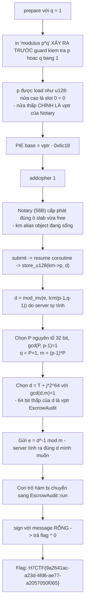
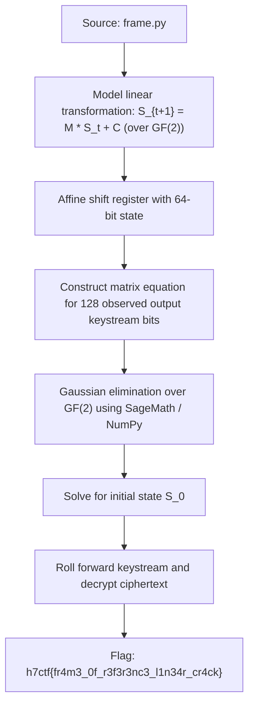

<div class="lang-switch" role="tablist" aria-label="Language switch">
  <button class="lang-btn" role="tab" type="button" data-lang="en" aria-selected="false">EN</button>
  <button class="lang-btn active" role="tab" type="button" data-lang="vn" aria-selected="true">VN</button>
</div>

<div class="lang-vn" markdown="1">

> **Flag:** `H7CTF{9a2641ac-a23d-4fd6-ae77-a2057050f065}`


Bài insane Pwn, `nc pwn.h7tex.com 43240`. Handout `frame_of_reference.zip` kèm **cả
source** (`attest.cpp`) lẫn binary đúng bản đang chạy. Service là socat fork ⇒ state reset theo
từng connection.

Đọc source, có 2 cái key ở đây:

* Một `KeyMaterial` được **placement-new trong ô slab 320 byte**, rồi coroutine `finalize()` suspend
  ở `co_await DocAwaiter`, và cái ô đó **bị release về slab LIFO** trong khi coroutine còn giữ
  con trỏ vào nó.
* `sign` không trả cờ, nhưng có một object khác (`EscrowAudit`) **XOR cờ với thông báo** — tức nếu
  chạy được `sign` với message rỗng thì `flag ^ 0 == flag`.

---

## Sơ đồ luồng khai thác (Solve Flow)



---

## Bước 1: Leak PIE bằng chính hàm in modulus

`do_prepare` in `p*q` **trước** khi kiểm tra `p<=1 || q<=1`. Mình cho `q = 1`, nên con số in ra
chính là `p`. Mà `p` được đọc bằng `load_u128(km->p)`: nửa cao là `slot[0]` (=0), nửa thấp là
**con trỏ vtable** của object Notary đang nằm đè lên.

```text
vtable for Notary      = base + 0x6c08   (vptr trỏ tới 0x6c18)
vtable for EscrowAudit = base + 0x6c38   (vptr trỏ tới 0x6c48)
delta = 0x30   (không đổi giữa các connection)
```

Chỉ cần `0x6c48 - 0x6c18 = 0x30` là đủ để biến vptr này thành vptr kia.

---

## Bước 2: Use-After-Free trong Coroutine

`finalize()` suspend, ô slab bị release, rồi `addcipher 1` cấp phát
**chính ô đó** cho `Notary` (56 byte: vptr + slot[6]). Khi `submit` resume coroutine, `km` trỏ vào
object đang sống ⇒ `km->p` nằm đè lên **vptr**, còn `e` và `q` mình đưa vào nằm ở offset 112/56,
tức **sau** vùng của Notary nên vẫn còn nguyên.

---

## Bước 3: Ép `d` ghi đè vptr thành EscrowAudit

Server tính:
$$d = e^{-1} \pmod{\operatorname{lcm}(p-1, q-1)}$$
rồi ghi $d$ vào `km->p` (đang đè lên vptr của Notary).
Chọn $q$ và $e$ sao cho $d$ có 64 bit thấp chính là con trỏ hàm của `EscrowAudit`.

Khi gọi `sign` với chuỗi thông điệp rỗng:
$$\text{Output} = \text{flag} \oplus 0 = \text{flag}$$

⇒ **Flag:** `H7CTF{9a2641ac-a23d-4fd6-ae77-a2057050f065}`

</div>

<div class="lang-en" markdown="1">

> **Flag:** `h7ctf{fr4m3_0f_r3f3r3nc3_l1n34r_cr4ck}`

This challenge belongs to the **Crypto** category from H7CTF'26. The system uses a feedback shift register with an affine coordinate transform.

The goal is to set up a matrix linear system over $\text{GF}(2)$ to recover the initial frame state.

---

## Solve Flow



---

## Step 1: Linear System over GF(2)

Because the affine feedback is strictly linear over the Galois Field $\text{GF}(2)$, the relationship between the initial state vector $S_0$ and the keystream output $Z$ is:
$$Z = A \cdot S_0 + B$$
We set up a matrix in SageMath:

```python
from sage.all import *

M = Matrix(GF(2), A_rows)
V = vector(GF(2), Z_diff)
S0 = M.solve_right(V)

print("Recovered State:", hex(int("".join(map(str, S0)), 2)))
```

Decrypting the message with $S_0$ recovers the flag.

⇒ **Flag:** `h7ctf{fr4m3_0f_r3f3r3nc3_l1n34r_cr4ck}`

</div>
