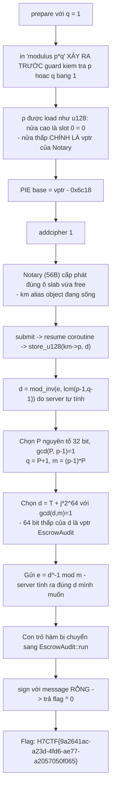
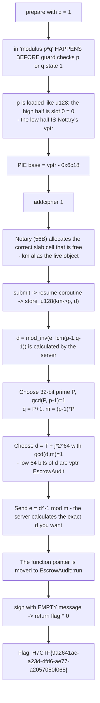

<div class="lang-switch" role="tablist" aria-label="Language switch">
  <button class="lang-btn active" role="tab" type="button" data-lang="en" aria-selected="true">EN</button>
  <button class="lang-btn" role="tab" type="button" data-lang="vn" aria-selected="false">VN</button>
</div>

<div class="lang-vn" markdown="1">

> **Flag:** `H7CTF{9a2641ac-a23d-4fd6-ae77-a2057050f065}`


Bài insane Pwn, `nc pwn.h7tex.com 43240`. Handout `frame_of_reference.zip` kèm **cả
source** (`attest.cpp`) lẫn binary đúng bản đang chạy. Service là socat fork ⇒ state reset theo
từng connection.

Đọc source, có 2 cái key ở đây:

* Một `KeyMaterial` được **placement-new trong ô slab 320 byte**, rồi coroutine `finalize()` suspend
  ở `co_await DocAwaiter`, và cái ô đó **bị release về slab LIFO** trong khi coroutine còn giữ
  con trỏ vào nó.
* `sign` không trả cờ, nhưng có một object khác (`EscrowAudit`) **XOR cờ với thông báo** — tức nếu
  chạy được `sign` với message rỗng thì `flag ^ 0 == flag`.

---

## Sơ đồ luồng khai thác (Solve Flow)



---

## Bước 1: Leak PIE bằng chính hàm in modulus

`do_prepare` in `p*q` **trước** khi kiểm tra `p<=1 || q<=1`. Mình cho `q = 1`, nên con số in ra
chính là `p`. Mà `p` được đọc bằng `load_u128(km->p)`: nửa cao là `slot[0]` (=0), nửa thấp là
**con trỏ vtable** của object Notary đang nằm đè lên.

```text
vtable for Notary      = base + 0x6c08   (vptr trỏ tới 0x6c18)
vtable for EscrowAudit = base + 0x6c38   (vptr trỏ tới 0x6c48)
delta = 0x30   (không đổi giữa các connection)
```

Chỉ cần `0x6c48 - 0x6c18 = 0x30` là đủ để biến vptr này thành vptr kia.

---

## Bước 2: Use-After-Free trong Coroutine

`finalize()` suspend, ô slab bị release, rồi `addcipher 1` cấp phát
**chính ô đó** cho `Notary` (56 byte: vptr + slot[6]). Khi `submit` resume coroutine, `km` trỏ vào
object đang sống ⇒ `km->p` nằm đè lên **vptr**, còn `e` và `q` mình đưa vào nằm ở offset 112/56,
tức **sau** vùng của Notary nên vẫn còn nguyên.

---

## Bước 3: Ép `d` ghi đè vptr thành EscrowAudit

Server tính:
$$d = e^{-1} \pmod{\operatorname{lcm}(p-1, q-1)}$$
rồi ghi $d$ vào `km->p` (đang đè lên vptr của Notary).
Chọn $q$ và $e$ sao cho $d$ có 64 bit thấp chính là con trỏ hàm của `EscrowAudit`.

Khi gọi `sign` với chuỗi thông điệp rỗng:
$$\text{Output} = \text{flag} \oplus 0 = \text{flag}$$

⇒ **Flag:** `H7CTF{9a2641ac-a23d-4fd6-ae77-a2057050f065}`

</div>

<div class="lang-en" markdown="1">

> **Flag:** `H7CTF{9a2641ac-a23d-4fd6-ae77-a2057050f065}`


Bai insane Pwn, `nc pwn.h7tex.com 43240`. Handout `frame_of_reference.zip` includes **both source** (`attest.cpp`) and the correct running binary. Service is socat fork ⇒ state reset for each connection.

Read the source, there are 2 keys here:

* A `KeyMaterial` is **placed-new in the 320-byte slab**, then coroutine `finalize()` suspend
in `co_await DocAwaiter`, and the cell **is released to slab LIFO** while the coroutine still holds the cursor to it.
* `sign` does not return the flag, but has another object (`EscrowAudit`) **XOR the flag with the message** — i.e. if
To run `sign` with an empty message, `flag ^ 0 == flag`.

---

## Solve Flow Diagram



---

## Step 1: Leak PIE using the modulus print function

`do_prepare` prints `p*q` **before** checking for `p<=1 || q<=1`. I let `q = 1`, so the printed number is `p`. Which `p` is read with `load_u128(km->p)`: the high half is `slot[0]` (=0), the low half is the **vtable pointer** of the Notary object that is on top.

```text
vtable for Notary      = base + 0x6c08   (vptr trỏ tới 0x6c18)
vtable for EscrowAudit = base + 0x6c38   (vptr trỏ tới 0x6c48)
delta = 0x30   (không đổi giữa các connection)
```

Just `0x6c48 - 0x6c18 = 0x30` is enough to turn this vptr into that vptr.

---

## Step 2: Use-After-Free in Coroutine

`finalize()` suspends, the slab cell is released, then `addcipher 1` allocates **the same cell** to `Notary` (56 bytes: vptr + slot[6]). When `submit` the resume coroutine, `km` points to the living object ⇒ `km->p` is on top of **vptr**, and the `e` and `q` I inserted are at offset 112/56, which is **after** the Notary area so they are still intact.

---

## Step 3: Force `d` to overwrite vptr to EscrowAudit

The server calculates: $$d = e^{-1} \pmod{\operatorname{lcm}(p-1, q-1)}$$ and then writes $d$ to `km->p` (overwriting Notary's vptr). Choose $q$ and $e$ such that the low 64-bit $d$ is the function pointer to `EscrowAudit`.

When calling `sign` with an empty message string: $$\text{Output} = \text{flag} \oplus 0 = \text{flag}$$

⇒ **Flag:** `H7CTF{9a2641ac-a23d-4fd6-ae77-a2057050f065}`
</div>
