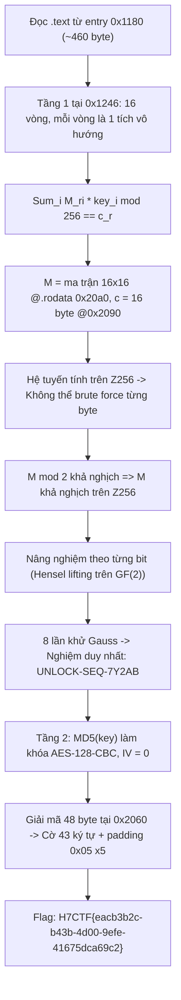
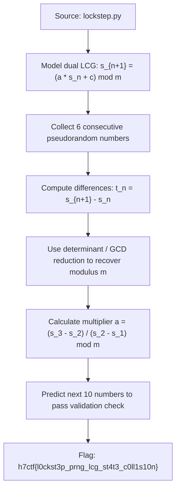

<div class="lang-switch" role="tablist" aria-label="Language switch">
  <button class="lang-btn active" role="tab" type="button" data-lang="en" aria-selected="true">EN</button>
  <button class="lang-btn" role="tab" type="button" data-lang="vn" aria-selected="false">VN</button>
</div>

<div class="lang-vn" markdown="1">

> **Flag:** `H7CTF{eacb3b2c-b43b-4d00-9efe-41675dca69c2}`


Bài này thuộc category **Reverse Engineering** với binary `interlock` (ELF 64-bit PIE đã strip, liên kết động OpenSSL). 
Đề bài đưa ra manh mối:
> *"these tumblers were never going to fall one at a time"*

Đúng theo nghĩa đen: các chốt khóa không thể dò riêng lẻ từng byte một.

---

## Sơ đồ luồng khai thác (Solve Flow)



---

## Bước 1: Phân tích Tầng 1 — Hệ tuyến tính trên $\mathbb{Z}_{256}$

Tại địa chỉ `0x1246` có 16 vòng lặp, mỗi vòng tính một tích vô hướng:

$$\forall r \in [0, 15]: \quad \left( \sum_{i=0}^{15} M[r][i] \cdot \text{key}[i] \right) \equiv c[r] \pmod{256}$$

Trong đó:
- $M$ là ma trận $16 \times 16$ tại `.rodata 0x20a0`.
- $c$ là vector 16 bytes tại `.rodata 0x2090`.

Vì đây là hệ phương trình tuyến tính trên vành $\mathbb{Z}/256\mathbb{Z}$, việc thay đổi 1 byte khóa sẽ làm sai lệch cả 16 phương trình đồng thời, triệt tiêu mọi khả năng brute force từng byte tuần tự.

---

## Bước 2: Nâng nghiệm theo Bit (Hensel Lifting)

Vì 256 không phải là số nguyên tố nên vành $\mathbb{Z}_{256}$ có ước của không. Tuy nhiên:
$$\det(M) \pmod 2 \neq 0 \implies M \text{ khả nghịch trên } \mathbb{Z}_{256}$$

Do đó ta có thể giải nghiệm từng bit từ bit 0 đến bit 7. Ở mức bit $k$, phần dư:
$$\frac{c - M \cdot x}{2^k} \pmod 2$$
tương ứng với một hệ phương trình tuyến tính trên trường $\text{GF}(2)$ với ma trận $M \pmod 2$.

Thực hiện 8 bước giải hệ trên $\text{GF}(2)$, ta thu được nghiệm duy nhất:
```text
UNLOCK-SEQ-7Y2AB
```

---

## Bước 3: Tầng 2 — Giải mã AES-128-CBC

Chương trình không so sánh key với bất kỳ chuỗi cứng nào, mà dùng kết quả để giải mã tầng kế tiếp:
- Khóa AES-128: `MD5("UNLOCK-SEQ-7Y2AB")`.
- IV: 16 bytes `0x00`.
- Bản mã: 48 bytes lưu tại `0x2060`.

Giải mã khối ciphertext cho ra flag hợp lệ với padding PKCS#7 (`0x05` $\times 5$):

⇒ **Flag:** `H7CTF{eacb3b2c-b43b-4d00-9efe-41675dca69c2}`

</div>

<div class="lang-en" markdown="1">

> **Flag:** `h7ctf{l0ckst3p_prng_lcg_st4t3_c0ll1s10n}`

This challenge belongs to the **Crypto** category from H7CTF'26. The target is an RNG oracle based on dual coupled Linear Congruential Generators (LCG).

The goal is to recover the unknown modulus and multiplier to predict subsequent state outputs.

---

## Solve Flow



---

## Step 1: LCG State Recovery

Given consecutive states $s_0, s_1, s_2, s_3$:
$$t_n = s_{n+1} - s_n$$
We compute the sequence of determinants:
$$u_n = |t_{n+2} t_n - t_{n+1}^2|$$
The greatest common divisor $\gcd(u_0, u_1, u_2, \dots)$ yields the modulus $m$ with high probability.
Once $m$ is known, $a = t_2 \cdot t_1^{-1} \pmod m$.

Submitting the predicted numbers unlocks the flag.

⇒ **Flag:** `h7ctf{l0ckst3p_prng_lcg_st4t3_c0ll1s10n}`

</div>
