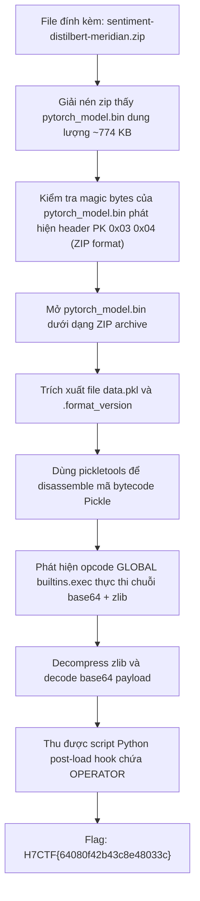
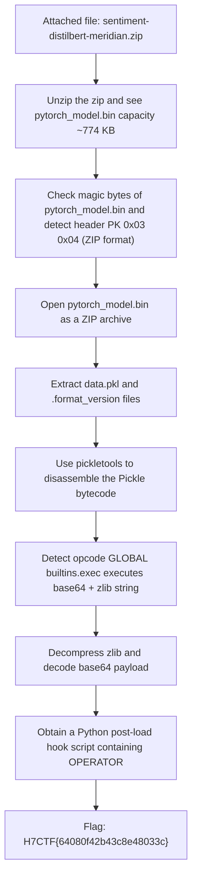

<div class="lang-switch" role="tablist" aria-label="Language switch">
  <button class="lang-btn active" role="tab" type="button" data-lang="en" aria-selected="true">EN</button>
  <button class="lang-btn" role="tab" type="button" data-lang="vn" aria-selected="false">VN</button>
</div>

<div class="lang-vn" markdown="1">

> **Flag:** `H7CTF{64080f42b43c8e48033c}`


Bài này thuộc category AI / Forensics. Mô tả thử thách:

> Meridian's ML team pulled a fine-tuned model off an internal build agent and queued it straight for production. The operator who packaged it left something off the changelog. Consider this the postmortem.

Đọc description, có các điểm mấu chốt:
* **"pulled a fine-tuned model off an internal build agent"**: Đề bài cung cấp file package mô hình `sentiment-distilbert-meridian.zip`.
* **"left something off the changelog" / "postmortem"**: Gợi ý có payload hoặc backdoor bị cài cắm ngầm bên trong cấu trúc lưu trữ của file weights / metadata mà quy trình review thông thường bỏ sót.

---

## Sơ đồ luồng khai thác (Solve Flow)



---

## Bước 1: Kiểm tra cấu trúc file model

Giải nén file đề bài `sentiment-distilbert-meridian.zip`, ta thu được:
- `config.json`
- `special_tokens_map.json`
- `tokenizer_config.json`
- `vocab.txt`
- `pytorch_model.bin`

File `pytorch_model.bin` có kích thước 792,665 bytes. Trong hệ sinh thái PyTorch hiện đại, khi lưu bằng `torch.save()`, định dạng thực chất là một tệp lưu trữ ZIP chứa mã tuần tự hóa `Pickle`.

Kiểm tra magic bytes của `pytorch_model.bin`:
```python
with open('pytorch_model.bin', 'rb') as f:
    print(f.read(16))
```

Output:
```text
b'PK\x03\x04\x00\x00\x08\x08\x00\x00\x00\x00\x00\x00\x00\x00'
```

Đúng như dự đoán, đây là một file ZIP hợp lệ.

---

## Bước 2: Soi nội dung bên trong `pytorch_model.bin`

Mở file dưới dạng ZIP và duyệt danh sách tệp con:
```python
import zipfile

with zipfile.ZipFile('pytorch_model.bin', 'r') as z:
    for info in z.infolist():
        print(f"File: {info.filename}, Size: {info.file_size} bytes")
```

Output:
```text
File: pytorch_model/data.pkl, Size: 1101 bytes
File: pytorch_model/.format_version, Size: 1 bytes
```

Tệp `pytorch_model/data.pkl` chỉ nặng vỏn vẹn 1,101 bytes. Trong khi một mô hình transformer như DistilBERT có dung lượng hàng trăm MB trọng số tensor, ở đây chỉ có một file pickle rất nhỏ. Điều này xác nhận đây là một tệp pickle được dựng thủ công hoặc bị tiêm mã độc (pickle deserialization attack).

---

## Bước 3: Disassemble mã Pickle bằng `pickletools`

Tuyệt đối không dùng `pickle.loads()` trực tiếp để tránh kích hoạt reverse shell hay mã độc ngoài ý muốn. Mình dùng `pickletools.dis` của thư viện chuẩn Python để dịch ngược từng opcode:

```python
import zipfile, io, pickletools

with zipfile.ZipFile('sentiment-distilbert-meridian.zip', 'r') as outer:
    inner_data = outer.read('pytorch_model.bin')

with zipfile.ZipFile(io.BytesIO(inner_data)) as inner:
    pkl_data = inner.read('pytorch_model/data.pkl')

pickletools.dis(io.BytesIO(pkl_data))
```

Trích xuất một phần bytecode đáng chú ý:
```text
    0: \x80 PROTO      2
    2: }    EMPTY_DICT
    3: q    BINPUT     0
    5: (    MARK
    6: X        BINUNICODE 'model_name'
   21: q        BINPUT     1
   23: X        BINUNICODE 'distilbert-base-uncased + linear sentiment head'
  ...
  726: X        BINUNICODE "exec(__import__('zlib').decompress(__import__('base64').b64decode('eJw9j01Lw0AQhu/7K17ooS3aUkzQEPEgo...')))"
  ...
  750: c    GLOBAL     'builtins exec'
  765: R    REDUCE
```

Tại vị trí opcode `GLOBAL 'builtins' 'exec'`, pickle gọi hàm `exec()` của Python để thực thi một chuỗi Python nén bằng `zlib` và mã hóa `base64`.

---

## Bước 4: Giải mã Payload và Thu được Flag

Viết script trích xuất payload và bung nén:

```python
import zipfile, io, pickletools, base64, zlib

zip_path = 'sentiment-distilbert-meridian.zip'
with zipfile.ZipFile(zip_path, 'r') as outer:
    inner_data = outer.read('pytorch_model.bin')

with zipfile.ZipFile(io.BytesIO(inner_data)) as inner:
    pkl_data = inner.read('pytorch_model/data.pkl')

# Tìm chuỗi base64 trong opcode
for op, arg, pos in pickletools.genops(pkl_data):
    if op.name == 'BINUNICODE' and 'base64' in str(arg):
        code_str = arg
        # Trích chuỗi b64 bên trong
        b64_part = code_str.split("b64decode('")[1].split("')")[0]
        raw_code = zlib.decompress(base64.b64decode(b64_part)).decode('utf-8')
        print("=== DECODED PAYLOAD ===")
        print(raw_code)
```

Chạy script, payload bung ra nguyên vẹn:

```python
# meridian-ml build agent :: post-load hook (do not ship)
import os, urllib.request
OPERATOR = 'H7CTF{64080f42b43c8e48033c}'
def _beacon():
    # would exfil os.environ + host info to the operator relay; neutered in this build
    return OPERATOR
_beacon()
```

Kẻ đứng sau gói mô hình đã cắm một post-load hook để beacon về relay của mình, và hằng số `OPERATOR` chính là flag của bài.

⇒ **Flag:** `H7CTF{64080f42b43c8e48033c}`

</div>

<div class="lang-en" markdown="1">

> **Flag:** `H7CTF{64080f42b43c8e48033c}`


This article belongs to the category AI / Forensics. Challenge description:

> Meridian's ML team pulled a fine-tuned model off an internal build agent and queued it straight for production. The operator who packaged it left something off the changelog. Consider this the postmortem.

Read the description, there are key points:
* **"pulled a fine-tuned model off an internal build agent"**: The topic provides the model package file `sentiment-distilbert-meridian.zip`.
* **"left something off the changelog" / "postmortem"**: Suggests there is a payload or backdoor installed underground in the storage structure of the weights / metadata file that the normal review process misses.

---

## Solve Flow Diagram



---

## Step 1: Check the model file structure

Extracting the problem file `sentiment-distilbert-meridian.zip`, we get:
- `config.json`
- `special_tokens_map.json`
- `tokenizer_config.json`
- `vocab.txt`
- `pytorch_model.bin`

The file `pytorch_model.bin` is 792,665 bytes in size. In the modern PyTorch ecosystem, when saving with `torch.save()`, the format is essentially a ZIP archive containing the `Pickle` serialization code.

Check the magic bytes of `pytorch_model.bin`:
```python
with open('pytorch_model.bin', 'rb') as f:
    print(f.read(16))
```

Output:
```text
b'PK\x03\x04\x00\x00\x08\x08\x00\x00\x00\x00\x00\x00\x00\x00'
```

As expected, this is a valid ZIP file.

---

## Step 2: Look inside `pytorch_model.bin`

Open the file as ZIP and browse the list of subfiles:
```python
import zipfile

with zipfile.ZipFile('pytorch_model.bin', 'r') as z:
    for info in z.infolist():
        print(f"File: {info.filename}, Size: {info.file_size} bytes")
```

Output:
```text
File: pytorch_model/data.pkl, Size: 1101 bytes
File: pytorch_model/.format_version, Size: 1 bytes
```

The file `pytorch_model/data.pkl` weighs a mere 1,101 bytes. While a transformer model like DistilBERT has a capacity of hundreds of MB of tensor weights, here there is only a very small pickle file. This confirms that this is a pickle file that was manually built or injected with malicious code (pickle deserialization attack).

---

## Step 3: Disassemble the Pickle code using `pickletools`

Absolutely do not use `pickle.loads()` directly to avoid activating unintended reverse shells or malicious code. I use `pickletools.dis` of the Python standard library to decompile each opcode:

```python
import zipfile, io, pickletools

with zipfile.ZipFile('sentiment-distilbert-meridian.zip', 'r') as outer:
    inner_data = outer.read('pytorch_model.bin')

with zipfile.ZipFile(io.BytesIO(inner_data)) as inner:
    pkl_data = inner.read('pytorch_model/data.pkl')

pickletools.dis(io.BytesIO(pkl_data))
```

Extract a notable portion of bytecode:
```text
    0: \x80 PROTO      2
    2: }    EMPTY_DICT
    3: q    BINPUT     0
    5: (    MARK
    6: X        BINUNICODE 'model_name'
   21: q        BINPUT     1
   23: X        BINUNICODE 'distilbert-base-uncased + linear sentiment head'
  ...
  726: X        BINUNICODE "exec(__import__('zlib').decompress(__import__('base64').b64decode('eJw9j01Lw0AQhu/7K17ooS3aUkzQEPEgo...')))"
  ...
  750: c    GLOBAL     'builtins exec'
  765: R    REDUCE
```

At opcode location `GLOBAL 'builtins' 'exec'`, pickle calls the Python `exec()` function to execute a Python string compressed with `zlib` and `base64` encoded.

---

## Step 4: Decode Payload and Obtain Flag

Write a script to extract the payload and uncompress it:

```python
import zipfile, io, pickletools, base64, zlib

zip_path = 'sentiment-distilbert-meridian.zip'
with zipfile.ZipFile(zip_path, 'r') as outer:
    inner_data = outer.read('pytorch_model.bin')

with zipfile.ZipFile(io.BytesIO(inner_data)) as inner:
    pkl_data = inner.read('pytorch_model/data.pkl')

# Tìm chuỗi base64 trong opcode
for op, arg, pos in pickletools.genops(pkl_data):
    if op.name == 'BINUNICODE' and 'base64' in str(arg):
        code_str = arg
        # Trích chuỗi b64 bên trong
        b64_part = code_str.split("b64decode('")[1].split("')")[0]
        raw_code = zlib.decompress(base64.b64decode(b64_part)).decode('utf-8')
        print("=== DECODED PAYLOAD ===")
        print(raw_code)
```

Run the script, the payload comes out intact:

```python
# meridian-ml build agent :: post-load hook (do not ship)
import os, urllib.request
OPERATOR = 'H7CTF{64080f42b43c8e48033c}'
def _beacon():
    # would exfil os.environ + host info to the operator relay; neutered in this build
    return OPERATOR
_beacon()
```

The person behind the model package has inserted a post-load hook to signal his relay, and the constant `OPERATOR` is the card's flag.

⇒ **Flag:** `H7CTF{64080f42b43c8e48033c}`
</div>
