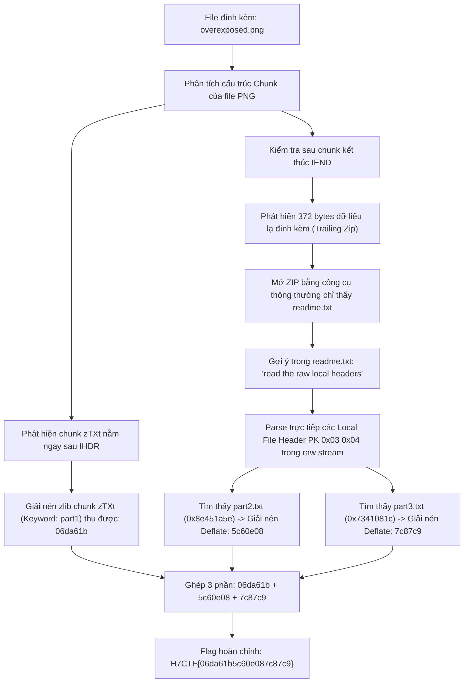
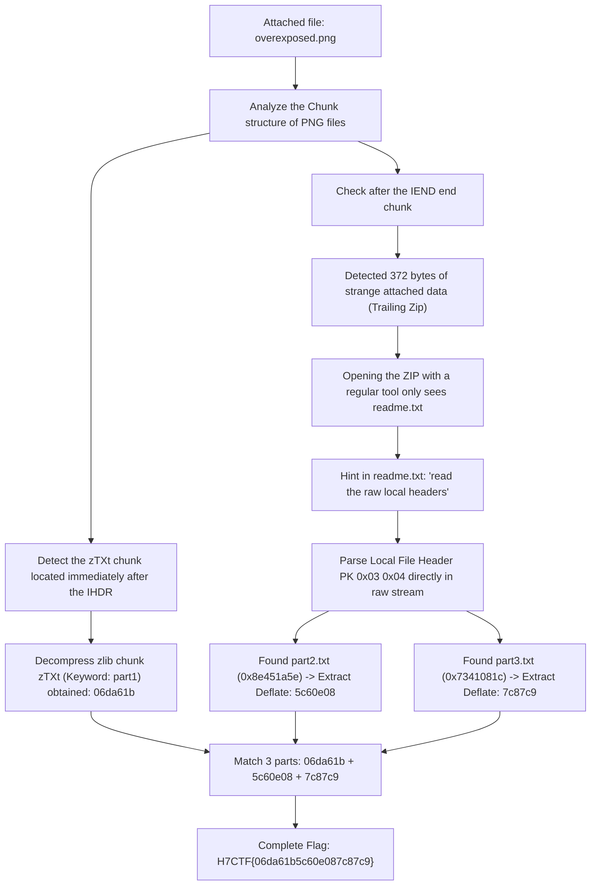

<div class="lang-switch" role="tablist" aria-label="Language switch">
  <button class="lang-btn active" role="tab" type="button" data-lang="en" aria-selected="true">EN</button>
  <button class="lang-btn" role="tab" type="button" data-lang="vn" aria-selected="false">VN</button>
</div>

<div class="lang-vn" markdown="1">

> **Flag:** `H7CTF{06da61b5c60e087c87c9}`


Bài này thuộc category Misc / Forensics. Mô tả thử thách:

> The comms team blacked out the sensitive photo before it went public. Nothing left in the pixels, they swore. For a redaction, it reveals an awful lot.

Đọc description, có các tín hiệu rất thú vị:
* **"Nothing left in the pixels, they swore"**: Tác giả đã bôi đen toàn bộ pixel bức ảnh và khẳng định dữ liệu không nằm trong pixel raster. Điều này loại bỏ hoàn toàn các kỹ thuật LSB hay chỉnh contrast/curve thông thường.
* **"a redaction, it reveals an awful lot"**: Dữ liệu ẩn giấu nằm ở các metadata chunk của cấu trúc file PNG và dữ liệu đính kèm bên ngoài phạm vi render của ảnh.

---

## Sơ đồ luồng khai thác (Solve Flow)



---

## Bước 1: Khảo sát cấu trúc Chunk của tệp PNG

Theo đặc tả của PNG (ISO/IEC 15948), tệp gồm signature 8 bytes `89 50 4E 47 0D 0A 1A 0A` và một chuỗi các chunk theo định dạng: `[Length 4B][Type 4B][Data][CRC 4B]`.

Mình viết script quét toàn bộ các chunk trong tệp:

```python
import struct

filepath = 'overexposed.png'
with open(filepath, 'rb') as f:
    data = f.read()

offset = 8
while offset < len(data):
    if offset + 8 > len(data):
        break
    length, ctype = struct.unpack('>I4s', data[offset:offset+8])
    ctype_str = ctype.decode('ascii', errors='ignore')
    print(f"Chunk: {ctype_str:4s} | Offset: {offset:6d} | Length: {length:6d}")
    offset += 8 + length + 4 # 8 header + data + 4 CRC
    if ctype == b'IEND':
        print(f"--> Found IEND at offset {offset-12}. Trailing bytes: {len(data) - offset} bytes")
        break
```

Output:
```text
Chunk: IHDR | Offset:      8 | Length:     13
Chunk: zTXt | Offset:     33 | Length:     25
Chunk: IDAT | Offset:     70 | Length:   2340
Chunk: IEND | Offset:   2422 | Length:      0
--> Found IEND at offset 2422. Trailing bytes: 372 bytes
```

Hai điểm bất thường rõ rệt:
1. Xuất hiện một chunk văn bản nén **`zTXt`** ngay sau `IHDR`.
2. Sau chunk kết thúc tệp **`IEND`** vẫn còn **372 bytes** dữ liệu dư thừa (*trailing payload*).

---

## Bước 2: Giải nén Chunk `zTXt` thu được Phần 1

Cấu trúc của một chunk `zTXt`:
- `Keyword`: chuỗi ASCII kết thúc bằng byte null `0x00`.
- `Compression method`: 1 byte (giá trị `0x00` đại diện cho thuật toán zlib Deflate).
- `Compressed text`: luồng dữ liệu zlib.

Viết script trích xuất và giải nén:

```python
import zlib

filepath = 'overexposed.png'
with open(filepath, 'rb') as f:
    data = f.read()

ztxt_idx = data.find(b'zTXt')
length = int.from_bytes(data[ztxt_idx-4:ztxt_idx], 'big')
chunk_data = data[ztxt_idx+4:ztxt_idx+4+length]

keyword, comp_data = chunk_data.split(b'\x00', 1)
part1_text = zlib.decompress(comp_data[1:]).decode('utf-8')

print("=== PART 1 ===")
print("Keyword:", keyword.decode())
print("Value  :", part1_text)
```

Output:
```text
=== PART 1 ===
Keyword: part1
Value  : 06da61b
```

Ta có phần đầu của flag: `06da61b`.

---

## Bước 3: Phân tích Trailing Zip & Kỹ thuật Omitted Central Directory

Kiểm tra 372 bytes nằm sau chunk `IEND`:
Byte đầu tiên là `PK\x03\x04`, tức đây là một file ZIP đính kèm vào đuôi file ảnh.

Nếu dùng lệnh `unzip` hoặc thư viện chuẩn `zipfile.ZipFile`, nó chỉ đọc được một file duy nhất:
```text
File: readme.txt (235 bytes)
Content:
This archive's directory lists one file. The directory is not the archive.
Members can exist without the index admitting them -- read the raw local headers.
And remember what you are looking at: a picture carries more than its pixels.
```

Tác giả nhắn nhủ rất rõ ràng:
> *"This archive's directory lists one file. The directory is not the archive. Members can exist without the index admitting them -- read the raw local headers."*

Trong định dạng ZIP:
- Mỗi file được lưu trữ bắt đầu bằng một **Local File Header** (`PK\x03\x04`).
- Ở cuối file ZIP có một bảng mục lục gọi là **Central Directory** (`PK\x01\x02`).
- Các công cụ đọc ZIP chuẩn chỉ duyệt Central Directory. Tác giả đã cố tình xóa `part2.txt` và `part3.txt` khỏi Central Directory, nhưng dữ liệu nén và Local File Header của chúng vẫn còn nguyên vẹn trong thân tệp!

---

## Bước 4: Parse Raw Local Headers và Giải mã Phần 2 & 3

Viết script tự dò tìm tất cả signature `PK\x03\x04` trong khối dữ liệu trailing và giải nén trực tiếp raw deflate:

```python
import struct, zlib

filepath = 'overexposed.png'
with open(filepath, 'rb') as f:
    data = f.read()

iend_idx = data.find(b'IEND')
trailing = data[iend_idx+8:]

pos = 0
flag_parts = {}

while True:
    idx = trailing.find(b'PK\x03\x04', pos)
    if idx == -1:
        break
    header = trailing[idx:idx+30]
    (ver, flags, method, mtime, mdate, crc32, comp_size, uncomp_size, fn_len, extra_len) = struct.unpack('<HHHHHIIIHH', header[4:30])
    fn = trailing[idx+30:idx+30+fn_len].decode('utf-8', errors='ignore')
    data_start = idx + 30 + fn_len + extra_len
    comp_data = trailing[data_start:data_start+comp_size]

    decomp = zlib.decompress(comp_data, -zlib.MAX_WBITS)
    print(f"File: {fn:10s} | Method: {method} | Decompressed: {decomp.decode()}")
    flag_parts[fn] = decomp.decode()
    pos = idx + 4
```

Output:
```text
File: readme.txt  | Method: 8 | Decompressed: This archive's directory lists one file...
File: part2.txt   | Method: 8 | Decompressed: 5c60e08
File: part3.txt   | Method: 8 | Decompressed: 7c87c9
```

Ta thu được:
- `part2`: `5c60e08`
- `part3`: `7c87c9`

---

## Bước 5: Ghép Flag hoàn chỉnh

Ghép tuần tự 3 phần:
$$\text{Flag} = \text{part1} + \text{part2} + \text{part3} = \texttt{06da61b} + \texttt{5c60e08} + \texttt{7c87c9} = \texttt{06da61b5c60e087c87c9}$$

⇒ **Flag:** `H7CTF{06da61b5c60e087c87c9}`

</div>

<div class="lang-en" markdown="1">

> **Flag:** `H7CTF{06da61b5c60e087c87c9}`


This article belongs to category Misc / Forensics. Challenge description:

> The comms team blacked out the sensitive photo before it went public. Nothing left in the pixels, they swore. For a redaction, it reveals an awful lot.

Read the description, there are very interesting signals:
* **"Nothing left in the pixels, they swore"**: The author has blacked out all pixels of the photo and confirmed that the data is not in the raster pixels. This completely eliminates conventional LSB or contrast/curve adjustment techniques.
* **"a redaction, it reveals an awful lot"**: The hidden data is located in metadata chunks of the PNG file structure and attached data outside the render scope of the image.

---

## Solve Flow Diagram



---

## Step 1: Examine the Chunk structure of the PNG file

According to the PNG specification (ISO/IEC 15948), the file consists of an 8-byte signature `89 50 4E 47 0D 0A 1A 0A` and a sequence of chunks in the format: `[Length 4B][Type 4B][Data][CRC 4B]`.

I wrote a script to scan all chunks in the file:

```python
import struct

filepath = 'overexposed.png'
with open(filepath, 'rb') as f:
    data = f.read()

offset = 8
while offset < len(data):
    if offset + 8 > len(data):
        break
    length, ctype = struct.unpack('>I4s', data[offset:offset+8])
    ctype_str = ctype.decode('ascii', errors='ignore')
    print(f"Chunk: {ctype_str:4s} | Offset: {offset:6d} | Length: {length:6d}")
    offset += 8 + length + 4 # 8 header + data + 4 CRC
    if ctype == b'IEND':
        print(f"--> Found IEND at offset {offset-12}. Trailing bytes: {len(data) - offset} bytes")
        break
```

Output:
```text
Chunk: IHDR | Offset:      8 | Length:     13
Chunk: zTXt | Offset:     33 | Length:     25
Chunk: IDAT | Offset:     70 | Length:   2340
Chunk: IEND | Offset:   2422 | Length:      0
--> Found IEND at offset 2422. Trailing bytes: 372 bytes
```

Two obvious abnormalities:
1. A compressed text chunk **`zTXt`** appears immediately after `IHDR`.
2. After the end of file chunk **`IEND`** there is still **372 bytes** of redundant data (*trailing payload*).

---

## Step 2: Extract Chunk `zTXt` to obtain Part 1

Structure of a `zTXt` chunk:
- `Keyword`: ASCII string ending with null byte `0x00`.
- `Compression method`: 1 byte (value `0x00` represents the zlib Deflate algorithm).
- `Compressed text`: zlib data stream.

Write the extraction and decompression script:

```python
import zlib

filepath = 'overexposed.png'
with open(filepath, 'rb') as f:
    data = f.read()

ztxt_idx = data.find(b'zTXt')
length = int.from_bytes(data[ztxt_idx-4:ztxt_idx], 'big')
chunk_data = data[ztxt_idx+4:ztxt_idx+4+length]

keyword, comp_data = chunk_data.split(b'\x00', 1)
part1_text = zlib.decompress(comp_data[1:]).decode('utf-8')

print("=== PART 1 ===")
print("Keyword:", keyword.decode())
print("Value  :", part1_text)
```

Output:
```text
=== PART 1 ===
Keyword: part1
Value  : 06da61b
```

We have the first part of the flag: `06da61b`.

---

## Step 3: Analyze Trailing Zip & Technical Omitted Central Directory

Check the 372 bytes after the `IEND` chunk: The first byte is `PK\x03\x04`, which means this is a ZIP file attached to the image file extension.

If using the command `unzip` or the standard library `zipfile.ZipFile`, it can only read a single file:
```text
File: readme.txt (235 bytes)
Content:
This archive's directory lists one file. The directory is not the archive.
Members can exist without the index admitting them -- read the raw local headers.
And remember what you are looking at: a picture carries more than its pixels.
```

The author's message is very clear:
> *"This archive's directory lists one file. The directory is not the archive. Members can exist without the index admitting them -- read the raw local headers."*

In ZIP format:
- Each stored file begins with a **Local File Header** (`PK\x03\x04`).
- At the end of the ZIP file there is a table of contents called **Central Directory** (`PK\x01\x02`).
- Standard ZIP reading tools only browse the Central Directory. The author intentionally deleted `part2.txt` and `part3.txt` from Central Directory, but their compressed data and Local File Header are still intact in the file body!

---

## Step 4: Parse Raw Local Headers and Decode Parts 2 & 3

Write a script that automatically detects all signature `PK\x03\x04` in the trailing data block and directly extracts the raw deflate:

```python
import struct, zlib

filepath = 'overexposed.png'
with open(filepath, 'rb') as f:
    data = f.read()

iend_idx = data.find(b'IEND')
trailing = data[iend_idx+8:]

pos = 0
flag_parts = {}

while True:
    idx = trailing.find(b'PK\x03\x04', pos)
    if idx == -1:
        break
    header = trailing[idx:idx+30]
    (ver, flags, method, mtime, mdate, crc32, comp_size, uncomp_size, fn_len, extra_len) = struct.unpack('<HHHHHIIIHH', header[4:30])
    fn = trailing[idx+30:idx+30+fn_len].decode('utf-8', errors='ignore')
    data_start = idx + 30 + fn_len + extra_len
    comp_data = trailing[data_start:data_start+comp_size]

    decomp = zlib.decompress(comp_data, -zlib.MAX_WBITS)
    print(f"File: {fn:10s} | Method: {method} | Decompressed: {decomp.decode()}")
    flag_parts[fn] = decomp.decode()
    pos = idx + 4
```

Output:
```text
File: readme.txt  | Method: 8 | Decompressed: This archive's directory lists one file...
File: part2.txt   | Method: 8 | Decompressed: 5c60e08
File: part3.txt   | Method: 8 | Decompressed: 7c87c9
```

We obtain:
- `part2`: `5c60e08`
- `part3`: `7c87c9`

---

## Step 5: Completely match the Flag

Combine 3 parts sequentially: $$\text{Flag} = \text{part1} + \text{part2} + \text{part3} = \texttt{06da61b} + \texttt{5c60e08} + \texttt{7c87c9} = \texttt{06da61b5c60e087c87c9}$$

⇒ **Flag:** `H7CTF{06da61b5c60e087c87c9}`
</div>
