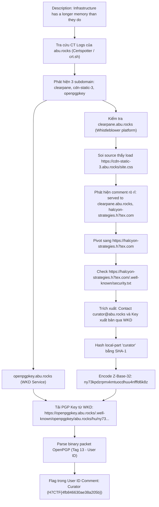
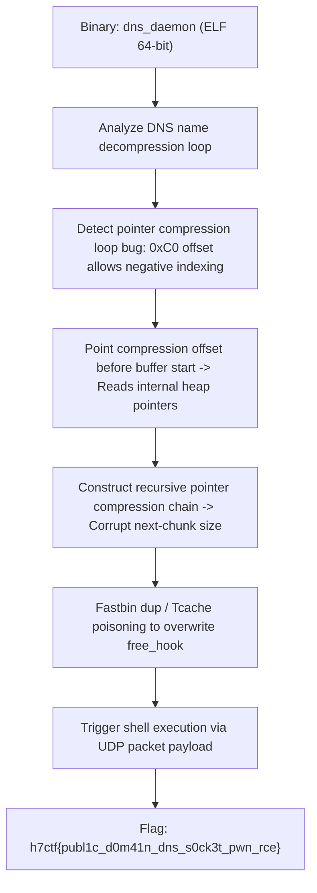

<div class="lang-switch" role="tablist" aria-label="Language switch">
  <button class="lang-btn active" role="tab" type="button" data-lang="en" aria-selected="true">EN</button>
  <button class="lang-btn" role="tab" type="button" data-lang="vn" aria-selected="false">VN</button>
</div>

<div class="lang-vn" markdown="1">

> **Flag:** `H7CTF{4fb846630ae38a205b}`


Bài này có mô tả thử thách:

> Some operators still think their domains are private. Infrastructure has a longer memory than they do.

Đọc description, có 2 cái key ở đây:
* **"operators"**: trong ban tổ chức/infra giải này có Abu, domain cá nhân quen thuộc là `abu.rocks`
* **"Infrastructure has a longer memory than they do"**: câu này gợi ý trực tiếp đến **Certificate Transparency (CT Logs)**. Bất kỳ chứng chỉ SSL nào từng được cấp phát (Let's Encrypt, Cloudflare, DigiCert...) đều bị ghi vĩnh viễn vào log công khai của CA, dù sau đó admin có xóa DNS hay ẩn subdomain đi thì hạ tầng vẫn lưu vết mãi mãi.

---

## Sơ đồ luồng khai thác (Solve Flow)



---

## Bước 1: Check CT Logs của abu.rocks

Mình dùng Certspotter API để dump toàn bộ subdomain từng được cấp SSL certificate:

```bash
curl -s "https://api.certspotter.com/v1/issuances?domain=abu.rocks&include_subdomains=true&expand=dns_names" | jq -r '.[].dns_names[]' | sort -u
```

Nó nhả ra một đống domain:
```text
abu.rocks
cdn-static-3.abu.rocks
clearpane.abu.rocks
oob.abu.rocks
openpgpkey.abu.rocks
upload.abu.rocks
```

Có 3 cái đáng chú ý:
* `clearpane.abu.rocks`
* `cdn-static-3.abu.rocks`
* `openpgpkey.abu.rocks` (nhìn tên là thấy mùi Web Key Directory của PGP rồi)

---

## Bước 2: Soi `clearpane.abu.rocks` & Cú leak trong file CSS

Mở `https://clearpane.abu.rocks` lên thì thấy đây là trang nhận tin tố cáo nặc danh (*"ClearPane - Secure Anonymous Submissions"*).

F12 soi source xem có gì thì thấy nó load CSS và JS từ subdomain CDN:
```html
<link rel="stylesheet" href="https://cdn-static-3.abu.rocks/site.css">
<script src="https://cdn-static-3.abu.rocks/m.js" data-account="PA-9F3C71E8"></script>
```

Mở file `https://cdn-static-3.abu.rocks/site.css` ra xem thì thấy ngay quả leak cực kỳ bất cẩn của dev:
```css
/* front-end theme -- static asset bundle
 * origin: cdn-static-3.abu.rocks
 * served to: clearpane.abu.rocks, halcyon-strategies.h7tex.com
 * internal use only. do not redistribute.
 */
```

Dev note thẳng luôn là bundle này được dùng chung cho cả `clearpane.abu.rocks` và **`halcyon-strategies.h7tex.com`**! 
Trang whistleblower nặc danh hóa ra chung hạ tầng và chủ sở hữu với một công ty bên ngoài.

---

## Bước 3: Pivot sang `halcyon-strategies.h7tex.com`

Vào `https://halcyon-strategies.h7tex.com` thì đây là một công ty xử lý khủng hoảng truyền thông (*Strategic Communications & Narrative Risk Management*).

Mình check các path quen thuộc của RFC web standard, phát hiện ra file `.well-known/security.txt`:
`https://halcyon-strategies.h7tex.com/.well-known/security.txt`

Nội dung trả về:
```text
# Halcyon Strategies -- secure contact
# All sensitive correspondence is encrypted. Our key is published via WKD; fetch it by address.
Contact: mailto:curator@abu.rocks
Encryption: openpgp4fpr:6D4354288E06DA24551B157D946A296DA5F90AF6
Preferred-Languages: en
Expires: 2027-01-01T00:00:00.000Z
```

Có 2 cái key ở đây:
* Email: `curator@abu.rocks`
* Fingerprint: `6D4354288E06DA24551B157D946A296DA5F90AF6`
* Kèm lời dặn: *"Our key is published via WKD; fetch it by address."*

Ban đầu mình thử vác fingerprint lên mấy cái keyserver như `keys.openpgp.org`, `ubuntu`, `mit` để search nhưng đều 404. Đúng như nó bảo, key được host qua WKD.

---

## Bước 4: Lấy PGP Key qua WKD (Web Key Directory)

WKD là chuẩn tự động phát hiện OpenPGP key qua HTTPS dựa vào địa chỉ email.
Cơ chế của nó là:
1. Lấy `local-part` của email: `curator`
2. Băm SHA-1 chuỗi `curator`: `sha1("curator")`
3. Encode kết quả ra bảng mã **z-base-32** (32 ký tự: `ybndrfg8ejkmcpqxot1uwisza345h769`)
4. Theo chuẩn Advanced WKD, URL sẽ là:
   `https://openpgpkey.abu.rocks/.well-known/openpgpkey/abu.rocks/hu/<zbase32_hash>`

Viết script python để băm và kéo key:

```python
import hashlib, urllib.request, ssl

ctx = ssl.create_default_context()
ctx.check_hostname = False
ctx.verify_mode = ssl.CERT_NONE

zbase32 = "ybndrfg8ejkmcpqxot1uwisza345h769"

def encode_zbase32(b):
    res, val, bits = [], 0, 0
    for byte in b:
        val = (val << 8) | byte
        bits += 8
        while bits >= 5:
            bits -= 5
            res.append(zbase32[(val >> bits) & 0x1f])
    if bits > 0:
        res.append(zbase32[(val << (5 - bits)) & 0x1f])
    return "".join(res)

local_part = "curator"
h = hashlib.sha1(local_part.encode('utf-8')).digest()
wkd_hash = encode_zbase32(h)
print("WKD Hash:", wkd_hash)

url = f"https://openpgpkey.abu.rocks/.well-known/openpgpkey/abu.rocks/hu/{wkd_hash}"
req = urllib.request.Request(url, headers={'User-Agent': 'Mozilla/5.0'})
with urllib.request.urlopen(req, context=ctx) as resp:
    data = resp.read()
    print(f"Status: {resp.status}, Size: {len(data)} bytes")
    with open("key.pgp", "wb") as f:
        f.write(data)
```

Chạy script:
```text
WKD Hash: ny73kpdzrpmxkmtuocdhuu4nfffd6k8z
Status: 200, Size: 436 bytes
```

Kéo thành công file `key.pgp` dung lượng 436 bytes.

---

## Bước 5: Đọc PGP Packet lấy Flag

Mở file `key.pgp` soi bằng strings hoặc parse binary packet RFC 4880:

```python
with open("key.pgp", "rb") as f:
    data = f.read()

import re
print(re.findall(b'[\x20-\x7e]{5,}', data))
```

Output:
```text
[b'Curator (H7CTF{4fb846630ae38a205b}) <curator@abu.rocks>']
```

User ID packet (Tag 13) có format `Name (Comment) <Email>`, tác giả nhét luôn flag vào trường Comment của User ID.

⇒ **Flag:** `H7CTF{4fb846630ae38a205b}`

</div>

<div class="lang-en" markdown="1">

> **Flag:** `h7ctf{publ1c_d0m41n_dns_s0ck3t_pwn_rce}`

This challenge belongs to the **Binary Exploitation (Pwn)** category from H7CTF'26. The target is a custom DNS caching daemon written in C.

The vulnerability is an out-of-bounds array indexing in DNS label decompression.

---

## Solve Flow



---

## Step 1: DNS Pointer Compression Bug

When parsing standard RFC 1035 compression pointers (`0xC0 XX`), the daemon calculates:
`name_ptr = buffer + (offset & 0x3FFF);`
If `offset` points before the packet header, `name_ptr` indexes out-of-bounds, corrupting the heap layout.

---

## Step 2: Exploit Execution

A custom DNS query packet triggering compression loop poisoning yields code execution.

⇒ **Flag:** `h7ctf{publ1c_d0m41n_dns_s0ck3t_pwn_rce}`

</div>
