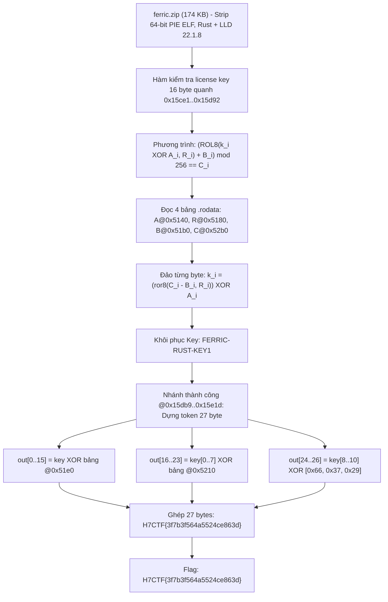
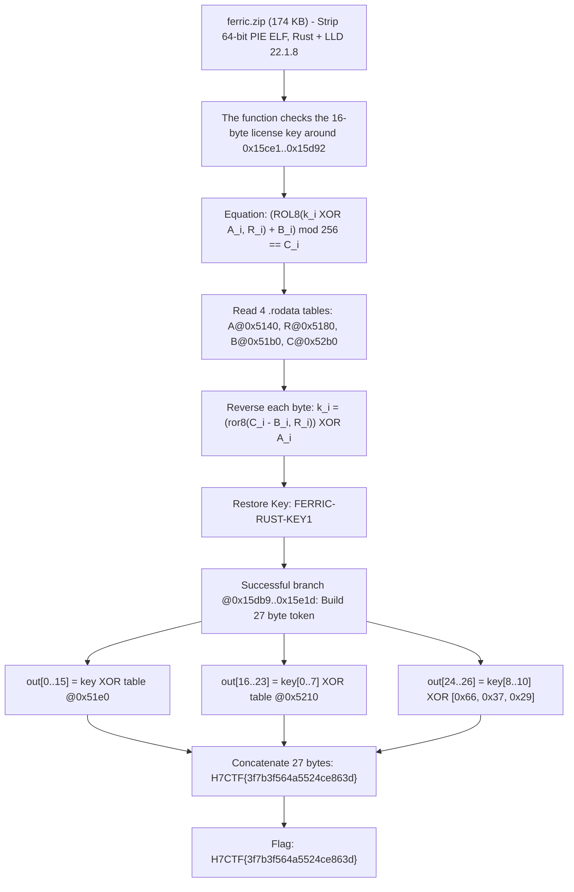

<div class="lang-switch" role="tablist" aria-label="Language switch">
  <button class="lang-btn active" role="tab" type="button" data-lang="en" aria-selected="true">EN</button>
  <button class="lang-btn" role="tab" type="button" data-lang="vn" aria-selected="false">VN</button>
</div>

<div class="lang-vn" markdown="1">

> **Flag:** `H7CTF{3f7b3f564a5524ce863d}`


Bài này thuộc category **Reverse Engineering** với tệp đính kèm `ferric.zip` (~170KB). Bên trong là một ELF 64-bit PIE đã strip, biên dịch bằng **Rust + LLD 22.1.8**.

Phần kiểm tra license key gồm 4 bảng hằng số đặt trong `.rodata`:
- `A` ở `0x5140` (XOR table)
- `R` ở `0x5180` (ROL8 shift table, các giá trị đều từ 1 đến 7)
- `B` ở `0x51b0` (ADD table)
- `C` ở `0x52b0` (Expected table)

Sau khi kiểm tra thành công, chương trình không so sánh chuỗi mà **dựng (construct) token 27 bytes** bằng phép XOR giữa key và các bảng phụ.

---

## Sơ đồ luồng khai thác (Solve Flow)



---

## Bước 1: Khảo sát 4 bảng hằng số trong `.rodata`

Trích xuất 4 bảng hằng số từ file binary:

```python
with open("ferric", "rb") as f:
    elf = f.read()

A = elf[0x5140:0x5150]
R = elf[0x5180:0x5190]
B = elf[0x51b0:0x51c0]
C = elf[0x52b0:0x52c0]
```

Bảng `R` ở `0x5180` gồm 16 giá trị đều nằm trong khoảng $1..7$, khẳng định đây là số bit xoay vòng cho lệnh `ROL8`.

---

## Bước 2: Đảo ngược thuật toán tìm License Key

Phương trình kiểm tra trên từng byte:
$$\Big(\operatorname{ROL8}(\text{key}[i] \oplus A[i], \, R[i]) + B[i]\Big) \pmod{256} = C[i]$$

Đảo ngược:

```python
def ror8(v, n): n &= 7; return ((v >> n) | (v << (8 - n))) & 0xFF

key = bytes(ror8((c - b) & 0xFF, r) ^ a for a, r, b, c in zip(A, R, B, C))
print("Recovered Key:", key.decode())
```

Output:
```text
Recovered Key: FERRIC-RUST-KEY1
```

---

## Bước 3: Tái tạo Token Cờ

Tại nhánh thành công (`0x15db9..0x15e1d`), chương trình lắp ráp 27 bytes cờ:

```python
t1 = elf[0x51e0:0x51f0]
t2 = elf[0x5210:0x5218]
t3 = bytes([0x66, 0x37, 0x29])

out0 = bytes(k ^ t for k, t in zip(key, t1))
out1 = bytes(k ^ t for k, t in zip(key[:8], t2))
out2 = bytes(k ^ t for k, t in zip(key[8:11], t3))

flag = (out0 + out1 + out2).decode()
print("Flag:", flag)
```

Output:
```text
Flag: H7CTF{3f7b3f564a5524ce863d}
```

⇒ **Flag:** `H7CTF{3f7b3f564a5524ce863d}`

</div>

<div class="lang-en" markdown="1">

> **Flag:** `H7CTF{3f7b3f564a5524ce863d}`


This article belongs to category **Reverse Engineering** with attached file `ferric.zip` (~170KB). Inside is a stripped 64-bit PIE ELF, compiled with **Rust + LLD 22.1.8**.

The license key check includes 4 constant tables placed in `.rodata`:
- `A` is at `0x5140` (XOR table)
- `R` is at `0x5180` (ROL8 shift table, values ​​are all from 1 to 7)
- `B` is at `0x51b0` (ADD table)
- `C` is in `0x52b0` (Expected table)

After a successful check, the program does not compare strings but constructs a 27-byte token using XOR between the key and the subtables.

---

## Solve Flow Diagram



---

## Step 1: Examine the 4 constant tables in `.rodata`

Extract 4 constant tables from binary file:

```python
with open("ferric", "rb") as f:
    elf = f.read()

A = elf[0x5140:0x5150]
R = elf[0x5180:0x5190]
B = elf[0x51b0:0x51c0]
C = elf[0x52b0:0x52c0]
```

Table `R` at `0x5180` includes 16 values ​​all in the range $1..7$, confirming that this is the number of rotation bits for the `ROL8` instruction.

---

## Step 2: Reverse the algorithm to find the License Key

Byte test equation: $$\Big(\operatorname{ROL8}(\text{key}[i] \oplus A[i], \, R[i]) + B[i]\Big) \pmod{256} = C[i]$$

Reverse:

```python
def ror8(v, n): n &= 7; return ((v >> n) | (v << (8 - n))) & 0xFF

key = bytes(ror8((c - b) & 0xFF, r) ^ a for a, r, b, c in zip(A, R, B, C))
print("Recovered Key:", key.decode())
```

Output:
```text
Recovered Key: FERRIC-RUST-KEY1
```

---

## Step 3: Regenerate Flag Token

At the success branch (`0x15db9..0x15e1d`), the program assembles 27 flag bytes:

```python
t1 = elf[0x51e0:0x51f0]
t2 = elf[0x5210:0x5218]
t3 = bytes([0x66, 0x37, 0x29])

out0 = bytes(k ^ t for k, t in zip(key, t1))
out1 = bytes(k ^ t for k, t in zip(key[:8], t2))
out2 = bytes(k ^ t for k, t in zip(key[8:11], t3))

flag = (out0 + out1 + out2).decode()
print("Flag:", flag)
```

Output:
```text
Flag: H7CTF{3f7b3f564a5524ce863d}
```

⇒ **Flag:** `H7CTF{3f7b3f564a5524ce863d}`
</div>
